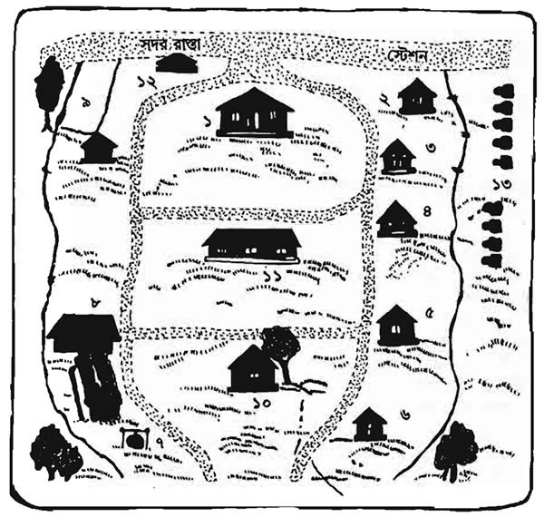

<h1>চিড়িয়াখানা</h1>

# 1

দ্বিতীয় মহাযুদ্ধের অব্যবহিত পরের ঘটনা। গ্ৰীষ্মকাল। ব্যোমকেশের শ্যালক সুকুমার সত্যবতীকে ও খোকাকে লইয়া দাৰ্জিলিং গিয়াছে। ব্যোমকেশ ও আমি হ্যারিসন রোডের বাসায় পড়িয়া চিংড়িপোড়া হইতেছি।

ব্যোমকেশের কাজকর্মে মন্দা যাইতেছিল। ইহা তাহার পক্ষে এমন কিছু নূতন কথা নয়; কিন্তু এবার নৈষ্কর্মের দৈর্ঘ্য ও নিরবচ্ছিন্নতা এতাই বেশি যে আমাদের অস্থির করিয়া তুলিয়াছিল। উপরন্তু খোকা ও সত্যবতী গৃহে নাই। মরিয়া হইয়া আমরা শেষ পর্যন্ত দাবা খেলিতে আরম্ভ করিয়াছিলাম।

আমি মোটামুটি দাবা খেলিতে জানিতাম‌, ব্যোমকেশকে শিখাইয়াছিলাম। প্রথম প্রথম সে সহজেই হারিয়া যাইত; ক্রমে তাহাকে মাত করা কঠিন হইল। অবশেষে একদিন আসিল যেদিন সে বড়ের কিস্তিতে আমাকে মাত করিয়া দিল।

পুত্ৰাৎ শিষ্যাৎ পরাজয়ে গৌরবের হানি হয় না জানি। কিন্তু যাহাকে মাত্র কয়েকদিন আগে হাতে ধরিয়া দাবার চাল দিতে শিখাইয়াছি‌, তাহার কাছে হারিয়া গেলে নিজের বুদ্ধিবৃত্তির উপর সন্দেহ হয়। আমার চিত্তে আর সুখ রহিল না।

তার উপর এবার গরমও পড়িয়াছে প্ৰচণ্ড। সেই যে চৈত্র মাসের মাঝামাঝি একদিন গলদঘর্ম হইয়া সকালে ঘুম ভাঙিয়াছিল‌, তারপর এই দেড় মাস ধরিয়া গরম উত্তরোত্তর বাড়িয়াই চলিয়াছে। মাঝে দু-এক পশলা বৃষ্টি যে হয় নাই এমন নয়‌, কিন্তু তাহা হবিষা কৃষ্ণবর্ক্সেব তাপের মাত্রা বর্ধিত করিয়াছিল। দিবারাত্র ফ্যান চালাইয়াও নিস্কৃতি ছিল না‌, মনে হইতেছিল। সারা গায়ে রসগোল্লার রস মাখিয়া বসিয়া আছি।

দেহমনের এইরূপ নিরাশাজনক অবস্থা লইয়া একদিন পূবাঁহুে তক্তপোশের উপর দাবার ছক পাতিয়া বসিয়াছিলাম। ব্যোমকেশ আমাকে গজ-চক্ৰ করিবার ব্যবস্থা প্রায় পাকা করিয়া শুনেিয়ছে‌, আমি অতিমাত্রায় বিচলিত হইয়া অনর্গল ঘৰ্মত্যাগ করতেছি‌, এমন সময় বাধা দরজায় খুঁটু খুঁটু কড়া নাড়ার শব্দ। ডাকপিয়ন নয়‌, তাহার কড়া নাড়ার ভঙ্গীতে একটা বেপরোয়া উগ্ৰতা আছে। তবে কে? আমরা ব্যগ্র আগ্রহে পরস্পর মুখের পানে চাহিলাম। এতদিন পরে সত্যই কি নূতন রহস্যের শুভাগমন হইল।

ব্যোমকেশ টপ করিয়া পাঞ্জাবিটা গলাইয়া লইয়া দ্রুত গিয়া দ্বার খুলিল। আমি ইতিমধ্যে নিরাবরণ দেহে একটা উড়ানি চাদর জড়াইয়া ভদ্র হইয়া বসিলাম।

দ্বারের বাহিরে দাঁড়াইয়া আছেন মধ্যবয়স্ক একটি ভদ্রলোক। আকৃতি মধ্যম‌, একটু নিরেট গোছের‌, চাঁচা-ছোলা ধারালো মুখ‌, চোখে ফ্রেমহীন ধূমল কাচের চশমা। পরিধানে মরাল-শুভ্র প্যান্টুলুন ও সিন্ধের হাতকটা কামিজ। পায়ে মোজা নাই‌, কেবল বিননি-করা চামড়ার গ্ৰীসান স্যান্ডাল। ছিমছাম চেহারা।

মার্জিত কণ্ঠে বলিলেন,–’ব্যোমকেশবাবু—?’

ব্যোমকেশ বলিল,–’আমিই। —আসুন!’

সে ভদ্রলোকটিকে আনিয়া চেয়ারে বসাইল‌, মাথার উপর পাখাটা জোর করিয়া দিল। ভদ্রলোক একটি কার্ড বাহির করিয়া ব্যোমকেশকে দিলেন।

কার্ডে ছাপা ছিল–

নিশানাথ সেন
গোলাপ কলোনী
মোহনপুর‌, ২৪ পরগনা
বি. এ. আর

কার্ডের অন্য পিঠে টেলিগ্রামের ঠিকানা ‘গোলাপ’ এবং ফোন নম্বর।

ব্যোমকেশ কার্ড হইতে চোখ তুলিয়া বলিল,–’গোলাপ কলোনী। নামটা নতুন ধরনের মনে হচ্ছে–’

নিশানাথবাবুর মুখে একটু হাসির ভাব দেখা দিল‌, তিনি বলিলেন,–’গোলাপ কলোনী আমার ফুলের বাগান। আমি ফুলের ব্যবসা করি। শাকসবজিও আছে‌, ডেয়ারি ফার্মও আছে। নাম দিয়েছি গোলাপ কলোনী।’

ব্যোমকেশ তাঁহাকে তীক্ষ্ণ চক্ষে নিরীক্ষণ করিয়া বলিল, —’ও।–মোহনপুর কলকাতা থেকে কত দূর?’

নিশানাথ বলিলেন,–’শিয়ালদা থেকে ঘন্টাখানেকের পথ–তবে রেলওয়ে লাইনের ওপর পড়ে না। স্টেশন থেকে মাইল দুই দূরে।’

নিশানাথবাবুর কথা বলিবার ভঙ্গীটি ত্বরাহীন‌, যেন আলস্যভরে কথা বলিতেছেন। কিন্তু এই মন্থরতা যে সত্যই আলস্য বা অবহেলা নয়‌, বরং তাঁহার সাবধানী মনের বাহ্য আবরণ মাত্র‌, তাহা তাঁহার সজাগ সতর্ক মুখ দেখিয়া বোঝা যায়। মনে হয় দীর্ঘকাল বাক-সংযমের ফলে তিনি এইরূপ বাচনভঙ্গীতে অভ্যস্ত হইয়াছেন।

ব্যোমকেশের বাকপ্ৰণালীও অতিথির প্রভাবে একটু চিন্তা-মন্থর হইয়া গিয়াছিল‌, সে ধীরে ধীরে বলিল,–’আপনি বলছেন ব্যবসা করেন। আপনাকে কিন্তু ব্যবসাদার বলে মনে হয় না‌, এমন কি বিলিতি সওদাগরি অফিসের ব্যবসাদারও নয়। আপনি কতদিন এই ব্যবসা করছেন?’

নিশানাথ বললেন–দশ বছরের কিছু বেশি। —আমাকে আপনার কী মনে হয়‌, বলুন দেহকি।

‘মনে হয় আপনি সিভিলিয়ান ছিলেন। জজ কিম্বা ম্যাজিস্ট্রেট।’

ধোঁয়াটে চশমার আড়ালে নিশানাথবাবুর চোখ দু’টি একবার চঞ্চল হইয়া উঠিল। কিন্তু তিনি শান্ত-মন্থর কঠেই বলিলেন,–’কি করে আন্দাজ করলেন জানি না। আমি সত্যিই বোম্বাই প্রদেশের বিচার বিভাগে ছিলাম‌, সেশন জজ পর্যন্ত হয়েছিলাম। তারপর অবসর নিয়ে এই দশ বছর ফুলের চাষ করছি।’

ব্যোমকেশ বলিল,–’মাফ করবেন‌, আপনার এখন বয়স কত?’

‘সাতান্ন চলছে।’

‘তার মানে সাতচল্লিশ বছর বয়সে রিটায়ার করেছেন। যতদূর জানি সরকারী চাকরির মেয়াদ পঞ্চান্ন বছর পর্যন্ত।’

নিশানাথবাবু একটু চুপ করিয়া থাকিয়া বলিলেন,–’আমার ব্লাড-প্রেসার আছে। দশ বছর আগে তার সূত্রপাত হয়। ডাক্তারেরা বললেন মস্তিষ্কের কাজ বন্ধ করতে হবে‌, নইলে বাঁচব না। কাজ থেকে অবসর নিলাম। তারপর বাংলা দেশে এসে ফুলের ফসল ফলাচ্ছি। ভাবনা-চিন্তা কিছু নেই‌, কিন্তু রক্তের চাপ বয়সের সঙ্গে সঙ্গে বেড়েই যাচ্ছে।’

ব্যোমকেশ বলিল,–’ভাবনা-চিন্তা কিছু নেই বলছেন। কিন্তু সম্প্রতি আপনার ভাবনার বিশেষ কারণ ঘটেছে। নইলে আমার কাছে আসতেন না।’

নিশানাথ হাসিলেন; অধর প্রান্তে শুভ্র দন্তরেখা অল্প দেখা গেল। বলিলেন‌, —’হ্যাঁ—! এটা অবশ্য অনুমান করা শক্ত নয়। কিছুদিন থেকে আমার কলোনীতে একটা ব্যাপার ঘটছে–’ তিনি থামিয়া গিয়া আমার দিকে চোখ ফিরাইলেন,–’আপনি অজিতবাবু?’

ব্যোমকেশ বলিল,–‘হ্যাঁ‌, উনি আমার সহকারী। আমার কাছে যা বলবেন ওঁর কাছে তা গোপন থাকবে না।’

নিশানাথ বলিলেন,–’না না‌, আমার কথা গোপনীয় নয়। উনি সাহিত্যিক‌, তাই ওঁর কাছে একটা কথা জানবার ছিল। অজিতবাবু্‌, blackmail শব্দের বাংলা প্রতিশব্দ কি?’

আকস্মিক প্রশ্নে অপ্ৰতিভ হইয়া পড়িলাম। বাংলা ভাষা লইয়া অনেকদিন নাড়াচাড়া করিতেছি‌, জানিতে বাকী নাই যে বঙ্গভারতী আধুনিক পাশ্চাত্ত্য সভ্যতার সহিত তাল রাখিয়া চলিতে পারেন নাই; অধিকাংশ ক্ষেত্রেই বিদেশী ভাবকে বিদেশী শব্দ দ্বারা প্ৰকাশ করিতে হয়। আমি আমতা-আমতা করিয়া বলিলাম,–’Blackmail-গুপ্তকথা ফাঁস করে দেবার ভয় দেখিয়ে টাকা আদায় করা। যতদূর জানি এককথায় এর বাংলা প্রতিশব্দ নেই।’

নিশানাথবাবু একটু অবজ্ঞার স্বরে বলিলেন,–’আমিও তাই ভেবেছিলাম। যা হোক‌, ওটা অবাস্তর কথা। এবার ঘটনাটা সংক্ষেপে বলি শুনুন।’‌

ব্যোমকেশ বলিল,–’সংক্ষেপে বলবার দরকার নেই‌, বিস্তারিত করেই বলুন। তাতে আমাদের বোঝবার সুবিধে হবে।’

নিশানাথ বলিলেন,–’আমার গোলাপ কলোনীতে যারা আমার অধীনে কাজ করে‌, মালীদের বাদ দিলে তারা সকলেই ভদ্রশ্রেণীর মানুষ‌, কিন্তু সকলেই বিচিত্র ধরনের লোক। কাউকেই ঠিক সহজ। সাধারণ মানুষ বলা যায় না। স্বাভাবিক পথে জীবিকা অর্জন তাদের পক্ষে সম্ভব নয়‌, তাই তারা আমার কাছে এসে জুটেছে। আমি তাদের থাকবার জায়গা দিয়েছি‌, খেতে পরতে দিই‌, মাসে মাসে কিছু হাতখরচ দিই। এই শর্তে তারা কলোনীর কাজ করে। অনেকটা মঠের মত ব্যবস্থা। খুব আরামের জীবন না হতে পারে‌, কিন্তু না খেয়ে মরবার ভয় নেই।’

ব্যোমকেশ বলিল,–’আর একটু পরিষ্কার করে বলুন। এদের পক্ষে স্বাভাবিক পথে জীবন নিবহি সম্ভব নয় কেন?’

নিশানাথ বলিলেন,–’এদের মধ্যে একদল আছে যারা শরীরের কোনও না কোনও খুঁতের জন্যে স্বাভাবিকভাবে জীবনযাত্রা নিবাহ করতে পারে না। যেমন‌, পানুগোপাল। বেশ স্বাস্থ্যবান ছেলে‌, অথচ সে কানে ভাল শুনতে পায় না‌, কথা বলাও তার পক্ষে কষ্টকর। অ্যাডোনয়েডের দোষ আছে। লেখাপড়া শেখেনি। তাকে আমি গোশালার ভার দিয়েছি‌, সে গরু-মোষ নিয়ে আছে।’

‘আর অন্য দল?’

‘অন্য দলের অতীত জীবনে দাগ আছে। যেমন ধরুন‌, ভূজঙ্গধরবাবু। এমন তীক্ষ্ণবুদ্ধি লোক কম দেখা যায়। ডাক্তার ছিলেন‌, সাজারিতে অসাধারণ হাত ছিল; এমন কি প্ল্যাস্টিক সাজারি পর্যন্ত জানতেন। কিন্তু তিনি এমন একটি দুনৈতিক কাজ করেছিলেন যে তাঁর ডাক্তারির লাইসেন্স কেড়ে নেওয়া হয়। তিনি এখন কলোনীর ডাক্তারখানার কম্পাউন্ডার হয়ে আছেন।’

‘বুঝেছি। তারপর বলুন।’

ব্যোমকেশ অতিথির সম্মুখে সিগারেটের টিন খুলিয়া ধরিল‌, কিন্তু তিনি সবিনয়ে প্রত্যাখ্যান করিয়া বলিলেন,–’ব্লাড-প্রেসার বাড়ার পর ছেড়ে দিয়েছি।’ তারপর তিনি ধীরে অত্বরিত কণ্ঠে বলিতে শুরু করিলেন,–’কলোনীর দৈনন্দিন জীবনযাত্রায় কোনও নূতনত্ব নেই‌, দিনের পর দিন একই কাজের পুনরাভিনয় হয়। ফুল ফোটে‌, শাকসবজি গজায়‌, মুগী ডিম পাড়ে‌, দুধ থেকে ঘি মাখন তৈরি হয়। কলোনীর একটা ঘোড়া-টানা ভ্যান আছে‌, তাতে বোঝাই হয়ে রোজ সকালে মাল স্টেশনে যায়। সেখান থেকে ট্রেনে কলকাতায় আসে। মূনিসিপাল মার্কেটে আমাদের দুটো স্টল আছে‌, একটাতে ফুল বিক্রি হয়‌, অন্যটাতে শাকসবজি। এই ব্যবসা থেকে যা আয় হয় তাতে ভালভাবেই চলে যায়।

‘এইভাবে চলছিল‌, হঠাৎ মাস ছয়েক আগে একটা ব্যাপার ঘটল। রাত্রে নিজের ঘরে ঘুমচ্ছিলাম‌, জানালার কাচ ভাঙার ঝনঝনি শব্দে ঘুম ভেঙে গেল। উঠে আলো জ্বেলে দেখি মেঝের ওপর পড়ে আছে—মোটরের একটি স্পার্কিং প্লাগ।’

আমি বলিয়া উঠিলাম্‌,–’স্পর্কিং প্লাগ।।’

নিশানাথ বলিলেন,–’হ্যাঁ। বাইরে থেকে কেউ ওটা ছুঁড়ে মেরে জানালার কাচ ভেঙেছে। শীতের অন্ধকার রাত্রি‌, কে এই দুষ্কার্য করেছে জানা গেল না। ভাবলাম‌, বাইরের কোনও দুষ্ট লোক নিরর্থক বজ্জাতি করেছে। গোলাপ কলোনীর কম্পাউন্ডের মধ্যে আসা-যাওয়ার কোনও অসুবিধা নেই‌, গরু-ছাগল আটকাবার জন্যে ফটকে আগড় আছে বটে‌, কিন্তু মানুষের যাতায়াতের পক্ষে সেটা গুরুতর বাধা নয়।

‘এই ঘটনার পর দশ-বারো দিন নিরুপদ্রবে কেটে গেল। তারপর একদিন সকালবেলা সদর দরজা খুলে দেখি দরজার বাইরে একটা ভাঙা কারবুরেটার পড়ে রয়েছে। তার দু’হগুী পরে এল একটা মোটর হর্ন। তারপর ছেড়া মোটরের টায়ার। এইভাবে চলেছে।’

ব্যোমকেশ বলিল,–’মনে হচ্ছে টুকরো টুকরো ভাবে কেউ আপনাকে একখানি মোটর উপহার দেবার চেষ্টা করছে। এর মানে কি বুঝতে পেরেছেন?

এতক্ষণে নিশানাথবাবুর মুখে একটু দ্বিধার ভাব লক্ষ্য করিলাম। তিনি ক্ষণেক নীরব থাকিয়া বলিলেন,–’পাগলের রসিকতা হতে পারে।–কিন্তু আমার এ অনুমান আমার নিজের কাছেও সন্তোষজনক নয়। তাই আপনার কাছে এসেছি।’

ব্যোমকেশ কিয়াৎকাল ঊর্ধ্বমুখ হইয়া ঘুরন্তু পাখার দিকে চাহিয়া রহিল‌, তারপর প্রশ্ন করিল,–’শেষবার মোটরের ভগ্নাংশ কবে পেয়েছেন?’

‘কাল সকালে। তবে এবার ভগ্নাংশ নয়‌, একটি আস্ত ছেলেখেলার মোটর।’

‘বাঃ! লোকটি সত্যিই রসিক মনে হচ্ছে। এ ব্যাপার অবশ্য কলোনীর সবাই জানে?’

‘জানে। এটা একটা হাসির ব্যাপার হয়ে দাঁড়িয়েছে।’

‘আচ্ছা‌, আপনার মোটর আছে?’

‘না। আমাদের কোথাও যাতায়াত নেই‌, মেলামেশা নেই,–সামাজিক জীবন কলোনীর মধ্যেই আবদ্ধ। তাই ইচ্ছে করেই মোটর রাখিনি।’

‘কলোনীতে এমন কেউ আছে যার কোনকালে মোটরের সঙ্গে সম্পর্ক ছিল?’

নিশানাথবাবুর অধরপ্রান্ত সম্মিত ব্যঙ্গভরে একটু প্রসারিত হইল,–’আমাদের কোচম্যান মুস্কিল চিত্র আগে মোটর ড্রাইভার ছিল‌, বারবার স্নাশ ড্রাইভিং-এর জন্য তার লাইসেন্স কেড়ে নিয়েছে।’

‘কি নাম বললেন‌, মুস্কিল মিঞা?’

‘তার নাম নূরুদ্দিন কিম্বা ঐ রকম কিছু। সকলে ওকে মুস্কিল মিঞা বলে! মুস্কিল শব্দটা ওর কথার মাত্রা।’

‘ও–আর কেউ?’

‘আর আমার ভাইপো বিজয়ের একটা মোটর-বাইক ছিল‌, কখনও চলত‌, কখনও চলত না। গত বছর বিজয় সেটা বিক্রি করে দিয়েছে।’

‘আপনার ভাইপো। তিনিও কলোনীতে থাকেন?’

‘হ্যাঁ। মূনিসিপাল মার্কেটের ফুলের স্টল সেই দেখে। আমার ছেলেপুলে নেই‌, বিজয়কেই আমার স্ত্রী পনরো বছর বয়স থেকে নিজের ছেলের মত মানুষ করেছেন।’

ব্যোমকেশ আবার ফ্যানের দিকে চোখ তুলিয়া বসিয়া রহিল। তারপর বলিল,–’মিস্টার সেন‌, আপনার জীবনে কখনও-দশ বছর আগে হোক বিশ বছর আগে হোক-এমন কোনও লোকের সংস্পর্শে এসেছিলেন কি যার মোটর ব্যবসার সঙ্গে সম্পর্ক আছে? ধরুন‌, মোটরের দালাল কিম্বা ঐরকম কিছু? মোটর মেকানিক-?’

এবার নিশানাথবাবু অনেকক্ষণ চুপ করিয়া রহিলেন। তারপর যখন কথা কহিলেন তখন তাঁহার কণ্ঠস্বর আরও চাপা শুনাইল। বলিলেন,–’বারো বছর আগে আমি যখন সেশন জজ ছিলাম‌, তখন লাল সিং নামে একজন পাঞ্জাবী খুনের দায়ে অভিযুক্ত হয়ে আমার এজলাসে এসেছিল। তার একটা ছোট মোটর মেরামতের কারখানা ছিল।’

‘তারপর?’

‘লাল সিং ভয়ানক ঝগড়াটে বদরাগী লোক ছিল‌, তার কারখানার একটা মিস্ক্রিকে মোটরের স্প্যানার দিয়ে নিষ্ঠুরভাবে খুন করেছিল। বিচারে আমি তাকে ফাঁসির হুকুম দিই।’ একটু হাসিয়া বলিলেন,–’হুকুম শুনে লাল সিং আমাকে জুতো ছুঁড়ে মেরেছিল।’

‘তারপর?’

‘তারপর আমার রায়ের বিরুদ্ধে হাইকোর্টে আপীল হল। আপীলে আমার রায় বহাল রইল বটে‌, কিন্তু ফাঁসি মকুব হয়ে চৌদ্দ বছর জেল হল।’

‘চৌদ্দ বছর জেল! তার মানে লাল সিং এখনও জেলে আছে।’

নিশানাথবাবু বলিলেন,–’জেলের কয়েদীরা শান্তশিষ্ট হয়ে থাকলে তাদের মেয়াদ কিছু মাফ হয়। লাল সিং হয়তো বেরিয়েছে।’

‘খোঁজ নিয়েছেন? জেল-বিভাগের দপ্তরে খোঁজ নিলেই জানা যেতে পারে।’

‘আমি খোঁজ নিইনি।’

নিশানাথবাবু উঠিলেন। বলিলেন,–’আর আপনাদের সময় নষ্ট করব না‌, আজ উঠি। আমার যা বলবার ছিল সবই বলেছি। দেখবেন যদি কিছু হদিস পান। কে এমন অনর্থক উৎপাত করছে জানা দরকার।’

ব্যোমকেশও দাঁড়াইয়া উঠিয়া বলিল,–’অনৰ্থক উৎপাত নাও হতে পারে।’

নিশানাথ বলিলেন,–’তাহলে উৎপাতের অর্থ কি সেটা আরও বেশি জানা দরকার।’ প্যান্টুলুনের পকেট হইতে এক গোছা নোট লইয়া কয়েকটা গণিয়া টেবিলের উপর রাখিলেন,–’আপনার পারিশ্রমিক পঞ্চাশ টাকা আগাম দিয়ে গেলাম। যদি আরও লাগে পরে দেব।–আচ্ছা।’

নিশানাথবাবু দ্বারের দিকে চলিলেন। ব্যোমকেশ বলিল,–’ধন্যবাদ।’

দ্বার পর্যন্ত গিয়া নিশানাথবাবু দ্বিধাভরে ফিরিয়া দাঁড়াইলেন। বলিলেন,–’আর একটা কথা মনে পড়ল। সামান্য কাজ‌, ভাবছি সে কাজ আপনাকে করতে বলা উচিত হবে কিনা।’

ব্যোমকেশ বলিল,–’বলুন না।’

নিশানাথ কয়েক পা ফিরিয়া আসিয়া বলিলেন,–’একটি স্ত্রীলোকের সন্ধান করতে হবে। সিনেমার অভিনেত্রী ছিল‌, নাম সুনয়না। বছর দুই আগে কয়েকটা বাজে ছবিতে ছোট পার্ট করেছিল‌, তারপর হঠাৎ উধাও হয়ে যায়। যদি তার সন্ধান পান ভালই‌, নচেৎ তার সম্বন্ধে যত কিছু খবর সংগ্ৰহ করা যায় সংগ্ৰহ করতে হবে। আর যদি সম্ভব হয়‌, তার একটা ফটোগ্রাফ যোগাড় করতে হবে।’

ব্যোমকেশ বলিল,–’যখন সিনেমার অভিনেত্রী ছিল তখন ফটো যোগাড় করা শক্ত হবে না। দু’এক দিনের মধ্যেই আমি আপনাকে খবর দেব।’

‘ধন্যবাদ।’ নিশানাথবাবু প্ৰস্থান করিলে ব্যোমকেশ প্রথমেই পাঞ্জাবিটা খুলিয়া ফেলিল‌, তারপর নোটগুলি টেবিল হইতে তুলিয়া গণিয়া দেখিল। তাহার মুখে সকৌতুক হাসি ফুটিয়া উঠিল। নোটগুলি দেরাজের মধ্যে রাখিতে রাখিতে সে বলিল–’নিশানাথবাবু কেতাদুরস্ত সিভিলিয়ান হতে পারেন। কিন্তু তিনি বিষয়ী লোক নন।’

আমি উড়ানির খোলস ছাড়িয়া দাবার ঘুঁটিগুলি কৌটোয় তুলিয়া রাখিতেছিলাম, প্রশ্ন করিলাম,–’কোন?’

সিগারেট ধরাইয়া ব্যোমকেশ তক্তপোশে আসিয়া বসিল‌, বলিল–’পঞ্চাশ টাকা দিলাম বলে ষাট টাকার নোট রেখে গেছেন। লোকটি বুদ্ধিমান‌, কিন্তু টাকাকড়ি সম্বন্ধে ঢ়িলে প্রকৃতির।’

আমি বলিলাম,–’আচ্ছা ব্যোমকেশ‌, উনি যে সিভিলিয়ান ছিলেন‌, তুমি এত সহজে বুঝলে কি করে?’

সে বলিল,–’বোঝা সহজ বলেই সহজে বুঝলাম। উনি যে-বেশে এসেছিলেন‌, সাধারণ বাঙালী ভদ্রলোক ও-বেশে বেড়ায় না‌, নিজের পরিচয় দেবার জন্য কার্ডও বের করে না। ওটা বিশেষ ধরনের শিক্ষাদীক্ষার লক্ষণ।। ওঁর কথা বলার ভঙ্গীতেও একটা হাকিমী মন্থরতা আছে।–কিন্তু ও কিছু নয়‌, আসল কথা হচ্ছে উনি কি জন্যে আমার কাছে এসেছিলেন।’

‘তার মানে?’ ‘উনি দুটো সমস্যা নিয়ে এসেছিলেন; এক হচ্ছে মোটরের ভগ্নাংশ লাভ; আর দ্বিতীয়‌, চিত্রাভিনেত্রী সুনয়না।–কোনটা প্রধান?’

‘আমার তো মনে হল মোটরের ব্যাপারটাই প্রধান–তোমার কি অন্যরকম মনে হচ্ছে?’

‘বুঝতে পারছি না। নিশানাথবাবু চাপা স্বভাবের লোক‌, হয়তো আমার কাছেও ওঁর প্রকৃত উদ্বেগের কারণ প্ৰকাশ করতে চান না।’

কথাটা ভাবিয়া দেখিয়া বলিলাম,–’কিন্তু যে-বয়সে মানুষ চিত্রাভিনেত্রীর পশ্চাদ্ধাবন করে ওঁর সে বয়স নয়।’

‘তার চেয়ে বড় কথা‌, ওঁর মনোবৃত্তি সে রকম নয়; নইলে বুড়ো লম্পট আমাদের দেশে দুষ্পপ্ৰাপ্য নয়। ওঁর পরিমার্জিত বাচনভঙ্গী থেকে মনোবৃত্তির যেটুকু ইঙ্গিত পেলাম তাতে মনে হয়। উনি মনুষ্য জাতিকে শ্রদ্ধার চোখে দেখেন না। ঘৃণাও করেন না; একটু তিক্ত কৌতুকমিশ্রিত অবজ্ঞার ভাব। উচ্ছের সঙ্গে তেঁতুল মেশালে যা হয় তাই।’

উচ্ছে ও তেঁতুলের কথায় মনে পড়িয়া গেল। আজ পুঁটিরামকে উক্ত দুইটি উপকরণ সহযোগে অম্বল রাঁধিবার ফরমাশ দিয়াছি। আমি স্নানাহারের জন্য উঠিয়া পড়িলাম। বলিলাম,–’তুমি এখন কি করবে?’

সে বলিল,–’মোটরের ব্যাপারে চিন্তা ছাড়া কিছু করবার নেই। আপাতত পলাতক অভিনেত্রী সুনয়নার পশ্চাদ্ধাবন করাই প্রধান কাজ।’

ব্যোমকেশ কিছুক্ষণ নীরবে সিগারেট টানিল‌, ভাবিতে ভাবিতে বলিল,–’Blackmaid কথাটা সম্বন্ধে নিশানাথবাবুর এত কৌতুহল কেন? বাংলা ভাষায় blackmail-এর প্রতিশব্দ আছে কিনা তা জেনে ওঁর কি লাভ?’

আমি মাথায় তেল ঘষিতে ঘষিতে বলিলাম,—’আমার বিশ্বাস ওটা অবচেতন মনের ক্রিয়া। হয়তো লাল সিং জেল থেকে বেরিয়েছে‌, সে-ই মোটরের টুকরো পাঠিয়ে ওঁকে ভয় দেখাবার চেষ্টা করছে।’

‘লাল সিং যদি জেল থেকে বেরিয়েই থাকে‌, সে নিশানাথবাবুকে blackmaid করবার চেষ্টা করবে। কেন? উনি তো বে-আইনী কিছু করেননি; আসামীকে ফাঁসির হুকুম দেওয়া বে-আইনী কাজ নয়। তবে লাল সিং প্রতিশোধ নেবার চেষ্টা করতে পারে। হয়তো এই বারো বছর ধরে সে রাগ পুষে রেখেছে। কিন্তু নিশানাথবাবুর ভাব দেখে তা মনে হয় না। তিনি যদি লাল সিংকে সন্দেহ করতেন তাহলে অন্তত খোঁজ নিতেন সে জেল থেকে বেরিয়েছে কি না।’

ব্যোমকেশ সিগারেটের দগ্ধাবশেষ ফেলিয়া দিয়া তক্তপোশের উপর চিৎ হইয়া শুইল। নিজ মনেই বলিল,–’নিশানাথবাবুর স্মৃতিশক্তি বোধ হয় খুব প্রখর।’

‘এটা জানলে কি করে?’

‘তিনি হাকিম-জীবনে নিশ্চয় হাজার হাজার ফৌজদারী মোকদ্দমার বিচার করেছেন। সব আসামীর নাম মনে রাখা সম্ভব নয়। কিন্তু তিনি লাল সিংয়ের নাম ঠিক মনে করে রেখেছেন।’

‘লাল সিং তাঁকে জুতো ছুঁড়ে মেরেছিল‌, হয়তো সেই কারণেই নামটা মনে আছে।’

‘তা হতে পারে’ বলিয়া সে আবার সিগারেট ধরাইবার উপক্ৰম করিল।

আমি বলিলাম,–’না না‌, আর সিগারেট নয়‌, ওঠে এবার। বেলা একটা বাজে।’

# 2

বৈকালে ব্যোমকেশ বলিল,–’তোমাদের লব্ধপ্ৰতিষ্ঠ সাহিত্যিকেরা তো আজকাল সিনেমার দলে ভিড়ে পড়েছেন। তা তোমার চেনাশোনা কেউ ওদিকে আছেন নাকি?’

অবস্থাগতিকে সাহিত্যিক মহলে আমার বিশেষ মেলামেশা নাই। যাঁহারা উন্নলাট সাহিত্যিক তাঁহারা আমাকে কলকে দেন না‌, কারণ আমি গোয়েন্দা কাহিনী লিখি; আর যাঁহারা সাহিত্য-খ্যাতি অর্জন করিবার পর শিং ভাঙিয়া বাছুরের দলে ঢুকিয়া পড়িয়াছেন তাঁহাদের সহিত ঘনিষ্ঠতা করিবার আগ্রহ আমার নাই। কেবল চিত্র-নাট্যকার ইন্দু রায়ের সহিত সদ্ভাব ছিল। তিনি সিনেমার সহিত সংশ্লিষ্ট থাকিয়াও সহজ মানুষের মত বাক্যালাপ ও আচার-ব্যবহার করিতেন।

ব্যোমকেশকে ইন্দু রায়ের নামোল্লেখ করিলে সে বলিল,–’বেশ তো। ওঁর বোধ হয় টেলিফোন আছে‌, দেখ না। যদি সুনয়নার খবর পাও।’

প্রশ্ন শুনিয়া বলিলেন,–’সুনয়নী! কৈ‌, নামটা চেনা-চেনা মনে হচ্ছে না তো। আমি অবশ্য ওদের বড় খবর রাখি না।–’

বলিলাম,–’ওদের খবর রাখে এমন কারুর খবর দিতে পারেন?’

ইন্দুবাবু ভাবিয়া বলিলেন,–’এক কাজ করুন। রমেন মল্লিককে চেনেন?’

‘না। কে তিনি? সিনেমার লোক?’

‘সিনেমার লোক নয়। কিন্তু সিনেমার এনসাইক্লোপিডিয়া‌, চিত্রশিল্পের ক্ষেত্রে এমন লোক নেই যার নাড়িনক্ষত্ৰ জানেন না। ঠিকানা দিচ্ছি‌, তাঁর সঙ্গে গিয়ে দেখা করুন। অতি অমায়িক লোক‌, তার শিষ্টতায় মুগ্ধ হবেন।’ বলিয়া রমেন মল্লিকের ঠিকানা দিলেন।

সন্ধ্যার পর ব্যোমকেশ ও আমি মল্লিক মহাশয়ের ঠিকানায় উপস্থিত হইলাম। তিনি সাজগোজ করিয়া বাহির হইতেছিলেন‌, আমাদের লইয়া বৈঠকখানায় বসাইলেন। দেখিলাম‌, রমেনবাবু ধনী ও বিনয়ী্‌্‌, তাঁহার বয়স চল্লিশের আশেপাশে‌, হৃষ্টপুষ্ট দীর্ঘ আকৃতি; মুখখানি পেঁপে। ফলের ন্যায় চোয়ালের দিকে ভারি‌, মাথার দিকে সঙ্কীর্ণ; গোঁফজোড়া সূক্ষ্ম ও যত্নলালিত; পরিধানে শৌখিন দেশী বেশ-কোঁচান। কাঁচ ধুতির উপর গিলে-করা স্বচ্ছ পাঞ্জাবি; পায়ে বার্নিশ পাম্প।

ব্যোমকেশের নাম শুনিয়া এবং আমরা ইন্দুবাবুর নির্দেশে আসিয়াছি জানিতে পারিয়া রমেনবাবু যেন স্বৰ্গ হাতে পাইলেন। তৎক্ষণাৎ বরফ দেওয়া ঘোলের সরবৎ ও সন্দেশ আসিয়া উপস্থিত হইল।

আদর-আপ্যায়নের ফাঁকে ব্যোমকেশ কাজের কথা পাড়িল‌, বলিল,–’আপনি শুনলাম চলচ্চিত্রের বিশ্বকোষ‌, সিনেমা জগতে এমন মানুষ নেই। যার নাড়ির খবর জানেন না।’

রমেনবাবু সলজ্জ বিনয়ে বলিলেন,–’ওটা আমার একটা নেশা। কিছু নিয়ে থাকা চাই তো। তা বিশেষ কারুর কথা জানতে চান নাকি?’

‘হ্যাঁ‌, সুনয়না নামে একটি মেয়ে বছর দুই আগে—’

রমেনবাবু চকিত চক্ষে চাহিলেন,–’সুনয়না। মানে-নেত্যকালী?’

‘নেত্যকালী!’ ‘সুনয়নার আসন নাম নৃত্যকালী। তার সম্বন্ধে কোনও নতুন খবর পাওয়া গেছে নাকি?’

ব্যোমকেশ বলিল,–’সুনয়নার কথা আমরা কিছুই জানি না-নামটা ছাড়া। আপনার কাছে খবর পাব এই আশায় এসেছি।’

রমেনবাবু বলিলেন,–’ও-আমি ভেবেছিলাম। আপনি পুলিসের পক্ষ থেকে–। যা হোক্‌, নেত্যকালীর অনেক খবরই আমি জানি, কেবল ল্যাজা মুড়োর খবর পাইনি।’

‘সেটা কি রকম?’

‘নেত্যকালী কোথা থেকে এসেছিল জানি না‌, আবার কোথায় লোপাট হয়ে গেল তাও জানি না।‘

‘ভারি রহস্যময় ব্যাপার দেখছি। এর মধ্যে পুলিসের গন্ধও আছে!—আপনি যা যা জানেন দয়া করে বলুন।’

রমেনবাবু আমাদের সিগারেট দিলেন এবং দেশলাই জ্বালিয়া ধরাইয়া দিলেন। তারপর বলিতে আরম্ভ করিলেন,–’ঘটনাচক্ৰে নেত্যকালীর সিনেমালীলা প্রস্তাবনা থেকেই তাকে দেখবার সুযোগ আমার হয়েছিল; আর যবনিকা পতন পর্যন্ত সেই লীলার খবর যে রেখেছিলাম তার কারণ মুরারি আমার বন্ধু ছিল। মুরারি দত্তর নাম বোধ হয় আপনারা জানেন না। তার কথা পরে আসবে।

‘আজ থেকে আন্দাজ আড়াই বছর আগে একদিন সকালের দিকে আমি গৌরাঙ্গ স্টুডিওর মালিক গৌরহরিবাবুর অফিসে বসে আড্ডা দিচ্ছিলাম। একটি নতুন মেয়ে দেখা করতে এল। গৌরহরিবাবু তখন ‘বিষবৃক্ষ ধরেছেন‌, প্রধান ভূমিকায় অ্যাকটর-অ্যাকট্রেস নেওয়া হয়ে গেছে‌, কেবল মাইনর পার্টের লোক বাকি।

‘সেই নেত্যকালীকে প্রথম দেখলাম। চেহারা এমন কিছু আহা-মারি নয়; তবে বয়স কম‌, চটক আছে। গৌরহরিবাবু ট্রাই নিতে রাজী হলেন।

‘ট্রাই নিতে গিয়ে গৌরহরিবাবুর তাক লেগে গেল। ভেবেছিলেন। ঝি চাকরানীর পার্ট দেবেন‌, কিন্তু অভিনয় দেখার পর বললেন‌, তুমি কুন্দনন্দিনীর পার্ট কর। নেত্যকালী। কিন্তু রাজী হল না‌, বললে‌, বিধবার পার্ট করবে না। গৌরহরিবাবু তখন তাকে কমলমণির পার্ট দিলেন। নেত্যকালী নাম সিনেমায় চলে না‌, তার নতুন নাম হল সুনয়না।’

ব্যোমকেশ প্রশ্ন করিল,–’বিধবার পার্ট করবে না কেন?’

রমেনবাবু বলিলেন,–’কম বয়সী অভিনেত্রীরা বিধবার পার্ট করতে চায় না। তবে নেত্যকালী অন্য ওজর তুলেছিল; বলেছিল‌, সে সধবা‌, গোরস্ত ঘরের বৌ‌, টাকার জন্যে সিনেমায় নেমেছে‌, কিন্তু বিধবা সেজে স্বামীর অকল্যাণ করতে পারবে না। যাকে বলে নাচতে নেমে ঘোমটা।’

‘আশ্চর্য বটে! তারপর?’

‘গৌরহরিবাবু তাকে মাইনে দিয়ে রেখে দিলেন। শুটিং চলল। তারপর যথা সময় ছবি বেরুল। ছবি অবশ্য দাঁড়াল না‌, কিন্তু কমলমণির অভিনয় দেখে সবাই মুগ্ধ হয়ে গেল। সবচেয়ে আশ্চর্য তার মেক-আপ। সে নিজে নিজের মেক-আপ করত; এত চমৎকার মেক-আপ করেছিল যে পদায় তাকে দেখে নেত্যকালী বলে চেনাই গেল না।’

‘তাই নাকি; আর অন্য যে সব ছবিতে কাজ করেছিল-?’

‘অন্য আর একটা ছবিতেই সে কাজ করেছিল‌, তারক গাঙ্গুলির ‘স্বৰ্ণলতায়। শ্যামা ঝি’র পার্ট করেছিল। সে কী অপূর্ব অভিনয়! আর শ্যামা ঝিাঁকে দেখে কার সাধ্য বলে সে-ই বিষবৃক্ষের কমলমণি। একেবারে আলাদা মানুষ!—এখন মনে হয় নেত্যকালীর আসল চেহারাও হয়তো আসল চেহারা নয়‌, মেক-আপ।’

‘তার আসল চেহারার ফটো বোধ হয় নেই?’

‘না। থাকলে পুলিসের কাজে লাগত।’

‘হুঁ। তারপর বলুন।’

রমেনবাবু আর একবার আমাদের সিগারেট পরিবেশন করিয়া আরম্ভ করিলেন—

‘এই তো গেল সুনয়নার সিনেমা-জীবনের ইতিহাস। ভেতরে ভেতরে‌, আর একটা ব্যাপার ঘটতে শুরু করেছিল। সুনয়না সিনেমায় ঢোকবার মাস দুই পরে স্টুডিওতেই মুরারির সঙ্গে তার দেখা হল। মুরারিকে আপনারা চিনবেন না‌, কিন্তু দত্ত-দাস কোম্পানির নাম নিশ্চয় শুনেছেন-বিখ্যাত জহরতের কারবার; মুরারি হল গিয়ে দত্তদের বাড়ির ছেলে। অগাধ বড়মানুষ।

‘মুরারি। আমার বন্ধু ছিল‌, এক গেলাসের ইয়ার বলতে পারেন। আমাদের মধ্যে‌, যাকে স্ত্রীদোষ বলে তা একটু আছে‌, ওটা তেমন দোষের নয়। মুরারিরও ছিল। পালে-পার্বণে একটু-আধটু আমোদ করা‌, বাঁধাবাঁধ কিছু নয়। কিন্তু মুরারি সুনয়নাকে দেখে একেবারে ঘাড় মুচড়ে পড়ল। সুনয়না এমন কিছু পরী-অন্সরী নয়‌, কিন্তু যার সঙ্গে যার মজে মন! মুরারি সকাল-বিকেল গৌরাঙ্গ স্টুডিওতে ধর্না দিয়ে পড়ল।

‘মুরারির বয়স হয়েছিল আমারই মতন। এ বয়সে সে যে এমন ছেলেমানুষী আরম্ভ করবে তা ভাবিনি। সুনয়না কিন্তু সহজে ধরা দেবার মেয়ে নয়। তার বাড়ি কোথায় কেউ জানত না‌, ট্রামে বাসে আসত‌, ট্রামে বাসে ফিরে যেত; কোনও দিন স্টুডিওর গাড়ি ব্যবহার করেনি। মুরারি অনেক চেষ্টা করেও খুঁজে বার করতে পারেনি তার বাসা কোথায়।

‘মুরারি। আমাকে মনের কথা বলত। আমি তাকে বোঝাতাম‌, সুনয়না ভদ্রঘরের বেী্‌্‌, ভয়ানক পতিব্ৰতা; ওদিকে তাকিও না। মুরারি কিন্তু বুঝত না। তাকে তখন কালে ধরেছে‌, সে বুঝবে কেন?

‘মাস ছয়-সাত কেটে গেল। সুনয়ন মুরারিকে আমল দিচ্ছে না‌, মুরারিও জোঁকের মত লেগে আছে। এইভাবেই চলছে।

‘স্বৰ্ণলতায় সুনয়নার কাজ শেষ হয়ে গেল। সে স্টুডিও থেকে দু’মাসের মাইনে আগাম নিয়ে কিছুদিনের ছুটিতে যাবে কাশ্মীর বেড়াতে‌, এমন সময় একদিন মুরারি এসে আমাকে বললে‌, সব ঠিক হয়ে গেছে। আশ্চর্য হলাম‌, আবার হলাম না। স্ত্রীজাতির চরিত্র‌, বুঝতেই পারছেন। সুনয়না যে অন্য মতলবে ধরা দেবার ভান করছে তা তখন জানব কি করে?

‘দত্ত-দাস কোম্পানির বাগবাজারের দোকানটা মুরারি দেখত। দোকানের পেছনদিকে একটা সাজানো ঘর ছিল। সেটা ছিল মুরারির আড়-ঘর‌, অনেক সময় সেখানেই রাত কাটাতো।

‘পরদিন সকালে হৈ হৈ কাণ্ড। মুরারি তার আডডা-ঘরে মরে পড়ে আছে। আর দোকানের শো-কেস থেকে বিশ হাজার টাকার হীরের গয়না গায়েব হয়ে গেছে।

‘পুলিস এল‌, লাস পরীক্ষার জন্যে চালান দিলে। কিন্তু কে মুরারিকে মেরেছে তার হদিস পেলে না। সে-রত্রে মুরারির ঘরে কে এসেছিল তা বোধ হয়। আমি ছাড়া আর কেউ জানত না। মুরারি। আর কাউকে বলেনি।

‘আমি বড় মুস্কিলে পড়ে গেলাম। খুনের মামলায় জড়িয়ে পড়বার ইচ্ছে মোটেই ছিল না‌, অথচ না বললেও নয়। শেষ পর্যন্ত কর্তব্যের খাতিরে পুলিসকে গিয়ে বললাম।

‘পুলিস অন্ধকারে হ্যাঁ করে বসে ছিল‌, এখন তুড়ে তল্লাস শুরু করে দিলে। সুনয়নার নামে ওয়ারেন্ট বেরুল। কিন্তু কোথায় সুনয়না! সে কাপুরের মত উবে গেছে। তার যে সব ফটোগ্রাফ ছিল তা থেকে সনাক্ত করা অসম্ভব। তার আসল চেহারা স্টুডিওর সকলকারই চেনা ছিল‌, কিন্তু এই ব্যাপারের পর আর কেউ সুনয়নাকে চোখে দেখেনি।

‘তাই বলেছিলাম সুনয়নার ল্যাজা-মুড়ো দুই-ই আমাদের চোখের আড়ালে রয়ে গেছে। সে কোথা থেকে এসেছিল‌, কার মেয়ে কার বৌ কেউ জানে না; আবার ভোজবাজির মত কোথায় মিলিয়ে গেল তাও কেউ জানে না।’

রমেনবাবু চুপ করিলেন। ব্যোমকেশও কিছুক্ষণ চিন্তামগ্ন হইয়া রহিল‌, তারপর বলিল,–’মুরারিবাবুর মৃত্যুর কারণ জানা গিয়েছিল?’

রমেনবাবু বলিলেন,–’তার পেটে বিষ পাওয়া গিয়েছিল।’

‘কোন বিষ জানেন?’

‘ঐ যে কি বলে-নামটা মনে পড়ছে না–তামাকের বিষ।’

‘তামাকের বিষ! নিকোটিন?’

‘হ্যাঁ হ্যাঁ‌, নিকোটিন। তামাক থেকে যে এমন দুদন্তি বিষ তৈরি হয় তা কে জানত?—আসুন।’ বলিয়া সিগারেটের টিন খুলিয়া ধরিলেন।

ব্যোমকেশ হাস্যমুখে উঠিয়া দাঁড়াইয়া বলিল,–’ধন্যবাদ‌, আর না। আপনার অনেক সময় নষ্ট করলাম। আপনি কোথাও বেরুচ্ছিলেন–’

‘সে কি কথা! বেরুনো তো রোজই আছে‌, আপনাদের মতো সজনদের সঙ্গ পাওয়া কি সহজ কথা–আমি যাচ্ছিলাম একটি মেয়ের গান শুনতে। নতুন এসেছে‌, খাসা গায়। তা এখনও তো রাত বেশি হয়নি‌, চলুন না। আপনারাও দুটো ঠুংরি শুনে আসবেন।’

ব্যোমকেশ মুচকি হাসিয়া বলিল,–’আমি তো গানের কিছুই বুঝি না‌, আমার যাওয়া বৃথা; আর অজিত ধ্রুপদ ছাড়া কোনও গান পছন্দই করে না। সুতরাং আজ থাক। আপনাকে অসংখ্য ধন্যবাদ। আবার যদি খবরের দরকার হয়‌, আপনার শরণাপন্ন হব।’

‘একশ’বার। —যখনই দরকার হবে তলব করবেন।’

‘আচ্ছা‌, আসি তবে। নমস্কার।’

নমস্কার। নমস্কার।’

# 3

পরদিন সকালে ঘুম ভাঙিয়া শুনিতে পাইলাম‌, পাশের ঘরে ব্যোমকেশ কাহাকে ফোন করিতেছে। দুই চারিটা ছাড়াছাড়া কথা শুনিয়া বুঝিলাম সে নিশানাথবাবুকে সুনয়নার কাহিনী শুনাইতেছে।

নিশানাথবাবুর আগমনের পর হইতে আমাদের তাপদগ্ধ কর্মহীন জীবনে নূতন সজীবতার সঞ্চার হইয়াছিল। তাই ব্যোমকেশ যখন টেলিফোনের সংলাপ শেষ করিয়া আমার ঘরে আসিয়া চুকিল এবং বলিল,–’ওহে ওঠে‌, মোহনপুর যেতে হবে’—তখন তিলমাত্ৰ আলস্য না করিয়া সটান উঠিয়া বসিলাম।

‘কখন যেতে হবে?’

‘এখনি। রমেনবাবুকেও নিয়ে যেতে হবে। নিশানাথবাবুর কথার ভাবে মনে হল তাঁর সন্দেহ ভূতপূর্ব অভিনেত্রী সুনয়না দেবী কাছাকাছি কোথাও বিরাজ করছেন। তাঁর সন্দেহ যদি সত্যি হয়‌, রমেনবাবু গিয়ে আসামীকে সনাক্ত করতে পারেন।’

আটটার মধ্যেই রমেনবাবুর বাড়িতে পৌঁছিলাম। তিনি লুঙ্গি ও হাতকটা গেঞ্জি পরিয়া বৈঠকখানায় ‘আনন্দবাজার’ পড়িতেছিলেন‌, আমাদের সহৰ্ষে স্বাগত করিলেন।

ব্যোমকেশের প্রস্তাব শুনিয়া তিনি উল্লাসভরে উঠিয়া দাঁড়াইলেন‌, বলিলেন–‘ যাব না? আলবৎ যাব। আপনারা দয়া করে পাঁচ মিনিট বসুন‌, আমি তৈরি হয়ে নিচ্ছি।’ বলিয়া তিনি অন্দরের দিকে অন্তধান করিলেন।

পাঁচ মিনিটের মধ্যে তিনি তৈয়ার হইয়া বাহির হইয়া আসিলেন। একেবারে ফিট্‌ফাট বাবু; যেমনটি কাল সন্ধ্যায় দেখিয়াছিলাম।

শিয়ালদা স্টেশনে পৌঁছিয়া তিনি আমাদের টিকিট কিনিতে দিলেন না‌, নিজেই তিনখানা প্রথম শ্রেণীর টিকিট কিনিয়া ট্রেনে অধিষ্ঠিত হইলেন। দেখিলাম আমাদের চেয়ে তাঁরই ব্যগ্রতা ও উৎসাহ বেশি।

ঘন্টাখানেক পরে উদ্দিষ্ট স্টেশনে পৌঁছান গেল। লোকজন বেশি নাই; বাহিরে আসিয়া দেখিলাম, পানের দোকানের সামনে দাঁড়াইয়া একটি লোক পান চিবাইতে চিবাইতে দোকানির সহিত রসালাপ করিতেছে। ব্যোমকেশ নিকটে গিয়া জিজ্ঞাসা করিল,–’গোলাপ কলোনী কোন দিকে বলতে পারেন?’

লোকটি এক চক্ষু মুদিত করিয়া আমাদের ভাল করিয়া দেখিয়া লইল‌, তারপর এড়ো গলায় বলিল,–’চিড়িয়াখানা দেখতে যাবেন?’

‘চিড়িয়াখানা!’

‘ঐ যার নাম চিড়িয়াখানা তারই নাম গোলাপ কলোনী। আজব জায়গা-আজব মানুষগুলি। আমন চিড়িয়াখানা আলিপুরেও নেই। তা-যাবার আর কষ্ট কি? ঐ যে চিড়িয়াখানার রথ রয়েছে ওতে চড়ে বসুন‌, গড়গড় করে চলে যাবেন।’

এতক্ষণ লক্ষ্য করি নাই‌, স্টেশন-প্রাঙ্গণের এক পাশে একটি জীর্ণকায় ঘোড়ার গাড়ি দাঁড়াইয়া আছে। মেয়েদের স্কুল-কলেজের গাড়ির মত লম্বা ধরনের গাড়ি। তাহার গায়ে এককালে সোনার জলে গোলাপ কলোনী লেখা ছিল‌, কিন্তু এখন তাহা প্ৰায় অবোধ্য হইয়া পড়িয়াছে। গাড়িতে লোকজন কেহ আছে বলিয়া বোধ হইল না‌, কেবল ঘোড়াটা একক দাঁড়াইয়া পা ছুঁড়িয়া মাছি তাড়াইতেছে।

কাছে গিয়া দেখিলাম গাড়ির পিছনের পা-দানে বসিয়া একটি লোক নিবিষ্টমনে বিড়ি টানিতেছে। লোকটি মুসলমান‌, বয়স হইয়াছে। দাড়ির প্রাচুর্য নাই‌, মুখময় ডুমো ডুমে ব্রণের ন্যায় মাংস উঁচু হইয়া আছে‌, চোখ দু’টিতে ঘোলাটে অভিজ্ঞতা; পরনে ময়লা পায়জামার উপর ফতুয়া। আমাদের দেখিয়া সে বিড়ি ফেলিয়া উঠিয়া বলিল,–’কলকাতা হতে আসতেছেন?’

‘হ্যাঁ। গোলাপ কলোনী যাব।’

‘আসেন। আপনাগোরে লইয়া যাইবার কথা বাবু কইছেন। কিন্তু মুস্কিল হইছে—’

বুঝিলাম ইনিই মুস্কিল মিঞা। ব্যোমকেশ বলিল,–’মুস্কিল কিসের?’

মুস্কিল বলিল,–’রসিকবাবুরাও এই টেরেনে আওনের কথা। তা তিনি আইলেন না। পরের টেরানের জৈন্য সবুর করতি হইব। তা বাবু মশায়রা গাড়ির মধ্যে বসেন।’

জিজ্ঞাসা করিলাম,–’রসিকবাবুটি কে?’

মুস্কিল বলিল,–’কলোনীর বাবু্‌, রোজ দুবেলা রেলে আয়েন যায়েন‌, আজ কি কারণে দেরি হইছে। বসেন না‌, পরের গাড়ি এখনই আইব।’

মুস্কিল গাড়ির দ্বার খুলিয়া দিল। ভিতরে মানুষ বসিবার স্থান তিন চারিটি আছে‌, কিন্তু অধিকাংশ স্থান স্তুপীকৃত শূন্য চ্যাঙারির দ্বারা পূর্ণ। অনুমান করা যায় প্রত্যহ প্রাতে এইসব চ্যাঙারিতে গোলাপ কলোনী হইতে ফুল শাকসবজি স্টেশনে আসে এবং কলিকাতার অভিমুখে রওনা হইয়া যায়; ওদিকে কলিকাতা হইতে পূর্বদিনের শূন্য চ্যাঙারিগুলি ফিরিয়া আসে। কমী মানুষগুলিরও যাতায়াত এই ভ্যানের সাহায্যেই সাধিত হয়।

রৌদ্রের তাপ বাড়িতেছিল। বাহিরে দাঁড়াইয়া থাকার চেয়ে গাড়ির ছায়াস্তরালে প্রবেশ করাই শ্ৰেয় বিবেচনা করিয়া আমরা গাড়িতে উঠিয়া বসিলাম।

মুস্কিল মিঞা। গাল্পিক লোক‌, মানুষ পাইলে গল্প করিতে ভালবাসে। সে বলিল,–’বাবু মশায়রা দুই-চারিদিন হেথায় থাকবেন তো?’

ব্যোমকেশ বলিল,–’আজই ফিরব। —তুমি মুস্কিল মিঞা?’

মুস্কিল মুখ মচুকাইয়া বলিল,–’নাম তো কর্তা  সৈয়দ নুরুদ্দিন। কিন্তু মুস্কিল হৈছে বাবুরা আব্দর কৈরা মুস্কিল মিঞা ডাকেন।’

‘এ আর মুস্কিল কি?-কতদিন আছো গোলাপ কলোনীতে?’

‘আন্দাজ সাত আট বছর হৈতে চলল। তখন বোষ্টম ঠাকুর ছাড়া আর কোনও কতাই দেখা দেন নাই। আমি পুরান লোক।’

‘হুঁ। তোমার গাড়ি আর ঘোড়াও তো বেশ পুরান মনে হচ্ছে।’ মুস্কিল আক্ষেপ করিয়া বলিল,–’আর কন কেন কতা। ঘোড়াডার মরবার বয়স হইছে, নেহাৎ আদত পড়ে গেছে তাই গাড়ি টানে। বড়বিবিরে কতবার কইছি‌, ও দুটো গাড়ি ঘোড়ারে বাতিল কৈরা নূতন মটর-ভ্যান খরিদ কর। তা মুস্কিল হৈছে‌, বড়বিবি কয় টাকা নাই।’

‘বড়বিবি কে? নিশানাথবাবুর স্ত্রী?’

‘হ। ভারি লক্ষ্মীমন্তর মেইয়া।’

‘তিনিই বুঝি কলোনী দেখাশোনা করেন?’

‘দেখাশুনা কর্তাবাবুও করে। কিন্তু টাকাকড়ি হিসাব-নিকাশ বড়বিবির হাতে।’

‘তা বড়বিবি টাকা নাই বলে কেন? কিলোনীর ব্যবসা কি ভাল চলে না?’

মুস্কিল মিঞার ঘোলাটে চোখে একটা গভীর অর্থপূর্ণ ইঙ্গিত ফুটিয়া উঠিল। সে বলিল,–’চলে তো ভালই। এত ফুল ফল ঘি মাখন আণ্ডা যায় কোথায়? তবে কি জানেন কতা‌, লাভের গুড় পিপড়া খাইয়া যায়।’ ইঙ্গিতপূর্ণ চক্ষে আমাদের তিনজনকে একে একে নিরীক্ষণ করিল।

মুস্কিল মিঞার নিকট হইতে ব্যোমকেশ হয়তো আরও আভ্যন্তরীণ তথ্য সংগ্ৰহ করিত‌, কিন্তু এই সময় দক্ষিণ হইতে একটি ট্রেন আসিয়া স্টেশনে থামিল। এবং অল্পকাল পরে একটি ক্ষিপ্রচারী ভদ্রলোক আসিয়া গাড়ির কাছে দাঁড়াইলেন। ইনি বোধ হয় রসিকবাবু।

ভদ্রলোকের বয়স আন্দাজ পঁয়ত্রিশ‌, কিন্তু আকৃতি স্নান ও শুষ্ক। বৃষিকাষ্ঠের মত দেহে লংক্লথের পাঞ্জাবি অত্যন্ত বেমানানভাবে বুলিয়া আছে‌, গাল-বসা খাপরা-ওঠা মুখ‌, জোড়া ভুরুর নিচে চোখদু’টি ঘন-সন্নিবিষ্ট‌, মুখে খুঁৎখুঁতে অতৃপ্ত ভাব। গাড়ির মধ্যে আমাদের বসিয়া থাকিতে দেখিয়া তাঁহার মুখ আরও খুঁৎখুঁতে হইয়া উঠিল। তিনি বলিলেন,–’আপনারা—?’

ব্যোমকেশ নিজের পরিচয় দিয়া বলিল,–’নিশানাথবাবু আমাদের ডেকে পাঠিয়েছেন–।’

রসিকবাবুর ঘন-সন্নিবিষ্ট চোখে একটা ক্ষণস্থায়ী আশঙ্কা পালকের জন্য চমকিয়া উঠিল; মনে হইল তিনি ব্যোমকেশের নাম জানেন। তারপর তিনি চাটু করিয়া গাড়িতে উঠিয়া বলিলেন,–’মুস্কিল‌, গাড়ি হাঁকাও। দেরি হয়ে গেছে।’

মুস্কিল ইতিমধ্যে সামনে উঠিয়া বসিয়াছিল‌, ঘোড়ার নিতম্বে দু’চার ঘা খেজুর ছড়ি বসাইয়া গাড়ি ছাড়িয়া দিল।

রসিকবাবু তখন আত্ম-পরিচয় দিলেন। তাঁহার নাম রসিকলাল দে‌, গোলাপ কলোনীর বাসিন্দা‌, হগ সাহেবের বাজারে তরিতরকারির দোকানের ইন-চার্জ।

এই সময় তাঁহার ডান হাতের দিকে দৃষ্টি পড়িতে চমকিয়া উঠিলাম। হাতের অঙ্গুষ্ঠ ছাড়া বাকি আঙুলগুলা নাই‌, কে যেন ভোজালির এক কোপে কাটিয়া লইয়াছে।

ব্যোমকেশও হাত লক্ষ্য করিয়াছিল‌, সে শাস্তস্বরে বলিল,–’আপনি কি আগে কোনও কল-কারখানায় কাজ করতেন?’

রসিকবাবু হাতখানি পকেটের মধ্যে লুকাইলেন‌, স্নানকণ্ঠে বলিলেন,–’কটন মিলের কারখানায় মিস্ত্রি ছিলাম‌, ভাল মাইনে পেতাম। তারপর করাত-মেসিনে আঙুলগুলো গেল; কিছু খেসারৎ পেলাম বটে‌, ন্যাকের বদলে নরুন! কিন্তু আর কাজ। জুটল না। বছর দুই থেকে নিশানাথবাবুর পিজরাপোলে আছি।’ তাঁহার মুখ আরও শীর্ণ-ক্লিষ্ট হইয়া উঠিল।

আমরা নীরব রহিলাম। গাড়ি ক্ষুদ্র শহরের সঙ্কীর্ণ গণ্ডী পার হইয়া খোলা মাঠের রাস্তা ধরিল।

ভাবিতে লাগিলাম‌, গোলাপ কলোনীর দেখি অনেকগুলি নাম! কেহ বলে চিড়িয়াখানা‌, কেহ। বলে পিজরাপোল। না জানি সেখানকার অন্য লোকগুলি কেমন! যে দুইটি নমুনা দেখিলাম তাহাতে মনে হয় চিড়িয়াখানা ও পিজরাপোল দু’টি নোমই সার্থক।

# 4

রাস্তাটি ভাল; পাশ দিয়া টেলিফোনের খুঁটি চলিয়াছে। যুদ্ধের সময় মার্কিন পথিকৃৎ এই পথ ও টেলিফোনের সংযোগ নিজেদের প্রয়োজনে তৈয়ার করিয়াছিল‌, যুদ্ধের শেষে ফেলিয়া চলিয়া গিয়াছে।

পথের শেষে আরও যুদ্ধের স্মৃতিচিহ্ন চোখে পড়িল; একটা স্থানে অগণিত সামরিক মোটর গাড়ি। পাশাপাশি শ্রেণীবদ্ধভাবে গাড়িগুলি সাজানো; সবাঙ্গে মরিচা ধরিয়াছে‌, রঙ চটিয়া গিয়াছে‌, কিন্তু তাহাদের শ্রেণীবিন্যাস ভগ্ন হয় নাই। হঠাৎ দেখিলে মনে হয় এ যেন যান্ত্রিক সভ্যতার গোরস্থান।

এই সমাধিক্ষেত্র যেখানে শেষ হইয়াছে সেখান হইতে গোলাপ কলোনীর সীমানা আরম্ভ। আন্দাজ পনরো-কুড়ি বিঘা জমি কাঁটা-তারের ধারে ধারে ত্রিশিরা ফণিমনসার ঝাড়। ভিতরে বাগান‌, বাগানের ফাঁকে ফাঁকে লাল টালি ছাওয়া ছোট ছোট কুঠি। মালীরা রবারের নলে করিয়া বাগানে জল দিতেছে। চারিদিকের ঝলসানো পারিবেশের মাঝখানে গোলাপ কলোনী যেন একটি শ্যামল ওয়েসিস।

ক্ৰমে কলোনীর ফটকের সম্মুখে উপস্থিত হইলাম। ফটকে দ্বার নাই‌, কেবল আগড় লাগাইবার ব্যবস্থা আছে। দুইদিকের স্তম্ভ হইতে মাধবীলতা উঠিয়া মাথার উপর তোরণমাল্য রচনা করিয়াছে। গাড়ি ফটকের ভিতর প্রবেশ করিল।

ফটকে প্রবেশ করিয়া সম্মুখেই একটি বাড়ি। টালির ছাদ‌, বাংলো ধরনের বাড়ি; নিশানাথবাবু এখানে থাকেন। আমরা গাড়ির মধ্যে বসিয়া দেখিলাম বাড়ির সদর দরজার পাশে দাঁড়াইয়া একটি মহিলা ঝারিতে করিয়া গাছে জল দিতেছেন। গাড়ির শব্দে তিনি মুখ ফিরাইয়া চাহিলেন; ক্ষণেকের জন্য একটি সুন্দরী যুবতীর মুখ দেখিতে পাইলাম। তারপর তিনি ঝারি রাখিয়া দ্রুত বাড়ির মধ্যে প্ৰবেশ করিলেন।

আমরা তিনজনেই যুবতীকে দেখিয়াছিলাম। ব্যোমকেশ বক্ৰচক্ষে একবার রমেনবাবুর পানে চাহিল। রমেনবাবু অধরোষ্ঠ সঙ্কুচিত করিয়া অনিশ্চিতভাবে মাথা নাড়িলেন‌, কথা বলিলেন না। লক্ষ্য করিয়াছিলাম‌, কলিকাতার বাহিরে পা দিয়া রমেনবাবু কেমন যেন নিবাক হইয়া গিয়াছিলেন। কলিকাতার যাঁহারা খাস বাসিন্দা তাঁহার কলিকাতার বাহিরে পদাৰ্পণ করিলে ডাঙায় তোলা মাছের মত একটু অস্বাচ্ছন্দ্য অনুভব করেন।

গাড়ি আসিয়া দ্বারের সম্মুখে থামিলে আমরা একে একে অবতরণ করিলাম। নিশানাথবাবু দ্বারের কাছে আসিয়া আমাদের সম্ভাষণ করিলেন। পরিধানে ঢিলা পায়জামা ও লিনেনের কুতর্গ। হাসিমুখে বলিলেন,–’আসুন! রোদুরে খুব কষ্ট হয়েছে নিশ্চয়।’—এই পর্যন্ত বলিয়া রসিক দে’র প্রতি তাঁহার দৃষ্টি পড়িল। রসিক দে আমাদের সঙ্গে গাড়ি হইতে নামিয়াছিল এবং অলক্ষিতে নিজের কুঠির দিকে চলিয়া যাইতেছিল। তাহাকে দেখিয়া নিশানাথবাবুর মুখের হাসি মিলাইয়া গেল‌, তিনি বলিলেন,–’রসিক‌, তোমার হিসেব এনেছ?’

রসিক যেন কুঁচুকাইয়া গেল‌, ঠোঁট চাটিয়া বলিল,–’আজ্ঞে‌, আজ হয়ে উঠল না। কাল-পরশুর মধ্যেই—

নিশানাথবাবু আর কিছু বলিলেন না‌, আমাদের লইয়া বসিবার ঘরে প্রবেশ করিলেন।

বসিবার ঘরটি মাঝারি। আয়তনের; আসবাবের জাঁকজমক নাই। কিন্তু পারিপাট্য আছে। মাঝখানে একটি নিচু গোল টেবিল‌, তাহাকে ঘিরিয়া কয়েকটা গন্দিযুক্ত চেয়ার। দেয়ালের গায়ে বইয়ের আলমারি। এক কোণে টিপাইয়ের উপর টেলিফোন‌, তাহার পাশে রোল টপ টেবিল। বাহিরের দিকের দেয়ালে দু’টি জানালা‌, উপস্থিত রৌদ্রের ঝাঁঝ নিবারণের জন্য গাঢ় সবুজ রঙের পদাৰ্থ দিয়া ঢাকা।

রমেনবাবুর পরিচয় দিয়া আমরা উপবিষ্ট হইলাম। নিশানাথবাবু বলিলেন,–’তেতে পুড়ে এসেছেন‌, একটু জিরিয়ে নিন। তারপর বাগান দেখাব। এখানে যাঁরা আছেন তাঁদের সঙ্গেও পরিচয় হবে। ‘ তিনি সুইচ টিপিয়া বৈদ্যুতিক পখা চালাইয়া দিলেন।

ব্যোমকেশ ঊর্ধ্বে দৃষ্টিপাত করিয়া বলিল, —’আপনার বিদ্যুতের ব্যবস্থা আছে দেখছি।’

নিশানাথবাবু বলিলেন,–’হ্যাঁ‌, আমার নিজের ডায়নামো আছে। বাগানে জল দেবার জন্যে কুয়ো থেকে জল পাম্প করতে হয়। তাছাড়া আলো-বাতাসও পাওয়া যায়।’

আমিও ছাদের দিকে দৃষ্টি তুলিয়া দেখিলাম টালির নিচে সমতল করিয়া তক্তা বসানো‌, তক্তা ভেদ করিয়া মোটা লোহার ডাণ্ডা বাহির হইয়া আছে‌, ডাণ্ডার বাঁকা হুক হইতে পাখা বুলিতেছে। অনুরূপ আর একটা ডাণ্ডার প্রান্তে আলোর বালব।

পখা চালু হইলে তাহার উপর হইতে কয়েকটি শুষ্ক ঘাসের টুকরা ঝরিয়া টেবিলের উপর পড়ল। নিশানাথ বললেন, —’চড়ুই পাখি। কেবলই পাখার ওপর বাসা বাঁধবার চেষ্টা করছে। ক্লান্তি নেই‌, নৈরাশ্য নেই‌, যতবার ভেঙে দেওয়া হচ্ছে ততবার বাঁধছে।’ তিনি ঘাসের টুকরাগুলি কুড়াইয়া জানালার বাহিরে ফেলিয়া দিয়া আসিলেন।

ব্যোমকেশ হাসিয়া বলিল,–‘ভারি একহুঁয়ে পাখি।’

নিশানাথবাবুর মুখে একটু অন্ত্রর সাক্ত হাসি দেখা দিল‌, তিনি বলিলেন,–’এই একগুঁয়েমি যদি মানুষের থাকত’

ব্যোমকেশ বলিল,–’মানুষের বুদ্ধি বেশি‌, তাই একগুয়েমি কম।’ নিশানাথ বলিলেন,–’তাই কি? আমার তো মনে হয় মানুষের চরিত্র দুর্বল‌, তাই একগুঁয়েমি কম।’

ব্যোমকেশ তাঁহার পানে হাস্য-কুঞ্চিত চোখে চাহিয়া থাকিয়া বলিল,–’আপনি দেখছি মানুষ জাতটাকে শ্রদ্ধা করেন না।’

নিশানাথ ক্ষণেক নীরব থাকিয়া হাল্কা সুরে বলিলেন,–’বর্তমান সভ্যতা কি শ্রদ্ধা হারানোর সভ্যতা নয়? যারা নিজের ওপর শ্রদ্ধা হারিয়েছে তারা আর কাকে শ্রদ্ধা করবে?’

ব্যোমকেশ উত্তর দিবার জন্য মুখ খুলিয়াছিল এমন সময় ভিতর দিকের পদ নড়িয়া উঠিল। যে মহিলাটিকে পূর্বে গাছে জল দিতে দেখিয়াছিলাম তিনি বাহির হইয়া আসিলেন; তাঁহার হাতে একটি ট্রের উপর কয়েকটি সরবতের গেলাস।

মহিলাটিকে দূর হইতে দেখিয়া যতটা অল্পবয়স্ক মনে হইয়াছিল আসলে ততটা নয়। তবে বয়স ত্রিশ বছরের বেশিও নয়। সুগঠিত স্বাস্থ্যপূর্ণ দেহ‌, সুশ্ৰী মুখ‌, টকটকে রঙ; যৌবনের অপরপ্রান্তে আসিয়াও দেহ যৌবনের লালিত্য হারায় নাই। সবার উপর একটি সংযত আভিজাত্যের ভাব।

তিনি কে তাহা জানি না‌, তবু আমরা তিনজনেই সসম্ভ্রমে উঠিয়া দাঁড়াইলাম। নিশানাথবাবু নীরস কণ্ঠে পরিচয় দিলেন‌, —’আমার স্ত্রী–দময়ন্তী।’

নিশানাথবাবুর স্ত্রী!

প্ৰস্তুত ছিলাম না। স্বভাবতাই ধারণা জন্মিয়ছিল নিশানাথবাবুর স্ত্রী বয়স্থ মহিলা; দ্বিতীয় পক্ষের কথা একেবারেই মনে আসে নাই। আমাদের মুখের বোকাটে বিস্ময় বোধ করি অসভ্যতাই প্ৰকাশ করিল। তারপর আমরা নমস্কার করিলাম। দময়ন্তী দেবী সরবতের ট্রে টেবিলে নামাইয়া রাখিয়া বুকের কাছে দুই হাত যুক্ত করিয়া প্রতিনমস্কার করিলেন। নিশানাথ বলিলেন,–’এঁরা আজ এখানেই খাওয়া-দাওয়া করবেন।’

দময়ন্তী দেবী একটু হাসিয়া ঘাড় বুকাইলেন‌, তারপর ধীরপদে ঘর হইতে বাহির হইয়া গেলেন।

আমরা আবার উপবেশন করিলাম। নিশানাথ আমাদের হাতে সরবতের গেলাস দিয়া কথাচ্ছিলে বলিলেন,–’এখানে চাকর-বাকির নেই‌, নিজেদের কাজ আমরা নিজেরাই করি।’

ব্যোমকেশ ঈষৎ উৎকণ্ঠিত স্বরে বলিল,–’সে তো খুব ভাল কথা। কিন্তু আমরা এসে মিসেস সেনের কাজ বাড়িয়ে দিলাম না তো? আমাদের জন্যে আবার নতুন করে রান্নাবান্না-’

নিশানাথ বলিলেন,–’আপনাদের আসার খবর আগেই দিয়েছি‌, কোনও অসুবিধা হবে না। মুকুল বলে একটি মেয়ে আছে‌, রান্নার ভার তারই; আমার স্ত্রী সাহায্য করেন। এখানে আলাদা রান্নাবান্নার ব্যবস্থা নেই; একটা রান্নাঘর আছে‌, সকলের রান্না একসঙ্গে হয়।’

ব্যোমকেশ বলিল,–’আপনার এখানকার ব্যবস্থা দেখে সত্যিকার আশ্রম বলে মনে হয়।’

নিশানাথবাবু কেবল একটু অম্লরসাক্ত হাসিলেন। ব্যোমকেশ সরবতে চুমুক দিয়া বলিল,–’বাঃ‌, চমৎকার ঠাণ্ড সরবৎ‌, কিন্তু বরফ দেওয়া নয়। ফ্রিজিডেয়ার আছে!’

নিশানাথ বলিলেন,–’তা আছে। —এবার মোটরের টুকরোগুলো আপনাকে দেখাই। ফ্রিজিডেয়ারের অস্তিত্ব যেমন চট্ট করে বলে দিলেন আমার অজ্ঞাত উপহারদাতার নামটাও তেমনি বলে দিন তবে বুঝব।’

ব্যোমকেশ মৃদু হাসিয়া বলিল,–’নিশানাথবাবু্‌, পৃথিবীর সব রহস্য যদি আপনার ফ্রিজিডেয়ারের মত স্বয়ংসিদ্ধ হত তাহলে আমার মত যারা বুদ্ধিজীবী তাদের অন্ন জুটত না।–ভাল কথা‌, কাল আপনি আমাকে পঞ্চাশ টাকা না দিয়ে ষাট টাকা দিয়ে এসেছিলেন।’

নিশানাথবাবু একটু অপ্রস্তুত হইয়া বলিলেন,–’তাই নাকি? ভাগ্যে কম টাকা দিইনি। তা ও টাকা আপনার কাছেই থাক‌, পরে না হয় হিসেব দেবেন।’

হিসাব দেওয়া কিন্তু ঘটিয়া ওঠে নাই।

নিশানাথ রোল টপ টেবিল খুলিয়া কয়েকটা মোটরের ভাঙা টুকরা আমাদের সম্মুখে রাখিলেন। স্পার্কিং প্লাগ‌, ছেড়া রবারের মোটর-হর্নি্‌্‌, টিনের লাল রঙ-করা খেলনা মোটর‌, সবই রহিয়াছে; ব্যোমকেশ সেগুলিকে দেখিল‌, কিন্তু বিশেষ ঔৎসুক্য প্রকাশ করিল না। কেবল খেলনা মোটরটিকে সন্তৰ্পণে ধরিয়া ঘুরাইয়া ফিরাইয়া নিরীক্ষণ করিল। বলিল,–’এতে কারুর আঙুলের টিপ দেখছি না‌, একেবারে ঝাড়া মোছা।’

নিশানাথ বলিলেন,–’আঙুলের ছাপ আমিও খুঁজেছিলাম। কিন্তু কিছু পাইনি। আমার উপহারদাতা খুব সাবধানী লোক।’

ব্যোমকেশ বলিল,–’আিৰ্হ। মোটরের টুকরোগুলো অবশ্য দাতা মহাশয় পাশের মোটর-ভাগাড় থেকে সংগ্রহ করেছেন। এ থেকে একটা কথা আন্দাজ করা যায়।’

‘কী আন্দাজ করা যায়?’

‘দাতা মহাশয় কাছেপিঠের লোক। এখানে আশেপাশে কোনও বসতি আছে নাকি?’

‘না। মাইলখানেক আরও এগিয়ে গেলে মোহনপুর গ্রাম পাওয়া যায়। আমার মালীরা সেখান থেকেই কাজ করতে আসে।’

‘মোহনপুরে ভদ্রশ্রেণীর কেউ থাকে?’

‘দু এক ঘর থাকতে পারে‌, কিন্তু বেশির ভাগই চাষাভুষো! তাদের কাউকে আমি চিনিও না। অবশ্য মালীদের ছাড়া।’

‘সুতরাং সেদিক থেকে উপহার পাবার কোনও সম্ভাবনা নেই‌, কারণ যিনি উপহার পাঠাচ্ছেন তিনি ভদ্রশ্রেণীর লোক। চলুন। এবার আপনারা‌, কলোনী পরিদর্শন করা যাক।’

কলোনী পরিদর্শনের প্রকৃত উদ্দেশ্য যে কলোনীর মানুষগুলিকে‌, বিশেষ নারীগুলিকে চক্ষুষ করা‌, একথা আমরা সকলে মনে মনে জানিলেও মুখে কেহই তাহা প্রকাশ করিল না। নিশানাথবাবু আমাদের জন্য তিনটি ছাতা সংগ্ৰহ করিয়া রাখিয়াছিলেন‌, আমরা ছাতা মাথায় দিয়া বাহির হইলাম। তিনি নিজে একটি সোলা-হ্যাটু পরিয়া লইলেন। কালো কাচের চশমা তাঁহার চোখেই ছিল।

এইখানে‌, উদ্যান পরিক্রম আরম্ভ করিবার আগে‌, গোলাপ কলোনীর একটি নক্সা পাঠকদের সম্মুখে স্থাপন করিতে চাই। নক্সা থাকিলে দীর্ঘ বর্ণনার প্রয়োজন হইবে না। —

১। নিশানাথ গৃহ; ২। বিজয়ের ঘর; ৩। বনলক্ষ্মীর ঘর; ৪। ভুজঙ্গাধরের ঘর ও ঔষধালয়; ৫। ব্ৰজদাসের ঘর; ৬। রসিকের ঘর; ৭। কৃপা; ৮। আস্তাবল ও মুস্কিলের ঘর; ৯। গোশালা ও পানুর ঘর; ১০। মুকুল ও নেপালের ঘর; ১১। ভোজনকক্ষ ও পাকশালা; ১২। অব্যবহৃত হাঁটু-হাউস; ১৩। সামরিক মোটরের সমাধিক্ষেত্ৰ।

বাড়ি হইতে বাহির হইয়া আমরা বাঁ দিকের পথ ধরিলাম। সুরকি-ঢাকা পথ সঙ্কীর্ণ কিন্তু পরিচ্ছন্ন‌, আকিয়া বাঁকিয়া কলোনীর সমস্ত গৃহগুলিকে সংযুক্ত করিয়া রাখিয়াছে।

প্রথমেই পড়িল ফটকের পাশে লম্বা টানা একটা ঘর। মাথার উপর টালির ফাঁকে ফাঁকে কাচ বসানো‌, দেওয়ালেও বড় বড় কাচের জানালা! কিন্তু ঘরটি অনাদৃত‌, কাচগুলি অধিকাংশই ভাঙিয়া গিয়াছে; অন্ধের চক্ষুর মত ভাঙা ফোকরের ভিতর দিয়া কেবল অন্ধকার দেখা যায়।

ব্যোমকেশ জিজ্ঞাসা করিল,–’এটা কি?’

নিশানাথ বলিলেন,–’হট্‌-হাউস করেছিলাম‌, এখন পড়ে আছে। বেশি শীত বা গরম পড়লে কচি চারাগাছ এনে রাখা হয়।’

পাশ দিয়া যাইবার সময় ভাঙা দরজা দিয়া উঁকি মারিয়া দেখিলাম‌, ভিতরে কয়েকটা ধূলিধূসর বেঞ্চি পড়িয়া আছে। মেঝের উপর কতকগুলি মাটিভরা চ্যাঙারি রহিয়াছে‌, তাহাতে নবাকুরিত গাছের চারা।

এখান হইতে সম্মুখের সীমানার সমান্তরাল খানিক দূর অগ্রসর হইবার পর গোেহালের কাছে উপস্থিত হইলাম। চেঁচারির বেড়া দিয়া ঘেরা অনেকখানি জমি‌, তাহার পিছন দিকে লম্বা খড়ের চালা; চালার মধ্যে অনেকগুলি গরু-বাছুর বাঁধা রহিয়াছে। খোলা বাথানে খড়ের আটটি ডাঁই করা।

গোহালের ঠিক গায়ে একটি ক্ষুদ্র টালি-ছাওয়া কুঠি। আমরা গোহালের সম্মুখে উপস্থিত হইলে একটি লম্বা-চওড়া যুবক কুঠির ভিতর হইতে তাড়াতাড়ি বাহির হইয়া আসিল। গায়ে গেঞ্জি, হাঁটু পর্যন্ত কাপড়; দাঁত বাহির করিয়া হাসিতে হাসিতে আমাদের কাছে আসিয়া দাঁড়াইল।

যুবকের দেহ বেশ বলিষ্ঠ কিন্তু মুখখানি বোকাটে ধরনের। আমাদের কাছে আসিয়া সে দুই কানের ভিতর হইতে খানিকটা তুলা বাহির করিয়া ফেলিল এবং আমাদের পানে চাহিয়া হাবলার মত হাসিতে লাগিল। হাসি কিন্তু সম্পূর্ণ নীরব হাসি‌, গলা হইতে কোনও আওয়াজ বাহির হইতে শুনিলাম না।

নিশানাথ বলিলেন,–’এর নাম পানু। গো-পালন করে তাই ওকে পানুগোপাল বলা হয়। কানে কম শোনে।’

পানুগোপাল পূর্ববৎ হাসিতে লাগিল‌, সে নিশানাথবাবুর কথা শুনিতে পাইয়াছে বলিয়া মনে হইল না। নিশানাথবাবু একটু গলা চড়াইয়া বলিলেন,–’পানুগোপাল‌, তোমার গরু-বাছুরের খবর কি? সব ভাল তো?’

প্ৰত্যুত্তরে পানুগোপালের কণ্ঠ হইতে ছাগলের মত কম্পিত মিহি আওয়াজ বাহির হইল। চমকিয়া তাহার মুখের পানে চাহিয়া দেখিলাম সে প্ৰাণপণে কথা বলিবার চেষ্টা করিতেছে‌, কিন্তু মুখ দিয়া কথা বাহির হইতেছে না। নিশানাথবাবু হাত তুলিয়া তাহাকে নিরস্ত করিলেন‌, খাটো গলায় বলিলেন,–’পানু যে একেবারে কথা বলতে পারে না তা নয়‌, কিন্তু একটু উত্তেজিত হলেই কথা আটকে যায়। ছেলেটা ভাল‌, কিন্তু ভগবান মেরেছেন।’

অতঃপর আমরা আবার অগ্রসর হইলাম‌, পানুগোপাল দাঁড়াইয়া রহিল। কিছু দূর গিয়া ঘাড় ফিরাইয়া দেখিলাম পানুগোপাল আবার কানে তুলা গুঁজিতেছে।

জিজ্ঞাসা করিলাম,–’পানুগোপাল কানে তুলো গোঁজে কেন?’

নিশানাথ বলিলেন,–’কানে পুঁজ হয়।’

কিছুদূর চলিবার পর বাঁ দিকে রাস্তার একটা শাখা গিয়াছে দেখিলাম; রাস্তাটি নিশানাথবাবুর বাড়ির পিছন দিক দিয়া গিয়াছে‌, মাঝে পাতা—বাহার ক্রোটন গাছে ভরা জমির ব্যবধান। এই রাস্তার মাঝামাঝি একটি লম্বাটে গোছের বাড়ি। নিশানাথবাবু সেই দিকে মোড় লইয়া বলিলেন,–’চলুন‌, আমাদের রান্নাঘর খাবারঘর দেখবেন।’

পূর্বে শুনিয়াছি মুকুল নামে একটি মেয়ে কলোনীর রান্নাবান্না করে। অনুমান করিলাম মুকুলকে দেখাইবার জন্যই নিশানাথবাবু আমাদের এদিকে লইয়া যাইতেছেন।

ভোজনালয়ে উপস্থিত হইয়া দেখা গেল‌, একটি লম্বা ঘরকে তিন ভাগ করা হইয়াছে; একপাশে রান্নাঘর‌, মাঝখানে আহারের ঘর এবং অপর পাশে স্নানাদির ব্যবস্থা। রান্নাঘর হইতে ছ্যাকছোঁক শব্দ আসিতেছিল‌, নিশানাথবাবু সে দিকে চলিলেন।

আমাদের সাড়া পাইয়া দয়মন্তী দেবী রান্নাঘরের দ্বারে আসিয়া দাঁড়াইলেন; কোমরে আঁচল জড়ানো‌, হাতে খুন্তি। তাঁহাকে এই নূতন পারিবেশের মধ্যে দেখিয়া মনে হইল‌, আগে যাঁহাকে দেখিয়াছিলাম ইনি সে-মানুষ নন‌, সম্পূর্ণ আলাদা মানুষ। প্রথমে দূর হইতে দেখিয়া একরকম মনে হইয়াছিল‌, তারপর সরবতের ট্রে হাতে তাঁহার অন্যরূপ আকৃতি দেখিয়াছিলাম‌, এখন আবার আর এক রূপ। কিন্তু তিনটি রূপই প্ৰীতিকর।

দময়ন্তী দেবী একটু উৎকণ্ঠিতভাবে স্বামীর মুখের পানে চাহিলেন। নিশানাথ বলিলেন,–’তুমি রান্না করছি? মুকুল কোথায়?’

দময়ন্তী দেবী বলিলেন,–’মুকুলের বড় মাথা ধরেছে‌, সে রান্না করতে পারবে না। শুয়ে আছে।’

নিশানাথ ভ্রূকুঞ্চিত করিয়া বলিলেন, —’তাহলে বনলক্ষ্মীকে ডেকে পাঠাওনি কেন? সে তোমাকে যোগান দিতে পারত।’

দময়ন্তী বলিলেন,–’দরকার নেই‌, আমি একলাই সামলে নেব।’

নিশানাথের ভ্রূকুঞ্চিত হইয়া রহিল‌, তিনি আর কিছু না বলিয়া ফিরিলেন। এই সময় স্নানঘরের ভিতর হইতে একটি যুবক তোয়ালে দিয়া মাথা মুছতে মুছিতে বাহির হইয়া আসিল,–’কাকিমা‌, শীগগির শীগগির-এখনি কলকাতা যেতে হবে–এই পর্যন্ত বলিবার পর সে তোয়ালে হইতে মুখ বাহির করিয়া আমাদের দেখিয়া থামিয়া গেল।

দময়ন্তী বলিলেন,–’আসন‌, পেতে বোসো‌, ভাত দিচ্ছি। সব রান্না কিন্তু হয়নি এখনও।’ তিনি রান্নাঘরের মধ্যে অদৃশ্য হইলেন।

আমাদের সম্মুখে যুবক মানসিক্ত নগ্নদেহে বিশেষ অপ্ৰস্তুত হইয়া পড়িয়াছিল‌, সে তোয়ালে গায়ে জড়াইয়া আসন পাতিতে প্ৰবৃত্ত হইল। তাহার বয়স আন্দাজ ছাব্বিশ-সাতাশ‌, বলবান সুদৰ্শন চেহারা। নিশানাথ অপ্ৰসন্নভাবে তাঁহাকে নিরীক্ষণ করিয়া বলিলেন,–’বিজয়‌, তুমি এখনও কাজে যাওনি?

বিজয় কাঁচুমাচু হইয়া বলিল,–’আজ দেরি হয়ে গেছে কাকা।–হিসেবটা তৈরি করছিলাম–

নিশানাথ জিজ্ঞাসা করিলেন,–’হিসেব কতদূর?’

‘আর দু’তিন দিন লাগবে।’

ওষ্ঠাধর দৃঢ়বদ্ধ করিয়া নিশানাথ দ্বারের দিকে চলিলেন‌, আমরা অনুবর্তী হইলাম। হিসাব লইয়া গোলাপ কলোনীতে একটা গোলযোগ পাকাইয়া উঠিতেছে মনে হইল।

দ্বারের নিকট হইতে পিছন ফিরিয়া দেখি, বিজয় বিস্ময়-কুতূহলী চক্ষে আমাদের পানে তাকাইয়া আছে। আমার সহিত চোখাচোখি হইতে সে ঘাড় নিচু করিল।

বাহিরে আসিয়া ব্যোমকেশ নিশানাথবাবুকে জিজ্ঞাসা করিল,–’আপনার ভাইপো? উনিই বুঝি ফুলের দোকান দেখেন?’

‘হ্যাঁ।‘

# 5

যেদিক দিয়া আসিয়াছিলাম সেই দিক দিয়াই ফিরিয়া চলিলাম। মোড় পর্যন্ত পৌঁছিবার আগেই দেখা গেল সম্মুখের রাস্তা দিয়া একটি যুবতী এক ঝাঁক পাতিহাস তাড়াইয়া লইয়া যাইতেছে।

যুবতী আমাদের দেখিতে পায় নাই। তাহার মাথার কাপড় খোলা‌, পরনে মোটা তাঁতের লুঙ্গি-ডুরে শাড়ি‌, দেহে ভরা যৌবন। অন্যমনস্কভাবে যাইতে যাইতে আমাদের দিকে চোখ ফিরাইয়া যুবতী লজ্জায় যেন শিহরিয়া উঠিল। ক্ষিপ্রহস্তে মাথার উপর ঘোমটা টানিয়া দিয়া সে তাড়াতাড়ি হাঁসগুলিকে পিছনে ফেলিয়া চলিয়া গেল। কলোনীর পিছন দিকে প্রকাণ্ড ইন্দারার পাশে কয়েকটা ঘর রহিয়াছে‌, সেইখানে অদৃশ্য হইয়া গেল।

নিশানাথ বলিলেন,–’মুস্কিলের বৌ। কলোনীর হাঁস-মুরগীর ইন-চার্জ।’

 মনে আবার একটা বিস্ময়ের ধাক্কা লাগিল। এখানে কি প্রভু-ভৃত্য সকলেরই দ্বিতীয় পক্ষ? ব্যোমকেশ জিজ্ঞাসা করিল,–’ওদিকে কোথায় গেল?’

নিশানাথ বলিলেন,–’ওদিকটা আস্তাবল। মুস্কিলও ওখানেই থাকে।’

ব্যোমকেশ বলিল,–’ভদ্রঘরের মেয়ে বলে মনে হয়।’

‘ওদের মধ্যে কে ভদ্র‌, কে অভদ্র বলা শক্ত। জাতের কড়াকড়ি নেই। কিনা।’

‘কিন্তু পর্দার কড়াকড়ি আছে।’

‘আছে‌, তবে খুব বেশি নয়। আমাদের দেখে নজর বিবি এখন আর লজ্জা করে না। আপনারা নতুন লোক‌, তাই বোধহয় লজ্জা পেয়েছে।’

নজর বিবি! নামটা যেন সুনয়নার কাছ ঘেঁষিয়া যায়! চকিতে মাথায় আসিল‌, যে স্ত্রীলোক খুন করিয়া আত্মগোপন করিতে চায়‌, মুসলমান অন্তঃপুরের চেয়ে আত্মগোপনের প্রকৃষ্টতর স্থান সে কোথায় পাইবে? আমি রমেনবাবুর দিকে সরিয়া গিয়া চুপিচুপি জিজ্ঞাসা করিলাম,–’কেমন দেখলেন?’

রমেনবাবু দ্বিধাভরে মাথা চুলকাইয়া বলিলেন,–’উই‌, নেত্যকালী নয়–কিন্তু–কিছু বলা যায় না—‘

বুঝিলাম‌, রমেনবাবু নেত্যকালীর মেক-আপ করিবার অসামান্য ক্ষমতার কথা ভাবিতেছেন। কিন্তু মুস্কিল মিঞার বৌ দিবারাত্র মেক-আপ করিয়া থাকে ইহাই বা কি করিয়া সম্ভব?

ইতিমধ্যে আমরা আর একটি বাড়ির সম্মুখীন হইতেছিলাম। ভোজনালয় যে রাস্তার উপর তাহার পিছনে সমান্তরাল একটি রাস্তা গিয়াছে‌, এই রাস্তার মাঝামাঝি স্থানে একটি কুঠি। ব্যোমকেশ জিজ্ঞাসা করিল,–’এখানে কে থাকে?’

নিশানাথ বলিলেন,–’এখানে থাকেন প্রফেসার নেপাল গুপ্ত আর তাঁর মেয়ে মুকুল।’

ব্যোমকেশ বলিল,–’নেপাল গুপ্ত-নামটা চেনা-চেনা ঠেকছে। বছর তিন-চার আগে এর নাম ‘কাগজে দেখেছি মনে হচ্ছে।’

নিশানাথ বলিলেন,–’অসম্ভব নয়। নেপালবাবু এক কলেজে কেমিস্ট্রির অধ্যাপক ছিলেন। তিনি রাত্রে গিয়ে ল্যাবরেটরিতে কাজ করতেন। একদিন ল্যাবরেটরিতে বিরাট বিস্ফোরণ হল‌, নেপালবাবু গুরুতর আহত হলেন। কর্তৃপক্ষ সন্দেহ করলেন নেপালীবাবু লুকিয়ে লুকিয়ে বোমা তৈরি করছিলেন। চাকরি তো গেলই‌, পুলিসের নজরবন্দী হয়ে রইলেন। যুদ্ধের পর পুলিসের শুভদৃষ্টি থেকে মুক্তি পেলেন বটে। কিন্তু চাকরি আর জুটল না। বিস্ফোরণের ফলে তাঁর চেহারা এবং চরিত্র দুই-ই দাগী হয়ে গিয়েছে।’

‘সত্যিই কি উনি বোমা তৈরি করছিলেন? উনি নিজে কি বলেন?’

নিশানাথ মুখ টিপিয়া হাসিলেন, —’উনি বলেন গাছের সার তৈরি করছিলেন।’

আমরা হাসিয়া উঠিলাম। নিশানাথ বলিয়া চলিলেন,–’এখানে এসেও সার তৈরি করা ছাড়েননি। বাড়িতে ল্যাবরেটরি করেছেন‌, অর্থাৎ গ্যাস-সিলিন্ডার‌, বুনসেন বানার‌, টেস্ট-টিউব‌, রেটর্ট ইত্যাদি যোগাড় করেছেন। একবার খানিকটা সার তৈরি করে আমাকে দিলেন‌, বললেন‌, পেঁপে গাছের গোড়ায় দিলে ইয়া ইয়া পেঁপে। ফলবে। আমার ইচ্ছে ছিল না‌, কিন্তু উনি শুনলেন না—‘

‘শেষ পর্যন্ত কি হল?’

‘পেঁপে গাছগুলি সব মরে গেল।’

নেপালবাবুর কুঠিতে প্রবেশ করিলাম। বাহিরের ঘরে তক্তপোশের উপর একটি অর্ধ উলঙ্গ বৃদ্ধ থাবা গাড়িয়া বসিয়া আছেন‌, তাঁহার সম্মুখে দাবার ছক। ছকের উপর কয়েকটি ঘুটি সাজানো রহিয়াছে‌, বৃদ্ধ একাগ্র দৃষ্টিতে সেইদিকে চাহিয়া আছেন। সেই যে ইংরেজি খবরের কাগজে দাবা খেলার ধাঁধা বাহির হয়‌, সাদা ঘুটি প্রথমে চাল দিবে এবং তিন চালে মাত করিবে‌, বোধহয় সেই জাতীয় ধাঁধার সমাধান করিতেছেন। আমরা দ্বারের বাহিরে আসিয়া দাঁড়াইলাম; কিন্তু তিনি জানিতে পারিলেন না।

নিশানাথবাবু আমাদের দিকে চাহিয়া একটু হাসিলেন। বুঝিলাম ইনিই বোমারু অধ্যাপক নেপাল গুপ্ত।

নেপালবাবু বয়সে নিশানাথের সমসাময়িক‌, কিন্তু গুণ্ডার মত চেহারা। গায়ের রঙ তামাটে কালো‌, মুখের একটা পাশ পুড়িয়া ঝামার মত কৰ্কশ ও সচ্ছিদ্র হইয়া গিয়াছে‌, বোধকরি বোমা বিস্ফোরণের চিহ্ন। তাঁহার মুখখানা স্বাভাবিক অবস্থায় হয়তো এতটা ভয়াবহ ছিল না‌, কিন্তু এখন দেখিলে বুক গুরগুর করিয়া ওঠে।

নিশানাথ ডাকিলেন,–’কি হচ্ছে প্রফেসর?’

নেপালবাবু দাবার ছক হইতে চোখ তুলিলেন‌, তখন তাঁহার চোখ দেখিয়া আরও ভয় পাইয়া গেলাম। চোখ দুটো আকারে হাঁসের ডিমের মত এবং মণির চারিপাশে রক্ত যেন জমাট হইয়া আছে। দৃষ্টি বাঘের মত উগ্র।

তিনি হেঁড়ে গলায় বলিলেন,–’নিশানাথ! এস। সঙ্গে কারা?’

দেখিলাম নেপালবাবু আশ্রয়দাতার সঙ্গে সমকক্ষের মত কথা বলেন‌, এমন কি কণ্ঠস্বরে একটু মুরুবিয়ানাও প্রকাশ পায়।

আমরা ঘরে প্রবেশ করিলাম। নেপালবাবু শিষ্টতার নিদর্শন স্বরূপ হাঁটু দু’টির উপর কেবল একটু কাপড় টানিয়া দিলেন। নিশানাথ বলিলেন,–’এঁরা কলকাতা থেকে বাগান দেখতে এসেছেন।’

নেপালবাবুর গলায় অবজ্ঞাসূচক একটি শব্দ হইল‌, তিনি বলিলেন,–’বাগানে দেখবার কি আছে তোমার? আমার সার যদি লাগাতে তাহলে বটে দেখবার মত হত।’

নিশানাথ বলিলেন,–’তোমার সার লাগালে আমার বাগান মরুভূমি হয়ে যেত।’

নেপালবাবু গরম স্বরে বলিলেন,–’দেখ নিশানাথ‌, তুমি যা বোঝা না তা নিয়ে তর্ক কোরো না। সয়েল কেমিষ্ট্রর কী জানো তুমি? পেঁপেগাছগুলো মরে গেল তার কারণ সারের মাত্রা বেশি হয়েছিল–তোমার মালীগুলো সব উলুক।’ বলিয়া একটা আধাপোড়া বিমাচুরুট তক্তপোশ হইতে তুলিয়া লইয়া বজ্র-দন্তে কামড়াইয়া ধরিলেন।

নিশানাথ বলিলেন,–’সে যাক‌, এখন নতুন গবেষণা কি হচ্ছে?’

নেপালবাবু চুরুট ধরাইতে ধরাইতে বলিলেন,–’তামাক নিয়ে experiment আরম্ভ করেছি।’

‘এবার কি মানুষ মারবে?’ নেপালবাবু চোখ পাকাইয়া তাকাইলেন,–’মানুষ মারব! নিশানাথ‌, তোমার বুদ্ধিটা একেবারে সেকেলে‌, জ্ঞান-বিজ্ঞানের ধার দিয়ে যায় না। বিজ্ঞানের কৌশলে বিষও অমৃত হয়‌, বুঝেছ?’

ঠোঁটের কোণে গোপন হাসি লইয়া নিশানাথ বলিলেন,–’তামাক থেকে যখন অমৃত বেরুবে তখন তোমাকে কিন্তু প্রথম চেখে দেখতে হবে।–এখন যাই‌, বেলা বাড়ছে‌, এদের বাকী বাগানটা দেখিয়ে বাড়ি ফিরব। হ্যাঁ‌, ভাল কথা‌, মুকুলের নাকি ভারি মাথা ধরেছে?’

নেপালবাবু উত্তর দিবার পূর্বে ঘনঘন চুরুট টানিয়া ঘরের বাতসা কটু করিয়া তুলিলেন, শেষে বলিলেন,–’মুকুলের মাথা! কি জানি‌, ধরেছে বোধহয়।’ অবহেলাভরে এই তুচ্ছ প্রসঙ্গ শেষ করিয়া বলিলেন,–’অবৈজ্ঞানিক লো-ম্যান হলেও তোমাদের জানা উচিত যে‌, নতুন ওষুধ প্রথমে ইত্যর প্রাণীর ওপর পরীক্ষা করে দেখতে হয়‌, যেমন ইঁদুর‌, গিনিপিগ। তাদের ওপর যখন ফল ভাল হয় তখন মানুষের ওপর পরীক্ষা করতে হয়।’

‘কিন্তু মানুষের ওপর ফল যদি মারাত্মক হয়?’

‘এমন মানুষের ওপর পরীক্ষা করতে হয় যারা মরলেও ক্ষতি নেই। অনেক অপদার্থ লোক আছে যারা ম’লেই পৃথিবীর মঙ্গল।’

‘তা আছে।’ অর্থপূর্ণভাবে এই কথা বলিয়া নিশানাথ দ্বারের দিকে চলিলেন। কিন্তু ব্যোমকেশের বোধহয় এত শীঘ্র যাইবার ইচ্ছা ছিল না‌, সে নেপালবাবুকে জিজ্ঞাসা করিল,–’আপনি বুঝি ভাল দাবা খেলেন?’

এতক্ষণে নেপালবাবু ব্যোমকেশকে ভাল করিয়া লক্ষ্য করিলেন‌, ব্যাঘ্রচক্ষে চাহিয়া বলিলেন,–’আপনি জানেন দাবা খেলতে?’

ব্যোমকেশ সবিনয়ে বলিল,–’সামান্য জানি।’

নেপালবাবু ছকের উপর খুঁটি সাজাইতে সাজাইতে বলিলেন,–’আসুন‌, তাহলে এক দান খেলা যাক।’

নিশানাথ বলিলেন,–’আরে না না‌, এখন দাবায় বসলে দুঘন্টাতেও খেলা শেষ হবে না।’

নেপালবাবু বলিলেন,–’দশ মিনিটেও শেষ হয়ে যেতে পারে। —আসুন।’

ব্যোমকেশ আমাদের দিকে একবার চোখের ইশারা করিয়া খেলায় বসিয়া গেল। মুহূৰ্তমধ্যে দু’জনের আর বাহ্যজ্ঞান রহিল না। নিশানাথ খাটো গলায় বলিলেন,–’নেপাল খেলার লোক পায় না‌, আজ একজনকে পাকড়েছে‌, সহজে ছাড়বে না‌,–চলুন‌, আমরাই ঘুরে আসি।’

বাহির হইলাম। আমরা যে-উদ্দেশ্যে ঘুরিয়া বেড়াইতেছি। তাহাতে ব্যোমকেশের উপস্থিতি অত্যাবশ্যক নয়‌, রমেনবাবুর উপস্থিতিই আসল।

বাড়ির বাহিরে আসিয়া পিছন দিকে জানালা খোলার শব্দে আম্রয়া তিনজনেই পিছু ফিরিয়া চাহিলাম। বাড়ির পাশের দিকে একটা জানালা খুলিয়া গিয়াছে এবং একটি উনিশ-কুড়ি বছরের মেয়ে রুক্ষ উৎকণ্ঠগভরা চক্ষে আমাদের দিকে চাহিয়া আছে। আমরা ফিরিতেই সে দ্রুত জানালা বন্ধ করিয়া দিল।

এক নজর দেখিয়া মনে হইল মেয়েটি দেখিতে ভাল; রঙ ফরসা‌, কোঁকড়া চুল‌, মুখের গড়ন একটু কঠিন গোছের। রমেনবাবু স্থাণুর মত দাঁড়াইয়া একদৃষ্টি বন্ধ জানালার দিকে তাকাইয়া ছিলেন‌, বলিলেন,–’ও কে?’

নিশানাথ বলিলেন,–’মুকুল-নেপালবাবুর মেয়ে।’

রমেনবাবু গভীর নিশ্বাস টানিয়া আবার সশব্দে ত্যাগ করিলেন,–’ওকে আগে দেখেছি–সিনেমার স্টুডিওতে দেখেছি—‘

নিশানাথ কিছুক্ষণ অপেক্ষা করিয়া শেষে মৃদুস্বরে বলিলেন,–’কিন্তু ও সুনয়না নয়?’

রমেনবাবু ধীরে ধীরে মাথা নাড়িলেন,–’ন-বোধ হয়—সুনয়না নয়।’

# 6

রাস্তা দিয়া চলিতে চলিতে নিশানাথবাবুকে প্রশ্ন করিলাম,–’আচ্ছা‌, নেপালবাবুরা কতদিন হল এখানে এসেছেন?’

নিশানাথ বলিলেন,–’প্রায় দু’বছর আগে। এক-আধ মাস কম হতে পারে।’

মনে মনে নোট করিলাম‌, সুনয়না প্রায় ঐ সময় কলিকাতা হইতে নিরুদ্দেশ হইয়াছিল। জিজ্ঞাসা করিলাম,–’ঠিক ঠিক সময়টা মনে নেই?’

নিশানাথ চিন্তা করিয়া বলিলেন,–’দু’বছর আগে‌, বোধহয় সেটা জুলাই মাস। মনে আছে‌, আমার স্ত্রী লেখাপড়া ছেড়ে দেবার দু-তিন দিন পরেই ওরা এসেছিল।’

‘আপনার স্ত্রী-লেখাপড়া–’

‘আমার স্ত্রীর মাঝে লেখাপড়া আর বিলিতি আদবাকায়দা শেখাবার শখ হয়েছিল। মাস আষ্ট্রেক-দশ নিয়মিত কলকাতা যাতায়াত করেছিলেন‌, একটা‌, বিলিতি মেয়ে-স্কুলে ভর্তি হয়েছিলেন। কিন্তু শেষ পর্যন্ত পোষালো না। উনি স্কুল ছেড়ে দিয়ে বাড়ি এসে বসবার দু-তিন দিন পরে নেপালবাবু মুকুলকে নিয়ে উপস্থিত হলেন।’

সংবাদটি হজম করিয়া পূর্ব-প্রসঙ্গে ফিরিয়া গেলাম্‌,–’নেপালীবাবু কলোনীর কোন কাজ করেন?

নিশানাথ অম্লতিক্ত হাসিলেন,–’বৈজ্ঞানিক গবেষণা করেন‌, দাবা খেলেন‌, আর সব কাজে আমার খুঁত ধরেন।’

‘আপনার খুঁত ধরেন?’

‘হ্যাঁ‌, আমি যে-ভাবে কলোনীর কাজ চালাই ওঁর পছন্দ হয় না। ওঁর বিশ্বাস‌, ওঁর হাতে পরিচালনার ভার দিলে ঢের ভাল চালাতে পারেন।’

‘উনি তাহলে কোনও কাজই করেন না?’

একটু নীরব থাকিয়া নিশানাথ বলিলেন,–’মুকুল খুব কাজের মেয়ে।’

মুকুল কাজের মেয়ে হইতে পারে; পিতার নৈষ্কর্ম সে নিজের পরিশ্রম দিয়া পুরাইয়া দেয়। কিন্তু আমরা আসিব শুনিয়া তাহার মাথা ধরিল কেন? এবং জানোলা দিয়া লুকাইয়া আমাদের পর্যবেক্ষণ করিবারই বা তাৎপৰ্য কি?

মোড়ের কাছে আসিয়া পৌঁছিলাম। সামনে পিছনে রাস্তা চলিয়া গিয়াছে‌, রাস্তার ধারে দূরে দূরে কয়েকটি কুঠি (নক্সা পশ্য)। কুঠিগুলির ব্যবধানস্থল পূর্ণ করিয়া রাখিয়াছে গোলাপ ও অন্যান্য ফুলের গাছ। প্রচুর জলসিঞ্চন সত্ত্বেও ফুলগাছগুলি মুহ্যমান।

মোড়ের উপর দাঁড়াইয়া নিশানাথ পিছনের কুঠির দিকে আঙুল দেখাইয়া বলিলেন,–’সবশেষের কুঠিতে রসিক থাকে। তার এদিকের কুঠি ব্ৰজদাসের। ঐ যে ব্ৰজদ্দাস বারান্দায় বসে কি করছে।’

তিনি সেইদিকে আগাইয়া গেলেন,–’কি হে ব্ৰজদাস‌, কি হচ্ছে?’

কুঠির বারান্দায় একটি প্রবীণ ব্যক্তি মাটিতে বসিয়া একটা হামানদিস্তা দুই পায়ে ধরিয়া কিছু কুটিতেছিলেন। বেঁটে গোলগাল লোকটি‌, মাথায় পাকা চুলের বাবরি‌, গলায় কঠি‌, কপালে হরিচন্দনের তিলক। নিশানাথের গলা শুনিয়া তিনি সসন্ত্রমে উঠিয়া দাঁড়াইলেন এবং হাস্যমুখে বলিলেন,–’একটা গরু রুগিয়েছে‌, তার জন্যে জোলাপ তৈরি করছি–নিমের পাতা‌, তিলের খোল আর এন্ডির বিচি।’

‘বেশ বেশ। যদি পারো প্রফেসার গুপ্তকে একটু খাইয়ে দিও‌, উপকার হবে।’ বলিয়া নিশানাথ ফিরিয়া চলিলেন।

বৈষ্ণব ব্ৰজদাস মিটমিটি হাসিতে হাসিতে দাঁড়াইয়া রহিলেন। তাঁহার চক্ষু দু’টি কিন্তু বৈষ্ণবোচিত ভাবাবেশে ঢুলু ঢুলু নয়‌, বেশ সজাগ এবং সতর্ক। দুইজন আগন্তুককে দেখিয়া তাঁহার চক্ষে যে জিজ্ঞাসা জাগিয়া উঠিল। তাহা তিনি মুখে প্রকাশ করিলেন না। নিশানাথও পরিচয় দিলেন না।

ফিরিয়া চলিতে চলিতে নিশানাথ বলিলেন,–’ব্ৰজদাস চিরকাল বৈষ্ণব ছিল না। ও বৈষ্ণব হয়ে গরু-বাছুরগুলোর ভারী সুখ হয়েছে। বড় যত্ন করে‌, গো-বদ্যির কাজও শিখেছে। গো-সেবা বৈষ্ণবের ধর্ম কিনা।’

নিশানাথবাবুর কথার মধ্যে একটু শ্লেষের ছিটা ছিল। প্রশ্ন করিলাম,–’উনি বৈষ্ণব হওয়ার আগে কী ছিলেন?’

নিশানাথ বলিলেন,–’জজ-সেরেস্তার কেরানি। ওকে অনেকদিন থেকে জানি। মাইনে বেশি। পেত না কিন্তু গান-বাজনা ফুর্তির দিকে ঝোঁক ছিল। সেরেস্তার কেরানিরা উপরি টাকাটা সিকেটা নিয়েই থাকে। কিন্তু ব্ৰজদাস একবার একটা গুরুতর দুষ্কার্য করে বসল। ঘুষ নিয়ে দপ্তর থেকে একটা জরুরী দলিল সরিয়ে ফেলল।’

‘তারপর?’

‘তারপর ধরা পড়ে গেল। ঘটনাচক্ৰে আমিই ওকে ধরে ফেললাম। আদালতে মামলা উঠল‌,’ আমাকে সাক্ষী দিতে হল। ছ’বছরের জন্যে ব্ৰজদাস শ্ৰীঘর গেল। ইতিমধ্যে আমি চাকরি ছেড়ে কলোনী নিয়ে পড়েছি‌, জেল থেকে বেরিয়ে ব্ৰজদাস সটান এখানে এসে উপস্থিত। দেখলাম‌, একেবারে বদলে গেছে; জেলের লাপসি খেয়ে খাঁটি বৈষ্ণব হয়ে উঠেছে। আমি সাক্ষী দিয়ে জেলে পাঠিয়েছিলাম। সেজন্যে আমার ওপর রাগ নেই। বরং কৃতজ্ঞতায় গদগদ। সেই থেকে আছে।’

বলিলাম,–’বৃদ্ধ বেশ্যা তপস্বিনী।’

নিশানাথ একটু নীরব থাকিয়া বলিলেন,–’ঠিক তাও নয়। ওর মনের একটা পরিবর্তন হয়েছে। আধ্যাত্মিক উন্নতির কথা বলছি না। তবে লক্ষ্য করেছি ও মিথ্যে কথা বলে না।’

কথা বলিতে বলিতে আমরা আর একটা কুঠির সম্মুখে আসিয়া পৌঁছিয়ছিলাম‌, শুনিতে পাইলাম কুঠির ভিতর হইতে মৃদু সেতারের আওয়াজ আসিতেছে। আমার সপ্রশ্ন দৃষ্টির উত্তরে নিশানাথ বলিলেন,–’ডাক্তার ভুজঙ্গাধর। ওর সেতারের শখ আছে।’

রমেনবাবু একাগ্ৰ মনে শুনিয়া বলিলেন,–’খাসা হাত। গৌড়-সারঙ বাজাচ্ছেন।’

ডাক্তার ভূজঙ্গধর বোধহয় জানোলা দিয়া আমাদের দেখিতে পাইয়াছিলেন‌, সেতারের বাজনা থামিয়া গেল। তিনি বারান্দায় আসিয়া দাঁড়াইলেন‌, বলিলেন,–’একি মিস্টার সেন‌, রোদুরে দাঁড়িয়ে কেন? রোদ লাগিয়ে ব্লাড-প্রেসার বাড়াতে চান?’

ডাক্তার ভুজঙ্গাধরের বয়স আন্দাজ চল্লিশ‌, দৃঢ় শরীর‌, ধারালো মুখ। মুখের ভাব একটু ব্যঙ্গ-বঙ্কিম; যেন বুদ্ধির ধার সিধা পথে যাইতে না পাইয়া বিদ্যুপের বাঁকা পথ ধরিয়াছে।

নিশানাথ বলিলেন,–’এদের বাগান দেখাচ্ছি।’

ডাক্তার বলিলেন,–’বাগান দেখাবার এই সময় বটে। তিনজনেরই সর্দিগমি হবে তখন হ্যাপা সামলাতে হবে এই নাম-কাটা ডাক্তারকে।’

‘না‌, আমরা এখনি ফিরব। কেবল বনলক্ষ্মীকে একবার দেখে যাব।’

ডাক্তার বাঁকা হাসিয়া বলিলেন,–’কোন বলুন দেখি? বনলক্ষ্মী বুঝি আপনার বাগানের একটি দর্শনীয় বস্তু‌, তাই এদের দেখাতে চান?’

নিশানাথ সংক্ষেপে বলিলেন,–’সেজন্যে নয়‌, অন্য দরকার আছে।’

‘ও—তাই বলুন—তা ওকে ওর ঘরেই পাবেন বোধহয়। এত রোদূরে সে বেরুবে না‌, ননীর অঙ্গ গলে যেতে পারে।’

‘ডাক্তার‌, তুমি বনলক্ষ্মীকে দেখতে পার না কেন বল দেখি?’

ডাক্তার একটু জোর করিয়া হাসিলেন,–’আপনারা সকলেই তাকে দেখতে পারেন‌, আমি দেখতে না পারলেও তার ক্ষতি নেই।–সে। যাক‌, আপনার আবার রক্তদান করবার সময় হল। আজ বিকেলে আসব নাকি ইনজেকশনের পিচকিরি নিয়ে?

‘এখনো দরকার বোধ করছি না।’ বলিয়া নিশানাথ চলিতে আরম্ভ করিলেন।

# 7

জিজ্ঞাসা করিলাম,–’রক্তদানের কথা কি বললেন ডাক্তার?’

নিশানাথ বলিলেন,–’ব্লাড-প্রেসারের জন্যে আমি ওষুধ-বিষুধ বিশেষ খাই না‌, চাপ বাড়লে ডাক্তার এসে সিরিঞ্জ দিয়ে খানিকটা রক্ত বার করে দেয়। সেই কথা বলছিলাম। প্রায় মাসখানেক রক্ত বার করা হয়নি।’

এই সময় ব্যোমকেশ পিছন হইতে আসিয়া আমাদের সঙ্গে যোগ দিল। নিশানাথ অবাক হইয়া বলিলেন,–’এ কি! এরি মধ্যে খেলা শেষ হয়ে গেল?’

ব্যোমকেশের মুখ বিমর্ষ। সে বলিল,–’নেপালবাবু লোকটি অতি ধূর্ত এবং ধড়িবাজ।’

‘কী হয়েছে?’

‘কোন দিক দিয়ে আক্রমণ করছে কিছু বুঝতেই দিল না। তারপর যখন বুঝলাম তখন উপায়। নেই। মাত হয়ে গেলাম।’

আমরা হাসিলাম। ব্যোমকেশ বলিল, —’হাসি নয়। নেপালাবাবুকে দেখে মনে হয় হোৎকা‌, কিন্তু আসলে একটি বিচ্ছু।’

আমরা আবার হাসিলাম। ব্যোমকেশ তখন এই অরুচিকর প্রসঙ্গ পাল্টাইবার জন্য বলিল,–’পিছনের কুঠির বারান্দায় যাঁকে দাঁড়িয়ে থাকতে দেখলাম উনি কে?’

‘উনি ভুতপূর্ব ডাক্তার ভুজঙ্গধর দাস।’

‘উনি এখানে কদিন আছেন?’

‘প্ৰায় বছর চারেক হতে চলল।’

‘বরাবর এইখানেই আছেন?’

‘হ্যাঁ। মাঝে মাঝে দু’চার দিনের জন্যে ডুব মারেন‌, আবার ফিরে আসেন।’

‘কোথায় যান?’ ‘তা জানি না। কখনও জিগ্যেস করিনি‌, উনিও বলেননি।’

এতক্ষণে আমরা বনলক্ষ্মীর কুঠির সামনে উপস্থিত হইলাম। ইহার পর কলোনীর সম্মুখভাগে কেবল একটি কুঠি‌, সেটি বিজয়ের (নক্সা পশ্য)। আমাদের উদ্যান পরিক্রম প্রায় সম্পূর্ণ হইয়া আসিয়াছে।

নিশানাথবাবু বারান্দার দিকে পা বাড়াইয়া দাঁড়াইয়া পড়িলেন। ভিতর হইতে একটি মেয়ে বাহির হইয়া আসিতেছে; তাহার বাম বাহুর উপর কোঁচানো শাড়ি এবং গামছা‌, মাথার চুল খোলা। সহসা আমাদের দেখিয়া সে জড়সড়ভাবে দাঁড়াইল এবং ডান কাঁধের উপর কাপড় টানিয়া দিল। দেখিলে বুঝিতে বিলম্ব হয় না যে সে স্নান করিতে যাইতেছে।

নিশানাথবাবু একটু অপ্রতিভ হইয়া সেই কথাই বলিলেন,–’বনলক্ষ্মী‌, তুমি স্নান করতে যাচ্ছ। আজ এত দেরি যে?’

বনলক্ষ্মী মুখ নীচু করিয়া বলিল,–’অনেক সেলাই বাকি পড়ে গিছিল কাকাবাবু। আজ সব শেষ করলুম।’

নিশানাথ আমাদের বলিলেন,–’বনলক্ষ্মী হচ্ছে আমাদের দাৰ্জিখানার পরিচালিকা‌, কলোনীর সব কাপড়-জামা ওই সেলাই করে। —আচ্ছা‌, আমরা যাচ্ছি। বনলক্ষ্মী। তোমাকে শুধু বলতে এসেছিলাম‌, মুকুলের মাথা ধরেছে সে রাঁধতে পারবে না‌, দময়ন্তী এক রান্না নিয়ে হিমসিম খাচ্ছেন। তুমি সাহায্য করলে ভাল হত।’

‘ওমা‌, এতক্ষণ জানতে পারিনি!’ বনলক্ষ্মী কোনও দিকে ভ্রূক্ষেপ না করিয়া দ্রুত আমাদের সামনে দিয়া বাহির হইয়া রান্নাঘরের দিকে চলিয়া গেল।

বনলক্ষ্মী চলিয়া গেল। কিন্তু আমার মনে একটি রেশ রাখিয়া গেল। পল্লীগ্রামের শীতল তরুচ্ছায়া‌, পুকুরঘাটের টলমল জল-তাহাকে দেখিলে এই সব মনে পড়িয়া যায়। সে রূপসী নয়‌, কিন্তু তাহাকে দেখিতে ভাল লাগে; মুখখানিতে একটি কচি স্নিগ্ধতা আছে। বয়স উনিশ-কুড়ি‌, নিটোল স্বাস্থ্য-মসৃণ দেহ‌, কিন্তু দেহে যৌবনের উগ্রতা নাই। নিতান্ত ঘরোয়া আটপৌরে গৃহস্থঘরের মেয়ে।

বনলক্ষ্মী দৃষ্টি-বহির্ভূত হইয়া গেলে ব্যোমকেশ বলিল,–’রমেনবাবু্‌, কি বলেন?’

রমেনবাবু একটি দীর্ঘনিশ্বাস ত্যাগ করিলেন। নিশানাথ বলিলেন,–’মিছে আপনাদের কষ্ট দিলাম। আমারই ভুল‌, সুনয়না। এখানে নেই।’

ব্যোমকেশ জিজ্ঞাসা করিল,–’এখানে আর কোনও মহিলা নেই?’

‘না। চলুন এবার ফেরা যাক। খাবার তৈরি হতে এখনও বোধহয় দেরি আছে। তৈরি হলেই দময়ন্তী খবর পাঠাবে।’

সিধা পথে নিশানাথবাবুর বাড়িতে ফিরিয়া পাখার তলায় বসিলাম। রমেনবাবু হঠাৎ বলিলেন,–’আচ্ছা‌, নেত্যকালী-মানে সুনয়না যে এখানে আছে। এ সন্দেহ আপনার হল কি করে? কেউ কি আপনাকে খবর দিয়েছিল?’

নিশানাথ শুষ্কম্বরে বলিলেন,–’এ প্রশ্নের উত্তর দিতে পারব না। It is not my secret. অন্য কিছু জানতে চান তো বলুন।’

ব্যোমকেশ বলিল,–’একটা অবাস্তর প্রশ্ন করছি কিছু মনে করবেন না। কেউ কি আপনাকে blackmail করছে?’

নিশানাথ দৃঢ়স্বরে বলিলেন,–’না।’

তারপর সাধারণ গল্পগুজবে প্রায় এক ঘণ্টা কাটিয়া গেল। পেটের মধ্যে একটু ক্ষুধার কামড় অনুভব করিতেছি এমন সময় ভিতর দিকের দরজার সম্মুখে আসিয়া দাঁড়াইল বনলক্ষ্মী। স্নানের পর বেশ পরিবর্তন করিয়াছে‌, পিঠে ভিজা চুল ছড়ানো। বলিল, —’কাকাবাবু্‌, খাবার দেওয়া হয়েছে।’

নিশানাথ উঠিয়া বলিলেন,–’কোথায়?’

বনলক্ষ্মী বলিল, —‘এই পাশের ঘরে। আপনারা আবার কষ্ট করে অতদূরে যাবেন‌, তাই আমরা খাবার নিয়ে এসেছি।’

নিশানাথ আমাদের বলিলেন,–’চলুন। ওরাই যখন কষ্ট করেছে তখন আমাদের আর কষ্ট করতে হল না। —কিন্তু আর সকলের কি ব্যবস্থা হবে?

বনলক্ষ্মী বলিল,–’গোঁসাইদ রান্নাঘরের ভার নিয়েছেন। —আসুন।’

পাশের ঘরে টেবিলের উপর আহারের আয়োজন। তবে ছুরি-কাঁটা নাই‌, শুধু চামচ। আমরা বসিয়া গেলাম। রান্নার পদ অনেকগুলি : ঘি-ভাত‌, সোনামুগের ডাল‌, ইচড়ের ডালনা‌, চিংড়িমাছের কাটলেট‌, কচি আমের ঝোল‌, পায়স ও ছানার বরফি। উদর পূৰ্ণ করিয়া আহার করিলাম। দময়ন্তী দেবী ও বনলক্ষ্মীর নিপুণ পরিচযায় ভোজনপর্ব পরম পরিতৃপ্তির সহিত সম্পন্ন হইল; লক্ষ্য করিলাম‌, দময়ন্তী দেবী অতি সুদক্ষা গৃহিণী‌, তাঁহার চোখের ইঙ্গিতে বনলক্ষ্মী যন্ত্রের মত কাজ করিয়া গেল।

আহারাস্তে আবার বাহিরের ঘরে আসিয়া বসিলাম। পান ও সিগারেট লইয়া বনলক্ষ্মী আসিল‌, টেবিলের উপর রাখিয়া আমাদের প্রতি প্রচ্ছন্ন কৌতুহলের দৃষ্টি নিক্ষেপ করিয়া চলিয়া গেল।

‘তোমরা এবার খেয়ে নাও’ বলিয়া নিশানাথও ভিতরে গেলেন।

বনলক্ষ্মীকে এতক্ষণ দেখিয়া তাহার চরিত্র সম্বন্ধে যেন একটা ধারণা করিতে পারিয়াছি। সে স্বভাবতাই মুক্ত-প্ৰাণ extrovert প্রকৃতির মেয়ে‌, কিন্তু কোনও কারণে নিজেকে চাপিয়া রাখিয়াছে‌, কাহারও কাছে আপন প্রকৃত স্বভাব প্রকাশ করিতেছে না।

কিছুকাল ধরিয়া ধূমপান চলিল। নিশানাথ ভিতরে বাহিরে যাতায়াত করিতে লাগিলেন। শেষে বলিলেন,–’আপনাদের ফিরে যাবার তাড়া নেই তো?’

ব্যোমকেশ বলিল,–’তাড়া থাকলেও অসমর্থ। মিসেস সেন যে-রকম খাইয়েছেন‌, নড়বার ক্ষমতা নেই। আপনি কি বলেন‌, রমেনবাবু?’

রমেনবাবু একটি উদগার তুলিয়া বলিলেন,–’খাওয়ার পর নড়াচড়া আমার গুরুর বারণ।’

নিশানাথ হাসিলেন,–’তবে আসুন‌, ওঘরে বিছানা পাতিয়ে রেখেছি‌, একটু গড়িয়ে নিন।’

একটি বড় ঘর। তাহার মেঝেয় তিনজনের উপযোগী বিছানা পাতা হইয়াছে। ঘরের দেয়াল ঘেষিয়া একটি একানে খাট; খাটের পাশে টুলের উপর টেবিল-ফ্যান। অনুমান করিলাম নিশানাথবাবুর এটি শয়নকক্ষ। ঘরের জানালাগুলি বন্ধ‌, তাই ঘরটি স্নিগ্ধ ছায়াচ্ছন্ন। আমরা বিছানায় বসিলাম। নিশানাথবাবু টেবিল-ফ্যানটি মেঝোয় নামাইয়া চালাইয়া দিলেন। বলিলেন,–’এ ঘরের সীলিং-ফ্যানটা সারাতে দিয়েছি। তাই টেবিল-ফ্যান চালাতে হচ্ছে। কষ্ট হবে না তো?’

ব্যোমকেশ বলিল,–’কিছু কষ্ট হবে না। আপনি এবার একটু বিশ্রাম করুন গিয়ে।’

নিশানাথ বলিলেন,–’দিনের বেলা শোয়া আমার অভ্যাস নেই–’

‘তাহলে বসুন‌, খানিক গল্প করা যাক।’

নিশানাথ বসিলেন। রমেনবাবু কিন্তু পাঞ্জাবি খুলিয়া লম্বা হইলেন। গুরুভক্ত লোক‌, গুরুর আদেশ অমান্য করেন না। আমরা তিনজনে বসিয়া নিম্নস্বরে আলাপ করিতে লাগিলাম।

ব্যোমকেশ বলিল,–’বনলক্ষ্মী কি চলে গেছে?’ নিশানাথ বলিলেন,–’হ্যাঁ‌, এই চলে গেল। কেন বলুন দেখি?’

‘ওর ইতিহাস শুনতে চাই। ও যখন গোলাপ কলোনীতে আশ্রয় পেয়েছে তখন ওর নিশ্চয় কোন দাগ আছে।‘

‘তা আছে। ইতিহাস খুবই সাধারণ। ও পাড়াগাঁয়ের মেয়ে‌, এক লম্পট ওকে ভুলিয়ে কলকাতায় নিয়ে আসে‌, তারপর কিছুদিন পরে ফেলে পালায়। গাঁয়ে ফিরে যাবার মুখ নেই‌, কলকাতায় খেতে পাচ্ছিল না। শেষ পর্যন্ত কলোনীতে আশ্রয় পেয়েছে।’

‘কতদিন আছে?’

‘বছর দেড়েক।’

‘ওর গল্প সত্যি কিনা যাচাই করেছিলেন?’

‘। ও নিজের গ্রামের নাম কিছুতেই বলল না।’

‘হুঁ। গোলাপ কলোনীর সন্ধান ও পেল কি করে? এটা তো সরকারী অনাথ আশ্রম নয়।’

নিশানাথ একটু মুখ গম্ভীর করিলেন‌, বলিলেন,–’ও নিজে আসেনি‌, বিজয় একদিন ওকে নিয়ে এল। কলকাতায় হগ মার্কেটের কাছে একটা রেস্তোরা আছে‌, বিজয় রোজ বিকেলে সেখানে চা খায়। একদিন দেখল একটি মেয়ে কোণের টেবিলে একলা বসে বসে কাঁদছে। বনলক্ষ্মীর তখন হাতে একটি পয়সা নেই‌, দুদিন খেতে পায়নি‌, স্রেফ চা খেয়ে আছে। ওর কাহিনী শুনে বিজয় ওকে নিয়ে এল।’

‘ওর চাল-চলন আপনার কেমন মনে হয়?’

‘ওর কোনও দোষ আমি কখনও দেখিনি। যদি ওর পদস্থলন হয়ে থাকে। সে ওর চরিত্রের দোষ নয়‌, অদৃষ্ট্রের দোষ।।’ এই বলিয়া নিশানাথ হঠাৎ উঠিয়া পড়িলেন। ‘এবার বিশ্রাম করুন বলিয়া দ্বার ভেজাইয়া দিয়া প্ৰস্থান করিলেন।

তাঁহার এই হঠাৎ উঠিয়া যাওয়া কেমন যেন বেখাপ্পা লাগিল। পাছে ব্যোমকেশের প্রশ্নের উত্তরে আরও কিছু বলিতে হয় তাই কি তাড়াতাড়ি উঠিয়া গেলেন?

আমরা শয়ন করিলাম। মাথার কাছে গুঞ্জনধ্বনি করিয়া পাখা ঘুরিতেছে। পাশে রমেনবাবু ঘুমাইয়া পড়িয়াছেন; তাঁহার নাক ডাকিতেছে না‌, চুপি চুপি জল্পনা করিতেছে। এতক্ষণ লক্ষ্য করি নাই‌, একটি চটক-দম্পতি কোন অদৃশ্য ছিদ্রপথে ঘরে প্রবেশ করিয়া ছাদের একটি লোহার আংটায় বাসা বাঁধিতেছে। চোরের মত কুটা মুখে করিয়া আসিতেছে‌, কুটা রাখিয়া আবার চলিয়া যাইতেছে। তাঁহাদের পাখার মৃদু শব্দ হইতেছে-ফর্‌র্‌ ফর্‌র্‌–

চিৎ হইয়া শুইয়া তাঁহাদের নিভৃত গৃহ-নির্মাণ দেখিতে দেখিতে চক্ষু মুদিয়া আসিল।

# 8

বৈকালে আবার বাহিরের ঘরে সমবেত হইলাম। দময়ন্তী দেবী চায়ের বদলে শীতল ঘোলের সরবৎ পরিবেশন করিয়া গেলেন। নিশানাথ বলিলেন,–’রোদ একটু পডুক‌, তারপর বেরুবেন। সাড়ে পাঁচটার সময় মুস্কিল গাড়ি নিয়ে স্টেশনে যায়‌, সেই গাড়িতে গেলেই হবে। সঙ্গে সঙ্গে ট্রেন পাবেন।’

সরবৎ পান করিতে করিতে আর এক দফা কলোনীর অধিবাসিবৃন্দের সহিত দেখা হইয়া গেল। প্রথমে আসিলেন প্রফেসর নেপাল গুপ্ত্‌্‌, সঙ্গে কন্যা মুকুল। মুকুল অন্দরের দিকে চলিয়া যাইতেছিল‌, নিশানাথ জিজ্ঞাসা করিলেন,–’এবেলা তোমার মাথা কেমন?

মুকুল ক্ষণেকের জন্য দাঁড়াইয়া বলিল,–’সেরে গেছে।-বলিয়া যেন একান্ত সন্ত্রস্তভাবে ভিতরে ঢুকিয়া পড়িল। তাহার গলার স্বর ভাঙা-ভঙা‌, একটু খসখসে; সর্দি-কাশিতে স্বর্যযন্ত্র বিপন্ন হইলে যেমন আওয়াজ বাহির হয়। অনেকটা সেই রকম।

এবেলা তাহাকে ভাল করিয়া দেখিবার সুযোগ পাইলাম। সে যদি এত বেশি প্রসাধন না করিত তাহা হইলে বোধহয় তাহাকে আরও ভাল দেখাইত। কিন্তু মুখে পাউডার ও ঠোঁটে রক্তের মত লাল রঙ লাগাইয়া সে যেন তাহার সহজ লাবণ্যকে ঢাকা দিয়াছে। তার উপর চোখের দৃষ্টিতে একটা শুষ্ক কঠিনতা। অল্প বয়সে বারবার আঘাত পাইয়া যাহারা বাড়িয়া উঠিয়াছে তাহাদের চোখেমুখে এইরূপ অকাল কঠিনতা বোধহয় স্বাভাবিক।

এদিকে নেপালবাবুও যেন জাপানী মুখোশ দিয়া মুখের অর্ধেকটা ঢাকিয়া রাখিয়াছেন। ব্যোমকেশকে দেখিয়া তাঁহার চোখে কুটিল কৌতুক নৃত্য করিয়া উঠিল। তিনি বলিলেন,–’কী‌, এবেলা আর এক দান হবে নাকি?’

ব্যোমকেশ বলিল,–’মাফ করবেন।’

নেপালবাবু অট্টহাস্য করিয়া বলিলেন,–’ভয় কি? না হয় আবার মাত হবেন। ভাল খেলোয়াড়ের সঙ্গে খেললে খেলা শিখতে পারবেন। কথায় বলে‌, লিখতে লিখতে সরে‌, আর—‘

ভাগ্যক্রমে প্রবাদবাক্য শেষ হইতে পাইল না‌, বৈষ্ণব ব্ৰজদাসকে প্ৰবেশ করিতে দেখিয়া নেপালবাবু তাঁহার দিকে ফিরিলেন–’কি হে ব্ৰজদাস‌, তুমি নাকি গরুকে ওষুধ খাওয়াতে আরম্ভ করেছ? গো-চিকিৎসার কী জান তুমি?’

ব্ৰজদাস মাথা চুলকাইয়া বলিলেন,–’আজ্ঞে—’

‘বোষ্টম হয়ে গো-হত্যা করতে চাও! নিশানাথ‌, তোমারই বা কেমন আক্কেল? হাজার বার বলেছি। একটা গো-বদ্যি যোগাড় কর‌, তা নয়‌, দুটো হেতুড়ের হাতে গরগুলোকে ছেড়ে দিয়েছ।’

নিশানাথবাবু বিরক্ত হইয়াছেন বুঝিলাম‌, কিন্তু তিনি নীরব রহিলেন।

নেপালীবাবু বলিলেন,–’যার কর্ম তারে সাজে। আমার হাতে ছেড়ে দাও‌, দেখবে দুদিনে গরুগুলোর চেহারা ফিরিয়ে দেব। আমি শুধু কেমিস্ট নই‌, বায়ো-কেমিস্ট‌, বুঝলে? চল বোষ্টম‌, তোমার গরু দেখি।’

ব্ৰজদাস কাতর চক্ষে নিশানাথের পানে চাহিলেন। নিশানাথ এবার একটু কড়া সুরে বলিলেন,–’নেপাল‌, গরু যত ইচ্ছে দেখ‌, কিন্তু ওষুধ খাওয়াতে যেও না।’

নেপালবাবু অধীর উপেক্ষাভরে বলিলেন,–’তুমি কিছু বোঝে না‌, কেবল সদরি কর। আমি গরুর চিকিৎসা করব। দেখিয়ে দেব–’

ছুরির মত তীক্ষ্ণ কণ্ঠে নিশানাথ বলিলেন,–’নেপাল‌, আমার হুকুম ডিঙিয়ে যদি এ কাজ কর‌, তোমাকে কলোনী ছাড়তে হবে।’

নেপালবাবু ফিরিয়া দাঁড়াইলেন‌, তাঁহার হাঁসের ডিমের মত চোখ হইতে রক্ত ফাটিয়া পড়িবার উপক্ৰম করিল। তিনি বিকৃত কষ্ঠে চীৎকার করিয়া উঠিলেন,–’আমাকে অপমান করছ তুমি-আমাকে? এত বড় সাহস! ভেবেছ আমি কিছু জানি না?-ভাঙিব নাকি হাটে হাঁড়ি।’

নিশানাথ শক্ত হইয়া উঠিয়া দাঁড়াইলেন। দেখিলাম তাঁহার রগের শিরা ফুলিয়া দপ দপ করিতেছে। তিনি রুদ্ধস্বরে বলিলেন,–’নেপাল‌, তুমি যাও—এই দণ্ডে এখান থেকে বিদেয় হও—‘

নেপালবাবু হিংস্ৰ মুখবিকৃতি করিয়া আবার গর্জন করিতে যাইতেছিলেন‌, এমন সময় ভিতর দিক হইতে মুকুল ছুটিয়া আসিয়া তাঁহার মুখ চাপিয়া ধরিল। ‘বাবা! কি করছ তুমি! চল‌, এক্ষুনি চলী-বলিয়া নেপালবাবুকে টানিয়া ঘর হইতে বাহির হইয়া গেল। মুকুলের ধমক খাইয়া নেপালবাবু নির্বিবাদে তাহার সঙ্গে গেলেন।

পরিণতবয়স্ক দুই ভদ্রলোকের মধ্যে সামান্য সূত্রে এই উগ্ৰ কলহ‌, আমরা যেন হতভম্ব হইয়া গিয়াছিলাম। এতক্ষণে লক্ষ্য করিলাম। ব্ৰজদাস বেগতিক দেখিয়া নিঃসাড়ে সরিয়া পড়িয়াছেন এবং ডাক্তার ভুজঙ্গধর কখন নিঃশব্দে আসিয়া দ্বারের কাছে দাঁড়াইয়া আছেন। নিশানাথবাবু শিথিল দেহে বসিয়া পড়িলে তিনি সশব্দে একটি নিশ্বাস ত্যাগ করিয়া দুঃখিতভাবে মাথাটি নাড়িতে নাড়িতে আসিয়া নিশানাথের পাশের চেয়ারে বসিলেন। বলিলেন,–’বেশি উত্তেজনা আপনার শরীরের পক্ষে ভাল নয় মিঃ সেন। যদি মাথার একটা ছোট্ট শিরা’জখম হয় তাহলে গুপ্তর কোন ক্ষতি নেই-কিন্তু–দেখি আপনার নাড়ি।’

নিশানাথ বলিলেন,–’দরকার নেই‌, আমি ঠিক আছি।’

ডাক্তার আর একটি নিশ্বাস ফেলিয়া আমাদের দিকে ফিরিলেন‌, একে একে আমাদের নিরীক্ষণ করিয়া বলিলেন,–’এদের সকালে দেখেছি‌, কিন্তু পরিচয় পাইনি।’

নিশানাথ বলিলেন,–’এঁরা বাগান দেখতে এসেছেন।’

ডাক্তার মুখের একপেশে বাঁকা হাসিলেন,–’তা মোটর রহস্যের কোনও কিনারা হল?’

আমরা চমকিয়া চাহিলাম। নিশানাথ ভ্রূকুটি করিয়া বলিলেন,–’ওঁরা কি জন্যে এসেছেন তুমি জানো?’

‘জানি না। কিন্তু আন্দাজ করা কি এতাই শক্ত? এই কাঠ-ফাটা গরমে কেউ বাগান দেখতে আসে না। তবে অন্য কী উদ্দেশ্যে আসতে পারে? কিলোনীতে সম্প্রতি একটা রহস্যময় ব্যাপার ঘটছে। অতএব দুই আর দুয়ে চার।’ বলিয়া ব্যোমকেশের দিকে সহাস্য দৃষ্টি ফিরাইলেন,–’আপনি ব্যোমকেশবাবু। কেমন‌, ঠিক ধরেছি। কিনা?’

ব্যোমকেশ অলস কণ্ঠে বলিল,–’ঠিকই ধরেছেন। এখন আপনাকে যদি দু-একটা প্রশ্ন করি উত্তর দেবেন কি?’

‘নিশ্চয় দেব। কিন্তু আমার কেচ্ছা আপনি বোধহয় সবই শুনেছেন।’

‘সব শুনিনি।’

‘বেশ‌, প্রশ্ন করুন।’

ব্যোমকেশ সরবতের গেলাসে ছোট একটি চুমুক দিয়া বলিল,–’আপনি বিবাহিত?’

ডাক্তার প্রশ্নের জন্য প্ৰস্তুত ছিলেন না‌, তিনি অবাক হইয়া চাহিলেন। তারপর ঘাড় নাড়িয়া বলিলেন,–‘হ্যাঁ‌, বিবাহিত।’

‘আপনার স্ত্রী কোথায়?’

‘বিলোতে।’

‘বিলোতে?’

ডাক্তার তাঁহার দাম্পত্য-জীবনের ইতিহাস হাসিমুখে প্রকাশ করিলেন,–’ডাক্তারি পড়া উপলক্ষে তিন বছর বিলেতে ছিলাম‌, একটি শ্বেতাঙ্গিনীকে বিবাহ করেছিলাম। কিন্তু তিনি বেশি দিন কালা আদমিকে সহ্য করতে পারলেন না‌, একদিন আমাকে ত্যাগ করে চলে গেলেন। আমিও দেশের ছেলে দেশে ফিরে এলাম। তারপর থেকে দেখাসাক্ষাৎ হয়নি।’

টেবিলের উপর হইতে সিগারেটের টিন লইয়া তিনি নির্বিকার মুখে সিগারেট ধরাইলেন। তাঁহার কথার ভাব-ভঙ্গীতে একটা মার্জিত নিলার্জত আছে‌, যাহা একসঙ্গে আকর্ষণ এবং বিকর্ষণ করে। ব্যোমকেশ বলিল,–’আর একটা প্রশ্ন করব।–যে অপরাধের জন্যে আপনার ডাক্তারির লাইসেন্স খারিজ করা হয়েছিল। সে অপরাধটা কি?’

ডাক্তার স্মিতমুখে ধোঁয়ার একটি সুদর্শনচক্ৰ ছাড়িয়া বলিলেন,–’একটি কুমারীকে লোকলজ্জার হাত থেকে বাঁচবার চেষ্টা করছিলাম। কিন্তু ধরা পড়ে গেলাম। শ্রেয়াংসি বহুবিঘ্নানি।’

# 9

মুস্কিল মিঞার ভ্যানে চড়িয়া আমরা স্টেশন যাত্ৰা করিলাম। নিশানাথবাবু ত্ৰিয়মাণভাবে আমাদের বিদায় দিলেন। নেপাল গুপ্তর সঙ্গে ওই ব্যাপার ঘটিয়া যাওয়ার পর তিনি যেন কচ্ছপের মত নিজেকে সংহরণ করিয়া লইয়াছিলেন।

ডাক্তার ভুজঙ্গধর আমাদের সঙ্গে গাড়িতে উঠিয়া বসিলেন‌, বলিলেন,–’চলুন‌, খানিকদূর আপনাদের পৌঁছে দিয়ে আসি।’

গাড়ি ফটকের বাহির হইয়া চলিতে আরম্ভ করিলে ডাক্তার বলিলেন,–‘ব্যোমকেশবাবু, আপনার সব প্রশ্নের জবাব আমি দিয়েছি‌, কিন্তু আমার গোড়ার প্রশ্নের জবাব আপনি দিলেন না।’

ব্যোমকেশ বলিল,–’কোন প্রশ্ন?’

‘মোটর রহস্যের কিনারা হল কি না।’

ব্যোমকেশ বলিল,–’না। কিছুই ধরা-ছোঁয়া যাচ্ছে না। এ বিষয়ে আপনার কোনও ধারণা আছে না কি?’

‘ধারণা একটা আছে বৈ কি। কিন্তু বলতে সাহস হচ্ছে না। আমার ধারণা যদি ভুল হয়‌, মিথ্যে অপবাদ দেওয়া হবে।’

‘তবু বলুন না শুনি।’

‘আমার বিশ্বাস এ ওই ন্যাপলা বুড়োর কাজ। ও নিশানাথবাবুকে ভয় দেখাবার চেষ্টা করছে। লোকটা বাইরে যেমন দাম্ভিক‌, ভেতরে তেমনি পেঁচালো।’

‘কিন্তু নিশানাথবাবুকে ভয় দেখিয়ে ওঁর লাভ কি?’

‘তবে বলি শুনুন। নেপালবাবুর ইচ্ছে উনিই গোলাপ কলোনীর হর্তাকর্তা হয়ে বসেন। কিন্তু নিশানাথবাবু তা দেবেন কেন? তাই উনি নিশানাথবাবুর বিরুদ্ধে স্নায়ুযুদ্ধ লাগিয়েছেন‌, যাকে বলে war of nerves. নিশানাথবাবুর একে রক্তের চাপ বেশি‌, তার ওপর যদি স্নায়ুপীড়ায় অকৰ্মণ্য হয়ে পড়েন‌, তখন নেপালবাবুই কত হবেন।’

কিন্তু নিশানাথবাবুর স্ত্রী রয়েছেন‌, ভাইপো রয়েছেন। তাঁরা থাকতে নেপালবাবু কর্তা হবেন কি করে?’

‘অসম্ভব মনে হয় বটে‌, কিন্তু–অসম্ভব নয়।’

‘কেন?’

‘মিসেস সেন নেপালবাবুকে ভারি ভক্তি করেন।’

কথাটা ভুজঙ্গধরবাবু এমন একটু শ্লেষ দিয়া বলিলেন যে‌, ব্যোমকেশ চট্‌ করিয়া বলিল,–’তাই নাকি! ভক্তির কি বিশেষ কোনও কারণ আছে?’

ভুজঙ্গধরবাবু একপেশে হাসি হাসিয়া বলিলেন,–’ব্যোমকেশবাবু্‌, আপনি বুদ্ধিমান লোক‌, আমিও একেবারে নিবোধ নই‌, বেশি কথা বাড়িয়ে লাভ কি? হয়তো আমার ধারণা আগাগোড়াই ভুল। আপনি আমার মতামত জানতে চেয়েছিলেন‌, আমার যা ধারণা আমি বললাম। এর বেশি বলা আমার পক্ষে স্বাস্থ্যকর নয়-আচ্ছা‌, এবার আমি ফিরব। ওরে মুস্কিল‌, তোর পক্ষিীরাজ একবার থামা!’

ব্যোমকেশ বলিল,–’একটা কথা। মুকুলও কি বাপের দলে?’

ডাক্তার একটু ইতস্তত করিয়া বলিলেন,–’তা ঠিক বলতে পারি না। তবে মুকুলেরও স্বার্থ আছে। ‘

গাড়ি থামিয়াছিল‌, ডাক্তার নামিয়া পড়িলেন। মুচকি হাসিয়া বলিলেন,–’আচ্ছা‌, নমস্কার। আবার দেখা হবে নিশ্চয়।’ বলিয়া পিছন ফিরিয়া চলিতে আরম্ভ করিলেন।

আমাদের গাড়ি আবার অগ্রসর হইল। ব্যোমকেশ গুম হইয়া রহিল।

ডাক্তার ভুজঙ্গাধরের আচরণ একটু রহস্যময়। তিনি নেপালীবাবুর বিরুদ্ধে অনেক কথা বলিলেন‌, কিন্তু মুকুল বা দময়ন্তী দেবী সম্বন্ধে প্রশ্ন এড়াইয়া গেলেন কেন?…কী উদ্দেশ্যে তিনি আমাদের সঙ্গে এতদূর আসিয়াছিলেন?…তাঁহার থিওরি কি সত্য‌্‌, নেপালবাবু মোটরের টুকরো উপহার দিতেছেন। …সুনয়না তো এখানে নাই। কিম্বা আছে‌, রমেনবাবু চিনিতে পারেন নাই। …মোটরের টুকরো উপহারের সহিত সুনয়নার অজ্ঞাতবাসের কি কোনও সম্বন্ধ আছে?

স্টেশনে পৌঁছিয়া টিকিট কিনিতে গিয়া জানা গেল ট্রেন আগের স্টেশনে আটকাইয়া গিয়াছে‌, কতক্ষণে আসিবে ঠিক নাই। ব্যোমকেশ ফিরিয়া আসিয়া ভ্যানের পা-দানে বসিল‌, নিজে একটি সিগারেট ধরাইল এবং মুস্কিল মিঞাকে একটি সিগারেট দিয়া তাহার সহিত গল্প জুড়িয়া দিল।

‘কদ্দিন হল বিয়া করেছ মিঞা?’

মুস্কিল সিগারেটকে গাঁজার কলিকার মত ধরিয়া তাহতে এক টান দিয়া বলি—কোন্‌ বিয়া?’

‘তুমি কি অনেকগুলি বিয়ে করেছ নাকি?’

‘অনেকগুলি আর কৈ কর্তা। কেবল দুইটি।’

‘তা শেষেরটিকে কবে বিয়ে করলে?’

‘দ্যাড় বছর হৈল।’

‘কোথায় বিয়ে করলে? দ্যাশে?’

‘কলকাত্তায় বিয়া করছি কর্তা। গফুর শেখ চামড়াওয়ালা–কানপুরের লোক‌, কলকাত্তায় জুতার দোকান আছে—তার বিবির বুন হয়।’

‘তবে তো বড় ঘরে বিয়ে করেছ।’

‘হ। কিন্তু মুস্কিল হৈছে‌, উয়ারা সব পচ্চিমা খোট্টা–বাংলা বুঝে না; অনেক কষ্টে নজর জানেরে বাংলায় তালিম দিয়া লইছি।’

‘বেশ বেশ। তা তোমার আগের বৌটি মারা গেছে বুঝি?’

‘মারা আর গেল কৈ? বাঁজা মনিষ্যি ছিল‌, মানুষটা মন্দ ছিল না। কিন্তু নতুন বেঁটারে যখন ঘরে আনলাম‌, কর্তাবাবু কইলেন‌, দুটা বৌ লৈয়া কলোনীতে থাকা চলাব না। কি করা! দিলাম পুরান বৌটারে তালাক দিয়া।’

এই সময় হুড়মুড় শব্দে ট্রেন আসিয়া পড়িল। মুস্কিল মিঞার সহিত রসালাপ অসমাপ্ত রাখিয়া আমরা ট্রেন ধরিলাম।

ট্রেনে উঠিয়া ব্যোমকেশ আর কথা বলিল না‌, অন্যমনস্কভাবে বাহিরের দিকে তাকাইয়া বসিয়া রহিল। কিন্তু রমেনবাবু্‌, গাড়ি যতাই কলিকাতার নিকটবর্তী হইতে লাগিল‌, ততাই উৎফুল্প হইয়া উঠিলেন। আমরা দু’জনে নানা গল্প করিতে করিতে চলিলাম। একবার সুনয়নার কথা উঠিল। তিনি বলিলেন,–’আদালতে হলফ নিয়ে যদি বলতে হয়‌, তবে বলব সুনয়না ওখানে নেই। কিন্তু তবুও মনের খুৎখুতুনি যাচ্ছে না।’

আমি বলিলাম,–’কিন্তু সুনয়না ছদ্মবেশে ওখানে আছে এটাই বা কি করে হয়? রাতদিন মেক-আপ করে থাকা কি সম্ভব?

রমেনবাবু বলিলেন,–’সুনয়না ছদ্মবেশে কলোনীতে আছে একথা আমিও বলছি না। ওখানে স্বাভাবিক বেশেই আছে। কিন্তু সে ছদ্মবেশ ধারণ করে সিনেমা করতে গিয়েছিল‌, আমি তাকে ছদ্মবেশে দেখেছি‌, এটা তো সম্ভব?

এই সময় ব্যোমকেশ বলিল,–’ঝড় আসছে!’

উৎসুকভাবে বাহিরের দিকে তাকাইলাম। কিন্তু কোথায় ঝড়! আকাশে মেঘের চিহ্নমাত্র নাই। সবিস্ময়ে ব্যোমকেশের দিকে ফিরিয়া দেখি সে চোখ বুজিয়া বসিয়া আছে। বলিলাম,–’ঝড়ের স্বপ্ন দেখছি নাকি?’

সে চোখ খুলিয়া বলিল,–’এ ঝড় সে ঝড় নয়—গোলাপ কলোনীতে ঝড় আসছে। অনেক উত্তাপ জমা হয়েছে‌, এবার একটা কিছু ঘটবে।’

‘কি ঘটবে?’

‘তা যদি জানতাম তাহলে তার প্রতিকার করতে পারতাম।’ বলিয়া সে আবার চোখ বুজিল।

শিয়ালদা স্টেশনে যখন পৌঁছিলাম তখন রাস্তার আলো জ্বলিয়াছে। রমেনবাবুর সহিত ছাড়াছাড়ি হইবার পূর্বে ব্যোমকেশ বলিল,–’আপনাকে আর একটু কষ্ট দেব। সুনয়নার দুটো স্টিল-ফটো যোগাড় করতে হবে। একটা কমলমণির ভূমিকায়‌, একটা শ্যামা-ঝি’র।’

রমেনবাবু বলিলেন,–’কালই পাবেন।’

# 10

পরদিন সকালে সংবাদপত্র পাঠ শেষ হইলে ব্যোমকেশ নিজের ভাগের কাগজ সযত্নে পাট করিতে করিতে বলিল, —’কাল চারটি স্ত্রীলোককে আমরা দেখেছি। তার মধ্যে কোনটিকে সবচেয়ে সুন্দরী বলে মনে হয়?’

স্ত্রীলোকের রূপ লইয়া আলোচনা করা ব্যোমকেশের স্বভাব নয়; কিন্তু হয়তো তাহার কোনও উল্ম আছে তাই বললাম-দময়ী দেবীকেই সবচেয়ে সুন্দরী বলতে হয়—‘

‘কিন্তু—‘

চকিত হইয়া বলিলাম,–’কিন্তু কি?’

‘তোমার মনে কিন্তু আছে। ‘ ব্যোমকেশ সহসা আমার দিকে তর্জনী তুলিয়া বলিল,–’কাল রাত্রে কাকে স্বপ্ন দেখেছ?’

এবার সত্যিই ঘাবড়াইয়া গেলাম্‌,–’স্বপ্ন! কৈ না–’

‘মিছে কথা বোলো না। কাকে স্বপ্ন দেখেছি?’

তখন বলিতে হইল। স্বপ্ন দেখার উপর যদিও কাহারও হাত নাই‌, তবু লজ্জিতভাবেই বলিলাম,–’বনলক্ষ্মীকে।’

‘কি স্বপ্ন দেখলে?’

‘দেখলাম‌, সে যেন হাতছানি দিয়ে আমায় ডাকছে‌, আর হাসছে।–কিন্তু একটা আশ্চর্য দেখলাম‌, তার দাঁতগুলো যেন ঠিক তার দাঁতের মত নয়। যতদূর মনে পড়ে তার সত্যিকারের দাঁত বেশ পাটি-মেলানো। কিন্তু স্বপ্নে দেখলাম‌, কেমন যেন এব্‌ড়ো খেব্‌ড়ো—’

ব্যোমকেশ অবাক হইয়া আমার মুখের পানে চাহিয়া রহিল‌, তারপর বলিল–’তোমার স্বপ্নেও দাঁত আছে!’

‘তার মানে? তুমিও স্বপ্ন দেখেছি নাকি? কাকে?’

সে হাসিয়া বলিল,–’সত্যবতীকে। কিন্তু তার দাঁত নিজের মত নয়‌, অন্যরকম। তাকে জিজ্ঞেস করলাম, তোমার দাঁত অমন কেন? সত্যবতী জোরে হেসে উঠল, আর তার দাঁতগুলো ঝরঝর করে পড়ে গেল।’

আমিও জোরে হাসিয়া উঠিলাম‌, বলিলাম,–’এসব মনঃসমীক্ষণের ব্যাপার। চল‌, গিরীন্দ্ৰশেখর বসুকে ধরা যাক‌, তিনি হয়তো স্বপ্ন-মঙ্গলের ব্যাখ্যা করতে পারবেন।’

এই সময় দ্বারের কড়া নড়িল।

ব্যোমকেশ দ্বার খুলিয়া দিলে ঘরে প্রবেশ করিল বিজয়। ঠোঁট চাটিয়া বলিল,–’আমি নিশানাথবাবুর ভাইপো—’

ব্যোমকেশ বলিল,–’পরিচয় দিতে হবে না‌, বিজয়বাবু্‌, কাল আপনাকে দেখেছি। তা কি খবর?’

বিজয় বলিল,–’ককা চিঠি দিয়েছেন। আমাকে বললেন চিঠিখানা পৌঁছে দিতে।’

সে পকেট হইতে একটা খাম বাহির করিয়া ব্যোমকেশকে দিল। বিজয়ের ভাবগতিক দেখিয়া মনে হয় তাহার মন খুব সুস্থ নয়। সে রুমাল দিয়া গলার ঘাম মুছিল‌, একটা কিছু বলিবার জন্য মুখ খুলিল‌, তারপর কিছু না বলিয়াই প্রস্থনোদ্যত হইল।

ব্যোমকেশ চিঠি পকেটে রাখিয়া বলিল,–’বসুন।’

বিজয় ক্ষণকাল ন যযৌ হইয়া রহিল‌, তারপর চেয়ারে বসিল। অপ্ৰতিভ হাসিয়া বলিল,–’কাল আমিও আপনাকে দেখেছিলাম‌, কিন্তু তখন পরিচয় জানতাম না—‘

‘পরিচয় কার কাছে জানলেন?’

‘কাল সন্ধের পর কলোনীতে ফিরে গিয়ে জানতে পারলাম। কাকা আপনাকে কোনও দরকারে ডেকেছিলেন বুঝি?’

ব্যোমকেশ মৃদু হাসিয়া বলিল,–’একথা আপনার কাকাকে জিগ্যেস করলেন না কেন?’

বিজয়ের মুখ উত্তপ্ত হইয়া উঠিল। সে বলিল,–’ককা সব কথা আমাদের বলেন না। তবে ঐ মোটরের টুকরো নিয়ে তিনি উদ্বিগ্ন হয়েছেন তাই বোধহয়—‘

‘মোটরের টুকরো সম্বন্ধে আপনার কি ধারণা?’

‘আমার তো মনে হয় একেবারে ছেলেমানুষী। মাইলখানেক দূরে গ্রাম আছে‌, গ্রামের ছোঁড়ারা প্রায়ই ঐ মোটরগুলোর মধ্যে এসে খেলা করে। আমার বিশ্বাস তারাই বজ্জাতি করে মোটরের টুকরো কলোনীতে ফেলে যায়।’

ব্যোমকেশ বলিল,–’ই‌, আচ্ছা ওকথা যাক। প্রফেসর নেপাল গুপ্তর খবর কি?’

বিজয়ের ভ্রূ কুঞ্চিত হইল। সে বলিল,–’কাল ফিরে গিয়ে শুনলাম নেপালবাবু কাকাকে অপমান করেছে। কাকা তাই সহ্য করলেন‌, আমি থাকলে–’

‘নেপালবাবু কলোনীতে আছেন এখনও?’

বিজয় অন্ধকার মুখে বলিল,–’হ্যাঁ। মুকুল এসে কাকিমার হাতে পায়ে ধরেছে। কাকিমা ভালমানুষ‌, গলে গেছেন‌, কাকাকে গিয়ে বলেছেন। কাকা কাকিমার কথা ঠেলতে পারেন না–’

‘তাহলে নেপালবাবু রয়ে গেলেন। লোকটি ভাল নয়‌, গেলেই বোধহয় ভাল হত। আচ্ছা! বলুন দেখি‌, ওঁর মেয়েটি কেমন?’

বিজয়ী থমকিয়া গেল। একবার বিস্মফারিত চক্ষে ব্যোমকেশের পানে চাহিয়া দ্রুতকণ্ঠে বলিল,–’মুকুল! বাপের মত নয়—ভালই—তবে। —আচ্ছা‌, আজ উঠি‌, দেরি হয়ে গেল-দোকানো যেতে হবে। নমস্কার।’

বিজয় ত্বরিতপদে প্রস্থান করিলে ব্যোমকেশ কিছুক্ষণ ভ্রূ তুলিয়া দ্বারের পানে চাহিয়া রহিল‌, তারপর ফিরিয়া আসিয়া তক্তপোশে বসিল। ভাবিতে ভাবিতে বলিল,–’বিজয় সুনয়নার ব্যাপার বোধহয় জানে না‌, কিন্তু মুকুলের কথায় অমান ভড়কে পালাল কেন?’

আমি বলিলাম,–’কাল ডাক্তার ভুজঙ্গধরও মুকুল সম্বন্ধে খোলসা কথা বললেন না-’

‘হুঁ। এখন নিশানাথবাবু কি লিখেছেন দেখা যাক। কিন্তু তিনি চিঠি লিখলেন কেন? টেলিফোন করলেই পারতেন।’

খাম ছিঁড়িয়া চিঠি পড়িতে পড়িতে ব্যোমকেশের মুখের ভাব ফ্যালফেলে হইয়া গেল। সে বলিল,–’ও-এই জন্য চিঠি!’

জিজ্ঞাসা করিলাম,–’কি লিখেছেন নিশানাথবাবু?’

‘পড়ে দেখ’ বলিয়া সে আমার হাতে চিঠি দিল। ইংরেজি চিঠি‌, মাত্র কয়েক ছত্ৰ

প্রিয় ব্যোমকেশবাবু্‌,
আপনাকে যে কার্যে নিযুক্ত করিয়াছিলাম সে কার্যে আর অগ্রসর হইবার প্রয়োজন নাই। আপনাকে যে টাকা দিয়াছি আপনার পারিশ্রমিকরূপে আশা করি তাই যথেষ্ট হইবে। ইতি–
ভবদীয়
নিশানাথ সেন

চিঠি হইতে মুখ তুলিয়া নিরাশ কষ্ঠে বলিলাম,–’নিশানাথবাবু হঠাৎ মত বদলালেন কেন? ব্যোমকেশ বলিল,–’পাছে এই প্রশ্ন তুলি তাই তিনি টেলিফোন করেননি‌, চিঠিতে সব চুকিয়ে দিয়েছেন।’

‘কিন্তু কেন?’

‘বোধহয় তাঁর ভয় হয়েছে কেঁচো খুঁড়তে সাপ বেরিয়ে পড়বে। নিশানাথবাবুর জীবনে একটা গুপ্ত রহস্য আছে। শুনলে না‌, কাল রাগের মাথায় নেপাল গুপ্ত বললেন-ভাঙব নাকি হাটে হাঁড়ি?’

‘তাহলে নেপালীবাবু ওঁর গুপ্ত রহস্য জানেন?’

‘জানেন বলেই মনে হয়। এবং হাটে হাঁড়ি ভাঙার ভয় দেখিয়ে ওঁকে blackmail করছেন।’

‘কিন্তু–কাল নিশানাথবাবু তো বেশ জোর দিয়েই বললেন‌, কেউ তাঁকে blackmail করছে না।‘

‘হুঁ—‘ বলিয়া ব্যোমকেশ সিগারেট খাইল এবং ধূমপান করতে করতে চিন্তাচ্ছন্ন হইয়া পড়ল।

সকালবেলাটা মন খারাপের মধ্যে দিয়া কাটিয়া গেল। একটা বিচিত্র রহস্যের সংস্পর্শে আসিয়াছিলাম‌, অনেকগুলা বিচিত্র প্রকৃতির মানুষের মানসিক ঘাত-প্ৰতিঘাতে একটা নাটকীয় সংস্থা চোখের সম্মুখে গড়িয়া উঠিতেছিল‌, নাটকের প্রথম অঙ্ক শেষ হইবার পূর্বেই কে যেন আমাদের প্রেক্ষাগৃহ হইতে ঠেলিয়া বাহির করিয়া দিল।

বৈকালে দিবানিদ্ৰা সারিয়া দেখিলাম‌, ব্যোমকেশ একান্তে বসিয়া গভীর মনোযোগের সহিত কিছু লিখিতেছে। আমি তাহার পিছন হইতে উঁকি মারিয়া দেখিলাম‌, ডায়েরির মত একটা ছোট খাতায় ক্ষুদি ক্ষুদি অক্ষরে লিখিতেছে। বলিলাম,–’এত লিখছ কি?

লেখা শেষ করিয়া ব্যোমকেশ মুখ তুলিল,–’গোলাপ কলোনীর পাত্র-পাত্রীদের চরিত্র-চিত্র তৈরি করেছি। খুব সংক্ষিপ্ত চিত্র-যাকে বলে। thumbnail portrait.’

অবাক হইয়া বলিলাম,–’কিন্তু গোলাপ কলোনীর সঙ্গে তোমার তো সম্বন্ধ ঘুচে গেছে। এখন চরিত্র-চিত্র একে লাভ কি?’

ব্যোমকেশ বলিল,–’লাভ নেই। কেবল নিরাসক্ত কৌতুহল। এখন অবধান কর। যদি কিছু বলবার থাকে। পরে বোলো।’

সে খাতা লইয়া পড়িতে আরম্ভ করিল—

নিশানাথ সেন : বয়স ৫৭। বোম্বাই প্রদেশে জজ ছিলেন‌, কাজ ছাড়িয়া দিয়া কলিকাতার উপকণ্ঠে গোলাপ বাগান করিয়াছেন। চাপা প্রকৃতির লোক। জীবনে কোনও গুপ্ত রহস্য আছে। সুনয়না নামে জনৈকা চিত্রাভিনেত্রী সম্বন্ধে জানিতে চান। সম্প্রতি কেহ তাঁহাকে মোটরের টুকরো উপহার দিতেছে। (কেন?)

দময়ন্তী সেন : বয়স আন্দাজ ৩০। এখনও সুন্দরী। বোধহয় নিশানাথের দ্বিতীয় পক্ষ। নিপুণা গৃহিণী। কলোনীর সমস্ত টাকা ও হিসাব তাঁহার হাতে। আচার-আচরণ সম্ভ্রম উৎপাদক। দুই বছর আগে বিদ্যাশিক্ষার জন্য নিয়মিত কলিকাতা যাতায়াত করিতেন।

বিজয়; বয়স ২৬-২৭। নিশানাথের পালিত ভ্রাতুষ্পপুত্র। ফুলের দোকানের ইন-চার্জ। দোকানের হিসাব দিতে বিলম্ব করিতেছে। আবেগপ্রবণ নাভাস প্রকৃতি। কাকাকে ভালবাসে‌, সম্ভবত কাকিমাকেও। নেপালবাবুকে দেখিতে পারে না। মুকুল সম্বন্ধে মনে জট পাকানো আছে-একটা গুপ্ত রহস্যের ইঙ্গিত পাওয়া যায়।

পানুগোপাল : বয়স ২৪-২৫। কান ও স্বরযন্ত্র বিকল। লেখাপড়া জানে না। নিশানাথের একান্ত অনুগত। চরিত্র বিশেষত্বহীন।

নেপাল গুপ্ত : বয়স ৫৬-৫৭। কুটিল ও কটুভাষী। প্রচণ্ড দাম্ভিক। রসায়নের অধ্যাপক ছিলেন। এখনও এক্সপেরিমেন্ট করেন‌, ফলে কিন্তু বিপরীত হয়। নিশানাথকে ঈর্ষা করেন‌, বোধহয় নিশানাথের জীবনের কোনও লজ্জাকর গুপ্তকথা জানেন। দময়ন্তী দেবী তাঁহাকে ভক্তি করেন। (ভয়ে ভক্তি?)

মুকুল : বয়স ১৯-২০। সুন্দরী কিন্তু কণ্ঠস্বর স্বাভাবিক নয়‌, কৃত্রিম বলিয়া মনে হয়। রুজ পাউডারের সাহায্যে মুখসজ্জা করিতে অভ্যস্ত। বর্তমান অবস্থার জন্য মনে ক্ষোভ আছে কিন্তু পিতার মত হঠকারী নয়। প্রায় দুই বছর পিতার সহিত কলোনীতে বাস করিতেছে।

ব্ৰজদাস : বয়স ৬০। নিশানাথের সেরেস্তার কেরানি ছিল‌, চুরির জন্য নিশানাথ তাহার বিরুদ্ধে সাক্ষী দিয়া তাহাকে জেলে পাঠাইয়াছিলেন। জেল হইতে বাহির হইয়া ব্ৰজদাস কলোনীতে আশ্ৰয় লইয়াছে। সে নাকি এখন সদা সত্য কথা বলে। লোকটিকে দেখিয়া চতুর ব্যক্তি বলিয়া মনে হয়।

ভুজঙ্গধর দাস . বয়স ৩৯-৪০। অত্যন্ত বুদ্ধিমান‌, অবস্থার শোচনীয় অবনতি সত্ত্বেও মনের ফুর্তি নষ্ট হয় নাই। ধৰ্মজ্ঞান প্রবল নয়‌, লজ্জাকর দুনৈতিক কর্মে ধরা পড়িয়াও লজ্জা নাই। বনলক্ষ্মীর প্রতি তীব্র বিদ্বেষ। (কেন?) ভাল সেতার বাজাইতে পারেন। চার বছর কলোনীতে আছেন।

বনলক্ষ্মী : বয়স ২২-২৩। স্নিগ্ধ যৌবনশ্রী; যৌন আবেদন আছে-(অজিত তাহাকে স্বপ্ন দেখিয়াছে) কিন্তু তাহাকে দেখিয়া মনে হয় না সে কুলত্যাগিনী। চঞ্চলা নয়‌, প্ৰগলভা নয়। কর্মকুশলা; একটু গ্ৰাম্য ভাব আছে। দেড় বছর আগে বিজয় তাহাকে কলোনীতে আনিয়াছে।

মুস্কিল মিঞা : বয়স ৫০। নেশাখোর (বোধহয় আফিম) কিন্তু হুঁশিয়ার লোক। কলোনীর সব খবর রাখে। তাহার বিশ্বাস কলিকাতার দোকানে চুরি হইতেছে। দেড় বছর আগে নূতন বিবি বিবাহ করিয়া ঘরে আনিয়াছে‌, পুরাতন বিবিকে তালাক দিয়াছে।

নজর বিবি : বয়স ২০-২১। পশ্চিমের মেয়ে‌, আগে বাংলা জানিত না‌, বিবাহের পর শিখিয়াছে। ভদ্রঘরের মেয়ে বলিয়া মনে হয়। কলোনীর অধিবাসীদের লজ্জা করে না‌, কিন্তু বাহিরের লোক দেখিলে ঘোমটা টানে।

রসিক দে; বয়স ৩৫। নিজের বর্তমান অবস্থায় তুষ্ট নয়। দোকানের হিসাব লইয়া নিশানাথের সহিত গণ্ডগোল চলিতেছে। চেহারা রুগ্ন‌, চরিত্র বৈশিষ্ট্যহীন। (কালো ঘোড়া?)

খাতা বন্ধ করিয়া ব্যোমকেশ বলিল,–’কেমন?’

ব্যোমকেশ আমাকে বনলক্ষ্মী সম্পর্কে খোঁচা দিয়াছে‌, আমিও তাহাকে খোঁচা দিবার লোভ সংবরণ করিতে পারিলাম না‌,–’ঠিক আছে। কেবল একটা কথা বাদ গেছে। নেপালবাবু ভাল দাবা খেলেন উল্লেখ করা উচিত ছিল।’

ব্যোমকেশ আমাকে একবার ভাল করিয়া নিরীক্ষণ করিল‌, তারপর হাসিয়া বলিল,–’আচ্ছা‌, শোধ-বোধ।’

সন্ধ্যার সময় রমেনবাবুর চাকর আসিয়া একটি খাম দিয়া গেল। খামের মধ্যে দুইটি ফটো।

ফটো দুইটি আমরা পরম আগ্রহের সহিত দর্শন করিলাম। কমলমণি সত্যই বঙ্কিমচন্দ্রের কমলমণি‌, লাবণ্যে মাধুর্যে ঝলমল করিতেছে। আর শ্যামা ঝি সত্যই জবরদস্তু শ্যামা ঝি। দুইটি আকৃতির মধ্যে কোথাও সাদৃশ্য নাই। এবং গোলাপ কলোনীর কোনও মহিলার সঙ্গে ছবি দুইটির তিলমাত্র মিল নাই।

# 11

পরদিন সকালে ঘুম ভাঙিল টেলিফোনের শব্দে।

টেলিফোনের সহিত যাঁহারা ঘনিষ্ঠভাবে পরিচিত তাঁহারা জানেন‌, টেলিফোনের কিড়িং কিড়িং শব্দ কখনও কখনও ভয়ঙ্কর ভবিতব্যতার আভাস বহন করিয়া আনে। যেন তারের অপর প্রাস্তে যে-ব্যক্তি টেলিফোন ধরিয়াছে‌, তাহার অব্যক্ত হৃদয়াবেগ বিদ্যুতের মাধ্যমে সংক্রামিত হয়।

বিছানায় উঠিয়া বসিয়া উৎকৰ্ণ হইয়া শুনিলাম‌, কিন্তু কিছু বুঝিতে পারিলাম না। দুই-তিন মিনিট পরে ব্যোমকেশ টেলিফোন রাখিয়া আমার ঘরে প্রবেশ করিল। তাহার মুখে-চোখে একটা অনভ্যস্ত ধাঁধা-লাগার আভাস; সে বলিল,–’ঝড় এসে গেছে।’

‘ঝড়!’

‘নিশানাথবাবু মারা গেছেন। চল‌, এখনি বেরুতে হবে।’

আমার মাথায় যেন অতর্কিতে লাঠির ঘা পড়িল! কিছুক্ষণ। হতভম্ব থাকিয়া শেষে ক্ষীণকণ্ঠে বলিলাম,–’নিশানাথবাবু মারা গেছেন! কি হয়েছিল?’

‘সেটা এখনও বোঝা যায়নি। স্বাভাবিক মৃত্যু হতে পারে‌, আবার নাও হতে পারে।’

‘কিন্তু এ যে বিশ্বাস হচ্ছে না। আজ মারা গেলেন?’

‘কাল রাত্রে। ঘুমন্ত অবস্থায় হয়তো রক্তের চাপ বেড়েছিল‌, হার্টফেল করে মারা গেছেন।

‘কে ফোন করেছিল?’

‘বিজয়। ওর সন্দেহ হয়েছে স্বাভাবিক মৃত্যু নয়। ভয় পেয়েছে মনে হল।–নাও‌, চটপট উঠে পড়। ট্রেনে গেলে দেরি হবে‌, ট্যাক্সিতে যাব।’

ট্যাক্সিতে যখন গোলাপ কলোনীর ফটকের সম্মুখে পৌঁছিলাম‌, তখনও আটটা বাজে নাই‌, কিন্তু প্রখর সূর্যের তাপ কড়া হইতে আরম্ভ করিয়াছে। ট্যাক্সির ভাড়া চুকাইয়া দিয়া আমরা ভিতরে প্ৰবেশ করিলাম।

বাগান নিঝুম; মালীরা কাজ করিতেছে না। কুঠিগুলিও যেন শূন্য। চারিদিকে চাহিয়া দেখিলাম কোথাও জনমানব নাই।

আমরা নিশানাথবাবুর বাড়ির সম্মুখীন হইলে বিজয় বাহির হইয়া আসিল। তাহার চুল এলোমেলো‌, গায়ে একটা চাদর‌, পা খালি‌, চোখ জবাফুলের মত লাল। ভাঙা গলায় বলিল,–’আসুন।’

বসিবার ঘরে প্রবেশ করিয়া ব্যোমকেশ বলিল,–’চলুন‌, আগে একবার দেখি‌, তারপর সব কথা শুনব।’

বিজয় আমাদের পাশের ঘরে লইয়া গেল; যে-ঘরে সেদিন দুপুরবেলা আমরা শয়ন করিয়াছিলাম সেই ঘর। জানালা খোলা রহিয়াছে। ঘরের একপাশে খাট‌, খাটের উপর সাদা চাদর-ঢাকা মৃতদেহ।

আমরা খাটের পাশে গিয়া দাঁড়াইলাম। ব্যোমকেশ সন্তৰ্পণে চাদর তুলিয়া লইল।

নিশানাথবাবু যেন ঘুমাইয়া আছেন। তাঁহার পরিধানে কেবল সিস্কের ঢ়িলা পায়জামা‌, গায়ে জামা নাই। তাঁহার মুখের ভাব একটু ফুলো ফুলো‌, যেন মুখে অধিক রক্ত সঞ্চার হইয়াছে। এ ছাড়া মৃত্যুর কোনও চিহ্ন শরীরে বিদ্যমান নাই।

নীরবে কিছুক্ষণ মৃতদেহ পর্যবেক্ষণ করিয়া ব্যোমকেশ হঠাৎ অঙ্গুলি নির্দেশ করিয়া বলিয়া উঠিল,–’এ কি? পায়ে মোজা!’

এতক্ষণ লক্ষ্য করি নাই-নিশানাথের পায়ের চেটো পায়জামার কাপড়ে প্রায় ঢাকা ছিল-এখন দেখিলাম সত্যই তাঁহার পায়ে মোজা। ব্যোমকেশ কুকিয়া দেখিয়া বলিল,—’গরম মোজা! উনি কি মোজা পায়ে দিয়ে শুতেন?’

বিজয় আচ্ছন্নের মত দাঁড়াইয়া ছিল‌, মাথা নাড়িয়া বলিল,–’না।’

অতঃপর ব্যোমকেশ মৃতদেহের উপর আবার চাদর ঢাকা দিয়া বলিল,–’চলুন‌, দেখা হয়েছে। ডাক্তার ডাকতে পাঠিয়েছেন কি? ডাক্তারের সার্টিফিকেট তো দরকার হবে।’

বিজয় বলিল,–’মুস্কিল গাড়ি নিয়ে শহরে গেছে‌, ডাক্তার নগেন পাল এখানকার বড় ডাক্তার—। কি বুঝলেন‌, ব্যোমকেশবাবু?

‘ও কথা পরে হবে।–আপনার কাকিমা কোথায়?’

‘কাকিমা অজ্ঞান হয়ে আছেন।’ বিজয় আমাদের পাশের ঘরের দ্বারের কাছে লইয়া গেল। পদাৰ্থ সরাইয়া দেখিলাম‌, ও ঘরটিও শয়নকক্ষ। খাটের উপর দময়ন্তী দেবী বিস্রস্তভাবে পড়িয়া আছেন‌, ডাক্তার ভুজঙ্গধর পাশে বসিয়া তাঁহার শুশ্রুষা করিতেছেন; মাথায় মুখে জল দিতেছেন‌, নাকের কাছে অ্যামোনিয়ার শিশি ধরিতেছেন।

আমাদের দেখিতে পাইয়া ভুজঙ্গধরবাবু লঘুপদে আমাদের কাছে আসিয়া দাঁড়াইলেন। তাঁহার মুখ বিষগ্ৰগম্ভীর; স্বভাবসিদ্ধ বেপরোয়া চটুলতা সাময়িকভাবে অস্তমিত হইয়াছে। তিনি খাটো গলায় বলিলেন,–’এখনও জ্ঞান হয়নি‌, তবে বোধহয় শীগগিরই হবে।’

ফিস ফিস করিয়া কথা হইতে লাগিল। ব্যোমকেশ জিজ্ঞাসা করিল,–’কতক্ষণ অজ্ঞান হয়ে আছেন?’

ভুজঙ্গধরবাবু বলিলেন,–’প্রায় তিন ঘন্টা। উনিই প্ৰথমে জানতে পারেন। ঘুম ভাঙার পর বোধহয় স্বামীর ঘরে গিয়েছিলেন‌, দেখে চীৎকার করে অজ্ঞান হয়ে পড়েন। এখনও জ্ঞান হয়নি।‘

‘আপনি মৃতদেহ দেখেছেন?’

‘দেখেছি।‘

‘আপনার কি মনে হয়? স্বাভাবিক মৃত্যু?’

ডাক্তার একবার চোখ বড় করিয়া ব্যোমকেশের পানে চাহিলেন‌, তারপর ধীরে ধীরে মাথা নাড়িয়া বলিলেন,–’এ বিষয়ে আমার কিছু বলবার অধিকার নেই। পাকা ডাক্তার আসুন‌, তিনি যা হয় বলবেন।’ বলিয়া ভুজঙ্গধরবাবু আবার দময়ন্তী দেবীর খাটের পাশে গিয়া বসিলেন।

আমরা বাহিরের ঘরে ফিরিয়া গেলাম। ইতিমধ্যে বৈষ্ণব ব্ৰজদাস বাহিরের ঘরে আসিয়া দ্বারের কাছে দাঁড়াইয়াছিলেন‌, আমাদের দেখিয়া নত হইয়া নমস্কার করিলেন। তাঁহার মুখে শোকাহত ব্যাকুলতার সহিত তীক্ষ্ণ উৎকণ্ঠার চিহ্ন মুদ্রিত রহিয়াছে। তিনি ভগ্নস্বরে বলিলেন,–’এ কি হল আমাদের! এতদিন পর্বতের আড়ালে ছিলাম‌, এখন কোথায় যাব?’

আমরা উপবেশন করিলাম। ব্যোমকেশ বলিল,–’কোথাও যাবার দরকার হবে না বোধহয়। কলোনী যেমন চলছে তেমনি চলবে।–বসুন।’

ব্ৰজদাস বসিলেন না‌, দ্বিধাগ্রস্ত মুখে জানালায় পিঠি দিয়া দাঁড়াইলেন। ব্যোমকেশ প্রশ্ন করিল,–’কাল নিশানাথবাবুকে আপনি শেষ কখন দেখেছিলেন?’

‘বিকেলবেলা। তখন তো বেশ ভালই ছিলেন।’

‘ব্লাড-প্রেসারের কথা কিছু বলেছিলেন?’

‘কিচ্ছু না।’

বাহিরে মুস্কিলের গাড়ি আসিয়া থামিল। বিজয় বাহিরে গিয়া ডাক্তার নগেন্দ্ৰ পালকে লইয়া ফিরিয়া আসিল। ডাক্তার পালের হাতে ব্যাগ‌, পকেটে স্টেথ’স্কেপ‌, লোকটি প্ৰবীণ কিন্তু বেশ চটুপটে। মৃদু কণ্ঠে আক্ষেপের বাঁধা বুলি আবৃত্তি করিতে করিতে বিজয়ের সঙ্গে পাশের ঘরে প্ৰবেশ করিলেন। তাঁহার কথার ভগ্নাংশ কানে আসিল,–’সব রোগের ওষুধ আছে‌, মৃত্যু রোগের ওষুধ নেই…’

তিনি পাশের ঘরে অন্তৰ্হিত হইলে ব্যোমকেশ ব্ৰজদাসকে জিজ্ঞাসা করিল,–’ডাক্তার পাল প্রায়ই আসেন বুঝি?’

ব্ৰজদাস বলিলেন,–’মাসে দু’ মাসে একবার আসেন। কলোনীর বাঁধা ডাক্তার। অবশ্য ভুজঙ্গধরবাবুই এখানকার কাজ চালান। নেহাৎ দরকার হলে এঁকে ডাকা হয়।’

পনেরো মিনিট পরে ডাক্তার পাল বাহিরে আসিলেন। মুখে একটু লৌকিক বিষন্নতা। তাঁহার পিছনে বিজয় ও ভুজঙ্গধরবাবুও আসিলেন। ডাক্তার পাল ব্যোমকেশের প্রতি একটি চকিত দৃষ্টি নিক্ষেপ করিলেন‌, মনে হইল তিনি বিজয়ের কাছে ব্যোমকেশের পরিচয় শুনিয়াছেন। তারপর চেয়ারে বসিয়া ব্যাগ হইতে শিরোনামা ছাপা কাগজের প্যাড় বাহির করিয়া লিখিবার উপক্রম করিলেন।

ব্যোমকেশ তাঁহার দিকে ঝুঁকিয়া বলিল, —’মাফ করবেন‌, আপনি কি ডেথ সার্টিফিকেট লিখছেন?’

ডাক্তার পাল ভ্রূ তুলিয়া চাহিলেন‌, বলিলেন,–’হ্যাঁ।’

ব্যোমকেশ বলিল,–’আপনি তাহলে মনে করেন স্বাভাবিক মৃত্যু?

ডাক্তার পাল ঠোঁটের কোণ তুলিয়া একটু হাসিলেন‌, বলিলেন,–’স্বাভাবিক মৃত্যু বলে কিছু নেই‌, সব মৃত্যুই অস্বাভাবিক। শরীরের অবস্থা যখন অস্বাভাবিক হয়‌, তখনই মৃত্যু হতে পারে।’

ব্যোমকেশ বলিল,–’তা ঠিক। কিন্তু শরীরের অস্বাভাবিক অবস্থা আপনা থেকে ঘটতে পারে‌, আবার বাইরে থেকে ঘটানো যেতে পারে।’

ডাক্তার পালের ভূ আর একটু উপরে উঠিল। তিনি বলিলেন, —’আপনি ব্যোমকেশবাবু্‌, না? আপনি কী বলতে চান আমি বুঝেছি। কিন্তু আমি নিশানাথবাবুর দেহ ভাল করে পরীক্ষা করেছি‌, কোথাও আঘাতের চিহ্ন নেই। মৃত্যুর সময় কাল রাত্রি দশটা থেকে এগারোটার মধ্যে। আমার বিচারে কাল রাত্রে ঘুমন্ত অবস্থায় ওঁর মাথার শিরা ছিঁড়ে যায়‌, তারপর ঘুমন্ত অবস্থাতেই মৃত্যু হয়েছে। যারা ব্লাড-প্রেসারের রুগী তাদের মৃত্যু সাধারণত এইভাবেই হয়ে থাকে।’

ব্যোমকেশ বলিল,–’কিন্তু ওঁর পায়ে মোজা ছিল লক্ষ্য করেছেন বোধহয়। এই দারুণ গ্ৰীষ্মে তিনি মোজা পরে শুয়েছিলেন একথা কি বিশ্বাসযোগ্য?’

ডাক্তার পালের মুখে একটু দ্বিধার ভাব দেখা গেল। তিনি বলিলেন,–’ওটা যদিও ডাক্তারি নিদানের এলাকায় পড়ে না‌, তবু ভাববার কথা। নিশানাথবাবু এই গরমে মোজা পায়ে দিয়ে শুয়েছিলেন বিশ্বাস হয় না। কিন্তু আর কেউ তাঁকে ঘুমন্ত অবস্থায় মোজা পরিয়ে দিয়েছে তাই বা কি করে বিশ্বাস করা যায়? কেউ সে-চেষ্টা করলে তিনি জেগে উঠতেন না? আপনার কি মনে হয়?’

ব্যোমকেশ বলিল,–’আগে একটা কথা বলুন। ব্লাড-প্রেসারের রুগী পায়ে মোজা পরলে ব্লাড-প্রেসার বেড়ে যাবার সম্ভাবনা আছে কি?’

ডাক্তার পাল বলিলেন,–’তা আছে। কিন্তু মাথার শিরা ছিঁড়ে মারা যাবেই এমন কথা জোর দিয়ে বলা যায় না। বিশেষ ক্ষেত্রে মারা যেতে পারে।’

ব্যোমকেশ বলিল,–’ডাক্তারবাবু্‌, আপনি স্বাভাবিক মৃত্যুর সার্টিফিকেট দেবেন না। নিশানাথবাবুর শরীরের মধ্যে কী ঘটেছে বাইরে থেকে হয়তো সব বোঝা যাচ্ছে না। পোস্ট-মর্টেম হওয়া উচিত।’

ডাক্তার তীক্ষ্ণ চক্ষে কিছুক্ষণ ব্যোমকেশকে নিরীক্ষণ করিলেন‌, তারপর কলমের মাথা বন্ধ করিতে করিতে বলিলেন,–’আপনি ধোঁকা লাগিয়ে দিলেন। বেশ‌, তাই ভালো‌, ক্ষতি তো আর কিছু হবে না।’ ব্যাগ হাতে উঠিয়া দাঁড়াইয়া বলিলেন,–’আমি চললাম। থানায় খবর পাঠাব‌, আর অটপ্সির ব্যবস্থা করব।’

ডাক্তার বিদায় দিয়া বিজয় ফিরিয়া আসিল‌, ক্লান্তভাবে একটা চেয়ারে বসিয়া দুহাতে মুখ ঢাকিল।

ভূজঙ্গধরবাবু তখনও ভিতর দিকের দ্বারের কাছে দাঁড়াইয়া ছিলেন, সদয় কণ্ঠে বলিলেন,–’বিজয়বাবু্‌, আপনি নিজের কুঠিতে গিয়ে শুয়ে থাকুন। আমি না হয় একটা সেডেটিভ্‌ দিচ্ছি। এ সময় ভেঙে পড়লে তো চলবে না।’

বিজয় হাতের ভিতর হইতে মুখ তুলিল না‌, রুদ্ধস্বরে বলিল,–’আমি ঠিক আছি।’

ভুজঙ্গধরবাবুর মুখে একটু ক্ষুব্ধ অসন্তোষ ফুটিয়া উঠিল। তিনি বলিলেন,–’নিশানাথবাবুও ঐ কথা বলতেন। শরীরে রোগ পুষে রেখেছিলেন‌, ওষুধ খেতেন না। আমি রক্ত বার করবার জন্য পীড়াপীড়ি করলে বলতেন‌, দরকার নেই‌, আমি ঠিক আছি। তার ফল দেখছেন তো?’

ব্যোমকেশ চট্‌ করিয়া তাঁহার দিকে ঘাড় ফিরাইল,–’তাহলে আপনিও বিশ্বাস করেন এটা স্বাভাবিক মৃত্যু?’

ভুজঙ্গধরবাবু বলিলেন,—’আমার বিশ্বাসের কোনও মূল্য নেই। আপনাদের সন্দেহ হয়েছে পরীক্ষা করিয়ে দেখুন। কিন্তু কিছু পাওয়া যাবে না।’

‘পাওয়া যাবে না কি করে জানলেন?’

ভুজঙ্গধরবাবু একটু মলিন হাসিলেন। ‘আমিও ডাক্তার ছিলাম একদিন।’ বলিয়া ধীরে ধীরে ভিতর দিকে প্ৰস্থান করিলেন।

ব্যোমকেশ বিজয়ের দিকে ফিরিয়া বলিল,–’ভুজঙ্গধরবাবু ঠিক বলেছেন‌, আপনার বিশ্রাম দরকার—‘

বিজয় কাতর মুখ তুলিয়া বলিল,–’আমি এখন শুয়ে থাকতে পারব না‌, ব্যোমকেশবাবু। কাকা—’ তাহার কণ্ঠরোধ হইয়া গেল।

‘তা বটে। আচ্ছা‌, তাহলে বলুন কাল থেকে কি কি ঘটেছে। কাল সকলে আপনি আমাকে চিঠি দিয়ে দোকানো গেলেন। ভাল কথা‌, আপনার কাকা আমাকে কি লিখেছিলেন। আপনি জানেন?’

‘না। কি লিখেছিলেন?’

‘লিখেছিলেন আমার সাহায্য আর তাঁর দরকার নেই। কিন্তু ওকথা যাক। আপনি কলকাতা থেকে ফিরলেন। কখন?’

‘পাঁচটার গাড়িতে।’

‘কাকার সঙ্গে দেখা হয়েছিল?’

‘কাকা বাগানে বেড়াচ্ছেন দেখেছিলাম। কথা হয়নি।’

‘শেষ তাঁকে কখন দেখেছিলেন?’

‘সেই শেষ‌, আর দেখিনি। সন্ধ্যের পর আমি এখানে আসছিলাম। কাকার সঙ্গে কথা বলবার জন্যে কিন্তু বাইরে থেকে শুনতে পেলাম রসিকাবাবুর সঙ্গে কাকার বাচসা হচ্ছে—‘

‘রসিকবাবু? যিনি শাকসবজির দোকান দেখেন? তাঁর সঙ্গে কী নিয়ে বাচসা হচ্ছিল?’

‘সব কথা শুনতে পাইনি। কেবল কাকা বলছিলেন শুনতে পেলাম—তোমাকে পুলিসে দেব। আমি আর ভেতরে এলাম না‌, ফিরে গেলাম।’

‘হুঁ। রাত্রে খাবার সময় কাকার সঙ্গে দেখা হয়নি?’

‘না। আমি—সকাল সকাল খেয়ে আবার আটটার ট্রেনে কলকাতায় গিয়েছিলাম।’

‘আবার কলকাতায় গিয়েছিলেন?’ ব্যোমকেশ স্থির নেত্ৰে বিজয়ের পানে চাহিয়া রহিল।

বিজয়ের শুষ্ক মুখ যেন আরও ক্লিষ্ট হইয়া উঠিল। সে একটু বিদ্রোহের সুরে বলিল,–’হ্যাঁ। আমার দরকার ছিল।’

কী দরকার ছিল এ প্রশ্ন ব্যোমকেশ করিল না। শান্তস্বরে বলিল,–’কখন ফিরলেন?’

‘বারোটার পর। নিজের কুঠিতে গিয়ে শুয়ে পড়েছিলাম। আজ সকালে মুকুল এসে—‘

‘মুকুল?’

‘মুকুল ভোরবেলা এদিক দিয়ে যাচ্ছিল‌, কাকিমার চীৎকার শুনতে পেয়ে ছুটে এসে দেখল কাকিমা অজ্ঞান হয়ে মাটিতে পড়ে আছেন আর কাকা মারা গেছেন। তখন মুকুল দৌড়ে গিয়ে আমাকে তুলল।’

কিছুক্ষণ নীরবে কাটিল। ব্যোমকেশ অন্যমনস্কভাবে সিগারেট মুখে দিতে গিয়া থামিয়া গেল‌, সিগারেট আবার কোটায় রাখিতে রাখিতে বলিল,–’রসিকবাবু কোথায়?’

বিজয় বলিল,–’রসিকবাবুকে আজ সকাল থেকে পাওয়া যাচ্ছে না। তাঁর কুঠি খালি পড়ে আছে।’

‘তাই নাকি?’

এই সময় ব্ৰজদাস কথা বলিলেন। তিনি এতক্ষণ জানালায় ঠেস দিয়া নীরবে সমস্ত শুনিতেছিলেন‌, এখন গলা খাঁকারি দিয়া বলিলেন,–’রসিকবাবু বোধহয় কাল রাত্রেই চলে গেছেন। ওঁর কুঠি আমার পাশেই রাত্রে ওঁর ঘরে আলো জ্বলতে দেখিনি।’

বিজয় বলিল,–’তা হবে। হয়তো কাকার সঙ্গে বকবকির পর—‘

ব্যোমকেশ বলিল, —’হয়তো ফিরে আসবেন। কলোনীর আর সবাই যথাস্থানে আছে তো? নেপালবাবু—‘

‘আর সকলেই আছে।’

আবার কিছুক্ষণ নীরবে কাটিল। তারপর ব্যোমকেশ বলিল,–’বিজয়বাবু্‌, এবার বলুন দেখি‌, নিশানাথবাবুর মৃত্যু যে স্বাভাবিক নয় এ সন্দেহ আপনার হল কেন?’

বিজয় বলিল,–’প্রথমে ওঁর পায়ে মোজা দেখে। কাকা শীতকালেও মোজা পরতেন না‌, মোজা তাঁর ছিলইনা। দ্বিতীয়ত‌, আমি ঘরে ঢুকে দেখলাম জানালা বন্ধ রয়েছে।’

‘বন্ধ রয়েছে?’

‘হ্যাঁ‌, ছিটিকিনি লাগানো। কাকা কখনই রাত্রে জানালা বন্ধ করে শোননি। তবে কে জানালা বন্ধ করলে?’

‘তা বটে।–বিজয়বাবু্‌, আপনাকে একটা ঘরের কথা জিগ্যেস করছি‌, কিছু মনে করবেন না। আপনার কাকার জীবনে কি কোনও গোপন কথা ছিল?’

বিজয়ের চোখের মধ্যে যেন ভয়ের ছায়া পড়িল‌, সে অস্পষ্ট স্বরে বলিল,–’গোপন কথা! না‌, আমি কিছু জানি না।’

ব্যোমকেশ বলিল,–’না জানা আশ্চর্য নয়। হয়তো তাঁর যৌবনকালে কিছু ঘটেছিল। কিন্তু কোনও দিন সন্দেহও কি হয়নি?’

‘না।’ বলিয়া বিজয় ক্লান্তভাবে দুহাতে মুখ ঢাকিল।

এই সময় দেখিলাম। বৈষ্ণব ব্ৰজদাস কখন নিঃসাড়ে ঘর হইতে অন্তর্হিত হইয়াছেন। আমাদের মনোযোগ বিজয়ের দিকে আকৃষ্ট ছিল বলিয়াই বোধহয় তাঁহার নিষ্ক্রমণ লক্ষ্য করি নাই।

ভিতর দিকের দ্বারা দিয়া ভুজঙ্গধরবাবু আসিয়া আমাদের মধ্যে দাঁড়াইলেন‌, খাটো গলায় বলিলেন,–’মিসেস সেনের জ্ঞান হয়েছে।’

বিজয় ধড়মড় করিয়া উঠিয়া গমনোদ্যত হইল। ভুজঙ্গধরবাবু তাহাকে ক্ষণেকের জন্য আটকাইলেন‌, বলিলেন,–’পোস্ট-মর্টেমের কথা এখন মিসেস সেনকে না বলাই ভাল।’

বিজয় চলিয়া গেল। কয়েক সেকেন্ড পরেই দময়ন্তী দেবীর ঘর হইতে মমন্তিক কান্নার আওয়াজ আসিল।

‘কাকিমা–।’

‘বাবা বিজয়–?’

ভুজঙ্গধরবাবু একটা অর্ধোচ্ছ্বসিত নিশ্বাস চাপিয়া যো-পথে আসিয়াছিলেন সেই পথে ফিরিয়া গেলেন। আমরা নেপথ্য হইতে দুইটি শোকার্ত মানুষের বিলাপ শুনিতে লাগিলাম।

# 12

হাতের ঘড়ি দেখিয়া ব্যোমকেশ বলিল‌, ‘সাড়ে ন’টা। এখনও পুলিস আসতে অনেক দেরি। চল একটু ঘুরে আসা যাক।’

‘কোথায় ঘুরবে?’

‘কলোনীর মধ্যেই এদিক ওদিক। এস।’

দু’জনে বাহির হইলাম। দময়ন্তী দেবীর কান্নাকাটির শব্দ এখনও থামে নাই। বিজয় কাকিমার কাছেই আছে। ভুজঙ্গধরবাবুরাও বোধহয় উপস্থিত আছেন।

আমরা সদর দরজা দিয়া বাহির হইলাম। বাঁ-হাতি পথ ধরিয়াছি‌, কয়েক পা। যাইবার পর একটা দৃশ্য দেখিয়া থমকিয়া গেলাম। বাড়ির এ-পাশে কয়েকটা কামিনী ফুলের ঝাড় বাড়ির দু’টি জানালাকে আংশিকভাবে আড়াল‌, করিয়া রাখিয়াছে। দু’টি জানালার আগেরটি নিশানাথবাবুর ঘরের জানালা, পিছনেরটি দয়মন্তী দেবীর ঘরের। দেখিলাম, দয়মন্তী দেবীর জানালার ঠিক নীচে একটি স্ত্রীলোক সম্মুখদিকে ঝুকিয়া একাগ্ৰ ভঙ্গীতে দাঁড়াইয়া আছে। আমাদের দেখিয়া সে চকিতে মুখ তুলিল এবং সরীসৃপের মত ঝোপঝাড়ের ভিতর দিয়া বাড়ির পিছনে অদৃশ্য হইল।

মুস্কিলের বৌ নজর বিবি।

ব্যোমকেশ ভ্রূকুঞ্চিত করিয়া চাহিয়া ছিল। বলিলাম,–’দেখলে?’

ব্যোমকেশ আবার চলিতে আরম্ভ করিয়া বলিল,–’জানালায় আড়ি পেতে শুনছিল।’

‘কি মতলবে?’

‘নিছক কৌতুহল হতে পারে। মেয়েমানুষ তো! নিশানাথবাবু মারা গেছেন। অথচ ওরা বিশেষ কোনও খবর পায়নি। সরাসরি জিজ্ঞেস করবারও সাহস নেই। তাই হয়তো–’

আমার মনঃপূত হইল না। মেয়েরা কৌতুহলের বশে আড়ি পাতিয়া থাকে। কিন্তু এক্ষেত্রে কি শুধুই কৌতুহল?

গোেহালের সম্মুখ দিয়া যাইবার সময় দেখিলাম পানুগোপাল নিজের কুঠির পৈঠায় বসিয়া হতাশা-ভরা চক্ষে আকাশের দিকে চাহিয়া আছে। আমাদের দেখিয়া সে উঠিয়া দাঁড়াইল‌, দু’ হাতে নিজের চুলের মুঠি ধরিয়া কিছু বলিতে চাহিল। তাহার ঠোঁট কাঁপিয়া উঠিল‌, কিন্তু গলা দিয়ে আওয়াজ বাহির হইল না। তারপর সে আবার বসিয়া পড়িল। এই অসহায় মানুষটি নিশানাথবাবুর মৃত্যুতে কতখানি কাতর হইয়াছে একটি কথা না বলিয়াও তাহা প্রকাশ করিল।

আমরা দাঁড়াইলাম না‌, আগাইয়া চলিলাম। সামনের একটা মোড় ছাড়িয়া দ্বিতীয় মোড় ঘুরিয়া নেপালবাবুর গৃহের সম্মুখে উপস্থিত হইলাম।

নেপালবাবু অধোিলঙ্গ অবস্থায় তক্তপোশে বসিয়া একটা বাঁধানো খাতায় কিছু লিখিতেছিলেন‌, আমাদের দেখিয়া দ্রুত খাতা বন্ধ করিয়া ফেলিলেন। চোখ পাকাইয়া আমাদের দিকে কিছুক্ষণ চাহিয়া থাকিয়া অপ্ৰসন্ন স্বরে বলিলেন,–’আপনারা!’

ব্যোমকেশ ঘরে প্রবেশ করিয়া তক্তপোশের পাশে বসিল‌, দুঃখিত মুখে মিথ্যা কথা বলিল,–’নিশানাথবাবু চিঠি লিখে নেমস্তন্ন করেছিলেন। আজ এসে দেখি–এই ব্যাপার।’

নেপালবাবু সতর্ক চক্ষে তাহাকে নিরীক্ষণ করিয়া গলার মধ্যে একটা শব্দ করিলেন এবং অর্ধদগ্ধ সিগার ধরাইতে প্ৰবৃত্ত হইলেন।

ব্যোমকেশ বলিল,—’আমরা তো একেবারে ঘাবড়ে গেছি। নিশানাথবাবু এমন হঠাৎ মারা যাবেন ভাবতেই পারিনি।’

নেপালবাবু ধোঁয়া ছাড়িয়া বলিলেন,–’ব্লাডুপ্রেসারের রুগী ঐভাবেই মরে। নিশানাথ বড় একগুঁয়ে ছিল‌, কারুর কথা শুনতো না। কতবার বলেছি—’

‘আপনার সঙ্গে তো তাঁর খুবই সদ্ভাব ছিল?’

নেপালবাবু একটু দাম লইয়া বলিলেন,–’হ্যাঁ‌, সদ্ভাব ছিল বৈকি। তবে ওর একগুঁয়েমির জন্যে মাঝে মাঝে কথা কাটাকাটি হত।’

‘কথা কাটাকাটির কথায় মনে পড়ল। সেদিন আমাদের সামনে আপনি ওঁকে বলেছিলেন‌, ভাঙব নাকি হাঁটে হাঁড়ি! তা থেকে আমার মনে হয়েছিল‌, আপনি ওঁর জীবনের কোনও গুপ্তকথা জানেন।‘

নেপালবাবুর এবার আর একটু ভাব-পরিবর্তন হইল‌, তিনি সৌহৃদ্যসূচক হাসিলেন। বলিলেন,–’গুপ্তকথা! আরে না‌, ও আপনার কল্পনা। রাগের মাথায় যা মুখে এসেছিল বলেছিলাম‌, ওর কোনও মানে হয় না।–তা আপনারা এসেছেন‌, আজ তো এখানে খাওয়া-দাওয়ার কোন ব্যবস্থাই নেই‌, হবে বলেও মনে হয় না। মুকুল—আমার মেয়ে অসুস্থ হয়ে পড়েছে।’

ব্যোমকেশ বলিল,–’হবারই কথা। উনিই তো প্রথম জানতে পারেন। খুবই শক লেগেছে। —আচ্ছা নেপালবাবু্‌, কিছু মনে করবেন না‌, একটা প্রশ্ন করি। আপনার মেয়ের সঙ্গে কি বিজয়বাবুর কোনও রকম—‘

নেপালবাবুর সুর আবার কড়া হইয়া উঠিল,–’কোনও রকম কী?’

‘কোনও রকম ঘনিষ্ঠতা–?’

‘কারুর সঙ্গে ঘনিষ্ঠতা করবার মেয়ে আমার নয়। তবে-প্রথম এখানে আসার কয়েকমাস পরে বিজয়ের সঙ্গে মুকুলের বিয়ের কথা তুলেছিলাম। বিজয় প্রথমটা রাজী ছিল‌, তারপর উলটে গেল।’ কিছুক্ষণ গুম হইয়া থাকিয়া বলিলেন,–’বিজয়টা ঘোর নির্লজ্জ।’

ব্যোমকেশ সঙ্কুচিতভাবে প্রশ্ন করিল,–’বিজয়বাবুর কি চরিত্রের দোষ আছে?’

নেপালবাবু বলিলেন,–’দোষ ছাড়া আর কি। স্বভাবের দোষ। ভাল মেয়ে ছেড়ে যারা নষ্ট-কুলটার পেছনে ঘুরে বেড়ায় তাদের কি সচ্চরিত্র বলব?’

বিজয়-মুকুলঘটিত রহস্যটি পরিষ্কার হইবার উপক্রম করিতেছিল‌, কিন্তু বাধা পড়িল। ভুজঙ্গাধর বাবু প্ৰবেশ করিয়া বলিলেন,–’মুকুল এখন কেমন আছে?’

নেপালবাবু বলিলেন,–যেমন ছিল তেমনি। নেতিয়ে পড়েছে মেয়েটা। তুমি একবার দেখবে?’

‘চলুন। কোথায় সে?’

‘শুয়ে আছে।’ বলিয়া নেপালবাবু তক্তপোশ হইতে উঠিলেন।

ব্যোমকেশ বলিল,–’আচ্ছা‌, আমরাও তাহলে উঠি!’

নেপালবাবু উত্তর দিলেন না‌, ভুজঙ্গধরবাবুকে লইয়া ভিতরে প্রবেশ করিলেন।

খাতাটা তক্তপোশের উপর পড়িয়া ছিল। ব্যোমকেশ টপ করিয়া সেটা তুলিয়া লইয়া দ্রুত পাতা উল্টাইল‌, তারপর খাতা যথাস্থানে রাখিয়া দিয়া বলিল,–’চল।’

বাহিরে রাস্তায় আসিয়া জিজ্ঞাসা করিলাম,–’খাতায় কী দেখলে?’

ব্যোমকেশ বলিল,–’বিশেষ কিছু নয়। কলোনীর সকলের নামের ফিরিস্তি। তার মধ্যে পানুগোপাল আর বনলক্ষ্মীর নামের পাশে ঢ্যারা।’

‘তার মানে?’

নেপালবাবু বোধহয় কালনেমির লঙ্কাভাগ শুরু করে দিয়েছেন। ওঁর ধারণা হয়েছে উনিই এবার কলোনীর শূন্য সিংহাসনে বসবেন। পানুগোপাল আর বনলক্ষ্মীকে কলোনী থেকে তাড়াবেন‌, তাই তাদের নামে ঢ্যারা পড়েছে। কিন্তু ওকথা যাক‌, মুকুল আর বিজয়ের ব্যাপার বুঝলে?’

‘খুব স্পষ্টভাবে বুঝিনি। কী ব্যাপার?’

‘নেপালবাবুরা কলোনীতে আসার পর মুকুলের সঙ্গে বিজয়ের মাখামাখি হয়েছিল‌, বিয়ের সম্বন্ধ হয়েছিল। তারপর এল। বনলক্ষ্মী। বনলক্ষ্মীকে দেখে বিজয় তার দিকে বুকল‌, মুকুলের সঙ্গে বিয়ে ভেঙে দিলে।’

‘ও—তাই নষ্ট-কুলটার কথা। কিন্তু বিজয়ও তো বনলক্ষ্মীর ইতিহাস জানে। প্রেম হলেও বিয়ে হবে কি করে?’

‘বিজয় যদি জেনেশুনে বিয়ে করতে চায় কে বাধা দেবে?’

‘নিশানাথবাবু নিশ্চয় বাধা দিয়েছিলেন।’

‘সম্ভব। তিনি বনলক্ষ্মীকে স্নেহ করতেন। কিন্তু তার সঙ্গে ভাইপোর বিয়ে দিতে বোধহয় প্ৰস্তুত ছিলেন না। —বড় জটিল ব্যাপার অজিত‌, যত দেখছি ততাই বেশি জটিল মনে হচ্ছে। নিশানাথবাবুর মৃত্যুতে অনেকেরই সুবিধা হবে।’

‘নিশানাথবাবুর মৃত্যু স্বাভাবিক নয়। এ বিষয়ে তুমি নিঃসংশয়?’

‘নিঃসংশয়। তাঁর ব্লাড-প্রেসার তাঁকে পাহাড়ের কিনারায় এনে দাঁড় করিয়েছিল‌, তারপর পিছন থেকে কেউ ঠেলা দিয়েছে।’

নিশানাথবাবুর বাড়িতে ফিরিয়া আসিলে বিজয় বলিল,–’কাকিমাকে ভুজঙ্গধরবাবু্‌, মরফিয়া ইনজেকশন দিয়েছেন। কাকিমা ঘুমিয়ে পড়েছেন।’

ব্যোমকেশ বলিল,–’ভাল। ঘুম ভাঙলে অনেকটা শান্ত হবেন। ইতিমধ্যে মৃতদেহ স্থানান্তরিত করা যাবে।’

# 13

এগারোটার সময় পুলিস ভ্যান আসিল। তাঁহাতে কয়েকজন কনস্টেবল ও স্থানীয় থানার দারোগা প্ৰমোদ বরাট।

প্রমোদ বরাটের বয়স বেশি নয়। কালো রঙ‌, কাটালো মুখ‌, শালপ্রাংশু দেহ। পুলিসের ছাঁচে পড়িয়াও তাহার মনটা এখনও শক্ত হইয়া ওঠে নাই; মুখে একটু ছেলেমানুষী ভাব এখনও লাগিয়া আছে। করজোড়ে ব্যোমকেশকে নমস্কার করিয়া তদগত মুখে বলিল,–’আপনিই ব্যোমকেশবাবু?’

বুঝিলাম পুলিসের লোক হইলেও সে ব্যোমকেশের ভক্ত। ব্যোমকেশ হাসিমুখে তাহাকে একটু তফাতে লইয়া গিয়া নিশানাথবাবুর মৃত্যুর সন্দেহজনক হাল বয়ান করিল। প্রমোদ বরাট একাগ্রমনে শুনিল। তারপর ব্যোমকেশ তাঁহাকে লইয়া মৃতের কক্ষে প্রবেশ করিল। বিজয় ও আমি সঙ্গে গেলাম।

ঘরে প্রবেশ করিয়া বরাট দ্বারের কাছে দাঁড়াইয়া পড়িল এবং চারিদিকে চক্ষু ফিরাইয়া দেখিতে লাগিল। এই সময় মেঝের উপর একটা লঘু গোলক বাতাসে গড়াইতে গড়াইতে যাইতেছে দেখিয়া বরাট নত হইয়া সেটা কুড়াইয়া লইল। খড়‌, শুকনা ঘাস‌, শণের সুতো মিশ্রিত একটি গুচ্ছ। বরাট বলিল,–’এটা কি? কোখেকে এল?’

ব্যোমকেশ বলিল, —’চড়াই পাখির বাসা। ঐ দেখুন‌, ওখান থেকে খসে পড়েছে।’ বলিয়া ঊর্ধ্বে পাখা ঝুলাইবার আংটার দিকে দেখাইল। দেখা গেল চড়াই পাখিরা নির্বিকার‌, শূন্য আংটায় আবার বাসা বাঁধতে আরম্ভ করিয়া দিয়াছে।

খড়ের গোলাটা ফেলিয়া দিয়া বরাট মৃতদেহের কাছে গিয়া দাঁড়াইল এবং চাদর সরাইয়া মৃতদেহের উপর চোখ বুলাইল। ব্যোমকেশ বলিল,–’পায়ে মোজা দেখছেন? ঐটেই সন্দেহের মূল কারণ। আমি মৃতদেহ ছুইনি‌, পুলিসের আগে মৃতদেহ স্পর্শ করা অনুচিত হত। কিন্তু মোজার তলায় কী আঁছে‌, পায়ে কোনও চিহ্ন আছে কি না জানা দরকার।’

‘বেশ তো‌, এখনই দেখা যেতে পারে বলিয়া বরাট মোজা খুলিয়া লইল। ব্যোমকেশ ঝুঁকিয়া পায়ের গোছ পর্যবেক্ষণ করিল। আপাতদৃষ্টিতে অস্বাভাবিক কিছু দেখা যায় না‌, কিন্তু ভাল করিয়া লক্ষ্য করিলে দেখা যায় পায়ের গোছের কাছে অল্প দাগ রহিয়াছে; মোজার উপর ইল্যাস্টিক গাটাির পরিলে যে-রকম দাগ হয়। সেই রকম।

দাগ দেখিয়া ব্যোমকেশের চোখ জ্বলজ্বল করিয়া জ্বলিয়া উঠিয়াছিল; সে বরাটকে বলিল,–’দেখলেন?’

বরাট বলিল,–’হ্যাঁ। বাঁধনের দাগ মনে হয়। কিন্তু এ থেকে কী অনুমান করা যেতে পারে?’

ব্যোমকেশ বলিল,–’অন্তত এটুকু অনুমান করা যেতে পারে যে‌, নিশানাথবাবু মৃত্যুর পূর্বে নিজে মোজা পারেননি‌, আর কেউ পরিয়েছে।’

বরাট বলিল,–’কিন্তু কেন? এর থেকে কি মনে হয়? আপনি বুঝতে পেরেছেন?’

‘বোধহয় পেরেছি। কিন্তু যতক্ষণ শব পরীক্ষা না হচ্ছে ততক্ষণ কিছু না বলাই ভাল। আপনি মৃতদেহ নিয়ে যান। ডাক্তারকে বিশেষভাবে লক্ষ্য করতে বলবেন গায়ে কোথাও হাইপোডারমিক সিরিঞ্জের চিহ্ন আছে কি না।’

‘বেশ।’

আমরা আবার বাহিরের ঘরে ফিরিয়া আসিলাম। বরাট কনস্টেবলদের ডাকিয়া মৃতদেহ ভ্যানে তুলিবার হুকুম দিল। বিজয় এতক্ষণ কোনও মতে নিজেকে শক্ত করিয়া রাখিয়াছিল‌, এখন মুখে হাত চাপা দিয়া কাঁদিতে লাগিল।

ব্যোমকেশ কোমল স্বরে বলিল,–’আপনার আজ আর সঙ্গে গিয়ে কাজ নেই‌, আমরা যাচ্ছি। আপনি বরং কাল সকালে যাবেন।–কি বলেন‌, ইন্সপেক্টর বরাট?’

বরাট বলিল,–’সেই ভাল। কাল সকালের আগে রিপোর্ট পাওয়া যাবে না। আমি সকালে ওঁকে নিয়ে আপনার বাসায় যাব।’

‘বেশ। চলুন তাহলে। আপনার ভ্যানে আমাদের জায়গা হবে তো?’

‘হবে। আসুন।’

ব্যোমকেশ বিজয়ের পিঠে হাত রাখিয়া মৃদুস্বরে আশ্বাস দিল‌, তারপর আমরা দ্বারের দিকে পা বাড়াইলাম। এই সময় ভিতরের দরজার সম্মুখে বনলক্ষ্মী আসিয়া দাঁড়াইল। তাহার মুখ শুষ্ক শ্ৰীহীন‌, পরনের ময়লা শাড়ির আঁচলে কালি ও হলুদের ছোপ। আমাদের সহিত চোখাচোখি হইতে সে বলিল,–’রান্না হয়েছে। আপনারা খেয়ে যাবেন না?’

ব্যোমকেশ বলিয়া উঠিল,–’রান্না! কে রাঁধলে?’

বনলক্ষ্মী চোখ নামাইয়া সঙ্কুচিত স্বরে বলিল,–’আমি।’

তাহার আঁচলে কালি ও হলুদের দাগ‌, অনভ্যস্ত রন্ধনক্রিয়ার চিহ্ন। যাক‌, তবু কলোনীর একজন মাথা ঠাণ্ডা রাখিয়াছে‌, যত মমস্তিক ঘটনাই ঘটুক এতগুলো লোকের আহার চাই তাহা সে ভোলে নাই। দেখিলাম‌, বিজয় মুখ তুলিয়া একদৃষ্টি কনলক্ষ্মীর পানে চাহিয়া আছে‌, যেন তাহাকে এই নূতন দেখিল।

ব্যোমকেশ বলিল,–’আমরা এখন ফিরে যাচ্ছি। খাওয়া থাক। এমনিতেই আপনাদের কষ্টের শেষ নেই‌, আমরা আর হাঙ্গামা বাড়ব না। আপনি বরং এদের ব্যবস্থা করুন।’ বলিয়া বিজয়ের দিকে ইঙ্গিত করিল।

বনলক্ষ্মী বিজয়ের কাছে আসিয়া দাঁড়াইল‌, ভারী গলায় বলিল,–’চলুন‌, স্নান করে নেবেন।’

আমরা বাহির হইলাম।

পুলিস ভ্যান একটি শবদেহ ও কয়েকটি জীবন্ত মানুষ লইয়া কলিকাতার অভিমুখে চলিল। পথে বেশি কথা হইল না। এক সময় ব্যোমকেশ বলিল, —’রসিক দে নামে একটি লোক কলোনীতে থাকত‌, কাল থেকে সে নিরুদ্দেশ। খুব সম্ভব দোকানের টাকা চুরি করেছে। তার খোঁজ নেবেন। তার হাতের আঙুল কাটা। খুঁজে বার করা কঠিন হবে না।’

বরাট নোটবুকে লিখিয়া লইল।

ঘণ্টাখানেক পরে বাসার সম্মুখে আমাদের নামাইয়া দিয়া পুলিস ভ্যান চলিয়া গেল।

সময় দিন ফটা বিভ্রান্ত হইয়া বহিল। নিশানাথবাবুর ছায়ামূর্তি মনের মধ্যে ঘুরিয়া বেড়াইতে লাগিল।

বিকালবেলা তিনটার সময় দেখিলাম ব্যোমকেশ ছাতা লইয়া বাহির হইতেছে। জিজ্ঞাসা করিলাম,–’কোথায়?’

সে বলিল,–’একটু খোঁজ-খবর নিতে বেরুচ্ছি।’

‘কার খোঁজ-খবর?’

‘কারুর ওপর আমার পক্ষপাত নেই‌, কলোনীর অধিবাসীদের যার খবর পাব যোগাড় করব। আপাতত দেখি ডাক্তার ভুজঙ্গধর আর লাল সিং সম্বন্ধে কিছু সংগ্ৰহ করতে পারি। কিনা।’

‘লাল সিংকে ভোলোনি?’

‘কাউকে ভুলিনি।’ বলিয়া ব্যোমকেশ নিস্ক্রান্ত হইল।

সে বাহির হইবার আধা ঘন্টা পরে টেলিফোন আসিল। বিজয় কলোনী হইতে টেলিফোন করিতেছে। ওদিকের খবর ভালই‌, দময়ন্তী দেবী এখনও জাগেন নাই। অন্য খবরের মধ্যে ব্ৰজদাস গোঁসাইকে পাওয়া যাইতেছে না‌, দ্বিপ্রহরে আহারের পূর্বেই তিনি অন্তর্ধান করিয়াছেন।

অভিনব সংবাদ। প্রথম রসিক দে, তারপর বৈষ্ণব বাবাজী! ইনিও কি কলোনীর টাকা হাত সাফাই করিতেছিলেন?

ব্যোমকেশ ফিরিলে সংবাদ দিব বলিয়া টেলিফোন ছাড়িয়া দিলাম।

সন্ধ্যার প্রাক্কালে ঝড়ের সঙ্গে বৃষ্টি নামিল। যেন অনেকদিন একজ্বরী ভোগ করিবার পর ঘাম দিয়া জ্বর ছাড়িল। ব্যোমকেশ রৌদ্রের জন্য ছাতা লইয়া বাহির হইয়াছে‌, বৃষ্টিতেও ছাতা কাজে আসিবে।

রাত্রি সাড়ে আটটার সময় ব্যোমকেশ ফিরিল। জামা ভিজিয়া গোবর হইয়াছে‌, ছাতাটার অবস্থা ঝোড়ো কাকের মত; সেই অবস্থায় চেয়ারে বসিয়া পরম তৃপ্তির একটি নিশ্বাস ফেলিল। তারপর গলা চড়াইয়া হাঁকিল,–’পুঁটিরাম‌, চা নিয়ে এস।’

তাহাকে বিজয়ের বার্তা শুনাইলাম। সে কিছুক্ষণ অন্যমনে রহিল‌, শেষে বলিল,–’একে একে নিভিছে দেউটি। এইভাবে যদি চলতে থাকে তাহলে শেষ পর্যন্ত মুস্কিল মিঞা ছাড়া আর কেউ থাকবে না। কিন্তু বাবাজী এত দেরিতে পালালেন কেন? পোস্ট-মর্টেমের নাম শুনে ঘাবড়ে গেছেন?’

জিজ্ঞাসা করিলাম,–’তারপর তোমার কি হল? ভুজঙ্গধরবাবুর খবর পেলে?’

‘নতুন খবর বড় কিছু নেই। তিনি যা যা বলেছিলেন সবই সত্যি। চীনেপট্টিতে তাঁর ডিসপেন্সারি আর নার্সিং হোম ছিল। অনেক রোজগার করতেন! তারপরই দুর্মতি হল।’

‘আর লাল সিং?’

ব্যোমকেশ ভিজা জামা খুলিয়া মাটিতে ফেলিল,–’লাল সিং বছর দুই আগে জেলে মারা গেছে। তার স্ত্রীকে চিঠি দেওয়া হয়েছিল। কিন্তু চিঠি ফিরে এসেছে। স্ত্রীর পাত্তা কেউ জানে না।‘

বাহিরে বৃষ্টি চলিতেছে; চারিদিক ঠাণ্ডা হইয়া গিয়াছে। পুঁটিরাম চা আনিয়া দিল। ব্যোমকেশ চায়ে একটি ক্ষুদ্র চুমুক দিয়া বলিল,–’এই বৃষ্টিটা যদি কাল রাত্তিরে হত তাহলে নিশানাথবাবুর মোজা পরার একটা মানে পাওয়া যেত‌, মনে হত উনি নিজেই মোজা পরেছেন। অন্তত সম্ভাবনাটা বাদ দেওয়া যেত না। ভাগ্যিস কাল বৃষ্টি হয়নি।’

# 14

পরদিন সকালবেলা বরাট ও বিজয় আসিল। বিজয়ের পা খালি‌, অশোচের বেশ। ক্লান্তভাবে চেয়ারে বসিল।

ব্যোমকেশ বরাটের দিকে হাত বাড়াইয়া বলিল,–’কৈ‌, পোস্ট-মর্টেম রিপোর্ট দেখি।’

বোতাম-অ্যাটা পকেট খুলিতে খুলিতে বরাট বলিল,–’পরিষ্কার রিপোর্ট; সন্দেহজনক কিছুই পাওয়া যায়নি। রক্তে কোনও বিষ বা ওষুধের চিহ্ন পর্যন্ত নেই। মাথার মধ্যে হেমারেজ হয়ে মারা গেছেন।’

‘হাইপোডারমিক সিরিঞ্জের দাগ নেই?’

‘কনুইয়ের কাছে শিরের ওপর ছুচ ফোটানোর কয়েকটা দাগ আছে কিন্তু সেগুলো দু’তিন মাসের পুরানো।’

‘আর পায়ের দাগ?’

‘ডাক্তার বলেন ও—দাগের সঙ্গে মৃত্যুর কোনও সম্বন্ধ নেই।’

বরাট রিপোর্ট বাহির করিয়া দিল। ব্যোমকেশ পুঙ্খানুপুঙ্খরূপে তাহা পড়িল। নিশ্বাস ফেলিয়া রিপোর্ট বরাটকে ফেরত দিয়া বলিল,–’দেহে কিছু পাওয়া যাবে আমার মনে করাই অন্যায় হয়েছিল।‘

বরাট বলিল,–’তাহলে কি সোজাসুজি ব্লাড-প্রেসার থেকে মৃত্যু বলেই ধরতে হবে?

‘কখনই না। হত্যাকারী ব্লাড-প্রেসারের সুযোগ নিয়েছে‌, তাই হত্যার কোনও চিহ্ন পাওয়া যাচ্ছে না।’

‘কিন্তু—কিভাবে সুযোগ নিয়েছে বুঝতে পারছি না। আমাকে যদি তদন্ত চালাতে হয় তাহলে ধরা-ছোঁয়া যায় এমন একটা কিছু চাই তো। আপনি কাল বলেছিলেন মোজা পরার কারণ বুঝতে পেরেছেন। কী বুঝতে পেরেছেন আমায় বলুন।’

বিজয় এতক্ষণ আঙ্গুল দিয়া কপালের দুই পাশ টিপিয়া নির্জীবভাবে বসিয়াছিল‌, এখন চোখ তুলিয়া ব্যোমকেশের পানে চাহিল। ব্যোমকেশও তাহার পানে চাহিয়া একটু যেন ইতস্তত করিল। তারপর বলিল,–’সব প্রমাণ আপনাদের চোখের সামনে রয়েছে। কিছু অনুমান করতে পারছেন না?’

বরাট বলিল,–’না‌, আপনি বলুন!’

‘চড়াই পাখির বাসা মেঝোয় পড়েছিল‌, তা থেকে কিছু ধরতে পারলেন না?’

‘না।‘

ব্যোমকেশ আবার একটু ইতস্তত করিল। ‘বড় বীভৎস মৃত্যু’ বলিয়া সে বিজয়ের দিকে সসঙ্কোচে দৃষ্টিপাত করিল।

বিজয় চাপা গলায় বলিল, —‘তবু আপনি বলুন।’

ব্যোমকেশ তখন ধীরে ধীরে বলিল,–’আপনাদের বলছি‌, কিন্তু কথাটা যেন চাপা। থাকে।–নিশানাথবাবুর পায়ে দড়ি বেঁধে কড়িকাঠের আংটা থেকে ঝুলিয়ে দিয়েছিল। ব্লাড-প্রেসার ছিলই‌, তার ওপর শরীরের সমস্ত রক্ত নেমে গিয়ে মাথায় চাপ দিয়েছিল। মাথার শিরা ছিঁড়ে পাঁচ মিনিটের মধ্যে মৃত্যু হল। তারপর তাঁকে নামিয়ে বিছানায় শুইয়ে দিলে। কিন্তু আমাদের ভাগ্যবশে মোজা খুলে নিয়ে যেতে ভুলে গেল। চতুর অপরাধীরাও ভুল করে‌, নইলে তাদের ধরবার উপায় থাকত না।’

আমরা স্তম্ভিত হতবাক হইয়া রহিলাম। বিজয়ের গলা দিয়া একটা বিকৃত আওয়াজ বাহির হইল। দেখিলাম‌, তাহার মুখ ছাইবৰ্ণ হইয়া গিয়াছে।

বরাট প্রথম কথা কহিল,–’কী ভয়ানক! এখন বুঝতে পারছি‌, পাছে পায়ে দড়ির দাগ হয় তাই মোজা পরিয়েছিল। আংটায় দড়ি পরাবার সময় চড়াই পাখির বাসা খসে পড়েছিল—ঘরে একটা টুল আছে‌, তাতে উঠে আংটায় দড়ি পরাবার কোনই অসুবিধা নেই। কিন্তু ব্যোমকেশবাবু্‌, একটা কথা। এত ব্যাপারেও নিশানাথবাবুর ঘুম ভাঙল না?

ব্যোমকেশ বলিল,–’নিশানাথবাবু বোধহয় জেগেই ছিলেন। রাত্রি দশটা থেকে এগারোটার মধ্যে এই ব্যাপার হয়েছিল। কাল ডাক্তার পাল তাই বলেছিলেন‌, রিপোর্ট থেকেও তাই পাওয়া যাচ্ছে।’

‘তবে?’

‘জানা লোক নিশানাথবাবুকে খুন করেছে এটা তো বোঝাই যাচ্ছে। আমি ভেবেছিলাম হত্যাকারী ইনজেকশন দিয়ে প্রথমে তাঁকে অজ্ঞান করে তারপর ঝুলিয়ে দিয়েছে। আজকাল এমন অনেক ইনজেকশন বেরিয়েছে যাতে দু’ মিনিটের মধ্যে অজ্ঞান হয়ে যায়। অথচ রক্তের মধ্যে ওষুধের কোনও চিহ্ন থাকে না-যেমন Sodium Pentiothal. কিন্তু শরীরে যখন ছুচ ফোটানোর দাগ পাওয়া যায়নি তখন বুঝতে হবে সাবেক প্রথা অনুসারেই নিশানাথবাবুকে অজ্ঞান করা হয়েছিল।’

‘অর্থাৎ?’

‘অর্থাৎ স্যান্ড ব্যাগ। ঘাড়ের উপর মোলায়েম হাতে এক ঘা দিলেই অজ্ঞান হয়ে যাবে‌, অথচ ঘাড়ে দাগ থাকবে না।’

কিছুক্ষণ সকলে নীরব রহিলাম। তারপর বিজয় পাংশু মুখ তুলিয়া বলিল,–’কিন্তু কে? কেন?’

তাহার প্রশ্নের মর্মার্থ বুঝিয়া ব্যোমকেশ মাথা নাড়িল—’তা এখনও জানি না। আর একটা কথা বুঝতে পারছি না‌, মিসেস সেন রাত্রি দশটা থেকে এগারোটার মধ্যে নিশ্চয় পাশের ঘরে ছিলেন। তিনি কিছু জানতে পারলেন না?’

বিজয় নিজের অজ্ঞাতসারে উঠিয়া দাঁড়াইল‌, স্থলিতকণ্ঠে বলিল,–’কাকিমা! না না‌, তিনি কিছু জানেন না-তিনি নিশ্চয় ঘুমিয়ে পড়েছিলেন–’

আমরা অবাক হইয়া তাহার পানে চাহিয়া আছি দেখিয়া সে আবার বসিয়া পড়িল।

ব্যোমকেশ বলিল,–’ওকথা যাক। যথা-সময়ে সব প্রশ্নেরই জবাব পাওয়া যাবে। আপাতত একটা কথা বলুন তো‌, নিশানাথবাবুর উত্তরাধিকারী কে?’

বিজয় উদভ্ৰান্তভাবে বলিল,–’আমি আর কাকিমা–সমান ভাগ।’

ব্যোমকেশ ও বরাটের মধ্যে একবার দৃষ্টি বিনিময় হইল। বরাট উঠিবার উপক্ৰম করিয়া বলিল,–’আজ তাহলে ওঠা যাক। বিজয়বাবুর এখনও অনেক কাজ‌, মৃতদেহ সৎকার করতে হবে–’

সকলে উঠিলাম। ব্যোমকেশ বলিল,–’ওবেলা আমরা একবার কলোনীতে যাব। ভাল কথা‌, রসিক দে’র খবর পাওয়া গেল?’

বরাট বলিল,–’আমি লোক লাগিয়েছি। এখনও কোনও খবর পাওয়া যায়নি।’

ব্যোমকেশ বিজয়কে জিজ্ঞাসা করিল,–’ব্ৰজদাস বাবাজী ফিরে আসেনি?’

বিজয় মাথা নাড়িল। ব্যোমকেশ বলিল,–’ইন্সপেক্টর বিরাট‌, আপনার একজন খদের বাড়ল। ব্ৰজদাসেরও খোঁজ নেবেন।’

বরাট লিখিয়া লইতে লইতে বলিল, —’ওদিকে যখন যাবেন থানায় একবার আসবেন নাকি?’

‘যাব।’

তাহারা প্ৰস্থান করিলে ব্যোমকেশ প্ৰায় আধা ঘন্টা ঘাড় গুজিয়া চেয়ারে বসিয়া রহিল। আমি দুটা সিগারেট শেষ করিবার পর নীরবতার মৌন উৎপীড়ন আর সহ্য করিতে না পারিয়া বলিলাম,–’বিজয়কে কী মনে হয়? অভিনয় করছে নাকি?’

ব্যোমকেশ ঘাড় তুলিয়া বলিল,–’এ যদি ওর অভিনয় হয়‌, তাহলে ওর মত অভিনেতা বাংলা দেশে নেই।’

‘তাহলে কাকার মৃত্যুতে সত্যি শোক পেয়েছে। কাকিমাকেও ভালবাসে মনে হল।’

‘হুঁ। এবং সেজন্যেই ওর ভয় হয়েছে।’

কিছুক্ষণ কাটিবার পর আবার প্রশ্ন করিলাম,–’আচ্ছা‌, মোটরের টুকরো পাঠানোর সঙ্গে নিশানাথবাবুর মৃত্যুর কি কোনও সম্বন্ধ আছে?’

ব্যোমকেশ বলিল‌, ‘থাকতেও পারে‌, না থাকতেও পারে।’

‘লাল সিং তো দু’ বছর আগে মরে গেছে। নিশানাথবাবুকে তবে মোটরের টুকরো পাঠাচ্ছিল কে?’

‘তা জানি না। কিন্তু একটা ভুল কোরো না। মোটরের টুকরোগুলো যে নিশানাথবাবুর উদ্দেশ্যেই পাঠানো হচ্ছিল তার কোনও প্রমাণ নেই। তিনি নিজে তাই মনে করেছিলেন বটে‌, কিন্তু তা না হতেও পারে।’

‘তবে কার উদ্দেশ্যে পাঠানো হচ্ছিল?’

ব্যোমকেশ উত্তর দিল না। দুই-তিন মিনিট অপেক্ষা করিয়া যখন দেখিলাম উত্তর দিবে না‌, তখন অন্য প্রশ্ন করিলাম,–’সুনয়না-উপাখ্যানের সঙ্গে নিশানাথবাবুর মৃত্যুর যোগাযোগ আছে নাকি?’

ব্যোমকেশ বলিল‌, ‘থাকলেও কিছু দেখতে পাচ্ছি না। মুরারি দত্তকে মেরেছিল সুনয়না নিকোটিন বিষ খাইয়ে। নিশানাথবাবুকে মেরেছে পুরুষ।’

‘পুরুষ?’

‘হ্যাঁ। নিশানাথবাবু লম্বা-চওড়া লোক ছিলেন না‌, তবু তাঁকে দড়ি দিয়ে কড়িকাঠ থেকে বুলিয়ে দেওয়া একজন স্ত্রীলোকের কর্ম নয়।’

‘তা বটে। কিন্তু মোটিভ কি হতে পারে?’

ব্যোমকেশ উঠিয়া আলস্য ভাঙিল।

‘আমাকে নিশানাথবাবু ডেকেছিলেন‌, এইটেই হয়তো সবচেয়ে বড় মোটিভ!’ বলিয়া সে সিগারেট ধরাইয়া স্নানঘরের দিকে চলিয়া গেল।

# 15

সায়াহ্নে মোহনপুরের স্টেশনে যখন পৌঁছিলাম তখনও গ্ৰীষ্মের বেলা অনেকখানি বাকি আছে। স্টেশনের প্রাঙ্গণে বাহির হইয়া দেখি কিলোনীর গাড়ি দাঁড়াইয়া আছে‌, মুস্কিল মিঞা পা-দানে বসিয়া বিড়ি টানিতেছে।

মুস্কিলকে এ কয়দিন দেখি নাই‌, সে যেন আর একটু বুড়ো হইয়া গিয়াছে‌, আরও ঝিমাইয়া পড়িয়াছে। সেলাম করিয়া বলিল,–’বিজয়বাবু আপনাগোর জৈন্য গাড়ি পাঠাইছেন।’

ব্যোমকেশ বলিল,–’ওরা ঘাট থেকে ফিরেছে তাহলে?’

মুস্কিল বলিল,–’হ-ফিরছেন।’

ব্যোমকেশ জিজ্ঞাসা করিল,–’নতুন খবর কিছু আছে নাকি?’

মুস্কিল নিশ্বাস ফেলিয়া বলিল,–’আর নূতন খবর কী কতা। সব তো শেষ হইয়া গিছে।’

‘তা বটে। চলা-কিন্তু একবার থানা হয়ে যেতে হবে।’

‘চলেন।–কর্তাবাবুর নাকি ময়না তদন্ত হৈছে?’

‘হ্যাঁ। তুমি খবর পেলে কোত্থেকে?’

‘শুন শুন কানে আইল। তা ময়না তদন্তে কী জানা গেল? সহজ মৃত্যু নয়?’

ব্যোমকেশ প্রশ্নটা পাশ কাটাইয়া গেল। বলিল,–’সে কথা ডাক্তার জানেন। মুস্কিল মিঞা‌, তুমি তো আফিম খেয়ে ঝিমোও‌, তুমি এত খবর পাও কি করে?’

মুস্কিলের মুখে একটু ক্ষীণ হাসি দেখা দিল‌, সে বলিল–’আমি ঝিমাইলে কি হৈব কত‌, আমার বিবিজানাডার চারটা চোখ চারটা কানি। তার চোখ কান এড়ায়া কিছু হৈবার যো নাই। আমি সব খবর পাই। একটা কিছু যে ঘটবো তা আগেই বুঝছিলাম।’

‘কি করে বুঝলে?’

মুস্কিল একটু চুপ করিয়া থাকিয়া হঠাৎ আক্ষেপভরে হস্তসঞ্চালন করিয়া বলিল,–’মেইয়া মানুষ লইয়া লট্‌খট্‌। রাতের আঁধারে এ উয়ার ঘরে যায়‌, ও ইয়ার ঘরে যায়–ই সব নষ্টামিতে কি ভাল হয় কর্তা? হয় না।’

বিস্মিতস্বরে ব্যোমকেশ বলিল,–’কে কার ঘরে যায়?’

কথাটা বলিয়া ফেলিয়া মুস্কিল একটু বিব্রত হইয়া পড়িয়াছিল‌, বলিল,–’কারে বাদ দিমু কর্তা? মেইয়া লোকগুলাই দুষ্ট হয় বেশি‌, মরদের সর্বনাশের জৈন্যই তো খোদা উয়াদের বানাইছেন।’

‘মানে…তুমি বলতে চাও রাত্রে কলোনীর মেয়েরা লুকিয়ে পুরুষদের ঘরে যায়। কে কার ঘরে যায় বলতে পার?’

‘তা কেমনে কৈব কর্তা? আঁধারে কি কারো মুখ দেখা যায়। তবে ভিতর ভিতর নষ্টামি চলছে। এখন কর্তাবাবু নাই‌, বড়বিবিও সাদাসিন্দা মেইয়া‌, এখন তো হন্দ বাড়াবাড়ি হৈব।’

ব্যোমকেশ বলিল,–’মেয়েরা কারা তা না হয় বলতে পারলে না‌, কিন্তু কার ঘরে যায় সেটা তো বলতে পার।’

মুস্কিল একটু অধীরস্বরে বলিল,–’কি মুস্কিল‌, সেটা আন্দাজ কৈরা লন না। মেইয়া লোক জোয়ান মরদের ঘরে যাইব না তো কি বুড়ার ঘরে যাইব?’

মুস্কিল মিঞার জীবন-দর্শনে মার-প্যাচ নাই। মনে মনে হিসাব করিলাম‌, জোয়ান মরদের মধ্যে আছে বিজয়‌, রসিক‌, পানুগোপাল। ডাক্তার ভুজঙ্গাধরকেও ধরা যাইতে পারে।

ব্যোমকেশ আর প্রশ্ন করিল না‌, গাড়িতে উঠিয়া বসিয়া বলিল,–’চল‌, এবার যাওয়া যাক। থানা কতদূর?’

‘কাছেই‌, রাস্তায় পড়ে।‘ মুস্কিল চালকের আসনে উঠিয়া গাড়ি হাঁকাইয়া দিল।

থানায় উপস্থিত হইলে প্রমোদ বরাট আমাদের খাতির করিয়া নিজের কুঠুরিতে বসাইল এবং সিগারেটের টিন খুলিয়া ধরিল। ব্যোমকেশ সিগারেট ধরাইয়া মৃদুহাস্যে বলিল,–’নিশানাথবাবুকে কেউ খুন করেছে এ প্রত্যয় আপনার হয়েছে?’

বরাট বলিল,—’আমার হয়েছে‌, কিন্তু কর্তারা তানানানা করছেন। তাঁরা বলেন‌, পোস্ট-মর্টেম রিপোর্টে যখন কিছু পাওয়া যায়নি তখন ঘাঁটাঘাঁটি করে কাজ কি! আমি কিন্তু ছোড়ছি না‌, লেগে থাকব।–আপনার কি কাউকে সন্দেহ হয়?’

ব্যোমকেশ বলিল,–’সন্দেহ এখনও কারুর ওপর পড়েনি। কিন্তু এই ঘটনার একটা পটভূমিকা আছে‌, সেটা আপনার জানা দরকার। বলি শুনুন।’ বলিয়া সুনয়না ও মোটরের টুকরো সংক্রান্ত সমস্ত কথা বিবৃত করিল।

শুনিয়া বিরাট উত্তেজিত হইয়া উঠিল‌, বলিল,–’ঘোরালো ব্যাপার দেখছি। —আমাকে কী করতে হবে বলুন।’

ব্যোমকেশ বলিল,–’আপাতত দুটো কাজ করা দরকার। এক‌, কলোনীর সকলের হাতের টিপ নিতে হবে–’

‘তাতে কী লাভ?’

‘ওটা থাকা ভাল। কখন কি কাজে লাগবে বলা যায় না।’

বরাট একটু ইতস্তত করিয়া বলিল,–’কাজটা ঠিক আইনসঙ্গত হবে কিনা বলতে পারি না‌, তবু আমি করব। দ্বিতীয় কাজ কী?’

‘দ্বিতীয় কাজ‌, আমরা কলোনীতে যাচ্ছি‌, আপনিও চলুন। আপনার সামনে আমি কলোনীর প্ৰত্যেককে প্রশ্ন করব‌, আপনি শুনবেন এবং দরকার হলে নোট করবেন।’

‘কী ধরনের প্রশ্ন করবেন?’

‘আমার প্রশ্নের উদ্দেশ্য হবে‌, সে-রাত্রে দশটা থেকে এগারোটার মধ্যে কে কোথায় ছিল‌, কার অ্যালিবাই আছে। কার নেই‌, এই নির্ণয় করা।’

‘বেশ‌, চলুন তাহলে বেরিয়ে পড়া যাক‌, কাজ সেরে ফিরতে হবে।’

টিপ লইবার সরঞ্জামসহ একজন হেড কনস্টেবল আমাদের সঙ্গে চলিল।

সন্ধ্যা হয়-হয় এমন সময় কলোনীতে পৌঁছিলাম। গত রাত্রির বর্ষণ এখানেও মাটি ভিজাইয়া দিয়া গিয়াছে। বাড়ির সম্মুখে দাঁড়াইয়া ভুজঙ্গধরবাবু বিজয়ের সহিত কথা বলিতেছিলেন। বিজয়ের মুখে এখনও শ্মশানবৈরাগ্যের ছায়া লাগিয়া আছে। ভুজঙ্গধরবাবুর মুখ কিন্তু প্ৰফুল্প্‌্‌, তাঁহার মুখে অমর সাক্ত একপেশে হাসি আবার ফিরিয়া আসিয়াছে।

আমাদের সঙ্গে প্রমোদ বরাট ও কনস্টেবলকে দেখিয়া বিজয়ের চোখে প্রশ্ন জাগিয়া উঠিল। ভুজঙ্গধরবাবু বলিলেন,–’আসুন। বিজয়বাবুকে মোহমুদগর শোনাচ্ছি।–কা। তব কন্তু-নিলিনীদলগত-জলমতিতরলং–’

তাঁহার লঘুতা সময়োচিত নয়; মনে হইল বিজয়ের মন প্রফুল্ল করিবার জন্য তিনি আধিক্য দেখাইতেছেন।

করাট পুলিসী গাভীর্যের সহিত বলিল,–’আপনাদের সকলের হাতের টিপ দিতে হবে।’

বিজয়ের চোখের প্রশ্ন আরও তীক্ষ্ণ হইয়া উঠিল‌, ভুজঙ্গধরবাবুও চিকিতভাবে চাহিলেন। ব্যোমকেশ ব্যাখ্যাচ্ছিলে বলিল,–’কলোনী থেকে যে-ভাবে একে একে লোক খসে পড়ছে‌, বাকিগুলি কতদিন টিকে থাকবে বলা যায় না। তাই সতর্কতা।’

বিজয় বুঝিল, —’বেশ তো-নিন।’ তাহার চোখের দৃষ্টি নীরবে প্রশ্ন করিতে লাগিল,–কেন? নতুন কিছু পাওয়া গেছে কি?’

ব্যোমকেশ বলিল,–’আশা করি কারুর আপত্তি হবে না। কারণ যিনি আপত্তি করবেন স্বভাবতাই তাঁর উপর সন্দেহ হবে। ভুজঙ্গধরবাবু্‌, আপনার আপত্তি নেই তো?’

‘বিন্দুমাত্র না। আসুন— বলিয়া তিনি অঙ্গুষ্ঠ বাড়াইয়া দিলেন।

বরাট কনস্টেবলকে ইঙ্গিত করিল‌, কনস্টেবল অঙ্গুষ্ঠের ছাপ তুলিতে প্ৰবৃত্ত হইল। ভুজঙ্গধরববাবু বাঁকা হাসিতে হাসিতে বলিলেন,–’দেখছি আমি ভুল করেছিলাম। আঙুলের ছাপ যখন নেওয়া হচ্ছে তখন লাস পরীক্ষায় কিছু পাওয়া গেছে।’

তাঁহার এই অর্ধ-প্রশ্নের জবাব কেহ দিল না। কাগজের উপর তাঁহার ও বিজয়ের নাম ও ছাপ লিখিত হইলে ভুজঙ্গধরবাবু বলিলেন,–’আর কার কার ছাপ নিতে হবে বলুন‌, আমি কনস্টেবলকে সঙ্গে নিয়ে যাচ্ছি।’

বরাট বলিল,–’সকলের ছাপই নিতে হবে। মেয়ে পুরুষ কেউ বাদ যাবে না।’

‘মিসেস সেনেরও?’

‘হ্যাঁ‌, মিসেস সেনেরও?’

‘বেশ-আও সিপাহী।’

ব্যোমকেশ বলিল,–’আর একটা কথা। টিপ নেবার সময় সকলকে বলে দেবেন যেন আধ ঘন্টা পরে এই বাড়িতে আসেন। দু’চারটে প্রশ্ন করব।’

ভুজঙ্গধরবাবু কনস্টেবলকে লইয়া চলিয়া গেলেন। আমরা বসিবার ঘরে প্রবেশ করিলাম। বিজয় আলো জ্বালিয়া দিল। ব্যোমকেশ বলিল,–’এ ঘরটা হোক ওয়েটিং রুম-যাঁরা সাক্ষী দিতে আসবেন তাঁরা এ ঘরে বসবেন। আর পাশের ঘরে আমরা বসব‌, প্ৰত্যেককে আলাদা ডেকে প্রশ্ন করা হবে। কি বলেন ইন্সপেক্টর বিরাট?’

বরাট বলিল, —’সেই ঠিক হবে।’

ব্যোমকেশ বলিল,–’তাহলে বিজয়বাবু্‌, ও ঘরে একটা টেবিল আর গোটকয়েক চেয়ার আনিয়ে দিন। আর কিছুর দরকার হবে না।’

বিজয় চেয়ার টেবিলের ব্যবস্থা করিতে গেল। পনেরো মিনিট পরে ভুজঙ্গধরবাবু কনস্টেবলসহ ফিরিয়া আসিলেন‌, বলিলেন—’এই নিন; টিপ সই হয়ে গেছে। ন্যাপলা একটু গোলমাল করবার তালে ছিল। কিন্তু শেষ পর্যন্ত ভয় পেয়ে গেল। —সকলকে বলে দিয়েছি‌, আধ ঘন্টার মধ্যে আসবে। আমিও আসছি হাত-মুখ ধুয়ে।’ বলিয়া তিনি প্ৰস্থান করিলেন।

# 16

নিশানাথ যে-কক্ষে শয়ন করিতেন সেই কক্ষে টেবিল পাতা হইয়াছে। টেবিলের দুই পাশে দুইটি চেয়ারে ব্যোমকেশ ও বিরাট‌, মাঝে একটি খালি চেয়ার। আমি দ্বারের কাছে টুল লইয়া বসিয়াছি‌, দুই ঘরের দিকেই আমার দৃষ্টি আছে। মাথার উপর উজ্জ্বল বিদ্যুৎবাতি জ্বলিতেছে।

প্রথমে দময়ন্তী দেবীকে ডাকা হইল। বিজয় তাঁহার হাত ধরিয়া ভিতরের ঘর হইতে লইয়া আসিল‌, তিনি শূন্য চেয়ারটিতে বসিলেন। বিধবার বেশ‌, দেহে অলঙ্কার নাই‌, মাথায় সিঁদুর নাই‌, সুন্দর মুখখানিতে মোমের মত ঈষদচ্ছ পাণ্ডুরতা। তিনি নতনেত্ৰে স্থির হইয়া রহিলেন।

বিজয় চেয়ারের পিছনে দাঁড়াইয়া তাঁহার দুই কাঁধের উপর হাত রাখিল‌, বলিল,–’আমি যদি এখানে থাকি আপনাদের আপত্তি হবে কি?’

ব্যোমকেশ একটু অনিচ্ছাভরে বলিল,–’থাকুন।’ তারপর কোমলকণ্ঠে দময়ন্তী দেবীকে দুই-চারিটি সহানুভুতির কথা বলিয়া শেষে বলিল,–’আমরা আপনাকে বেশি কষ্ট দেব না‌, শুধু দু’চারটে প্রশ্ন করব যার আপনি ছাড়া আর কেউ উত্তর দিতে পারবে না-আপনাদের বিয়ে হয়েছিল। কতদিন আগে?’

দময়ন্তী দেবীর নত চক্ষু ব্যোমকেশের মুখ পর্যন্ত উঠিয়া আবার নামিয়া পড়িল। করুণ মিনতিভরা দৃষ্টি, তবু যেন তাহার মধ্যে একটা সংকল্প রহিয়াছে। অতি মৃদুস্বরে বলিলেন,–’দশ বছর আগে।’

অতঃপর নিম্নরূপ সওয়াল জবাব হইল। দময়ন্তী দেবী আর দ্বিতীয়বার চক্ষু তুলিলেন না‌, নিম্নস্বরে সকল প্রশ্নের উত্তর দিলেন।

ব্যোমকেশ : আপনাদের যখন বিয়ে হয় নিশানাথবাবু তখন চাকরিতে ছিলেন?

দময়ন্তী; না‌, তার পরে।

ব্যোমকেশ; কিন্তু কলোনী তৈরি হবার আগে?

দময়ন্তী : হ্যাঁ।

ব্যোমকেশ : তাহলে বিয়ের সময় নিশানাথবাবুর বয়স ছিল সাতচল্লিশ বছর?

দময়ন্তী : হ্যাঁ।

ব্যোমকেশ; মাফ করবেন‌, আপনার এখন বয়স কত?

দময়ন্তী : উনত্ৰিশ।

ব্যোমকেশ : বিজয়বাবু কবে থেকে আপনাদের কাছে আছেন?

বিজয় এই প্রশ্নের জবাব দিল‌, বলিল,—’আমার দশ বছর বয়সে মা-বাবা মারা যান‌, সেই থেকে আমি কাকার কাছে আছি।’

ব্যোমকেশ : আপনার এখন বয়স কত?

বিজয় : পঁচিশ।

দেবীর কাঁধের উপর আড়ষ্টভাবে শক্ত হইয়া আছে। সে যেন ভিতরে ভিতরে অত্যন্ত উত্তেজিত হইয়া উঠিয়াছে এবং প্ৰাণপণে চাপিবার চেষ্টা করিতেছে। ব্যোমকেশ নিশ্চয় তাহা লক্ষ্য করিয়াছিল। কিন্তু সে নির্লিপ্তভাবে আবার প্রশ্ন করিল।

ব্যোমকেশ : বছর দুই আগে আপনি কলকাতার একটি মেয়ে স্কুলে ভর্তি হয়েছিলেন। কি নাম স্কুলটির?

দময়ন্তী : সেন্ট মাথা গার্লস স্কুল।

ব্যোমকেশ : হঠাৎ স্কুলে ভর্তি হবার কি কারণ?

দময়ন্তী : ইংরেজি শেখবার ইচ্ছে হয়েছিল।

ব্যোমকেশ : মাস আষ্টেক পরে ছেড়ে দিয়েছিলেন?

দময়ন্তী : হ্যাঁ, আর ভালো লাগল না।

বরাট এতক্ষণ খাতা পেন্সিল লইয়া মাঝে মাঝে নোট করিতেছিল। ব্যোমকেশ আবার আরম্ভ করিল–

ব্যোমকেশ : পরশু রাত্রে আপনি খাওয়া সেরে রান্নাঘর থেকে কখন ফিরে এসেছিলেন?

দময়ন্তী : প্ৰায় দশটা।

ব্যোমকেশ : নিশানাথবাবু তখন কোথায় ছিলেন?

দময়ন্তী : (একটু নীরব থাকিয়া) শুয়ে পড়েছিলেন।

ব্যোমকেশ : ঘর অন্ধকার ছিল?

দময়ন্তী : হ্যাঁ।

ব্যোমকেশ : জানালা খোলা ছিল?

দময়ন্তী : বোধহয় ছিল। লক্ষ্য করিনি।

ব্যোমকেশ : সদর দরজা তখন নিশ্চয় বন্ধ হয়ে গিয়েছিল?

দময়ন্তী : (বিলম্বে) হ্যাঁ।

ব্যোমকেশ : আপনি বাড়িতে এলেন কি করে?

দময়ন্তী; পিছনের দরজা দিয়ে।

ব্যোমকেশ; সে-রাত্রে-তারপর আপনি কি করলেন?

দময়ন্তী : শুয়ে পড়লাম।

ব্যোমকেশ; নিশানাথবাবু তখন ঘুমোচ্ছিলেন? অর্থাৎ বেঁচে ছিলেন?

দময়ন্তী : (বিলম্বে) হ্যাঁ।

ব্যোমকেশ : আপনি তাঁর গায়ে হাত দিয়ে দেখেননি? কি করে বুঝলেন?

দময়ন্তী : নিশ্বাস পড়ছিল।

ব্যোমকেশ একটু চুপ করিয়া থাকিয়া হঠাৎ বলিল, —’সুনয়না নামের কোনও মেয়েকে আপনি চেনেন?’

দময়ন্তী : না।

ব্যোমকেশ : কিছুদিন থেকে আপনার বাড়িতে কেউ মোটরের টুকরো ফেলে দিয়ে যায়—এ বিষয়ে কিছু জানেন?

দময়ন্তী : যা সকলে জানে তাই জানি।

ব্যোমকেশ : আপনার জীবনে কোনও গুপ্তকথা আছে?

দময়ন্তী : না।

ব্যোমকেশ; নিশানাথবাবুর জীবনে কোনও গুপ্তকথা ছিল?

দময়ন্তী : জানি না।

ব্যোমকেশ একটু হাসিয়া বলিল,–’উপস্থিত আর কোনও প্রশ্ন নেই। বিজয়বাবু্‌, এবার ওঁকে নিয়ে যান।’

বিজয় সশব্দে একটি নিশ্বাস ফেলিল, তারপর দয়মন্তী দেবীর হাত ধরিয়া তুলিয়া পাশের ঘরে লইয়া গেল। দেখিলাম তাঁহার পা কাঁপতেছে। তাঁহার বর্তমান মানসিক অবস্থায় তীক্ষ্ণ প্রশ্নের আঘাত না করিলেই বোধহয় ভাল হইত।

ইতিমধ্যে বসিবার ঘরে জনসমাগম হইতেছিল‌, আমি দ্বারের কাছে বসিয়া দেখিতেছিলাম। প্রথমে আসিল পানুগোপাল‌, ঘরের এক কোণে গিয়া যথাসম্ভব অদৃশ্য হইয়া বসিল। তারপর আসিলেন সকন্যা নেপালবাবু; তাঁহারা সামনের চেয়ারে বসিলেন; নেপালবাবুর পোড়া মুখের দিকটা আমার দিকে রহিয়াছে তাই তাঁহার মুখভাব দেখিতে পাইলাম না‌, কিন্তু মুকুলের মুখে শঙ্কিত উদ্বেগ। সে একবার এদিক ওদিক চাহিল‌, তারপর নিম্নকণ্ঠে পিতাকে কিছু বলিল।

সর্বশেষে আসিল বনলক্ষ্মী। তাহার মুখ শুষ্ক‌, যেন চুপসিয়া গিয়াছে; রান্নার কাজ সম্ভবত তাহাকেই চালাইতে হইতেছে। তাহাকে দেখিয়া মুকুল গভীর বিতৃষ্ণাভরে ভ্রূকুটি করিয়া মুখ ফিরাইয়া লইল। বনলক্ষ্মী একবার একটু দ্বিধা করিল‌, তারপর ধীরপদে খোলা জানালার সম্মুখে গিয়া দাঁড়াইল‌, গরাদের উপর হাত রাখিয়া বাহিরের অন্ধকারের দিকে চাহিয়া রহিল।

এদিকে বিজয় ফিরিয়া আসিয়া দময়ন্তী দেবীর পরিত্যক্ত চেয়ারে বসিয়াছিল‌, চাদরে কপালের ঘাম মুছিয়া বলিল,–’এবার আমার এজেহারও না হয় সেরে নিন।’

ব্যোমকেশ বলিল,–’বেশ তো। আপনাকে সামান্যই জিজ্ঞাসা করবার আছে।’

লক্ষ্য করিলাম, দময়ন্তী দেবীকে জেরা করার সময় বিজয় যতটা ততস্থ হইয়াছিল, তাহার তুলনায় এখন অনেকটা সুস্থ। কিন্তু ব্যোমকেশের প্রথম প্রশ্নেই সে থতমত খাইয়া গেল।

ব্যোমকেশ : কিছুদিন আগে নেপালবাবুর মেয়ে মুকুলের সঙ্গে আপনার বিয়ের সম্বন্ধ হয়েছিল। আপনি প্ৰথমে রাজী ছিলেন। তারপর হঠাৎ মত বদলালেন কেন?

বিজয়; আমি-আমার-ওটা আমার ব্যক্তিগত কথা। ওর সঙ্গে কাকার মৃত্যুর কোনও সম্পর্ক নেই।

ব্যোমকেশ তাহাকে একটি নাতিদীর্ঘ নেত্রপাতে অভিষিক্ত করিয়া অন্য প্রশ্ন করিল। বলিল,–’পরশু বিকেলবেলা আপনি কলকাতা থেকে ফিরে এসে রাত্রে আবার কলকাতা গিয়েছিলেন কেন?’

বিজয় : আমার দরকার ছিল।

ব্যোমকেশ : কী দরকার বলতে চান না?

বিজয় : এটাও আমার ব্যক্তিগত কথা।

ব্যোমকেশ : বিজয়বাবু্‌, আপনার ব্যক্তিগত কথা জানবার কৌতুহল আমার নেই। আপনার কাকার মৃত্যু সম্বন্ধে অনুসন্ধান করবার জন্যে আপনি আমাদের ডেকেছেন। এখন আপনিই যদি আমাদের কাছে কথা গোপন করেন তাহলে আমাদের অনুসন্ধান করে লাভ কি?

বিজয় : আমি বলছি। এর সঙ্গে কাকার মৃত্যুর কোনও সম্বন্ধ নেই।

ব্যোমকেশ : সে বিচার আমাদের হাতে ছেড়ে দিলে ভাল হয় না?

দেখিলাম বিজয়ের মনের মধ্যে একটা দ্বন্দ্ব চলিতেছে। তারপর সে পরাভব স্বীকার করিল। অপ্ৰসন্ন স্বরে বলিল,–’বেশ শুনুন। পরশু বিকেলে কলকাতা থেকে ফিরে এসে একটা চিঠি পেলাম। বেনামী চিঠি। তাতে লেখা ছিল-আপনি ডুবে ডুবে জল খাচ্ছেন। যদি বিপদে পড়তে না চান আজ রাত্রি দশটার সময় হগ সাহেবের বাজারে চায়ের দোকানে থাকবেন‌, একজনের সম্বন্ধে অনেক কথা জানতে পারবেন। —এই চিঠি পেয়ে গিয়েছিলাম। কিন্তু যে চিঠি লিখেছিল। সে এল না। এগারোটা পর্যন্ত অপেক্ষা করে ফিরে এলাম।’

ব্যোমকেশ : চিঠি আপনার কাছে আছে?

বিজয় : না‌, ছিঁড়ে ফেলে দিয়েছি।

ব্যোমকেশ : আপনি যে পরশু রাত্রে কলকাতায় গিয়েছিলেন তার কোনও সাক্ষী আছে?

বিজয় : না‌, সাক্ষী রেখে যাইনি‌, চুপি চুপি গিয়েছিলাম।

ব্যোমকেশ : স্টেশনে গেলেন। কিসে-পায়ে হেঁটে?

বিজয়; না‌, কলোনীর একটা সাইকেল আছে‌, তাইতে।

ব্যোমকেশ : যাক। —আপনি ডুবে ডুবে জল খাচ্ছেন‌, তার মানে কি?

বিজয় : জানি না।

ব্যোমকেশ : বেনামী চিঠিতে ছিল‌, একজনের সম্বন্ধে অনেক কথা জানতে পারবেন। এই একজনটি কে? কারুর নাম ছিল না?

বিজয় : (ঢোক গিলিয়া) নাম ছিল না। একজনটি কে তা জানি না।

ব্যোমকেশ : তবে গেলেন কেন?

বিজয় : কে বেনামী চিঠি লিখেছে দেখবার জন্যে।

ব্যোমকেশ : ও।–কিছু মনে করবেন না‌, আপনি যে-দোকান দেখাশুনা করেন। তার টাকার হিসেব কি গরমিল হয়েছে?

বিজয় : (একটু উদ্ধতভাবে) হ্যাঁ হয়েছে। আমার কাকার টাকা আমার টাকা। আমি নিয়েছি।

ব্যোমকেশ : কত টাকা?

বিজয়; হিসেব করে নিইনি। দু’তিন হাজার হবে।

ব্যোমকেশ : টাকা নিয়ে কি করলেন?

বিজয়; টাকা নিয়ে মানুষ কী করে? মনে করুন রেস খেলে উড়িয়েছি।

ব্যোমকেশ তির্যক হাসিল‌, বলিল,–’রেস খেলে ওড়াননি। যা হোক‌, আর কিছু জানিবার নেই-আজত‌, বনলক্ষ্মীকে আসতে বল। আর যদি ভুজঙ্গধরবাবু এসে থাকেন তাঁকেও।’

ভুজঙ্গধরবাবু আসিয়াছেন। কিনা দেখি নাই। আমি উঠিয়া বাহিরের ঘরে গেলাম। সকলে উচ্চকিত হইয়া চাহিল। দেখিলাম‌, ভুজঙ্গধরবাবু আসিয়াছেন‌, দ্বারের বাহিরে দাঁড়াইয়া আছেন।  তাহার মুখের ভাব স্বপ্নালু, আমাকে দেখিয়া ফিক করিয়া হাসিয়া মৃদুকণ্ঠে বলিলেন,–‘দন্তরুচি কৌমদী।‘

অবাক হইয়া বলিলাম,–’সে আবার কি?’

ভুজঙ্গধরবাবুর স্বপ্নালুতা কাটিয়া গেল‌, তিনি বলিলেন‌, ‘ওটা মোহমুদগরের অ্যান্টিডোট।–আমার ডাক পড়েছে? চলুন।’

‘আসুন’ বলিয়া আমি বনলক্ষ্মীর দিকে ফিরিয়াছি। এমন সময় একটা ব্যাপার ঘটিল। বনলক্ষ্মী জানালার গরাদ ধরিয়া দাঁড়াইয়া ছিল‌, হঠাৎ চীৎকার করিয়া মাটিতে পড়িয়া গেল। আমি ছুটিয়া গেলাম‌, পাশের ঘর হইতে ব্যোমকেশ‌, বরাট ও বিজয় বাহির হইয়া আসিল।

বনলক্ষ্মীর কপালের ডানদিকে কাটিয়া গিয়া রক্ত পড়িতেছে। ব্যোমকেশ তাহাকে তুলিতে গিয়া ঘাড় তুলিয়া চাহিল।

‘ডাক্তার‌, আপনি আসুন। মুর্ছা গিয়েছে।’

ভুজঙ্গধরবাবু আসিয়া পরীক্ষা করিলেন। তাঁহার মুখে বিরক্তি ফুটিয়া উঠিল। বলিলেন,–’সামান্য জখম‌, মুছা যাবার মত নয়।’

‘কিন্তু জখম হল কি করে?’

‘তা কি করে জানব? বোধহয় জানালার বাইরে থেকে কেউ ইট পাটকেল ছুড়েছিল‌, তাই লেগেছে।’

বরাট পকেট হইতে টর্চ লইয়া দ্রুত বাহির হইয়া গেল। ব্যোমকেশ ভুজঙ্গধরবাবুকে জিজ্ঞাসা করিল,–’এখন একে নিয়ে কি করা যায়?’

ভুজঙ্গধরবাবু একটা মুখভঙ্গী করিলেন‌, তারপর বনলক্ষ্মীকে দুই বাহুর দ্বারা তুলিয়া লইয়া বলিলেন,–’আমি ওকে ওর কুঠিতে নিয়ে যাচ্ছি‌, বিছানায় শুইয়ে মুখে জলের ঝাপটা দিলেই জ্ঞান হবে। যেখানটা কেটে গেছে সেখানে টিঞ্চার আয়োডিন দিয়ে বেঁধে দিলেই চলবে। আপনারা কাজ চালান‌, আমি পাঁচ মিনিটের মধ্যে আসছি।’

বিজয় এতক্ষণ যেন মোহাচ্ছন্ন হইয়া ছিল‌, বলিল—’চলুন‌, আমিও আপনার সঙ্গে যাই।’

‘আসুন বলিয়া ভুজঙ্গধরবাবু বনলক্ষ্মীকে লইয়া অগ্রসর হইলেন। দ্বার দিয়া বাহির হইতে হইতে তিনি বিজয়কে বলিতেছেন শুনিতে পাইলাম—’আপনি বরং এক কাজ করুন‌, আমার কুঠি থেকে টিঙ্কার আয়োডিনের শিশি আর ব্যাণ্ডেজ নিয়ে আসুন—‘

ব্যোমকেশ আর পাশের ঘরে ফিরিয়া না গিয়া এই ঘরেই বসিল‌, বলিল,–’কি বিপত্তি! অজিত‌, তুমি তো উপস্থিত ছিলে‌, কি হয়েছিল বল দেখি?’

যাহা যাহা ঘটিয়াছিল বলিলাম‌, দন্তরূচি কৌমুদীও বাদ দিলাম না। শুনিয়া ব্যোমকেশ ভ্রূ কুঞ্চিত করিয়া রহিল।

বরাট ফিরিয়া আসিয়া বলিল,–’কাউকে দেখতে পেলাম না। জানালার বাইরে মানুষের পায়ের দাগ রয়েছে কিন্তু কাঁচা দাগ বলে মনে হল না। ইট পাটকেল অবশ্য অনেক পড়ে রয়েছে।’

যেখানে বনলক্ষ্মী অজ্ঞান হইয়া পড়িয়ছিল। সেখানে একটা বাঁকা কালো জিনিস আলোয় চিকমিক করিতেছিল। ব্যোমকেশ উঠিয়া গিয়া সেটা তুলিয়া লইল‌, আলোয় ধরিয়া বলিল,–’ভাঙা কাচের চুড়ি। বোধহয় বনলক্ষ্মী পড়ে যাবার সময় চুড়ি ভেঙেছে।’

চুড়ির টুকরো বরাটকে দিয়া ব্যোমকেশ আবার আসিয়া বসিল, নেপালবাবুকে লক্ষ্য করিয়া বলিল,–’আপনারা বোধহয় জানেন‌, পুলিসের সন্দেহ নিশানাথবাবুর মৃত্যু স্বাভাবিক নয়। তাই একটু খোঁজ খবর নিতে হচ্ছে।–নেপালবাবু্‌, যে-রাত্ৰে নিশানাথবাবু মারা যান সে-রত্রে দশটা থেকে এগারোটার মধ্যে আপনি কোথায় ছিলেন?’

সোজাসুজি প্রশ্ন, প্রশ্নের অন্তর্নিহিত সন্দেহটিও খুব অস্পষ্ট নয়। নেপালবাবুর গলার শির উঁচু হইয়া উঠিল‌, কিন্তু তিনি বরাটের দিকে বক্র দৃষ্টিপাত করিয়া কষ্ট-সংযত কণ্ঠে বলিলেন,–’দাবা

খেলছিলাম।’

এই সময় ঘরের কোণে পানুগোপালের উপর চোখ পড়িল। সে কানের তুলা খুলিয়া ফেলিয়া ঘাড় বাঁকাইয়া একাগ্রভাবে শুনিবার চেষ্টা করিতেছে।

ব্যোমকেশ : দাবা খেলছিলেন? কার সঙ্গে?

নেপাল : মুকুলের সঙ্গে।

ব্যোমকেশ; উনি দাবা খেলতে জানেন?

নেপাল; জানে কিনা একবার খেলে দেখুন না!

ব্যোমকেশ; না না‌, তার দরকার নেই। তা আপনারা যখন খেলছিলেন‌, সেখানে কেউ উপস্থিত ছিল?

নেপাল : কেউ না। নিশানাথ যে সেই সময় মারা যাবে তা জানতাম না‌, জানলে সাক্ষী যোগাড় করে রাখতাম।

ব্যোমকেশ; সে-রত্রে আপনারা এদিকে আসেননি?

নেপাল : এদিকে আসব কি জন্যে? গরমে রাত্রে ঘুম আসে না। তাই দাবা খেলছিলাম।

ব্যোমকেশ : তাহলে-সো-রাত্রে এ বাড়িতে কেউ এসেছিল। কিনা তা আপনারা বলতে পারেন

নেপাল : না।

এই সময় ঘরের কোণে পানুগোপাল হঠাৎ উঠিয়া দাঁড়াইল। তাহার মুখ লাল হইয়া উঠিয়াছে‌, চোখ দুটা জ্বলজ্বল করিতেছে। সে প্ৰাণপণে একটা কিছু বলিবার চেষ্টা করিল; কিন্তু মুখ দিয়া শব্দ বাহির হইল না। ব্যোমকেশ জিজ্ঞাসা করিল,–’আপনি কি কিছু বলবেন? পানু সবেগে ঘাড় নাড়িয়া আবার কথা বলিবার চেষ্টা করিল; কিন্তু এবারও কৃতকাৰ্য হইল না।

নেপালবাবু মুখ বিকৃত করিয়া বলিলেন,–’যত সব হাবা কালার কাণ্ড।’

দ্বারের কাছে একটা শব্দ শুনিয়া ঘাড় ফিরাইয়া দেখিলাম ভুজঙ্গধরবাবু ফিরিয়া আসিয়াছেন এবং তীক্ষ্ণচক্ষে পানুগোপালকে দেখিতেছেন। তিনি অগ্রসর হইয়া আসিয়া বলিলেন,–’পানু। বোধহয় কিছু বলবার চেষ্টা করছিল। কিন্তু ও এখন উত্তেজিত হয়েছে‌, কিছু বলতে পারবে না। পরে ঠাণ্ডা হলে হয়তো—‘

ব্যোমকেশ জিজ্ঞাসা করিল,–’ওদিকের খবর কি?’

‘বনলক্ষ্মীর জ্ঞান হয়েছে। কপাল ড্রেস করে দিয়েছি।’

‘বিজয়বাবু কোথায়?’

‘তিনি বনলক্ষ্মীর কাছে আছেন।’ ভুজঙ্গধরবাবুর অধরপ্রান্ত একটু প্রসারিত হইল।

নেপালবাবু উঠিয়া দাঁড়াইলেন‌, কর্কশাস্বরে বলিলেন,–’আপনাদের জেরা আশা করি শেষ হয়েছে। আমরা এবার যেতে পারি?’

ব্যোমকেশ : একটু দাঁড়ান। (মুকুলকে) আপনি কখনও সিনেমায় অভিনয় করেছেন?

মুকুলের মুখ শুকাইয়া গেল‌, সে ত্ৰস্ত-চোখে চারিদিকে চাহিয়া স্মৃলিতস্বরে বলিল,–’আমি–না‌, আমি কখনও সিনেমায় অভিনয় করিনি।’

নেপালবাবু। গর্জন করিয়া উঠিলেন,–’মিথ্যে কথা! কে বলে আমার মেয়ে সিনেমা করে! যত সব মিথ্যুক ছোটলোকের দল।’

ব্যোমকেশ শাস্তস্বরে বলিল,–’আপনার মেয়েকে সিনেমা স্টুডিওতে যাতায়াত করতে দেখেছে এমন সাক্ষীর অভাব নেই।‘

নেপাল আবার গর্জন ছাড়িতে উদ্যত হইয়াছিলেন‌, মুকুল পিতাকে থামাইয়া দিয়া বলিল,–’সিনেমা স্টুডিওতে আমি কয়েকবার গিয়েছি সত্যি, কিন্তু অভিনয় করিনি। চল বাবা।’ বলিয়া মুকুল ঘর হইতে বাহির হইয়া গেল। নেপালবাবু বাঘের মত এদিক ওদিক চাহিতে চাহিতে তাহার পশ্চাদ্বর্তী হইলেন।

ব্যোমকেশ বলিল,–’রমেনবাবু ঠিকই ধরেছিলেন। যাক‌, ভূজঙ্গধরবাবু্‌, আপনাকেও একটি মাত্র প্রশ্ন করব। সে-রাত্রে দশটা থেকে এগারোটার মধ্যে আপনি কোথায় ছিলেন?’

ভুজঙ্গধরবাবু একপেশে হাসি হাসিয়া বলিলেন,–’সে-রত্রে খাওয়া-দাওয়ার পর আমি নিজের ঘরে আলো নিভিয়ে বসে অনেকক্ষণ সেতার বাজিয়েছিলাম। সাক্ষী সাবুদ আছে কিনা জানি না।‘

ব্যোমকেশ কিছুক্ষণ নীরবে নতমুখে বসিয়া রহিল, তারপর উঠিয়া বরাটকে বলিল,–‘চলুন বনলক্ষ্মীকে দেখে আসি।’

# 17

বরাট‌, ব্যোমকেশ ও আমি বনলক্ষ্মীর কুঠিতে উপস্থিত হইলাম। ভিতরে প্রবেশ করিবার সময় পাশের খোলা জানালা দিয়া একটি নিভৃত দৃশ্য চোখে পড়িল। ঘরটি বোধহয় বনলক্ষ্মীর শয়নঘর; আলো জ্বলিতেছিল‌, কনলক্ষ্মী শয্যায় শুইয়া আছে‌, আর বিজয় শয্যার পাশে বসিয়া মৃদুস্বরে তাহার সহিত বাক্যালাপ করিতেছে।

আমাদের পদশব্দে বিজয় বাহির হইয়া আসিল। বলিল, —’বনলক্ষ্মী এখনও বড় দুর্বল। মাথার চোট গুরুতর নয়‌, কিন্তু স্নায়ুতে শক লেগেছে। তাকে এখন জেরা করা ঠিক হবে কি?’

ব্যোমকেশ স্নিগ্ধস্বরে বলিল,–’জেরা করব না‌, আপনি নিশ্চিন্ত থাকুন। আমরা শুধু তাকে দেখতে এসেছি‌, দেখেই চলে যাব।’

‘তা—আসুন।’

ব্যোমকেশ ঘনিষ্ঠভাবে বিজয়ের কাঁধে হাত রাখিয়া বলিল,–’আপনাকে কিন্তু আর একটি কাজ করতে হবে বিজয়বাবু। একাজ আপনি ছাড়া আর কারুর দ্বারা হবে না।’

‘কি করতে হবে বলুন।’

‘পানুগোপাল কিছু জানে‌, আপনার কাকার মৃত্যুর রাত্রে বোধহয় কিছু দেখেছিল।! কিন্তু সে উত্তেজিত হয়েছে‌, কিছু বলতে পারছে না। আপনি তাকে ঠাণ্ডা করে কথাটা বার করে নিতে পারেন? আমরা পারব না‌, আমাদের দেখলেই সে আবার উত্তেজিত হয়ে উঠবে।’

বিজয় উৎসুক হইয়া বলিল, —’আচ্ছা‌, দেখি চেষ্টা করে।’ বলিয়া সে চলিয়া গেল।

আমরা বনলক্ষ্মীর ঘরে প্রবেশ করিলাম।

লোহার সরু খাটের উপর বিছানা। বনলক্ষ্মী খাটের ধারে উঠিয়া বসিয়াছে‌, তাহার কপালে পটি বাঁধা। আমাদের দেখিয়া উঠিবার উপক্ৰম করিল।

ব্যোমকেশ বলিল,–’উঠবেন না‌, উঠবেন না‌, আপনি শুয়ে থাকুন।’

বনলক্ষ্মী লজ্জিতমুখে ক্ষীণকণ্ঠে বলিল,–’কোথায় যে বসতে দেব আপনাদের!’

ব্যোমকেশ বলিল,–’সে ভাবনা ভাবতে হবে না। আপনাকে। আপনি শুয়ে পড়ুন তো আগে।’

বনলক্ষ্মী গুটিসুটি হইয়া শুইল। ব্যোমকেশ তখন খাটের পাশে বসিল‌, আমরা দু’জনে খাটের পায়ের কাছে দাঁড়াইলাম। ক্ষুদ্র নিরাভরণ ঘর; লোহার খাটটি ছাড়া বলিতে গেলে আর কিছুই নাই।

ব্যোমকেশ হাল্কা গল্প করার ভঙ্গীতে বলিল,–’কী হয়েছিল বলুন দেখি? বাইরে থেকে কেউ ঢিল ছুঁড়েছিল?’

বনলক্ষ্মী দুর্বল কণ্ঠে বলিল,–’কিছু জানি না। জানালার গরদ ধরে দাঁড়িয়ে ছিলুম‌, তারপর আর কিছু মনে নেই। জ্ঞান হল ডাক্তারবাবুর টিঞ্চার আয়োডিনের জ্বলুনিতে।’

‘কপালে ছাড়া আর কোথাও লেগেছে নাকি?’

বনলক্ষ্মী ডান হাত তুলিয়া দেখাইল,–’হাতে কাচের চুড়ি ছিল‌, ভেঙে গেছে। হাতে একটু আঁচড় লেগেছে। বোধহয় হাতটা মাথার কাছে ছিল‌, একসঙ্গে লেগেছে-?

‘তা হতে পারে।’ ব্যোমকেশ হাত পরীক্ষা করিয়া বলিল,–’প্রথমে বোধহয় ইট আপনার হাতে লেগেছিল‌, তাই মাথায় বেশি চোট লাগেনি। আচ্ছা‌, কে ইট ছুড়তে পারে? কিলোনীতে এমন কেউ আছে কি‌, যে আপনার প্রতি প্ৰসন্ন নয়?’

বনলক্ষ্মী ব্যথিত স্বরে বলিল,–’মুকুল আর নেপালবাবু আমাকে-পছন্দ করেন না। তা ছাড়া-তা ছাড়া–’

‘তা ছাড়া ভুজঙ্গধরবাবুও আপনার ওপর সন্তুষ্ট নন।’

বনলক্ষ্মী চুপ করিয়া রহিল।

ব্যোমকেশ বলিল,–’ভুজঙ্গধরবাবু হয়তো আপনাকে দেখতে পারেন না‌, কিন্তু সেজন্য ওঁর কর্তব্যে ত্রুটি হয় না। ‘

বনলক্ষ্মীর অধরে একটু তিক্ত হাসি ফুটিয়া উঠিল‌, সে বলিল,–’না‌, তা হয় না। আমার কপালে খুব টিঙ্কার আয়োডিন ঢেলেছেন।’

ব্যোমকেশ হাসিল,–’যাক।–ব্ৰজদাস বাবাজী আর রসিকবাবুর সঙ্গে আপনার কোনও রকম অসদ্ভাব–?’

বনলক্ষ্মী বলিল,–’ব্ৰিজদাস ঠাকুর খুব ভাল লোক ছিলেন‌, আমাকে স্নেহ করতেন। কেন যে কাউকে কিছু না বলে চলে গেলেন–’

‘আর রসিকবাবু?’

‘রসিকবাবুকে আমি দেখেছি‌, এই পর্যন্ত। কখনও কথা হয়নি।–তিনি মিশুকে লোক ছিলেন না‌, নিজের কাজ নিয়ে থাকতেন।’

‘ওকথা যাক। আপনি এখন বেশ সুস্থ বোধ করছেন তো?’

বনলক্ষ্মী একটু হাসিল,–’হ্যাঁ।’

ব্যোমকেশ বলিল,–’তাহলে বাঁধা বুলিটা আউড়ে নিই। সে-রত্রে দশটা এগারোটার মধ্যে আপনি কোথায় ছিলেন?’

বনলক্ষ্মীর চোখে অন্ধকার জমিয়া উঠিল। অতি অস্ফুট স্বরে সে বলিল,–’কাকাবাবুর মৃত্যু তাহলে–?’

ব্যোমকেশ বলিল,–’তাই মনে হচ্ছে।’ বনলক্ষ্মী ক্ষণকাল চোখ বুজিয়া রহিল‌, তারপর বলিল,–’সো-রাত্রে রান্নাঘর থেকে খাওয়া-দাওয়া সেরে ফিরে আসার পর আমি অনেকক্ষণ কলে সেলাই করেছিলুম।’

বাহিরের ঘরে একটি পায়ে-চালানো সেলাইয়ের মেশিন দেখিয়াছি; পূর্বে নিশানাথবাবু বনলক্ষ্মীকে দর্জিখানার পরিচারিকা বলিয়া উল্লেখ করিয়াছিলেন মনে পড়িল।

ব্যোমকেশ নরম সুরে বলিল,–’আপনি তো কলোনীর সকলের জামা-কাপড় সেলাই করেন। অনেক কাজ জমা হয়ে গিয়েছিল বুঝি?’

‘না‌, কাজ বেশি জমা হয়নি। কাকাবাবুর জন্যে সিল্কের একটা ড্রেসিং গাউন তৈরি করছিলুম।’ বনলক্ষ্মীর চক্ষু সহসা জলে ভরিয়া উঠিল।

ব্যোমকেশ একটু চুপ করিয়া থাকিয়া বলিল,–’আচ্ছা বলুন দেখি‌, আপনি সে-রাত্রে যখন সেলাইয়ের কল চালাচ্ছিলেন‌, তখন ভুজঙ্গধরবাবুকে সেতার বাজাতে শুনেছিলেন? ওঁর কুঠি তো আপনার পাশেই?’

বনলক্ষ্মী চোখ মুছিয়া মাথা নাড়িল,–’না‌, আমি কিছু শুনিনি। কনের কাছে কল চলছিল, শুনব কি করে? তাহার যেন একটু রাগ-রাগ ভাব।

ব্যোমকেশ মুখ টিপিয়া হাসিল,–’শুধু যে ভুজঙ্গধরবাবু আপনাকে দেখতে পারেন না তা নয়‌, আপনিও তাঁকে দেখতে পারেন না। ভুজঙ্গধরবাবু সে-রত্রে নিজের ঘরে বসে সেতার বাজাচ্ছিলেন‌, অন্তত তাই বললেন। আপনি যদি না শুনে থাকেন‌, তাহলে বলতে হবে উনি মিথ্যে কথা বলেছেন।’

এবার বনলক্ষ্মীর মুখের ভাব সম্পূর্ণ পরিবর্তিত হইল। লজ্জা ও অনুতাপভরা মুখে সে ব্যোমকেশের হাত ধরিয়া আবেগভরা কণ্ঠে বলিয়া উঠিল,–’না! উনি সেতার বাজাচ্ছিলেন। আমি কল চালাবার ফাঁকে ফাঁকে শুনেছিলাম!’

বোমকেশ তাহার হাতটি দুই হাতের মধ্যে লইয়া বলিল—তবে যে আগে বললেন শোনেননি!’

বনলক্ষ্মীর অধর স্ফুরিত হইল‌, অনুতাপের সহিত অভিমান মিশ্রিত হইল। সে বলিল,–’উনি আমার সঙ্গে যেরকম ব্যাভার করেন–’

‘কিন্তু কোন ও রকম ব্যবহার করেন? কোনও কারণ আছে কি?’

বনলক্ষ্মী হাত ছাড়াইয়া লইয়া একবার কপালের উপর আঙ্গুল বুলাইয়া অর্ধস্মৃটি স্বরে বলিল,–’সে আপনার শুনে কাজ নেই।’

‘কিন্তু আমার যে জানা দরকার।’

বনলক্ষ্মী চুপ করিয়া রহিল। ব্যোমকেশ আবার অনুরোধ করিল। তখন বনলক্ষ্মী লজ্জাজড়িত কণ্ঠে বলিতে আরম্ভ করিল–

‘আমার কথা বোধহয় শুনেছেন‌, নিজের দোষে ইহকাল পরকাল নষ্ট করেছি। কাকাবাবু আশ্রয় দিয়েছিলেন। তাই-নইলে—‘

‘আমি এখানে আশ্রয় পাবার পর ডাক্তারবাবু আমার সঙ্গে খুব সদয় ব্যাভার করেছিলেন। উনি খুব মিশুকে‌, ওঁকে আমার খুব ভাল লাগত। উনি চমৎকার সেতার বাজাতে পারেন। আমার ছেলেবেলা থেকে গান-বাজনার দিকে ঝোঁক‌, কিন্তু কিছু শিখতে পারিনি। একদিন ওঁর কাছে গিয়ে বললুম‌, আমি সেতার শিখব‌, আমাকে শেখাবেন?—’

‘তারপর?’

বনলক্ষ্মীর চোখ ঝাপসা হইয়া গেল,–’উনি যে প্রস্তাব করলেন তাতে ছুটে পালিয়ে এলুমি…আমি জীবনে একবার ভুল করেছি। তাই উনি মনে করেন। আমি–’ তাহার স্বর বুজিয়া গেল।

ব্যোমকেশ গম্ভীর মুখে কিছুক্ষণ চুপ করিয়া থাকিয়া বলিল,–’ভুজঙ্গবাবু তো খাসা মানুষ। একথা কেউ জানে?’

বনলক্ষ্মী জিভ কাটিল,–’আমি কাউকে কিছু বলিনি। একথা কি বলবার? বললে কেউ বিশ্বাস করত না…যে-মেয়ের একবার বদনাম হয়েছে—‘

বাহিরে পায়ের শব্দ হইল। বনলক্ষ্মী চমকিয়া ত্ৰস্তস্বরে ফিস ফিস্ করিয়া বলিল, —’উনি-বিজয়বাবু আসছেন! ওঁকে যেন কিছু বলবেন না। উনি রাগী মানুষ—’

‘ভয় নেই’ বলিয়া ব্যোমকেশ উঠিয়া দাঁড়াইল।

দ্বারের কাছে বিজয়ের সঙ্গে দেখা হইল। ব্যোমকেশ বলিল, —’কি হল? পানুগোপালের কাছ থেকে কিছু বার করতে পারলেন?’

বিজয় বিষন্ন বিরক্তির সহিত বলিল,–’কিছু না। পানুটা ইডিয়ট; হয়তো ওর কিছুই বলবার নেই‌, যখন বলতে পারবে তখন দেখা যাবে অতি তুচ্ছ কথা। আপনাদের কোনই কাজে লাগবে না।‘

‘তা হতে পারে। তবু চেষ্টা করে দেখতে ক্ষতি নেই। কাজের কথাও বেরিয়ে পড়তে পারে।’

‘কাল সকালে আর একবার চেষ্টা করে দেখব।’

‘আচ্ছা। আজ চলি তাহলে।’

‘আসুন। দরকার হলে কাল টেলিফোন করব।’

বিজয় রহিয়া গেল‌, আমরা বাহিরে আসিলাম। কুঠি হইতে নামিবার স্থানটি অন্ধকার। বরাট টর্চ জ্বলিল।

পাশের যে জানোলা দিয়া বনলক্ষ্মীর শয়নঘর দেখা যায়‌, তাহার নীচে একটা কালো কাপড়-ঢাকা মূর্তি লুকাইয়া ছিল‌, টর্চের প্রভা সেদিকে পড়িতেই প্ৰেত-মূর্তির মত একটা ছায়া সন্ট্র করিয়া সরিয়া গেল‌, তারপর গাছপালার মধ্যে অদৃশ্য হইল। ব্যোমকেশ বিদ্যুদ্বেগে বরাটের হাত হইতে টর্চ কাড়িয়া লইয়া ছুটিয়া চলিয়া গেল। আমরা বোকার মত ক্ষণকাল দাঁড়াইয়া রহিলাম‌, তারপর অন্ধকারে হোঁচট খাইতে খাইতে তাহার অনুসরণ করিলাম।

কিছুদূর যাইবার পর দেখা গেল ব্যোমকেশ ফিরিয়া আসিতেছে। জোরে জোরে নিশ্বাস ফেলিতে ফেলিতে বলিল,–’ধরতে পারলাম না। নেপালবাবুর কুঠির পিছন পর্যন্ত গিয়ে হঠাৎ মিলিয়ে গেল।’

বরাট বলিল,–’লোকটা কে আন্দাজ করতে পারলেন?’

‘উঁহু। তবে মেয়েমানুষ। দৌড়বার সময় মনে হল বাতাসে গোলাপী আতরের গন্ধ পেলাম। একবার চুড়ি কিম্বা চাবির আওয়াজও যেন কানে এল।’

‘মেয়েমানুষ-কে হতে পারে?’

‘মুকুল হতে পারে‌, মুস্কিলের বিবি হতে পারে‌, আবার দময়ন্তী দেবীও হতে পারেন। —চলুন‌, সাড়ে ন’টা বেজে গেছে।’

বরাট স্টেশন পর্যন্ত আমাদের পৌছাইয়া দিতে আসিল-ট্রেন তখনও আসে নাই। প্ল্যাটফর্মে দাঁড়াইয়া ব্যোমকেশ বলিল,–’আপনাকে আর একটা কাজ করতে হবে। ইন্সপেক্টর বরাট‌, আপনি মনে করবেন না। আমি আপনার ওপর সদরি করছি। এ কাজে আমরা সহযোগী। আপনার পেছনে পুলিসের অফুরন্ত এক্তিয়ার রয়েছে‌, আপনি যে-কাজটা পাঁচ মিনিটে করতে পারবেন। আমি করতে গেলে সেটা পাঁচ দিন লাগবে। তাই আপনাকে অনুরোধ করছি–’

বরাট হাসিয়া বলিল,–’কি কাজ করতে হবে বলুন না।’

ব্যোমকেশ বলিল,–’গুপ্তচর লাগাতে হবে। কলোনী থেকে কে কখন কলকাতায় যাচ্ছে তার খবর আমার দরকার। যেই খবর পাবেন সঙ্গে সঙ্গে আমাকে টেলিফোন করবেন।’

‘তাই হবে। কলোনীতে আর স্টেশনে লোক রাখব। —বনলক্ষ্মীর ভাঙা চুড়িটা আমায় দিয়েছিলেন‌, সেটা নিয়ে কী করা যাবে?’

‘ওটা ফেলে দিতে পারেন। ভেবেছিলাম পরীক্ষা করাতে হবে‌, কিন্তু তার দরকার নেই।’

‘আর কিছু?

আপাতত আর কিছু নয়। —আজ যা দেখলেন শুনলেন তা থেকে কি মনে হল? কাউকে সন্দেহ হচ্ছে?’

‘দময়ন্তীকে সবচেয়ে বেশি সন্দেহ হচ্ছে।’

‘কিন্তু এ স্ত্রীলোকের কাজ নয়।’

‘স্ত্রীলোকের সহকারী থাকতে পারে তো।’

ব্যোমকেশ চকিতে বরাটের পানে চোখ তুলিল।

‘সহকারী কে হতে পারে?’

‘সেটা বলা শক্ত। যে-কেউ হতে পারে। বিজয় হতে বাধা কি? ও যেভাবে কাকীমাকে আগলে বেড়াচ্ছে দেখলাম

‘হ্যাঁ–ভাববার কথা বটে। ওদিকে নেপালবাবুর সঙ্গেও দময়ন্তী দেবীর একটা প্রচ্ছন্ন সংযোগ রয়েছে।‘

‘আচ্ছা‌, দময়ন্তীর স্বভাব-চরিত্র সম্বন্ধে কিছু জানা গেছে?

‘দুর্নাম কিছু শুনিনি‌, বরং ভালই শুনেছি।’

‘আপনার গাড়ি এসে পড়েছে। হ্যাঁ‌, রসিক দে’র সবজি-দোকানের হিসেব-পত্ৰ দেখবার ব্যবস্থা করেছি। যদি সত্যিই চুরি করে থাকে‌, ওর নামে ওয়ারেন্ট বের করব।’

ট্রেনের শূন্য কামরায় ব্যোমকেশ একটা বেঞ্চিতে চিৎ হইয়া আলোর দিকে চাহিয়া অনেকক্ষণ স্বপ্নাচ্ছিন্ন হইয়া রহিল। তারপর হঠাৎ উঠিয়া বসিয়া সিগারেট ধরাইতে ধরাইতে বলিল,–’চিড়িয়াখানাই বটে।’

উৎসুকভাবে জিজ্ঞাসা করিলাম,–’হঠাৎ একথা কেন?’

ব্যোমকেশ ধোঁয়া ছাড়িয়া বলিল,–’চিড়িয়াখানা ছাড়া আর কি? নাম-কাটা ডাক্তার সংস্কৃত শ্লোক আওড়ায়‌, মুখপোড়া প্রফেসর রাত দুপুরে মেয়ের সঙ্গে দাবা খেলে‌, কর্তাকে দোর-বন্ধ বাড়িতে ঢুকে কেউ খুন করে যায়। কিন্তু পাশের ঘরে গৃহিণী কিছু জানতে পারেন না‌, কর্তার ভাইপো খুড়োর তহবিল ভেঙ্গে সগর্বে সেকথা প্রচার করে‌, বোষ্টম ফেরারী হয়‌, গাড়োয়ানের বৌ আড়ি পাতে–। চিড়িয়াখানা আর কাকে বলে?’

জিজ্ঞাসা করিলাম,—’আজকের অনুসন্ধানে কিছু পেলে?’

‘এইটুকু পেলাম যে সবাই মিথ্যে কথা বলছে। নির্জলা মিথ্যে বলছে না। সত্যি-মিথ্যে মিশিয়ে এমনভাবে বলছে যে কোনটা সত্যি কোনটা মিথ্যে ধরা যায় না।’

‘বনলক্ষ্মীও মিথ্যে বলছে?’

‘অন্তত বলবার তালে ছিল। নেহাৎ বিবেকের দংশনে সত্যি কথা বলে ফেলল।’

‘আচ্ছা‌, অ্যালিবাই সম্বন্ধে কি মনে হল?’

‘কারুর অ্যালিবাই পাকা নয়। বিজয় বলছে‌, ঠিক যে-সময় খুন হয় সে-সময় সে কলকাতায় ছিল‌, অথচ তার কোনোও সাক্ষী-প্রমাণ নেই‌, বেনামী চিঠিখানা পর্যন্ত ছিঁড়ে ফেলে দিয়েছে। নেপালবাবু মেয়ের সঙ্গে দাবা খেলছিলেন‌, কেউ তাঁদের খেলতে দেখেনি। ডাক্তার অন্ধকারে সেতার বাজাচ্ছিলেন‌, একজন কানে শুনেছে কিন্তু চোখে দেখেনি। বনলক্ষ্মী কলে সেলাই করছিল‌, সাক্ষী নেই। দময়ন্তীর কথা ছেড়েই দাও। এর নাম কি অ্যালিবাই?’

ব্যোমকেশ খানিকক্ষণ বাহিরের অপসৃয়মান আলো-আঁধারের পানে চাহিয়া রহিল‌, তাহার ললাটে চিন্তার ভ্রূকুটি। সে বলিল,–’বনলক্ষ্মী একবার আমার হাত ধরেছিল‌, লক্ষ্য করেছিলে?’

বলিলাম,–’লক্ষ্য আবার করিনি! তুমিও দুহাতে তার হাত ধরে কত আদর করলে দেখলাম।’

ব্যোমকেশ ফিক হাসিল,–’আদর করিনি‌, সহানুভূতি জানাচ্ছিলাম।–কিন্তু আশ্চর্য বনলক্ষ্মীর বাঁ হাতের তর্জনীর ডগায় কড়া পড়েছে।’

বলিলাম,–’এ আর আশ্চর্য কি? যারা সেলাই করে তাদের আঙুলে কড়া পড়েই থাকে।’

ব্যোমকেশ চিন্তাক্রান্ত মুখে সিগারেটে একটা সুখ-টান দিয়া সেটা বাহিরে ফেলিয়া দিল। তারপর আবার লম্বা হইয়া শুইল।

সে-রাত্রে বাসায় ফিরিতে সাড়ে এগারোটা বাজিল। আর কোনও কথা হইল না‌, তাড়াতাড়ি আহার সারিয়া শুইয়া পড়িলাম।

# 18

ঘুম ভাঙিল মাথার মধ্যে ঝন ঝন শব্দে। তখনও ভাল করিয়া ভোর হয় নাই‌, মনে হইল কানের কাছে কাঁসর-ঘণ্টা বাজিয়া উঠিল। কয়েকদিন আগে ঘুমের মধ্যে এমনি আর্ত আহ্বান আসিয়াছিল।

আজ আর বিছানায় থাকিতে পারিলাম না। তাড়াতাড়ি পাশের ঘরে গিয়া দেখিলাম। ব্যোমকেশ ইতিমধ্যে আসিয়া টেলিফোন ধরিয়াছে। আমি তক্তপোশের পাশে বসিয়া একতরফা সংলাপ শুনিলাম-হ্যালো..বিজয়বাবুকী? মারা গেছে। কখন?…কি হয়েছিল…আমি যেতে পারি‌, কিন্তু এখন গিয়ে লাভ কি?…আপনি বরং ইন্সপেক্টর বিরাটকে ফোন করুন‌, তিনি ব্যবস্থা করবেন…হ্যাঁ‌, পোস্ট-মর্টেম হওয়া চাই‌, আর ওষুধের শিশিটা পরীক্ষা হওয়া চাই..আচ্ছা—’

টেলিফোন রাখিয়া ব্যোমকেশ একটা আরাম-চেয়ারে বসিল। আমার ঠোঁটের কাছে যে প্রশ্নটা ধড়ফড় করিতেছিল। তাহ বাহির হইয়া আসিল,–’কোঁ? কে গেল?’

ব্যোমকেশের চোখে-মুখে যেন দুঃস্বপ্নের জড়তা লাগিয়া ছিল‌, সে মুখের উপর হাত চালাইয়া তাহা সরাইয়া দিবার চেষ্টা করিল। বলিল,–’পানুগোপাল। কিছুক্ষণ আগে তার মৃতদেহ পাওয়া গেছে। বোধহয় কানে ওষুধ দিয়েছিল; ওষুধের শিশিটা ছিপিখোলা অবস্থায় পাওয়া গেছে। ওষুধে বিষ মেশানো ছিল‌, বিষের জ্বালায় সে ঘর থেকে ছুটে বেরিয়ে আসে‌, বারান্দা থেকে নীচে পড়ে যায়। সেইখানেই মৃত্যু হয়েছে।–আমার দোষ। আমার ভাবা উচিত ছিল‌, পানু যদি সত্যিই কোনও গুরুতর কথা জানতে পেরে থাকে‌, তাহলে তার প্রাণের আশঙ্কা আছে। কেন সাবধান হইনি! কেন তাকে সঙ্গে নিয়ে আসিনি। কিন্তু কাল বিজয় বললে‌, ওটা একটা ইডিয়ট‌, হয়তো কিছুই বলবার নেই। আমার মনও সেই কথায় ভিজে গেল–’

ব্যোমকেশ হঠাৎ চুপ করিল। তাহার তীব্র আত্মগ্লানির মধ্যে আবার কোন নূতন সংশয় মাথা তুলিয়াছে‌, সে মুখের উপর একটা হাত ঢাকা দিয়া নীরব হইয়া রহিল।

তারপর সকাল হইল; পুঁটিরাম চা দিয়া গেল। ব্যোমকেশ কিন্তু চা স্পর্শ করিল না‌, একটা সিগারেট পর্যন্ত ধরাইল না‌, মোহগ্ৰস্তের মত মুখের উপর হাত চাপা দিয়া আরাম-চেয়ারে পড়িয়া রহিল।

আমার মনটা বিকল হইয়া গিয়াছিল। পানুগোপাল ছেলেটা প্রকৃতির কৃপণতায় অসুস্থ দেহ লাইয়া জন্মিয়ছিল‌, কিন্তু সে নিবেধি ছিল না। তাহার হৃদয় ছিল‌, হৃদয়ে কৃতজ্ঞতা ছিল। নিশানাথবাবু তাহাকে ভালবাসিতেন‌, আমারও তাঁহাকে ভাল লাগিয়া গিয়াছিল। তাহার এই যন্ত্রণাময় মৃত্যুর সংবাদ কাঁটার মত মনের মধ্যে বিঁধিয়া রহিল।

শয্যায় শয়ন করিল। সে যে দিবানিদ্ৰা দিবার জন্য শয়ন করিল না তাহা বুঝিলাম। পানুগোপালের মৃত্যুর জন্য সে নিজেকে দোষী মনে করিতেছে‌, একান্ত নিভৃতে নিজের সঙ্গে বোঝাপড়া করিতে চায়। এবং যে অদৃশ্য নরঘাতক পর-পর দুইটি মানুষকে নিঃশব্দে পৃথিবী হইতে সরাইয়া দিল তাহার ছদ্মবেশ অপসারিত করিয়া তাহাকে ফাঁসিকাঠে লাটুকাইবার পন্থা আবিষ্কার করিতে চায়।

অপরাহ্নে দুইজনে নীরবে বসিয়া চা-পান করিলাম। ব্যোমকেশের মুখখানা শাণ দেওয়া ক্ষুরের মত হিংস্র এবং কঠিন হইয়া রহিল।

সন্ধ্যার সময় পোস্ট-মর্টেম রিপোর্ট লইয়া প্ৰমোদ বরাট আসিল। ব্যোমকেশের হাতে রিপোর্ট দিয়া বলিল,–’নিকোটিন বিষে মৃত্যু হয়েছে। ওষুধের শিশিতেও নিকোটিন পাওয়া গেছে।’

ব্যোমকেশ বরাটের সম্মুখে সিগারেটের টিন রাখিয়া পুঁটিরামকে আর এক দফা চায়ের হুকুম দিল; রিপোর্ট পড়িয়া কোনও মন্তব্য না করিয়া আমার হাতে দিল।

রাত্রি দশটা হইতে এগারোটার মধ্যে মৃত্যু হইয়াছে। পানুর কানের মধ্যে ক্ষত ছিল‌, রাত্রে শয়নের পূর্বে শিশির ঔষধে তুলা ভিজাইয়া কানে দিয়াছিল। ইহা তাহার প্রাত্যহিক কর্ম। কিন্তু কাল কেহ অলক্ষিতে তাহার ঔষধে বিষ মিশাইয়া দিয়া গিয়াছিল। বিষ রক্তের সহিত মিশিবার অল্পকাল মধ্যে মৃত্যু হইয়াছে। তাহার দেহে কোনও আঘাতের চিহ্ন পাওয়া যায় নাই। —পোস্ট-মর্টেম রিপোর্ট ও বরাটের মুখের কথা হইতে এই তথ্যগুলি প্রকাশ পাইল।

ব্যোমকেশ জিজ্ঞাসা করিল,–’মৃতদেহ কে প্রথম আবিষ্কার করে?’

বরাট বলিল,–’নেপালবাবুর মেয়ে মুকুল।’ ব্যোমকেশ কিছুক্ষণ বরাটের পানে চাহিয়া রহিল‌, তারপর বলিল, —‘এবারেও মুকুল! আশ্চর্য।’

বরাট বলিল,–’যা শুনলাম‌, ভোর রাত্রে উঠে বাগানে ঘুরে বেড়ানো মেয়েটার অভ্যোস।’

‘হুঁ। —আপনি খোঁজ-খবর নিয়েছিলেন?’

‘সকলকেই সওয়াল করেছিলাম। কিন্তু কাজের কথা কিছু পেলাম না।’

‘পানু যে-ওষুধ কানে দিত সেটা কি ভুজঙ্গধরবাবুর দেওয়া ওষুধ?’

‘হ্যাঁ। ওষুধে ছিল স্রেফ গ্লিসারিন আর বোরিক পাউডার। ভুজঙ্গধরবাবু বললেন‌, তিনি মাসে এক শিশি পানুকে তৈরি করে দিতেন‌, পানু তাই কানে দিত। কাল রাত্রি দশটার আগে কোনও সময় হত্যাকারী এসে তার শিশিতে নিকোটিন মিশিয়ে দিয়ে গিয়েছিল। সম্ভবত পানু তখন খেতে গিয়েছিল।’

‘কে কখন খেতে গিয়েছিল। খবর নিয়েছেন?’

‘সকলে একসঙ্গে খেতে যায়নি‌, কেউ আগে কেউ পরে। পানু খেতে গিয়েছিল আন্দাজ পৌঁনে দশটার সময়‌, অর্থাৎ আমরা চলে আসবার পরই।’

‘কাল রান্না করেছিল কে?’

‘দময়ন্তী আর মুকুল। দু’জনেই সারাক্ষণ রান্নাঘরে ছিল।’

কিছুক্ষণ চুপচাপ। পুঁটিরাম চা ও জলখাবার দিয়া গেল। ব্যোমকেশ বলিল,–’নিকোটিন। অজিত‌, লক্ষ্য করেছ‌, দ্বিতীয়বার নিকোটিনের আবির্ভাব হল। ‘

বলিলাম,–’হ্যাঁ। তার মানে-সুনয়না।’

বরাট বলিল,–’কিন্তু সুনয়না বা অন্য কোনও স্ত্রীলোক নিশানাথবাবুকে কড়িকাঠ থেকে বুলিয়ে দিতে পারে এ প্রস্তাব আমরা আগেই খারিজ করেছি। ধরে নিতে হবে সুনয়নার একজন সহকর্মী আছে।’

ব্যোমকেশ বলিল,–’সহকর্মী কিম্বা সহকর্মিণী। একজন স্ত্রীলোকের পক্ষে যে কাজ অসম্ভব‌, দু’জন স্ত্রীলোক মিলে সে কাজ সহজেই করতে পারে। কিন্তু আসল কথা নিকোটিন। এ বিষ এল কোত্থেকে? ইন্সপেক্টর বরাট‌, আপনি নিকোটিন সম্বন্ধে কিছু জানেন?

বরাট বলিল,–’ওটা ভয়ঙ্কর বিষ এই জানি। আপনার মুখে সুনয়নার কথা শোনবার পর খোঁজখবর নিয়েছিলাম‌, দেখলাম ওষুধের দোকানে ও-মাল পাওয়া যায় না; কোথাও পাওয়া যায় কিনা সন্দেহ। এক যদি কোনও বড় ফ্যাক্টরিতে তৈরি হয় তো বলতে পারি না।’

‘এক হতে পারে যে-ব্যক্তি বিষ ব্যবহার করেছে সে নিজে একজন কেমিস্ট কিংবা কোনও কেমিস্টকে দিয়ে বিষ তৈরি করিয়েছে।’

‘তা হতে পারে। কেমিস্ট তো একজন হাতের কাছেই রয়েছে।–নেপাল গুপ্ত।’

‘যদি নেপাল গুপ্ত হয়‌, সুনয়নার সঙ্গে তার সম্বন্ধ কি?’

‘বাপ-বেটি হতে বাধা কি?’

আমি বলিলাম,–’নেপালবাবুর সঙ্গে দময়ন্তী দেবীরও যোগাযোগ আছে—তাঁরা দু’জনে হতে পারেন।’

ব্যোমকেশ ক্লিষ্ট হাসিয়া বলিল,–’দিময়ন্তী দেবী আর বিজয় হতে পারে‌, বিজয় আর বনলক্ষ্মী

ব্ৰজদাস হতে পারে‌, এমন কি মুস্কিল মিঞা আর নজর বিবি হতে পারে। সম্ভাবনা অনেকগুলো রয়েছে‌, কিন্তু কেবল সম্ভাবনার কথা গবেষণা করে কোনও লাভ হবে না। পাকাপাকি জানতে হবে।’

বরাট জলযোগ শেষ করিয়া মুখ মুছিতে মুছিতে বলিল, —’বেশ তো‌, পাকাপাকি জানার একটা উপায় বলুন না। পুলিসের দিক থেকে আর কোনও বাধা নেই‌, পানুকে যে খুন করা হয়েছে—আমার কর্তারা তা স্বীকার করবেন; সুতরাং পুলিসের যা-কিছু কর্তব্য সবই আমি করতে পারি। এখন কি করতে হবে বলুন।’

ব্যোমকেশ বলিল,–‘এক, কলোনীর সকলের কুঠি খানাতল্লাস করে দেখতে পারেন, কিন্তু নিকোটিন পাবেন না। আমার মনে হয়‌, রুটিন-মাফিক কাজে কোনও ফল হবে না। বরং আপাতত কিছুদিন বসে থাকা ভাল।’

‘চুপচাপ হাত গুটিয়ে বসে থাকব?’

‘একেবারে হাত গুটোবার দরকার নেই। ব্ৰজদাস আর রসিকের তল্লাস যেমন চলছে চলুক। রসিকের দোকানের খাতপত্র পরীক্ষা করুন। আর কলোনীতে গুপ্তচর বসান। কে কখন বাইরে যাচ্ছে সেটা জানা বিশেষ দরকার।’

বরাট গাত্ৰোত্থান করিয়া বলিল,–’আজ থেকেই লোক লাগাবো ঠিক করেছিলাম। কিন্তু পানুর ব্যাপারে সব গোলমাল হয়ে গেছে। কাল থেকে হবে। —কলোনীতে আর কারুর হঠাৎ মৃত্যুর যোগ নেই তো?’

ব্যোমকেশ কিছুক্ষণ চোখ বুজিয়া রহিল‌, তারপর বলিল,–’বোধহয় না। থাকলেও আমরা ঠেকাতে পারব না।’

# 19

দুইদিন গোলাপ কলোনীর দিক থেকে কোনও সাড়াশব্দ আসিল না; প্রমোদ বরািটও খবর দিল। না। মৃত্যু-ছায়াচ্ছন্ন কলোনীর কথা যেন সকলে ভুলিয়া গিয়াছে। ব্যোমকেশ টেলিফোনের দিকে চোখ রাখিয়া অতৃপ্ত প্রেতাত্মার মত ঘুরিয়া বেড়াইতে লাগিল। দু’একবার আমরা দাবার ছক সাজাইয়া বসিলাম। কিন্তু ব্যোমকেশ অন্যমনস্ক হইয়া রহিল‌, খেলা জমিল না।

তৃতীয় দিন বিকালবেলা চা-পানের পর ব্যোমকেশ বলিল,–’আমি একটু বেরুব।’

আমারও মন চঞ্চল হইয়া উঠিল‌, বলিলাম,–’কোথায় যাবে?’

‘সেন্ট মার্থার স্কুলে খোঁজ-খবর নেওয়া দরকার। তুমি কিন্তু বাড়িতেই থাকবে। যদি টেলিফোন আসে।’

ব্যোমকেশ চলিয়া গেল। তারপর দুঘন্টা কড়িকাঠ গুনিয়া কাটাইয়া দিলাম।

ছটা বাজিতে পাঁচ মিনিটে টেলিফোন বাজিল। বুকের ভিতরটা ছাৎ করিয়া উঠিল।

বরাট টেলিফোন করিতেছে। বলিল,–’বেরিয়েছেন?–তাঁকে বলে দেবেন। ভুজঙ্গধরবাবু কোট-প্যান্ট পরে পৌঁনে ছাঁটার ট্রেনে কলকাতা গেছেন।–আর একটা খবর আছে‌, রসিক দে’র খতাপত্র পরীক্ষা করে দেখা গেছে তিন হাজার টাকার গরমিল। রসিকের নামে ওয়ারেন্ট বার করেছি।’

‘কলোনীর খবর কী?’

‘নতুন খবর কিছু নেই।’

বরাট টেলিফোন ছাড়িয়া দিবার পর মনটা আরও অস্থির হইয়া উঠিল। ভুজঙ্গধরবাবু কলিকাতায় আসিতেছেন এ সংবাদের গুরুত্ব কতখানি কিছুই জানি না। ব্যোমকেশ কখন ফিরিবে?

ব্যোমকেশ ফিরিল সওয়া ছাঁটার সময়। ভুজঙ্গধরবাবুর সংবাদ দিতেই তাহার মুখ উজ্জ্বল হইয়া উঠিল‌, সে হাতের ঘড়ি দেখিয়া বলিল, —’ট্রেন এসে পৌঁছতে এখনও আধা ঘন্টা। অনেক সময় আছে।’ বলিয়া নিজের শয়নকক্ষে গিয়া দ্বার বন্ধ করিয়া দিল।

আমি দ্বারের নিকট হইতে বলিলাম,–’রসিক দে দোকানের তিন হাজার টাকা মেরেছে।’

ওপার হইতে আওয়াজ আসিল,–’বেশ বেশ।’

পাঁচ মিনিট পরে ঘর হইতে বাহির হইয়া আসিল একটি আধাবয়সী ফিরিঙ্গী। পরিধানে ময়লা জিনের প্যান্টুলুন ও রঙচটা আলপাকার কোট‌, মাথায় তেল-চিট নাইট ক্যাপ‌, ছাঁটা গোঁফের ভিতর হইতে আধ-পোড়া একটা চুরুট বাহির হইয়া আছে।

বলিলাম,–’এ কি গোয়াঞ্চি পিদ্রু সেজে কোথায় চললে?’

সাহেব কড়া সুরে বলিল, —’None of your business‌, young man.’ বলিয়া পা ঘষিয়া বাহির হইয়া গেল।

তারপর সাড়ে দশটার আগে আর তাহার দেখা পাইলাম না। একেবারে স্নান সারিয়া গরম চায়ের পেয়ালা হাতে বাহিরের ঘরে আসিয়া বসিল।

আমি বলিলাম,–’কোট-প্যান্টুলুনের আর একটা মহৎ গুণ‌, পরলেই মেজাজ। সপ্তমে চড়ে যায়। আশা করি মাথা ঠাণ্ডা হয়েছে।’

ব্যোমকেশ বলিল,–’কোট-প্যান্টুলুনের আর একটা মহৎ গুণ‌, বেশি ছদ্মবেশ দরকার হয় না।–তুমি বোধহয় খুবই উৎসুক হয়ে উঠেছ?’

‘তা উঠেছি। এবার তোমার হৃদয়ভার লাঘব কর।’

‘কোনটা আগে বলব? ভুজঙ্গধরবাবুর বৃত্তান্ত?’

‘হ্যাঁ।‘

ব্যোমকেশ চায়ে চুমুক দিয়া বলিল,–’বুঝতেই পেরেছ ফিরিঙ্গী সেজে শিয়ালদা স্টেশনে গিয়েছিলাম। উদ্দেশ্য ছিল ভুজঙ্গধরবাবু কোথায় যান দেখা। স্টেশনে তাঁকে আবিষ্কার করে তাঁর পিছু নিলাম। তখন সন্ধ্যে ঘনিয়ে এসেছে। তাঁকে অনুসরণ করা শক্ত হল না। তিনি ট্রামে চড়লেন‌, আমিও ট্রামে চড়লাম। মৌলালির মোড়ে এসে তিনি নামলেন‌, আমিও নোমলাম। তারপর ধর্মতলা দিয়ে কিছুদূর গিয়ে তিনি একটা গলির মধ্যে ঢুকে পড়লেন। গলির পর গলি‌, তস্য গলি। দেখলাম ফিরিঙ্গী পাড়ায় এসে পৌঁছেছি। ভালই হল। পাড়ার সঙ্গে আমার ছদ্মবেশ খাপ খেয়ে গেল। কোট-প্যান্টুলুনের ওই মাহাত্ম্য, যে পাড়াতেই যাও বেমানান হয় না।‘

‘তারপর?’

‘একটা এদোঁপড়া বাড়ির দরজার পাশে দুটো স্ত্রীলোক দেয়ালে ঠেস দিয়ে দাঁড়িয়েছিল। ভুজঙ্গধরবাবু গিয়ে তাদের সঙ্গে খাটো গলায় কথা বললেন‌, তারপর বাড়ির মধ্যে ঢুকে গেলেন। স্ত্রীলোক দুটো দাঁড়িয়ে রইল।’

জিজ্ঞাসা করিলাম,–’তাদের কি রকম মনে হল?’

ব্যোমকেশের মুখে বিতৃষ্ণা ফুটিয়া উঠিল‌, সে বলিল

‘দেবতা ঘুমালে তাঁহাদের দিন
দেবতা জাগিলে তাদের রাতি
ধরার নরক সিংহদুয়ারে
জ্বালায় তাহারা সন্ধ্যাবাতি!’

‘তারপর বল।’

‘আমি বড় মুস্কিলে পড়ে গেলাম। ভুজঙ্গধরবাবুর চরিত্র আমরা যতটা জানতে পেরেছি। তাতে আশ্চর্য হবার কিছু ছিল না। কিন্তু এই এঁদোপড়া বাড়িটাই তাঁর একমাত্র গন্তব্যস্থল কিনা তা না জেনে তাঁকে ছেড়ে দেওয়া যায় না। আমি বাড়ির সামনে দিয়ে একবার হেঁটে গেলাম‌, দেখে নিলাম বাড়ির নম্বর উনিশ। তারপর একটা অন্ধকার কোণে লুকিয়ে অপেক্ষা করতে লাগলাম। মেয়ে দুটো দরজার পাশে দাঁড়িয়ে সিগারেট টানতে লাগল।

‘প্ৰায় চল্লিশ মিনিট পরে ভুজঙ্গধরবাবু বেরুলেন। আশেপাশে দৃকপাত না করে যে-পথে এসেছিলেন। সেই পথে ফিরে চললেন। আমি চললাম। তারপর সটান শেয়ালদা স্টেশনে তাঁকে নটা পঞ্চান্নর গাড়িতে তুলে দিয়ে আসছি।’

চায়ের পেয়ালা এক চুমুকে শেষ করিয়া ব্যোমকেশ সিগারেট ধরাইল। আমি বলিলাম‌, ‘তাহলে ভুজঙ্গধরবাবুর কার্যকলাপ থেকে কিছু ধরা গেল না?’

ব্যোমকেশ কিছুক্ষণ ভ্রূকুঞ্চিত করিয়া রহিল‌, তারপর বলিল,–’কেমন যেন ধোঁকা লাগল। ভুজঙ্গধরবাবু যখন দরজা থেকে বেরুলেন তখন তাঁর পকেট থেকে কি একটা জিনিস মাটিতে পড়ল। বিনিৎ করে শব্দ হল। তিনি দেশলাই জ্বেলে সেটা মাটি থেকে কুড়িয়ে নিলেন। দেখলাম। একটা চাবির রিঙ‌, তাতে গোটা তিনেক বড়-বড় চাবি রয়েছে।’

‘এতে ধোঁকা লাগাবার কি আছে?’

‘হয়তো কিছু নেই‌, তবু ধোঁকা লাগছে।’

কিছুক্ষণ নীরবে কাটিবার পর বলিলাম,–’ওদিকে কী হল? সেন্ট মার্থা স্কুল?’

ব্যোমকেশ বলিল,–’দময়ন্তী দেবী মাস আষ্টেক স্কুলে যাতায়াত করেছিলেন। রোজ যেতেন না‌, ইংরেজি শেখার দিকেও খুব বেশি চাড় ছিল না। স্কুলে দু’ তিনটি পাঞ্জাবী মেয়ে পড়ত‌, তাদের সঙ্গে গল্প করতেন–’

‘পাঞ্জাবী মেয়েদের সঙ্গে?’

‘হ্যাঁ। দময়ন্তী দেবী পাঞ্জাবী ভাষা জানেন।’

এই সময়ে টেলিফোন বাজিল। ব্যোমকেশ টপ করিয়া ফোন তুলিয়া লইল,–’হ্যালো…ইন্সপেক্টর বিরাট! এত রাত্রে কী খবর?..রসিক দে ধরা পড়েছে! কোথায় ছিল.অ্যাঁ। শিয়ালদার কাছে ‘বঙ্গ বিলাসী হোটেলে! সঙ্গে টাকাকড়ি কিছু ছিল?…মাত্র ত্রিশ টাকা …আজ তাকে আপনাদের লক-আপে রাখুন‌, কাল সকালেই আমি গিয়ে হাজির হব। …আর কি! হ্যাঁ দেখুন‌, একটা ঠিকানা দিচ্ছি‌, আপনার একজন লোক পাঠিয়ে সেখানকার হালচাল সব সংগ্ৰহ করতে হবে…১৯ নম্বর মিজ লেন…হ্যাঁ‌, স্থানটা খুব পবিত্র নয়…কিন্তু সেখানে গিয়ে আলাপ জমাবার মতন লোক আপনাদের বিভাগে নিশ্চয় আছে…হাঃ হাঃ হাঃ…আচ্ছা‌, কাল সকালেই যাচ্ছি…নমস্কার।’

ফোন রাখিয়া ব্যোমকেশ বলিল,–’চল‌, আজ খেয়ে-দোয়ে শুয়ে পড়া যাক‌, কাল ভোরে উঠতে হবে।’

# 20

গোলাপ কলোনীর ঘটনাবলী ধাবমান মোটরের মত হঠাৎ বানচাল হইয়া রাস্তার মাঝখানে দাঁড়াইয়া পড়িয়াছিল‌, তিন দিন পরে মেরামত হইয়া আবার প্রচণ্ড বেগে ছুটিতে আরম্ভ করিল।

পরদিন সকালে আন্দাজ সাড়ে আটটার সময় মোহনপুরের স্টেশনে অবতীর্ণ হইলাম। আকাশে শেষরাত্রি হইতে মেঘ জমিতেছিল‌, সূর্য ছাই-ঢাকা আগুনের মত কেবল অস্তদাহ বিকীর্ণ করিতেছিলেন। আমরা পদব্রজে থানার দিকে চলিলাম।

থানার কাছাকাছি পৌঁছিয়াছি। এমন সময় নেপালবাবু বন্য বরাহের ন্যায় থানার ফটক দিয়া বাহির হইয়া আসিলেন। আমাদের দিকে মোড় ঘুরিয়া ছুটিয়া আসিতে আসিতে হঠাৎ আমাদের দেখিয়া থমকিয়া দাঁড়াইয়া পড়িলেন‌, তারপর আবার ঘোঁৎ ঘোৎ করিয়া ছুটিয়া চলিলেন।

ব্যোমকেশ ডাকিল,–’নেপালবাবু্‌, শুনুন-শুনুন।’

নেপালবাবু যুযুৎসু ভঙ্গীতে ঘুরিয়া দাঁড়াইয়া চক্ষু ঘূর্ণিত করিতে লাগিলেন। ব্যোমকেশ তাঁহার কাছে গিয়া বলিল,–’এ কি‌, আপনি থানায় গিয়েছিলেন। কী হয়েছে?’

নেপালবাবু ফাটিয়া পড়িলেন,–’ঝকমারি হয়েছে! পুলিসকে সাহায্য করতে গিয়েছিলাম,  আমার ঘাট হয়েছে। পুলিসের খুরে দণ্ডবৎ।’ বলিয়া আবার উল্টামুখে চলিতে আরম্ভ করিলেন।

ব্যোমকেশ আবার গিয়া তাঁহাকে ধরিয়া ফেলিল,–’কিন্তু ব্যাপারটা কি? পুলিসকে কোন বিষয়ে সাহায্য করতে গিয়েছিলেন?’

ঊর্ধ্বে হাত তুলিয়া নাড়িতে নাড়িতে নেপালবাবু বলিলেন,–’না না‌, আর না‌, যথেষ্ট হয়েছে। কোন শালা আর পুলিসের কাজে মাথা গলায়। আমার দুবুদ্ধি হয়েছিল‌, তাই—!’’

ব্যোমকেশ বলিল,–’কিন্তু আমাকে বলতে দোষ কি? আমি তো আর পুলিস নাই।’

নেপালবাবু্‌, কিন্তু বাগ মানিতে চান না। অনেক কষ্টে পিঠে অনেক হাত বুলাইয়া ব্যোমকেশ তাঁহাকে কতকটা ঠাণ্ডা করিল। একটা গাছের তলায় দাঁড়াইয়া কথা হইল। নেপালবাবু বলিলেন,–’কলোনীতে দুটো খুন হয়ে গেল‌, পুলিস চুপ করে বসে থাকতে পারে কিন্তু আমি চুপ করে থাকি কি করে? আমার তো একটা দায়িত্ব আছে! আমি জানি কে খুন করেছে‌, তাই পুলিসকে বলতে গিয়েছিলাম। তা পুলিস উল্টে আমার ওপরই চাপ দিতে লাগল। ভাল রে ভাল-যেন আমিই খুন করেছি।’

ব্যোমকেশ বলিল, —’আপনি জানেন কে খুন করেছে?’

‘এর আর জানাজানি কি? কলোনীর সবাই জানে‌, কিন্তু মুখ ফুটে বলবার সাহস কারুর নেই।’

‘কে খুন করেছে?’

‘বিজয়! বিজয়! আর কে খুন করবে? খুড়ীর সঙ্গে ষড় করে আগে খুড়োকে সরিয়েছে‌, তারপর পানুকে সরিয়েছে। পানুটাও দলে ছিল কিনা।’

‘কিন্তু–পানু কিসে মারা গেছে আপনি জানেন?’

‘নিকোটিন। আমি সব খবর রাখি।’

‘কিন্তু বিজয় নিকোটিন পাবে কোথায়? নিকোটিন কি বাজারে পাওয়া যায়?’

‘বাজারে সিগারেট তো পাওয়া যায়। যার ঘটে এতটুকু বুদ্ধি আছে সে এক প্যাকেট সিগারেট থেকে এত নিকোটিন বার করতে পারে যে কলোনী সুদ্ধ লোককে তা দিয়ে সাবাড় করা যায়।’

‘তাই নাকি? নিকোটিন তৈরি করা এত সহজ?’

‘সহজ নয় তো কী! একটা বকযন্ত্র যোগাড় করতে পারলেই হল।’ এই পর্যন্ত বলিয়া নেপালবাবু হঠাৎ সচকিত হইয়া উঠিলেন‌, তারপর আর বাক্যব্যয় না করিয়া স্টেশনের দিকে পা চালাইলেন।

আমরাও সঙ্গে চলিলাম! ব্যোমকেশ বলিল,–’আপনি বৈজ্ঞানিক‌, আপনার কথাই ঠিক। আমি জানতাম না নিকোটিন তৈরি করা এত সোজা।–তা আপনি এদিকে কোথায় চলেছেন? কলোনীতে ফিরবেন না?’

‘কলকাতা যাচ্ছি একটা বাসা ঠিক করতে-কলোনীতে ভদরলোক থাকে না—’ বলিয়া তিনি হনহন করিয়া চলিয়া গেলেন।

আমরা থানার দিকে ফিরিলাম। ব্যোমকেশের ঠোঁটের কোণে একটা বিচিত্ৰ হাসি খেলা করিতে লাগিল।

থানায় প্রমোদ বরাটের ঘরে আসন গ্ৰহণ করিয়া ব্যোমকেশ বলিল,–’রাস্তায় নেপাল গুপ্তর সঙ্গে দেখা হল।’

বরাট বলিল,–’আর বলবেন না‌, লোকটা বদ্ধ পাগল। সকাল থেকে আমার হাড় জ্বালিয়ে খেয়েছে। ওর বিশ্বাস বিজয় খুন করেছে‌, কিন্তু সাক্ষী প্রমাণ কিছু নেই‌, শুধু আক্ৰোশ। আমি বললাম‌, আপনি যদি বিজয়ের নামে পুলিসে ডায়েরি করতে চান আমার আপত্তি নেই‌, কিন্তু পরে যদি বিজয় মানহানির মামলা করে তখন আপনি কি করবেন? এই শুনে নেপাল গুপ্ত উঠে পালাল। আসল কথা বিজয় ওকে নোটিস দিয়েছে; বলেছে চুপটি করে কলোনীতে থাকতে পারেন তো থাকুন‌, নইলে রাস্তা দেখুন‌, সদারি করা এখানে চলবে না। তাই এত রাগ।’

ব্যোমকেশ বলিল, —’আমারও তাই আন্দাজ হয়েছিল।—যাক‌, এবার আপনার রসিককে বার করুন।’

রসিক আনীত হইল। হাজতে রাত্রিবাসের ফলে তাহার চেহারার শ্ৰীবৃদ্ধি হয় নাই। খুঁতখুঁতে মুখে নিপীড়িত একগুঁয়েমির ভাব। আমাদের দেখিয়া একবার ঢোক গিলিল‌, কণ্ঠার হাড় সবেগে নড়িয়া উঠিল।

কিন্তু তাহাকে জেরা করিয়া ব্যোমকেশ কোনও কথাই বাহির করিতে পারিল না। বস্তুত রসিক প্রায় সারাক্ষণই নিবাক হইয়া রহিল। সে চুরি করিয়াছে কি না এ প্রশ্নের জবাব নাই‌, টাকা লইয়া কী করিল। এ বিষয়েও নিরুত্তর। কেবল একবার সে কথা কহিল‌, তাহাও প্রায় অজ্ঞাতসারে।

ব্যোমকেশ জিজ্ঞাসা করিল,–’যে-রাত্রে নিশানাথবাবু মারা যান সেদিন সন্ধ্যেবেলা তাঁর সঙ্গে আপনার ঝগড়া হয়েছিল?’

রসিক চোখ মেলিয়া কিছুক্ষণ চাহিয়া রহিল‌, বলিল,–’নিশানাথবাবু মারা গেছেন?’

ব্যোমকেশ বলিল,–’হ্যাঁ। পানুগোপালও মারা গেছে। আপনি জানেন না?’

রসিক কেবল মাথা নাড়িল। তারপর ব্যোমকেশ আরও প্রশ্ন করিল। কিন্তু উত্তর পাইল না। শেষে বলিল,–’দেখুন‌, আপনি চুরির টাকা নষ্ট করেননি‌, কোথাও লুকিয়ে রেখেছেন। আপনি যদি আমাদের জানিয়ে দেন কোথায় টাকা রেখেছেন তাহলে আমি বিজয়বাবুকে বলে আপনার বিরুদ্ধে মামলা তুলিয়ে নেব‌, আপনাকে জেলে যেতে হবে না।–কোথায় কার কাছে টাকা রেখেছেন বলবেন কি?’

রসিক পূর্ববৎ নিবাক হইয়া রহিল।

আরও কিছুক্ষণ চেষ্টার পর ব্যোমকেশ হাল ছাড়িয়া দিল। বলিল,–’আপনি ভাল করলেন না। আপনি যে-কথা লুকোবার চেষ্টা করছেন তা আমরা শেষ পর্যন্ত জানতে পারবই। মাঝ থেকে আপনি পাঁচ বছর জেল খাটবেন।’

রসিকের কণ্ঠার হাড় আর একবার নড়িয়া উঠিল‌, সে যেন কিছু বলিবার জন্য মুখ খুলিল। তারপর আবার দৃঢ়ভাবে ওষ্ঠাধর সম্বদ্ধ করিল।

রসিককে স্থানান্তরিত করিবার পর ব্যোমকেশ শুষ্কম্বরে বলিল,–’এদিকে তো কিছু হল না-কিন্তু আর দেরি নয়‌, সব যেন জুড়িয়ে যাচ্ছে। একটা প্ল্যান আমার মাথায় এসেছে—‘

বরাট বলিল,–’কী প্ল্যান?’

প্ল্যান কিন্তু শোনা হইল না। এই সময় একটি বাঁকাটে ছোকরা গোছের চেহারা দরজা দিয়া মুণ্ড বাড়াইয়া বলিল,–’ব্ৰজদাস বোষ্টমকে পাকড়েছি স্যার।’

বরাট বলিল,–’বিকাশ! এস। কোথায় পাকড়ালে বোষ্টমকে?’

বিকাশ ঘরে প্রবেশ করিয়া দন্তবিকাশ করিল,–’নবদ্বীপের এক আখড়ায় বসে খঞ্জনি বাজাচ্ছিল। কোনও গোলমাল করেনি। যেই বললাম‌, আমার সঙ্গে ফিরে যেতে হবে‌, অমনি সুসসুড় করে চলে এল।’

‘বাঃ বেশ। এই ঘরেই পাঠিয়ে দাও তাকে।’

ব্ৰজদাস বৈষ্ণব ঘরে প্রবেশ করিলেন। গায়ে নামাবলী, মুখে কয়েক দিনের অক্ষৌরিত দাড়ি-গোঁফ মুখখানিকে ধুতরা-ফলের মত কন্টকাকীর্ণ করিয়া তুলিয়াছে‌, চোখে লজ্জিত অপ্রস্তুত ভাব। তিনি বিনয়াবনত হইয়া জোড়হস্তে আমাদের নমস্কার করিলেন।

বরাট ব্যোমকেশকে চোখের ইশারা করিল, ব্যোমকেশ ব্রজদাসের দিকে মুচকি হাসিয়া বলিল,–’বসুন।’

ব্ৰজদাস যেন আরও লজ্জিত হইয়া একটি টুলের উপর বসিলেন। ব্যোমকেশ বলিল,–’আপনি হঠাৎ ডুব মেরেছিলেন কেন বলুন তো? যতদূর জানি কলোনীর টাকাকড়ি কিছু আপনার কাছে ছিল না।’

ব্ৰজদাস বলিলেন,–’আজ্ঞে না।’

‘তবে পালালেন কেন?’

ব্ৰজদাস‌, কচুমাচু মুখে চুপ করিয়া রহিলেন। তাহার মুখের পানে চাহিয়া চাহিয়া আমার হঠাৎ মনে পড়িয়া গেল‌, নিশানাথ বলিয়াছিলেন ব্ৰজদাস মিথ্যা কথা বলে না। ইহাও কি সম্ভব? পাছে সত্য কথা বলিতে হয় এই ভয়ে তিনি পলায়ন করিয়াছিলেন। কিন্তু কী এমন মারাত্মক সত্য কথা?

ব্যোমকেশ বলিল,–’আচ্ছা‌, ওকথা পরে হবে। এখন বলুন দেখি‌, নিশানাথবাবুর মৃত্যু সম্বন্ধে কিছু জানেন?’

ব্ৰজদাস বলিলেন,–’না‌, কিছু জানি না।’

‘কাউকে সন্দেহ করেন?’

‘আজ্ঞে না।‘

‘তবে–ব্যোমকেশ থামিয়া গিয়া বলিল,–’নিশানাথবাবুর মৃত্যুর রাত্রে আপনি কলোনীতেই ছিলেন তো?’

‘আজ্ঞে কলোনীতেই ছিলাম।’

লক্ষ্য করিলাম ব্ৰজদাস এতক্ষণে যেন বেশ স্বচ্ছন্দ হইয়াছেন‌, কচুমাচু ভাব আর নাই। ব্যোমকেশ জিজ্ঞাসা করিল,–’রাত্রে খাওয়া-দাওয়ার পর কোথায় ছিলেন‌, কি করছিলেন?’

ব্ৰজদাস বলিলেন,–’আমি আর ডাক্তারবাবু একসঙ্গে খাওয়া-দাওয়া সেরে ফিরে এলাম‌, উনি নিজের কুঠিতে গিয়ে সেতার বাজাতে লাগলেন‌, আমি নিজের দাওয়ায় শুয়ে তাঁর বাজনা শুনলাম!’

ব্যোমকেশ কিছুক্ষণ চাহিয়া থাকিয়া বলিল,–’ও।–ভুজঙ্গধরবাবু সেতার বাজাচ্ছিলেন?’

‘আজ্ঞে হ্যাঁ‌, মালকোষের আলাপ করছিলেন।’

‘কতক্ষণ আলাপ করেছিলেন?’

‘তা প্ৰায় সাড়ে এগারোটা পর্যন্ত। চমৎকার হাত ওঁর।’

‘হুঁ। একটানা আলাপ করেছিলেন? একবারও থামেননি?

‘আজ্ঞে না‌, একবারও থামেননি।‘

‘পাঁচ মিনিটের জন্যেও নয়?’

‘আজ্ঞে না। সেতারের কান মোচ্‌ড়াববার জন্য দু’একবার থেমেছিলেন‌, তা সে পাঁচ-দশ সেকেন্ডের জন্য‌, তার বেশি নয়।’

‘কিন্তু আপনি তাঁকে বাজাতে দেখেননি?’

‘দেখব কি করে? উনি অন্ধকারে বসে বাজাচ্ছিলেন। কিন্তু আমি ওঁর আলাপ চিনি‌, উনি ছাড়া আর কেউ নয়।’

ব্যোমকেশ কিছুক্ষণ বিফল হইয়া রহিল‌, তারপর নিশ্বাস ফেলিয়া অন্য প্রসঙ্গ আরম্ভ করিল।–

‘আপনি কলোনীতে আসবার আগে থেকেই নিশানাথবাবুকে চিনতেন?’

আবার ব্ৰজদাসের মুখ শুকাইল। তিনি উসখুসি করিয়া বলিলেন,–’আজ্ঞে হ্যাঁ।’

‘আপনি ওঁর সেরেস্তায় কাজ করতেন‌, উনি সাক্ষী দিয়ে আপনাকে জেলে পাঠিয়েছিলেন?’

‘আজ্ঞে হ্যাঁ‌, আমি চুরি করেছিলাম।’

‘বিজয় তখন নিশানাথবাবুর কাছে থাকত?’

‘আজ্ঞে হ্যাঁ।’

‘দময়ন্তী দেবীর তখন বিয়ে হয়েছিল?’

ব্ৰজদাসের মুখ কাঁদো-কাঁদো হইয়া উঠিল‌, তিনি ঘাড় হেঁট করিয়া রহিলেন। ব্যোমকেশ বলিল,–’উত্তর দিচ্ছেন না যে? দময়ন্তী দেবীকে তখন থেকেই চেনেন তো?’

ব্ৰজদাস অস্পষ্টভাবে হ্যাঁ বলিলেন। ব্যোমকেশ বলিল,–’তার মানে নিশানাথ আর দময়ন্তীর বিয়ে তার আগেই হয়েছিল—কেমন?’

ব্ৰজদাস এবার ব্যাকুল স্বরে বলিয়া উঠিলেন,-‘এই জন্যেই আমি পালিয়েছিলাম। আমি জানতাম আপনারা এই কথা তুলবেন। দোহাই ব্যোমকেশবাবু, আমাকে ও প্রশ্ন করবেন না। আমি সাত বছর ওঁদের অন্ন খেয়েছি। আমাকে নিমকহারামি করতে বলবেন না। ’ বলিয়া তিনি কাতরভাবে হাত জোড় করিলেন।

ব্যোমকেশ সোজা হইয়া বসিল, তাহার চোখের দৃষ্টি বিস্ময়ে প্রখর হইয়া উঠিল। সে বলিল,-’এ সব কী ব্যাপার?

ব্ৰজদাস ভগ্নস্বরে বলিলেন,-’আমি জীবনে অনেক মিথ্যে কথা বলেছি, আর মিথ্যে কথা বলব না। জেল থেকে বেরিয়ে আমি বৈষ্ণব হয়েছি, কণ্ঠি নিয়েছি ; কিন্তু শুধু কঠি নিলেই তো হয় না, প্ৰাণে ভক্তি কোথায়, প্রেম কোথায়? তাই প্রতিজ্ঞা করেছি। জীবনে আর মিথ্যে কথা বলব না, তাতে যদি ঠাকুরের কৃপা হয়। —আপনারা আমায় দয়া করুন, ওঁদের কথা জিগ্যেস করবেন না। ওঁরা আমার মা বাপ।’

ব্যোমকেশ ধীরস্বরে বলিল,-‘আপনার কথা শুনে এইটুকু বুঝলাম যে আপনি মিথ্যে কথা বলেন না, কিন্তু নিশানাথ সম্বন্ধে সত্যি কথা বলতেও আপনার সঙ্কোচ হচ্ছে। মিথ্যে কথা না বলা খুবই প্রশংসার কথা, কিন্তু সত্যি কথা গোপন করায় কোনও পুণ্য নেই। ভেবে দেখুন, সত্যি কথা না জানলে আমরা নিশানাথবাবুর খুনের কিনারা করব কি করে? আপনি কি চান না যে নিশানাথবাবুর খুনের কিনারা হয়?’

ব্ৰজদাস নতমুখে রহিলেন। তারপর আমরা সকলে মিলিয়া নির্বন্ধ করিলে তিনি অসহায়ভাবে বলিলেন,-‘কি জানতে চান বলুন।‘

ব্যোমকেশ বলিল,-‘নিশানাথ ও দময়ন্তীর বিয়ের ব্যাপারে কিছু গোলমাল আছে। কী গোলমাল?’

‘ওঁদের বিয়ে হয়নি।’

বোকার মত সকলে চাহিয়া রহিলাম।

ব্যোমকেশ প্ৰথমে সামলাইয়া লইল। তারপর ধীরে ধীরে একটি একটি প্রশ্ন করিয়া ব্ৰজদাস বাবাজীর নিকট হইতে যে কাহিনী উদ্ধার করিল। তাহা এই–

নিশানাথবাবু পুণায় জজ ছিলেন, ব্ৰজদাস ছিলেন তাঁর সেরেস্তার কেরানি। লাল সিং নামে একজন পাঞ্জাবী খুনের অপরাধে দায়রা-সোপর্দ হইয়া নিশানাথবাবুর আদালতে বিচারার্থ আসে। দময়ন্তী এই লাল সিং-এর স্ত্রী।

নিশানাথের কোর্টে যখন দায়রা মোকদ্দমা চলিতেছে তখন দময়ন্তী নিশানাথের বাংলোতে আসিয়া সকাল-সন্ধ্যা বসিয়া থাকিত, কান্নাকাটি করিত। নিশানাথ তাহাকে তাড়াইয়া দিতেন, সে আবার আসিত। বলিত, আমি অনাথা, আমার স্বামীর সাজা হইলে আমি কোথায় যাইব?

দময়ন্তীর বয়স তখন উনিশ-কুড়ি; অপরূপ সুন্দরী। বিজয়ের বয়স তখন তেরো-চৌদ্দ, সে দময়ন্তীর অতিশয় অনুগত হইয়া পড়িল। কাকার কাছে দময়ন্তীর জন্য দরবার করিত। নিশানাথ কিন্তু প্রশ্রয় দিতেন না। বিজয় যে, দময়ন্তীকে চুপি চুপি খাইতে দিতেছে এবং রাত্রে বাংলোতে লুকাইয়া রাখিতেছে তাহা তিনি জানিতে পারিতেন না।

লাল সিং-এর ফাঁসির হুকুম হইয়া যাইবার পর নিশানাথ জানিতে পারিলেন। খুব খানিকটা বকাবকি করিলেন এবং দময়ন্তীকে অনাথ আশ্রমে পাঠাইবার ব্যবস্থা করিলেন। দময়ন্তী কিন্তু তাঁহার পা জড়াইয়া ধরিয়া কাঁদিতে লাগিল, বালক বিজয়ও চীৎকার করিয়া কাঁদিতে লাগিল। নিরুপায় হইয়া নিশানাথ দময়ন্তীকে বাংলোয় থাকিতে দিলেন। বাড়ির চাকর-বাকরের কাছে ব্ৰজদাস এই সকল সংবাদ পাইয়াছিলেন।

হাইকোর্টের আপীলে লাল সিং-এর ফাঁসির হুকুম রদ হইয়া যাবজীবন কারাবাস হইল। দময়ন্তী নিশানাথের আশ্রয়ে রহিয়া গেল। হাকিম-হুকুম মহলে এই লইয়া একটু কানাঘুষা হইল। কিন্তু নিশানাথের চরিত্র-খ্যাতি এতাই মজবুত ছিল যে‌, প্রকাশ্যে কেহ তাঁহাকে অপবাদ দিতে সাহস করিল না।

ইহার দু’এক মাস পরে ব্ৰজদাসের চুরি ধরা পড়িল; নিশানাথ সাক্ষী দিয়া তাঁহাকে জেলে পাঠাইলেন। তারপর কয়েক বৎসর কী হইল ব্ৰজদাস তাহা জানেন না।

ব্ৰজদাস জেল হইতে বাহির হইয়া শুনিলেন নিশানাথ কর্ম হইতে অবসর লইয়াছেন‌, তিনি নিশানাথের সন্ধান লাইতে লাগিলেন। জেলে থাকাকালে ব্ৰজদাসের মতিগতি পরিবর্তিত হইয়াছিল‌, তিনি বৈষ্ণব হইয়াছিলেন। সন্ধান করিতে করিতে তিনি গোলাপ কলোনীতে আসিয়া উপস্থিত হইলেন।

এখানে আসিয়া ব্ৰজদাস দেখিলেন নিশানাথ ও দময়ন্তী স্বামী-স্ত্রীরূপে বাস করিতেছেন। নিশানাথ তাঁহাকে কলোনীতে থাকিতে দিলেন‌, কিন্তু সাবধান করিয়া দিলেন‌, দময়ন্তীঘটিত কোনও কথা যেন প্রকাশ না পায়। দময়ন্তী ও বিজয় পূর্বে ব্ৰজদাসকে এক-আধবার দেখিয়াছিল‌, এতদিন পরে তাঁহাকে চিনিতে পারিল না! তদবধি ব্ৰজদাস কলোনীতে আছেন। নিশানাথ ও দময়ন্তীর মত মানুষ সংসারে দেখা যায় না। তাঁহারা যদি কোনও পাপ করিয়া থাকেন। ভগবান তাহার বিচার করিবেন।

ব্যোমকেশ সুদীর্ঘ নিশ্বাস ফেলিয়া বলিল,–’ইন্সপেক্টর বরাট‌, চলুন। একবার কলোনীতে যাওয়া যাক। অন্ধকার অনেকটা পরিষ্কার হয়ে আসছে।’

ব্ৰজদাস করুণ স্বরে বলিলেন,—’আমার এখন কী হবে?’

ব্যোমকেশ বলিল,–’আপনিও কলোনীতে চলুন। যেমন ছিলেন তেমনি থাকবেন।’

# 21

প্ৰমোদ বরাটের ঘর হইতে যখন বাহিরে আসিলাম বেলা তখন প্ৰায় বারোটা। পাশের ঘরে থানার কয়েকজন কর্মচারী খাতা-পত্র লইয়া কাজ করিতেছিল, বরাট বাহিরে আসিলে হেড-ক্লার্ক উঠিয়া আসিয়া নিম্নস্বরে বিরাটকে কিছু বলিল।

বরাট ব্যোমকেশকে বলিল,–’একটু অসুবিধা হয়েছে। আমাকে এখনি আর একটা কাজে বেরুতে হবে। তা আপনার না হয় এগোন‌, আমি বিকেলের দিকে কলোনীতে হাজির হব।’

ব্যোমকেশ একটু চিস্তা করিয়া বলিল,–’তার চেয়ে এক কাজ করা যাক‌, সন্ধ্যের সময় সকলে একসঙ্গে গেলেই চলবে। আপনি কাজে যান‌, সন্ধ্যে ছাঁটার সময় স্টেশনে ওয়েটিং রুমে আমাদের খোঁজ করবেন।’

বরাট বলিল,–’বেশ‌, সেই ভাল।’

ব্ৰজদাস বলিলেন,–’কিন্তু আমি—‘

ব্যোমকেশ বলিল,–’আপনি এখন কলোনীতে ফিরে যেতে পারেন‌, কিন্তু যে-সব কথা হল তা কাউকে বলবার দরকার নেই।’

‘যে আজ্ঞে।’

ব্ৰজদাস কলোনীর রাস্তা ধরিলেন‌, আমরা স্টেশনে ফিরিয়া চলিলাম। চলিতে চলিতে ব্যোমকেশ বলিল,–’আমাদের চোখে ঠুলি আঁটা ছিল। দময়ন্তী নামটা প্রচলিত বাংলা নাম নয় এটাও চোখে পড়েনি। অমন রঙ এবং রূপ যে বাঙালীর ঘরে চোখে পড়ে না। এ কথাও একবার ভেবে দেখিনি। দময়ন্তী এবং নিশানাথের বয়সের পার্থক্য থেকে কেবল দ্বিতীয় পক্ষই আন্দাজ করলাম‌, অন্য সম্ভাবনা যে থাকতে পারে তা ভাবলাম না। দময়ন্তী স্কুলে গিয়ে পাঞ্জাবী মেয়েদের সঙ্গে গল্প করেন এ থেকেও কিছু সন্দেহ হল না। অথচ সন্দেহ হওয়া উচিত ছিল। নিশানাথবাবু বোম্বাই প্রদেশে সাতচল্লিশ বছর বয়সে একটি উনিশ-কুড়ি বছরের বাঙালী তরুণীকে বিয়ে করলেন এটা এক কথায় মেনে নেবার মত নয়।–অজিত‌, মাথার মধ্যে ধূসর পদার্থ ক্রমেই ফ্যাকাসে হয়ে আসছে‌, এবার অবসর নেওয়া উচিত। সত্যান্বেষণ ছেড়ে ছাগল চরানো কিম্বা অনুরূপ কোনও কাজ করার সময় উপস্থিত হয়েছে।’

তাহার ক্ষোভ দেখিয়া হাসি আসিল। বলিলাম,–’ছাগল না হয়। পরে চরিও‌, আপাতত এ ব্যাপারের তো একটা নিম্পত্তি হওয়া দরকার। দময়ন্তী নিশানাথবাবুর স্ত্রী নয় এ থেকে কী বুঝলে?’

ক্ষুব্ধ ব্যোমকেশ কিন্তু উত্তর দিল না।

স্টেশনে ওয়েটিং রুমে তালা লাগানো ছিল‌, তালা খোলাইয়া ভিতরে গিয়া বসিলাম। একটা কুলিকে দিয়া বাজার হইতে কিছু হিঙের কচুরি ও মিষ্টান্ন আনাইয়া পিত্ত রক্ষা করা গেল।

আকাশে মেঘ। আরও ঘন হইয়াছে‌, মাঝে মাঝে চড়বড় করিয়া দু’চার ফোঁটা ছাগল-তাড়ানো বৃষ্টি ঝরিয়া পড়িতেছে। সন্ধ্যা নাগাদ বেশ চাপিয়া বৃষ্টি নামিবে মনে হইল।

দুইটি দীর্ঘবাহু আরাম-কেন্দারায় আমরা লম্বা হইলাম। বাহিরে থাকিয়া থাকিয়া ট্রেন আসিতেছে। যাইতেছে। আমি মাঝে মাঝে বিমাইয়া পড়িতেছি‌, মনের মধ্যে সূক্ষ্ম চিন্তার ধারা বহিতেছে-দময়ন্তী দেবী নিশানাথের স্ত্রী নয়‌, লাল সিং-এর স্ত্রী…মানসিক অবস্থার কিরূপ বিবর্তনের ফলে একজন সচ্চরিত্র সম্ভ্রান্ত ব্যক্তি এরূপ কর্ম করিতে পারেন?…দময়ন্তী প্রকৃতপক্ষে কিরূপ স্ত্রীলোক? স্বৈরিণী? কুহকিনী? কিন্তু তাঁহাকে দেখিয়া তাহা মনে হয় না…

সাড়ে পাঁচটার সময় পুলিস ভ্যান লইয়া বরাট আসিল। আকাশের তখন এমন অবস্থা হইয়াছে যে‌, মনে হয়। রাত্রি হইতে আর দেরি নাই। মেঘগুলা ভিজা ভোট-কম্বলের মত আকাশ আবৃত করিয়া দিনের আলো মুছিয়া দিয়াছে।

বরাট বলিল,–’বিকাশকে আপনার উনিশ নম্বর মিজ লেনে পাঠিয়ে দিলাম। কাল খবর পাওয়া যাবে।’

ব্যোমকেশ বলিল,–’বিকাশ! ও-বেশ বেশ। ছোকরা কি আপনাদের দলের লোক‌, অর্থাৎ পুলিসে কাজ করে?’।

বরাট বলিল,–’কাজ করে বটে। কিন্তু ইউনিফর্ম পরতে হয় না। ভারী খলিফা ছেলে। চলুন‌, এবার যাওয়া যাক।।’

স্টেশনের স্টলে এক পেয়ালা করিয়া চা গলাধঃকরণ করিয়া আমরা বাহির হইতেছি‌, একটা ট্রেন কলিকাতার দিক হইতে আসিল। দেখিলাম নেপালবাবু গাড়ি হইতে নামিলেন‌, হনহন করিয়া বাহির হইয়া গেলেন। আমাদের দেখিতে পাইলেন না।

ব্যোমকেশ বলিল,–’উনি এগিয়ে যান। আমরা আধা ঘন্টা পরে বেরুব।’

আমরা আবার ওয়েটিং রুমে গিয়া বসিলাম। একথা-সেকথায় আধা ঘণ্টা কাটাইয়া মোটর ভ্যানে চড়িয়া বাহির হইয়া পড়িলাম।

কলোনীর ফটক পর্যন্ত পৌঁছবার পূর্বেই ব্যোমকেশ বলিল,–’এখানেই গাড়ি থামাতে বলুন‌, গাড়ি ভেতরে নিয়ে গিয়ে কাজ নেই। অনর্থক সকলকে সচকিত করে তোলা হবে।’

গাড়ি থামিল‌, আমরা নামিয়া পড়িলাম। অন্ধকার আরও গাঢ় হইয়াছে। আমরা কলোনীর ফটকের সম্মুখে উপস্থিত হইয়া দেখিলাম নিশানাথবাবুর ঘরের পাশের জানোলা দিয়া আলো আসিতেছে।

ব্যোমকেশ সদর দরজার কড়া নাড়িল। বিজয় দরজা খুলিয়া দিল এবং আমাদের দেখিয়া চমকিয়া বলিয়া উঠিল,–’আপনারা।’

ভিতরে দময়ন্তী চেয়ারে বসিয়া আছেন দেখা গেল। ব্যোমকেশ গম্ভীর মুখে বলিল,–’দিময়ন্তী দেবীকে কিছু জিজ্ঞাসা করবার আছে।’

আমাদের ঘরে প্রবেশ করিতে দেখিয়া দময়ন্তী ত্ৰস্তভাবে উঠিয়া দাঁড়াইলেন‌, তাঁহার মুখ ব্বির্ণ হইয়া গেল। ব্যোমকেশ বলিল,–’উঠবেন না। বিজয়বাবু্‌, আপনিও বসুন।’

দয়মন্তী ধীরে ধীরে আবার বসিয়া পড়িলেন। বিজয় চোখে শঙ্কিত সন্দেহ ভরিয়া তাঁহার চেয়ারের পিছনে গিয়া দাঁড়াইল।

আমরা উপবিষ্ট হইলাম! ব্যোমকেশ জিজ্ঞাসা করিল,–’বাড়িতে আর কেউ নেই?’

বিজয় নীরবে মাথা নাড়িল। ব্যোমকেশ যেন তাহা লক্ষ্য না করিয়াই নিজের ডান হাতের নখগুলি নিরীক্ষণ করিতে করিতে বলিল,–’দিময়ন্তী দেবী‌, সেদিন আপনাকে যখন প্রশ্ন করেছিলাম। তখন সব কথা। আপনি বলেননি। এখন বলবেন কি?’

দময়ন্তী ভয়ার্তা চোখ তুলিলেন,–’কি কথা?’

ব্যোমকেশ নির্লিপ্তভাবে বলিল,–’সেদিন আপনি বলেছিলেন দশ বছর আগে আপনাদের বিয়ে হয়েছিল‌, কিন্তু আমরা জানতে পেরেছি। বিয়ে হওয়া সম্ভব ছিল না। নিশানাথবাবু আপনার স্বামী নন—‘

মৃত্যুশরাহতের মত দময়ন্তী কাঁদিয়া উঠিলেন,–’না না‌, উনিই আমার স্বামী-উনিই আমার স্বামী-?’ বলিয়া নিজের কোলের উপর ঝুকিয়া পড়িয়া মুখ ঢাকিলেন।

বিজয় গৰ্জিয়া উঠিল,–’ব্যোমকেশবাবু!’

বিজয়কে সম্পূর্ণ উপেক্ষা করিয়া ব্যোমকেশ বলিয়া চলিল,–’আপনার ব্যক্তিগত জীবনের গোপনীয় কথায় আমাদের দরকার ছিল না। অন্য সময় হয়তো চুপ করে থাকতাম‌, কিন্তু এখন তো চুপ করে থাকবার উপায় নেই। সব কথাই জানতে হবে—‘

বিজয় বিকৃত স্বরে বলিল,–’আর কী কথা জানতে চান আপনি?’

ব্যোমকেশ চকিতে বিজয়ের পানে চোখ তুলিয়া করাতের মত অমসৃণ কণ্ঠে বলিল,–’আপনাকেও অনেক কৈফিয়ৎ দিতে হবে‌, বিজয়বাবু; অনেক মিছে কথা বলেছেন আপনি। কিন্তু সে পরের কথা। এখন দময়ন্তী দেবীর কাছ থেকে জানতে চাই‌, যে-রাত্রে নিশানাথবাবুর মৃত্যু হয় সে-রত্রে কী ঘটেছিল?’

দময়ন্তী গুমরিয়া গুমরিয়া কাঁদিতে লাগিলেন। বিজয় তাঁহার পাশে নতজানু হইয়া বাষ্পরুদ্ধ স্বরে ডাকিতে লাগিল,–’কাকিমা-কাকিমা–!’

প্রায় দশ মিনিট পরে দময়ন্তী অনেকটা শান্ত হইলেন‌, অশ্রুল্লাবিত মুখ তুলিয়া আঁচলে চোখ মুছিলেন। ব্যোমকেশ শুষ্কস্বরে বলিল,–’সত্য কথা গোপন করার অনেক বিপদ। হয়তো এই সত্য গোপনের ফলেই পানুগোপাল বেচারা মারা গেছে। এর পর আর মিথ্যে কথা বলে ব্যাপারটাকে আরও জটিল করে তুলবেন না।’

দয়মন্তী ভগ্নস্বরে বলিলেন,–’আমি মিথ্যে কথা বলিনি‌, সে-রাত্রির কথা যা জানি সব বলেছি।‘

ব্যোমকেশ বলিল,–’দেখুন‌, কী ভয়ঙ্করভাবে নিশানাথবাবুর মৃত্যু হয়েছিল তা বিজয়বাবু জানেন। আপনি পাশের ঘরে থেকেও কিছু জানতে পারেননি‌, এ অসম্ভব। হয় আপনি দশটা থেকে এগারোটার মধ্যে বাড়িতে ছিলেন না‌, কিংবা আপনার চোখের সামনে নিশানাথবাবুর মৃত্যু হয়েছে।‘

পূর্ণ এক মিনিট ঘর নিস্তব্ধ হইয়া রহিল। তারপর বিজয় ব্যগ্রস্বরে বলিল,–’কাকিমা‌, আর লুকিয়ে রেখে লাভ কি। আমাকে যা বলেছ। এঁদেরও তা বল। হয় তো—’

আরও খানিকক্ষণ মুক থাকিয়া দময়ন্তী অতি অস্পষ্ট স্বরে বলিলেন,–’আমি বাড়িতে ছিলাম না।‘

‘কোথায় গিয়েছিলেন? কি জন্যে গিয়েছিলেন?’

অতঃপর দময়ন্তী স্বলিতস্বরে এলোমেলোভাবে তাঁহার বাহিরে যাওয়ার ইতিহাস বলিলেন। দীর্ঘ আট মাসের ইতিহাস; তাঁহার ভাষায় বলিলে অনাবশ্যক জটিল ও জবড়জং হইয়া পড়িবে। সংক্ষেপে তাহা এইরূপ–

আট নয় মাস পূর্বে দময়ন্তী ডাকে একটি চিঠি পাইলেন। লাল সিং-এর চিঠি। লাল সিং লিখিয়াছে-জেল হইতে বাহির হইয়া আমি তোমাদের সন্ধান পাইয়াছি। ছদ্মবেশে গোলাপ কলোনী দেখিয়া আসিয়াছি‌, তোমাদের সব কীর্তি জানিতে পারিয়াছি। আমি ভীষণ প্ৰতিহিংসা লইতে পারিতাম। কিন্তু তাহা লইব না। আমার টাকা চাই। কাল রাত্ৰি দশটা হইতে এগারোটার মধ্যে কলোনীর ফটকের পাশে যে কাচের ঘর আছে। সেই ঘরে বেঞ্চির উপর ৫০০ টাকা রাখিয়া আসিবে। কাহাকেও কিছু বলিবে না‌, বলিলে তোমাদের দু’জনকেই খুন করিব। এর পর আমি তোমাকে চিঠি লিখিব না। (জেলে বাংলা শিখিয়াছি কিন্তু লিখিতে চাই না)‌, টাকার দরকার হইলে মোটরের একটি ভাঙা অংশ বাড়ির কাছে ফেলিয়া দিয়া যাইব। তুমি সেই রাত্ৰে নির্দিষ্ট সময়ে ৫০০ টাকা কাচের ঘরে রাখিয়া আসিবো। —

চিঠি পাইয়া দময়ন্তী ভয়ে দিশাহারা হইয়া গেলেন। কিন্তু নিশানাথকে কিছু বলিলেন না। রাত্রে ৫০০ টাকার নোট কাচের ঘরে রাখিয়া আসিলেন। কলোনীর টাকাকড়ি দময়ন্তীর হাতেই থাকিত। কেহ জানিতে পারিল না।

তারপর মাসের পর মাস শোষণ চলিতে লাগিল। মাসে দুই-তিন বার মোটরের ভগ্নাংশ আসে‌, দময়ন্তী কাচের ঘরে টাকা রাখিয়া আসেন। কলোনীর আয় ছিল মাসে প্রায় আড়াই হাজার তিন হাজার‌, কিন্তু এই সময় হইতে আয় কমিতে লাগিল। তাহার উপর এইভাবে দেড় হাজার টাকা বাহির হইয়া যায়। আগে অনেক টাকা উদ্ধৃত্তি হইত‌, এখন টায়ে টায়ে খরচ চলিতে লাগিল।

নিশানাথ টাকার হিসাব রাখিতেন না‌, কিন্তু তিনিও লক্ষ্য করিলেন। তিনি দময়ন্তীকে প্রশ্ন করিলেন‌, দময়ন্তী মিথ্যা বলিয়া তাঁহাকে স্তোক দিলেন; আয় কমিয়া যাওয়ার কথা বলিলেন‌, খরচ বাড়ার কথা বলিলেন না।

এইভাবে আট মাস কাটিয়াছে। নিশানাথের মৃত্যুর দিন সকালে দময়ন্তী আবার একখানি চিঠি পাইলেন। লাল সিং লিখিয়াছে-আমি এখান হইতে চলিয়া যাইতেছি‌, যাইবার আগে তোমার সঙ্গে দেখা করিয়া যাইতে চাই। তুমি রাত্রি দশটার সময় কাচের ঘরে আসিয়া আমার জন্য অপেক্ষা করিবে। যদি এগারোটার মধ্যে না যাইতে পারি। তখন ফিরিয়া যাইও। আমি তোমাকে ক্ষমা করিয়াছি কিন্তু কাহাকেও কিছু বলিলে কিম্বা আমাকে ধরিবার চেষ্টা করিলে খুন করিব।

সে-রাত্রে আহারের পর বাড়িতে ফিরিয়া আসিয়া দময়ন্তী দেখিলেন‌, নিশানাথ আলো নিভাইয়া শুইয়া পড়িয়াছেন। দময়ন্তী নিঃশব্দে পিছনের দরজা দিয়া বাহির হইয়া গেলেন। কিন্তু লাল সিং আসিল না। দময়ন্তী এগারোটা পর্যন্ত কাচের ঘরে অপেক্ষা করিয়া ফিরিয়া আসিলেন। দেখিলেন নিশানাথ পূর্ববৎ ঘুমাইতেছেন। তখন তিনিও নিজের ঘরে গিয়া শয়ন করিলেন।

পরদিন প্ৰাতঃকালে উঠিয়া নিশানাথের গায়ে হাত দিয়া দময়ন্তী দেখিলেন নিশানাথ বাঁচিয়া নাই। তিনি চীৎকার করিয়া অজ্ঞান হইয়া পড়িলেন।

ব্যোমকেশ নত মুখে সমস্ত শুনিল‌, তারপর বিজয়ের দিকে চোখ তুলিয়া বলিল,–’বিজয়বাবু্‌, আপনি এ কাহিনী কবে জানতে পারলেন?’

বিজয় বলিল,–’তিন-চার দিন আগে। আমি আগে জানতে পারলে–’

ব্যোমকেশ কড়া সুরে বলিল,–’অন্য কথাটা অর্থাৎ আপনার কাকার সঙ্গে দময়ন্তী দেবীর প্রকৃত সম্পর্কের কথা। আপনি গোড়া থেকেই জানেন। কোনও সময় কাউকে একথা বলেছেন?’

বিজয় চমকিয়া উঠিল‌, তাহার মুখ ধীরে ধীরে রক্তাভ হইয়া উঠিল। সে বলিল,–’না‌, কাউকে না।’

ব্যোমকেশ উঠিয়া দাঁড়াইয়া বরাটকে বলিল,–’চলুন‌, এবার যাওয়া যাক।’

দ্বার পর্যন্ত গিয়া সে ফিরিয়া দাঁড়াইয়া বলিল,–’একটা খবর দিয়ে যাই। লাল সিং দু’বছর আগে জেলে মারা গেছে।’

# 22

শেষ রাত্রির দিকে কলকাতায় ফিরিয়া পরদিন সকালে ঘুম ভাঙিতে দেরি হইল। শয্যাত্যাগ করিয়া দেখিলাম আকাশ জলভারাক্রান্তু হইয়া আছে‌, আজও মেঘ কাটে নাই। বসিবার ঘরে গিয়া দেখি তক্তপোশের উপর ব্যোমকেশ ও আর একজন চায়ের পেয়ালা লইয়া বসিয়াছে। আমার আগমনে লোকটি ঘাড় ফিরাইয়া দন্ত বাহির করিল। দেখিলাম-বিকাশ।

আমিও তক্তপোশে গিয়া বসিলাম। বিকাশের মুখখানা বকাটে ধরনের কিন্তু তাহার দাঁত-খিচানো হাসিতে একটা আপন-করা ভাব আছে। তাহার বাচনভঙ্গীও অত্যন্ত সিধা ও বস্তুনিষ্ঠ। সে বলিল,–’উনিশ নম্বরে গিয়ে জোন কয়লা হয়ে গিয়েছে স্যার।’

ব্যোমকেশ বলিল,–’কী দেখলেন শুনলেন বলুন।’

বিকাশ সক্ষোভে বলিল,–’কি আর দেখব শুনব স্যার‌, একেবারে লঝঝড় মাল‌, নাইনটীন-ফিফটীন মডেল–’

ব্যোমকেশ তাড়াতাড়ি বলিল,–’হ্যাঁ হ্যাঁ। বুঝেছি। ওখানে কি কি খবর পেলেন। তাই বলুন।’

বিকাশ বলিল,–’খবর কিসসু নেই। ও বাড়িতে দুটো বস্তাপচা ইস্ত্রীলোক থাকে—‘

‘দুটো!’ বোমকেশের স্বর উত্তেজিত হইয়া উঠিল।

‘আজ্ঞে। বাড়িতে তিনটে ঘর আছে‌, কিন্তু ইস্ত্রীলোক থাকে দুটোই।’

‘ঠিক দেখেছেন‌, দুটোর বেশি নেই?’

বিকাশের আত্মসম্মানে আঘাত লাগিল,–’দুটোর জায়গায় যদি আড়াইটে বেরোয় স্যার‌, আমার কান কেটে নেবেন। অমন ভুল বিকাশ দত্ত করবে না।’

‘না না‌, আপনি ঠিকই দেখেছেন। কিন্তু তৃতীয় ঘরে কি কেউ থাকে না‌, ঘরটা খোলা পড়ে থাকে?’

‘খোলা পড়ে থাকবে কেন স্যার‌, বাড়িওয়ালা ও-ঘরটা নিজের দখলে রেখেছে। মাঝে মাঝে আসে‌, তখন থাকে।’

‘ও—’ ব্যোমকেশ আবার নিস্তেজ হইয়া পড়িল।

তারপর বিকাশ আরও কয়েকটা খুচরা খবর দিল‌, কিন্তু তাহা নিতান্ত অপ্রাসঙ্গিক এবং ছাপার অযোগ্য বলিয়া উহ্য রাখিলাম।

বিকাশ চলিয়া যাইবার পর প্রায় পনরো মিনিট ব্যোমকেশ চুপ করিয়া বসিয়া রহিল‌, তারপর লাফাইয়া উঠিয়া বলিল,–’ব্যস‌, প্ল্যান ঠিক করে ফেলেছি। অজিত‌, তুমি নীচের ডাক্তারখানা থেকে কিছু ব্যান্ডেজ‌, কিছু তুলো আর একশিশি টিঙ্কার আয়োডিন কিনে আনো দেখি।’

অবাক হইয়া বলিলাম,–’কি হবে ওসব?’

‘দরকার আছে। যাও‌, আমি ইতিমধ্যে কলোনীতে টেলিফোন করি।–হ্যাঁ‌, গোটা দুই বেশ পুরু খাম মনিহারী দোকান থেকে কিনে এনো।’ বলিয়া সে টেলিফোন তুলিয়া লইল।

আমি জামা পরিতে পরিতে শুনিলাম সে বলিতেছে-‘হ্যালো…কে‌, বিজয়বাবু? একবার নেপালবাবুকে ফোনে ডেকে দেবেন? বিশেষ দরকার। …’

সওদা করিয়া ফিরিয়া দেখিলাম ব্যোমকেশ টেলিফোনে বাক্যালাপ শেষ করিয়াছে‌, টেবিলে ঝুকিয়া বসিয়া দুইটি ফটোগ্রাফ দেখিতেছে।

ফটোগ্রাফ দুইটি সুনয়নার‌, রমেনবাবু যাহা দিয়াছিলেন। আমাকে দেখিয়া সে বলিল,–’এবার মন দিয়ে শোনো।’–

দু’টি খামে ফটো দুইটি পুরিয়া সযত্নে আঠা জুড়িতে জুড়িতে ব্যোমকেশ বলিল,–’আমি কিছুদিন থেকে একটা দুদন্তি গুণ্ডাকে ধরবার চেষ্টা করছি। গুণ্ডা কাল রাত্রে বাদুড়বাগানের মোড়ে আমাকে ছুরি মেরে পালিয়েছে। আঘাত গুরুতর নয়‌, কিন্তু গুণ্ডা। আমাকে ছাড়বে না‌, আবার চেষ্টা করবে। আমি তাকে আগে ধরব‌, কিম্বা সে আমাকে আগে মারবে‌, তা বলা যায় না। যদি সে আমাকে মারে তাহলে গোলাপ কলোনীর রহস্যটা রহস্যই থেকে যাবে। তাই আমি এক উপায় বার করেছি। এই দু’টি খামে দু’টি ফটো রেখে যাচ্ছি। একটি খাম নেপালবাবুকে দেব‌, অন্যটি ভুজঙ্গধরবাবুকে। আমি যদি দু’চার দিনের মধ্যে গুণ্ডার ছুরিতে মারা যাই তাহলে তাঁরা খাম খুলে দেখবেন আমি কাকে কলোনীর হত্যা সম্পর্কে সন্দেহ করি। আর যদি গুণ্ডাকে ধরতে পারি তখন আমার অপঘাত-মৃত্যুর সম্ভাবনা অনেক কমে যাবে; তখন আমি খাম দু’টি ওঁদের কাছ থেকে ফেরত নেব এবং গোলাপ কলোনীর অনুসন্ধান যেমন চালাচ্ছি। তেমনি চালাতে থাকব। বুঝতে পারলে?’

বলিলাম,–’কিছু কিছু বুঝেছি। কিন্তু এই অভিনয়ের ফল কি হবে?’

ব্যোমকেশ বলিল,–’ফল কিছুই হবে কি না এখনও জানি না। মা ফলেষু’। নেপালবাবু বারোটার আগেই আসছেন। তুমি এই বেলা আমার হাতে ব্যাণ্ডেজটা বেঁধে দাও। আর‌, তোমাকে কি করতে হবে শোনো।’–

আমি তাহার বাঁ হাতের প্রগণ্ডে ব্যাণ্ডেজ বাঁধিতে আরম্ভ করিলাম; টিক্কার আয়োডিনে তুলা ভিজাইয়া বেশ মোটা করিয়া তাগার মত পটি বাঁধিলাম; কমিজের আস্তিনে ব্যান্ডেজ ঢাকা দিয়া একফালি ন্যাকড়া দিয়া হাতটা গলা হইতে ঝুলাইয়া দিলাম। এই সঙ্গে ব্যোমকেশ আমার কর্তব্য সম্বন্ধে আমাকে উপদেশ দিল–

বেলা এগারোটার সময় দ্বারের কড়া নড়িল। আমি দ্বারের কাছে গিয়া সশঙ্ককণ্ঠে বলিলাম,–’কে? আগে নাম বল তবে দোর খুলব।’

ওপার হইতে আওয়াজ আসিল,–’আমি নেপাল গুপ্ত।‘ সন্তর্পণে দ্বার একটু খুলিলাম; নেপালবাবু প্ৰবেশ করিলে আবার হুড়কা লাগাইয়া দিলাম।

নেপালবাবুর মুখ ভয় ও সংশয়ে ব্বিৰ্ণ হইয়া গেল‌, তিনি বলিয়া উঠিলেন,–’এ কি! মতলব কি আপনাদের?’

ব্যোমকেশ তক্তপোশের উপর বালিসে পিঠি দিয়া অর্ধশয়ান ছিল। ক্ষীণকণ্ঠে বলিল,–’ভয় নেই‌, নেপালবাবু। এদিকে আসুন‌, সব বলছি।’

নেপালবাবু দ্বিধাজড়িত পদে ব্যোমকেশের পাশে গিয়া দাঁড়াইলেন। ব্যোমকেশ ফ্যাকাসে হাসি হাসিয়া বলিল,–’বসুন। টেলিফোনে সব কথা বলিনি‌, পাছে জানাজানি হয়। আমাকে গুণ্ডারা ছুরি মেরেছে–কাল্পনিক গুণ্ডার নামে অজস্র মিথ্যা কথা বলিয়া শেষে কহিল,–’আপনিই কলোনীর মধ্যে একমাত্র লোক‌, যার বুদ্ধির প্রতি আমার শ্রদ্ধা আছে। যদি আমার ভালমন্দ কিছু হয়‌, তাই এই খামখানা আপনার কাছে রেখে যাচ্ছি। আমার মৃত্যু-সংবাদ যদি পান‌, তখন খামখানা খুলে দেখবেন‌, কার ওপর আমার সন্দেহ বুঝতে পারবেন। তারপর যদি অনুসন্ধান চালান‌, অপরাধীকে ধরা শক্ত হবে না। আমি পুলিসকে আমার সন্দেহ জানিয়ে যেতে পারতাম‌, কিন্তু পুলিসের ওপর আমার বিশ্বাস নেই। ওরা সব ভণ্ডুল করে ফেলবে।’

শুনিতে শুনিতে নেপালবাবুর সংশয় শঙ্কা কাটিয়া গিয়াছিল‌, মুখে সদম্ভ প্রফুল্লতা ফুটিয়া উঠিয়াছিল। তিনি খামখানা সযত্নে পকেটে রাখিয়া বলিলেন,–’ভাববেন না‌, যদি আপনি মারা যান‌, আমি আছি। পুলিসকে দেখিয়ে দেব বৈজ্ঞানিক প্রথায় অনুসন্ধান কাকে বলে।’

দেখা গেল ইতিপূর্বে তিনি যে বিজয়কে আসামী বলিয়া সাব্যস্ত করিয়াছিলেন‌, তাহা আর তাঁহার মনে নাই। বোধহয় বিজয়ের সহিত একটা বোঝাপড়া হইয়া গিয়াছে। ব্যোমকেশ বলিল,–’কিন্তু একটা কথা‌, আমার মৃত্যু-সংবাদ না পাওয়া পর্যন্ত খাম খুলবেন না। গুণ্ডাটাকে যদি জেলে পুরতে পারি‌, তাহলে আর আমার প্রাণহানির ভয় থাকবে না; তখন কিন্তু খামখানি যেমন আছে তেমনি অবস্থায় আমাকে ফেরত দিতে হবে।’

নেপালবাবু একটু দুঃখিতভাবে শর্ত স্বীকার করিয়া লইলেন।

তিনি প্ৰস্থান করিলে ব্যোমকেশ উঠিয়া বসিল‌, বলিল,–’অজিত‌, পুঁটিরামকে বলে দাও এ বেলা কিছু খাব না।’

‘খাবে না কেন?

‘ক্ষিদে নেই।’ বলিয়া সে একটু হাসিল।

আমি বেলা একটা নাগাদ আহারাদি শেষ করিয়া আসিলে ব্যোমকেশ বলিল,–’এবার তুমি টেলিফোন কর।’

আমি কলোনীতে টেলিফোন করিলাম। বিজয় ফোন ধরিল। বলিলাম,–’ভুজঙ্গধরবাবুকে একবারটি ডেকে দেবেন?’ ভুজঙ্গধরবাবু আসিলে বলিলাম,–’ব্যোমকেশ অসুস্থ, আপনার সঙ্গে একবার দেখা করতে চায়। আপনি আসতে পারবেন?’

মুহুর্তকাল নীরব থাকিয়া তিনি বলিলেন,–’নিশ্চয়। কখন আসব বলুন।’

‘চারটের সময় এলেই চলবে। কিন্তু কাউকে কোনও কথা বলবেন না। গোপনীয় ব্যাপার।’

‘আচ্ছা।‘

চারটের কিছু আগেই ভুজঙ্গধরবাবু আসিলেন। দ্বারের সম্মুখে আগের মতাই অভিনয় হইল। ভুজঙ্গধরবাবু চমকিত হইলেন‌, তারপর ব্যোমকেশের আহ্বানে তাহার পাশে গিয়া বসিলেন।

সমস্ত দিনের অনাহারে ব্যোমকেশের মুখ শুষ্ক। সে ভুজঙ্গধরবাবুকে গুণ্ডা কাহিনী শুনাইল। ভুজঙ্গধরবাবু তাহার নাড়ি দেখিলেন‌, বলিলেন,–’একটু দুর্বল হয়েছেন। ও কিছু নয়।’

ব্যোমকেশ কেন সমস্ত দিন উপবাস করিয়া আছে বুঝিলাম। ডাক্তারের চোখে ধরা পড়িতে চায় না।

ভুজঙ্গধরবাবু বলিলেন,–’যাক‌, আসল কথাটা কি বলুন।’ আজ তাঁহার আচার আচরণে চপলতা নাই; একটু গম্ভীর।

ব্যোমকেশ আসল কথা বলিল। ভুজঙ্গধর সমস্ত শুনিয়া এবং খামখানি একটু সন্দিগ্ধভাবে পকেটে রাখিয়া বলিলেন,–’এ সব দিকে আমার মাথা খালে না। যা হোক‌, যদি আপনার ভালমন্দ কিছু ঘটে-আশা করি সে রকম কিছু ঘটবে না।–তখন যথাসাধ্য চেষ্টা করব। আপনি বোধহয় এখনও নিঃসন্দেহ হতে পারেননি‌, তাই ঝেড়ে কাশছেন না। কেমন?’

ব্যোমকেশ বলিল, —’হ্যাঁ। নিঃসন্দেহ হতে পারলে আপনাকে কষ্ট দিতাম না‌, সটান পুলিসকে বলতাম-ঐ তোমার আসামী।’

আরও কিছুক্ষণ কথাবাতার পর চা ও সিগারেট সেবন করিয়া ভুজঙ্গধরবাবু বিদায় লইলেন।

আমি জানালার ধারে দাঁড়াইয়া দেখিলাম, তিনি ট্রাম ধরিয়া শিয়ালদার দিকে চলিয়া গেলেন।

ব্যোমকেশ এবার গা ঝাড়া দিয়া উঠিয়া বসিল‌, বলিল,–’ম্যায় ভুখা ইঁ। —পুঁটিরাম?

# 23

পুলিস ভ্যানে ফিরিয়া যাইতে যাইতে ব্যোমকেশ বলিল,–’দময়ন্তী দেবীর কথা সত্যি বলেই মনে হয় নিশানাথবাবুর সন্দেহ হয়েছিল। কেউ দময়ন্তীকে blackmail করছে; তাই যেদিন তিনি আমাদের সঙ্গে দেখা করতে যান সেদিন নিতান্ত অপ্রাসঙ্গিকভাবে কথাটা উচ্চারণ করেছিলেন। কথাটা তাঁর মনের মধ্যে ছিল তাই মুখ দিয়ে বেরিয়ে এসেছিল।’

বরাট বলিল,–’এখন কথা হচ্ছে‌, কে blackmaid করছে? নিশ্চয় এমন লোক যে দময়ন্তীর গুপ্তকথা জানে।’

ব্যোমকেশ বলিল,–’আমাদের জ্ঞানত তিনজন এই গুপ্তকথা জানে-বিজয়‌, ব্ৰজদাস বাবাজী আর নেপালবাবু। নেপালবাবু জানলে মুকুল জানবে। সব মিলিয়ে চারজন; আরও কেউ কেউ থাকতে পারে‌, যাদের আমরা নাম জানি না। আর কিছু না হোক হত্যার একটা স্পষ্ট পরিষ্কার মোটিভ পাওয়া গেল।’

জিজ্ঞাসা করিলাম,–’স্পষ্ট পরিষ্কার মোটিভটা কি?’

ব্যোমকেশ বলিল,–’ধরা যাক নেপালবাবু blackmail করছিলেন। আট মাস ধরে তিনি বেশ কিছু দোহন করেছেন‌, আরও অনেক দিন পেন্সন ভোগ করবার ইচ্ছে আছে‌, এমন সময় দেখলেন নিশানাথবাবুর সন্দেহ হয়েছে‌, তিনি আমাকে ডেকে এনেছেন। নেপালবাবুর ভয় হল এমন লাভের ব্যবসাটা বুঝি ফেসে যায়। শুধু তাই নয়‌, তিনি যদি ধরা পড়েন তাহলে ইতিপূর্বে তাঁর কন্যার সাহায্যে যে হত্যাকাণ্ডটি ঘটিয়েছেন তাও প্রকাশ হয়ে পড়বে‌, তাঁর কন্যাটিও যে চিত্রাভিনেত্রী সুনয়না ওরফে নৃত্যকালী তাও আর গোপন থাকবে না। রমেন মল্লিককে আমাদের সঙ্গে দেখে তাঁর এ রকম সন্দেহ হওয়া স্বাভাবিক। তিনি তখন কী করবেন? নিশানাথকে মারতে গেলে সব সমস্যার মূলে কুঠারাঘাত করা হয়‌, নিৰ্ভয়ে blackmail চালানো যায়। কিন্তু নিশানাথের মৃত্যুটা স্বাভাবিক হওয়া চাই। সুতরাং নিশানাথ যথাসম্ভব স্বাভাবিকভাবে মারা গেলেন। কিন্তু তবু খুঁত রয়ে গেল। পুলিসের যাতায়াত শুরু হল। তার ওপর পানুগোপালটা কিছু দেখে ফেলেছিল। অতএব তাকেও সরানো দরকার হল। মোটামুটি এই মোটিভ।’

বরাট বলিল,–’তাহলে কর্তব্য কি?’

ব্যোমকেশ বলিল, —‘একটা প্ল্যান আমার মাথায় ঘুরছে‌, কিন্তু সে বিষয়ে পরে ব্যবস্থা হবে। আজ রাত্রেই একটা কাজ করা দরকার‌, আবার আমাদের কলোনীতে ফিরে যেতে হবে। লুকিয়ে লুকিয়ে কলোনীর লোকগুলির ওপর নজর রাখতে হবে।’

‘কী উদ্দেশ্য?’

‘আজ মেঘৈর্মেদুরমম্বরং-অভিসারের উপযুক্ত রাত্রি। দেখতে হবে কেউ কারুর ঘরে যায় কিনা। আপনি রাজী?’

‘নিশ্চয় রাজী। কিন্তু আগে চলুন আমার বাসায় খাওয়া-দাওয়া করবেন।’

বরাটের বাসায় আহার শেষ করিয়া আমরা যখন বাহির হইলাম রাত্রি তখন সওয়া নট। একটু আগে যাওয়া ভাল‌, পালা শেষ হইবার পর প্রেক্ষাগৃহে রাত জাগিয়া বসিয়া থাকার মানে হয় না। বরাট আমাদের জন্য দুইটা বিষতি যোগাড় করিয়া লইল।

কলোনী হইতে আধ মাইল দূরে গাড়ি থামানো হইল। ড্রাইভারকে এইখানে গাড়ি রাখিতে বলিয়া আমরা পদব্রজে অগ্রসর হইলাম; আকাশ তেমনি থমথমে হইয়া আছে‌, প্রত্যাশিত বৃষ্টি নামে নাই। মাঝে মাঝে বিদ্যুৎ চমকাইতেছে বটে‌, কিন্তু তাহা অবগুষ্ঠিতা বধূর মুচকি হাসির মত লজ্জিত; তাহার পিছনে গুরু গুরু ডাকও নাই।

কলোনীতে প্রবেশ করিয়া দেখিলাম একটিও কুঠিতে আলো জ্বলিতেছে না‌, কেবল ভোজনগৃহে আলো। সকলেই আহার করিতে গিয়াছে। ব্যোমকেশ চুপি চুপি আমাদের নির্দেশ দিল,–’অজিত‌, তুমি বিজয়ের কুঠির আনাচে কানাচে ঝোপঝাড়ের মধ্যে লুকিয়ে বোসো‌, বিজয় ছাড়া আর কেউ আসে। কিনা লক্ষ্য করবে। —ইন্সপেক্টর বিরাট‌, আপনি দময়ন্তীর খিড়কি দরজার ওপর নজর রাখবেন।’

‘আর আপনি?’

‘আমি নেপালবাবুর সদর আর অন্দর দুদিকেই চোখ রাখব। একটা করবীর ঝাড় দেখে রেখেছি‌, সেখান থেকে দুদিকেই দৃষ্টি রাখা চলবে।’

বরাট ও বোমকেশের বিষতি-পরা মূর্তি অন্ধকারে মিলাইয়া গেল। আমি বিজয়ের কুঠির এক কোণে একটা ঝোপের মধ্যে আডডা গাড়িলাম।

পনরো-কুড়ি মিনিটের মধ্যে ভোজনকারীরা একে একে ফিরিতে আরম্ভ করিল। প্ৰথমে ডাক্তার ভুজঙ্গাধরের ঘরে আলো জ্বলিয়া উঠিল। তারপর বিজয়ের পায়ের শব্দ শুনিলাম; সে নিজের কুঠিতে প্রবেশ করিয়া আলো জ্বলিল। বনলক্ষ্মীর ঘর অন্ধকার‌, সে বোধহয় এখনও রান্নাঘরে আছে।

বসিয়া বসিয়া দময়ন্তী ও নিশানাথের চিন্তাই মনে আসিল; যে-কঙ্কালটুকু পাইয়াছিলাম তাহাতে কল্পনার রক্ত-মাংস সংযোগ করিয়া মানুষের মত করিয়া তুলিবার চেষ্টা করিলাম। —দময়ন্তী বোধহয় লাল সিং-এর মত দুদন্তি নিষ্ঠুর স্বামীকে ভালবাসিত না‌, কিন্তু স্বামী খুনের অপরাধে অভিযুক্ত হইলে অশিক্ষিত রমণীর স্বাভাবিক কর্তব্যবোধে বিচারকের করুণা-ভিক্ষা করিতে গিয়াছিল; তারপর বিজয় ও নিশানাথের প্রতি আকৃষ্ট হইয়া পড়িয়াছিল‌, দাম্পত্য জীবনের যে-কোমলতা পায় নাই তাহার। আশায় লুব্ধ হইয়াছিল। নিশানাথও ক্রমশ নিজের বিবেকবুদ্ধির বিরুদ্ধে এই সুন্দরী অনাথার মায়োজালে আবদ্ধ হইয়াছিলেন। তাঁহার অন্তরে ঘাত-প্রতিঘাত আরম্ভ হইয়াছিল‌, বিচারকের আসনে অধিষ্ঠিত হইয়া তিনি নীতি লঙঘন করিতে পারেন নাই। চাকরি ছাড়িয়া দিয়া এই একান্ত অপরিচিত স্থানে আসিয়া দময়ন্তীর সহিত বাস করিতেছিলেন। …দোষ কাহার‌, কে কাহাকে অধিক প্রলুব্ধ করিয়াছিল‌, এ প্রশ্নের অবতারণা এখন নিরর্থক; কিন্তু এ জগতে কর্মফলের হাত এড়ানো যায় না‌, বিনামূল্যে কিছু পাওয়া যায় না। নিশানাথ কঠিন মূল্য দিয়াছেন‌, দময়ন্তীও লজ্জা ভয় ও শোকের মাশুল দিয়া জীবনের ঋণ পরিশোধ করিতেছেন। যে ছিদ্রান্বেষী শক্ৰ তাহাদের দুর্বলতার ছিদ্রপথে প্রবেশ করিয়া কৃমিকীটের ন্যায় আত্মপুষ্টি করিতে চায় সে নিমিত্ত মাত্র। আবার তাহাকেও একদিন মাশুল দিতে হইবে—

বিজয়ের ঘরে আলো নিভিয়া গেল; পাশের কুঠিতে বনলক্ষ্মীর আলো জ্বলিল। কিছুক্ষণ পরে কনলক্ষ্মীর ওপাশের কুঠিতে ভুজঙ্গধরবাবুর সেতার বাজিয়া উঠিল! কী সুর ঠিক জানি না‌, কিন্তু দ্রুত তাহার ছন্দ তাল‌, অসন্দিগ্ধ তাহার ভঙ্গী; যেন বহিঃপ্রকৃতির রসালতায় নূতন উদ্দীপনা প্রয়োগ করিবার প্রয়াস পাইতেছে, বিরহী প্রিয়তমাকে আহ্বান করিতেছে—

কাজর রুচিহর রয়নী বিশালা,
তছুপার অভিসার করু নববালা–

দশ মিনিট পরে সেতার থামিল‌, ভুজঙ্গধরবাবু আলো নিভাইলেন। কয়েক মিনিট পরে কনলক্ষ্মীর আলোও নিভিয়া গেল। সব কুঠিগুলি অন্ধকার।

আপন আপনি নিভৃত কক্ষে ইহারা কি করিতেছে-কী ভাবিতেছে? এই কলোনীর তিমিরাবৃত বুকে কোন মানুষটির মনের মধ্যে কোন চিন্তার ক্রিয়া চলিতেছে? বনলক্ষ্মী এখন তাহার সঙ্কীর্ণ বিছানায় শুইয়া কি ভাবিতেছে? কাহার কথা ভাবিতেছে?-যদি অন্তর্যামী হইতাম..

অলস ও অসংলগ্ন চিন্তায় বোধ করি। ঘন্টাখানেক কাটিয়া গেল। হঠাৎ সচকিত হইয়া উঠিলাম। পায়ের শব্দ। দ্রুত অথচ সতর্ক। আমি যে ঝোপে লুকাইয়া ছিলাম তাহার পাশ দিয়া বিজয়ের কুঠির দিকে যাইতেছে। অন্ধকারে কিছুই দেখিতে পাইলাম না।

যেখানে লুকাইয়া আছি সেখান হইতে বিজয়ের সদর দরজা দশ-বারো হাত দূরে। শুনিতে পাইলাম খট্‌খট্‌ শব্দে দরজায় টোকা পড়িল; তারপর দ্বার খোলার শব্দ পাইলাম। তারপর নিস্তব্ধ।

এই সময় আকাশের অবগুষ্ঠিতা বধূ একবার মুচকি হাসিল। আর আধ মিনিট আগে হাসিলে বিজয়ের নৈশ অতিথিকে দেখিতে পাইতাম।

পাঁচ মিনিট-দশ মিনিট। কুঠির আরও কাছে গেলে হয়তো কিছু শুনিতে পাইতাম‌, কিন্তু সাহসী হইল না। অন্ধকারে হোঁচটি কিম্বা আছাড় খাইলে নিজেই ধরা পড়িয়া যাইব।

দ্বার খোলার মৃদু শব্দ! আবার আমার পাশ দিয়া অদৃশ্যচারী চলিয়া যাইতেছে। আকাশ-বধূ হাসিল না। কাহাকেও দেখা গেল না‌, কেবল একটা চাপা কান্নার নিগৃহীত আওয়াজ কানে আসিল। কে?–কান্নার শব্দ হইতে চিনিতে পারিলাম না‌, কিন্তু যেই হোক সে স্ত্রীলোক!

তারপর আরও এক ঘন্টা হাত পা শক্ত করিয়া বসিয়া রহিলাম। কিন্তু আর কাহারও সাড়াশব্দ পাওয়া গেল না। আর কতক্ষণ বসিয়া থাকিতে হইবে ভাবিতেছি‌, কানের কাছে ব্যোমকেশের ফিসফিস্ গলা শুনিলাম—’চলে এস। যা দেখবার দেখা হয়েছে।’

ফটকের বাহিরে আসিয়া দেখিলাম ছায়ামূর্তির মত বরাট দাঁড়াইয়া আছে। তিনজনে ফিরিয়া চলিলাম।

ব্যোমকেশ বলিল,–’কে কি দেখলে বল। —অজিত‌, তুমি?’

আমি যাহা শুনিয়াছিলাম বলিলাম।

ব্যোমকেশ নিজের রিপোর্ট দিল,–’আমি একজনকে নেপালবাবুর খিড়কি দিয়ে বেরুতে শুনেছি। নেপালবাবু নয়‌, কারণ পায়ের শব্দ হাল্কা। পনরো-কুড়ি মিনিট পরে তাকে আবার ফিরে আসতে শুনেছি।–ইন্সপেক্টর বিরাট‌, আপনি?’

বরাট বলিল,–’আমি দময়ন্তীর বাড়ি থেকে কাউকে বেরুতে শুনিনি। কিন্তু অন্য কিছু দেখেছি!’

‘কী?’

‘বনলক্ষ্মীকে তার ঘর থেকে বেরুতে দেখেছি। আমি ছিলাম দময়ন্তীর বাড়ির পিছনের কোণে; বনলক্ষ্মীর ঘরের আলো দেখতে পাচ্ছিলাম। তারপর আলো নিভে গেল‌, আমি সেই দিকেই তাকিয়ে রইলাম। একবার একটু বিদ্যুৎ চমকালো। দেখলাম বনলক্ষ্মী নিজের কুঠি থেকে বেরুচ্ছে।’

‘কোন দিকে গেল?’

‘তা জানি না। আর বিদ্যুৎ চমকায়নি।’

কিছুক্ষণ নীরবে চলিবার পর ব্যোমকেশ একটা নিশ্বাস ফেলিয়া বলিল,–’মুস্কিল মিঞার বৌ মিথ্যা বলেনি। এখন কথা হচ্ছে‌, বিজয়ের ঘরে যে গিয়েছিল সে কে? মুকুল‌, না বনলক্ষ্মী? যদি বনলক্ষ্মী বিজয়ের ঘরে গিয়ে থাকে। তবে মুকুল কোথায় গিয়েছিল?’

# 24

ভুজঙ্গধরবাবু চলিয়া যাইবার ঘণ্টাখানেক পরে বৃষ্টি আরম্ভ হইল। প্রথমে রিমঝিম তারপর ঝমঝম। দীর্ঘ আয়োজনের পর বেশ জুত করিয়া বৃষ্টি আরম্ভ হইয়াছে‌, শীঘ্ৰ থামিবে বলিয়া বোধ হয় না।

ব্যোমকেশের ভাবভঙ্গী হইতে অনুমান হইল‌, তাহার উদ্যোগ আয়োজনও চরম পরিণতির মুখোমুখি আসিয়া দাঁড়াইয়াছে। সে ছটফট করিয়া বেড়াইতেছে‌, ক্রমাগত সিগারেট টানিতেছে। এ সব লক্ষণ আমি চিনি। জাল গুটিাইয়া আসিতেছে।

মেঘের অন্তরপথে দিন শেষ হইয়া রাত্রি আসিল। আটটার সময় ব্যোমকেশ প্রমোদ বরািটকে ফোন করিল; অনেকক্ষণ ধরিয়া ফোনের মধ্যে গুজগুজ করিল। তাহার সংলাপের ছিন্নাংশ হইতে এইটুকু শুধু বুঝিলাম যে‌, গোলাপ কলোনীর উপর কড়া পাহারা রাখা দরকার‌, কেহ না পালায়।

রাত্রে ঘুমের মধ্যেও অনুভব করিলাম‌, ব্যোমকেশ জাগিয়া আছে এবং বাড়িময় পায়চারি করিয়া বেড়াইতেছে।

সমস্ত রাত্রি বৃষ্টি হইল। সকালে দেখিলাম‌, মেঘগুলো ফ্যাকাসে হইয়া গিয়াছে; বৃষ্টির তেজ কমিয়াছে কিন্তু থামে নাই। এগারেটার সময় বৃষ্টি বন্ধ হইয়া পাঙাস সূৰ্য্যলোক দেখা দিল।

ব্যোমকেশ ছাতা লইয়া গুটি গুটি বাহির হইতেছে দেখিয়া বলিলাম,–’এ কি! চললে কোথায়?’

উত্তর না দিয়া সে বাহির হইয়া গেল। ফিরিল বিকাল সাড়ে তিনটার সময়। জিজ্ঞাসা করিলাম,–’আজও কি একাদশী?’

সে বলিল,–’উহুঁ‌, কাফে সাজাহানে খিচুড়ি আর ইলিশ মাছের ডিম দিয়ে দিব্যি চৰ্ব-চোষ্য হয়েছে।’

‘যদি নেপাল গুপ্ত কিম্বা ভূজঙ্গ ডাক্তার দেখে ফেলত!’

‘সে সম্ভাবনা কম। তাঁরা কেউ কলোনী থেকে বেরুবার চেষ্টা করলে গ্রেপ্তার হতেন।’

‘যাক‌, ওদিকে তাহলে পাকা বন্দোবস্ত করেছ। এদিকের খবর কি‌, গিছলে কোথায়?’

‘প্রথমত কপোরেশন অফিস। ১৯ নং মিজা লেন বাড়িটির মালিক কে জািনবার কৌতুহল হয়েছিল।’

‘মালিক কে-ভুজঙ্গধরবাবু?’

ব্যোমকেশ মাথা নাড়িল,–’না‌, একজন স্ত্রীলোক।’

‘আর কোথায় গিছলে?’

‘রমেনবাবুর কাছে। সুনয়নার আরও দুটো ফটো যোগাড় করেছি।’

‘আর কি করলে?’

‘আর‌, একবার চীনেপটিতে গিয়েছিলাম দাঁতের সন্ধানে।’

‘দাঁতের সন্ধানে?’

‘হ্যাঁ। চীনেরা খুব ভাল দাঁতের ডাক্তার হয় জানো? বলিয়া উত্তরের অপেক্ষা না করিয়া সে স্নান-ঘরের দিকে চলিয়া গেল! আমি বসিয়া ভাবিতে লাগিলাম-নাটকের পঞ্চম অঙ্কে যবনিকা পড়িতে আর দেরি নাই‌, অথচ নাটকের নায়ক-নায়িকাকে চিনিতে পারিতেছি না কেন?

কাগজ রাখিয়া বলিল,—’আটটা বাজল। এস‌, এবার আমাকে কাটা সৈনিক সাজিয়ে দাও। কলোনীতে যেতে হবে।’

‘একলা যাবে?

‘না‌, তুমিও যাবে। গুণ্ডা ধরা পড়েছে। কিন্তু তবু সাবধানের মার নেই। একজন সঙ্গী থাকা দরকার।’

‘গুণ্ডা কবে ধরা পড়ল?’

‘কাল রাত্তিরে।’

‘আজ কলোনীতে যাওয়ার উদ্দেশ্য কি?’

‘ছবির খাম ফেরত নিতে হবে। আজ এম্পার কি ওস্পার।’

তাহার ব্যান্ডেজ বাঁধিয়া দিলাম। বাহির হইবার পূর্বে সে প্রমোদ বরাটকে ফোন করিল। আমি একটা মোটা লাঠি হাতে লইলাম।

মোহনপুরের স্টেশনে বরাট উপস্থিত ছিল। ব্যোমকেশের রূপসজ্জা দেখিয়া মুচকি মুচকি হাসিতে লাগিল।

ব্যোমকেশ বলিল,–’হাসছেন কি‌, ভেক না হলে ভিক পাওয়া যায় না। আমার গুন্ডার নাম জানেন তো? সজ্জনদাস মিরজাপুরী। যদি দরকার হয়‌, মনে রাখবেন। আজ কাগজে ঐ নামটা পেয়েছি‌, কাল রাত্রে বেলগাছিয়া পুলিস তাকে ধরেছে।’

‘বাঃ! জুতসই একটা গুণ্ডাও পেয়ে গেছেন।’

‘আমন একটা-আধটা গুণ্ডার খবর প্রায় রোজই কাগজে থাকে!’

কলোনীতে উপস্থিত হইলাম। ফটকের কাছে পুলিসের থানা বসিয়াছে‌, তাছাড়া তারের বেড়া ঘিরিয়া কয়েকজন পাহারাওয়ালা রোঁদ দিতেছে। বেশ একটা থমথমে ভাব।

ফটকের বাহিরে গাড়ি রাখিয়া আমরা প্ৰবেশ করিলাম। প্রথমেই চোখে পড়িল‌, নিশানাথবাবুর বারান্দায় বিজয় ও ভুজঙ্গধরবাবু বসিয়া আছেন। ভুজঙ্গধরবাবু খবরের কাগজ পড়িতেছিলেন‌, আমাদের দেখিয়া কাগজ মুড়িয়া রাখিলেন। বিজয় ভ্রূকুটি করিয়া চাহিল। আমরা নিকটস্থ হইলে সে রুক্ষস্বরে বলিয়া উঠিল,–’এর মানে কি‌, ব্যোমকেশবাবু? অপরাধীকে ধরবার ক্ষমতা নেই‌, মাঝ থেকে কলোনীর ওপর চৌকি বসিয়ে দিয়েছেন। পরশু থেকে আমরা কলোনীর সীমানার মধ্যে বন্দী হয়ে আছি।’

ব্যোমকেশ তাহার রুক্ষতা গায়ে মাখিল না‌, হাসিমুখে বলিল,–’বাঘে ছুলে আঠারো ঘা। যেখানে খুন হয়েছে। সেখানে একটু-আধটু অসুবিধে হবে বৈকি। দেখুন না। আমার অবস্থা।’

ভুজঙ্গধরবাবু বলিলেন,–’আজ তো আপনি চাঙ্গা হয়ে উঠেছেন। গুণ্ডা কি ধরা পড়েছে নাকি?’

‘হ্যাঁ‌, সজ্জনদাস ধরা পড়েছে।’

সজ্জনদাস! নামটা যেন কোথায় দেখেছি।–ও-আজকের কাগজে আছে। তা-এই সজ্জনদাসই আপনার দুর্জনদাস?’

‘হ্যাঁ‌, পুলিস কাল রাত্রে তাকে ধরেছে! তাই অনেকটা নিৰ্ভয়ে বেরুতে পেরেছি।’

‘তাহলে—?’ ভুজঙ্গধরবাবু সপ্রশ্ন দৃষ্টিপাত করিলেন।

ব্যোমকেশ বলিল,–’হ্যাঁ। আসুন‌, আপনার সঙ্গে কাজ আছে।’ ভুজঙ্গধরবাবুকে লইয়া আমরা তাঁহার কুঠির দিকে চলিলাম। ব্যোমকেশ বলিল,–’খামখানা ফেরত নিতে এসেছি।’

ভুজঙ্গধরবাবু বলিলেন,–’বাঁচালেন মশাই‌, ঘাড় থেকে বোঝা নামল। ভয় হয়েছিল শেষ পর্যন্ত বুঝি আমাকেই গোয়েন্দাগিরি করতে হবে। —একটু দাঁড়ান।’

নিজের কুঠিতে প্ৰবেশ করিয়া তিনি মিনিটখানেক পরে খাম হাতে বাহির হইয়া আসিলেন। ব্যোমকেশ খাম লইয়া বলিল,–’খোলেননি তো?’

না‌, খুলিনি। লোভ যে একেবারে হয়নি তা বলতে পারি না। কিন্তু সামলে নিলাম। হাজার হোক‌, কথা দিয়েছি।–আচ্ছা ব্যোমকেশবাবু্‌, সত্যি কি কিছু জানতে পেরেছেন?’

‘এইটুকু জানতে পেরেছি যে স্ত্রীলোকঘটিত ব্যাপার।’

‘তাই নাকি?’ কৌতুহলী চক্ষে ব্যোমকেশকে নিরীক্ষণ করিতে করিতে তিনি মস্তকের পশ্চাৎভাগ চুলকাইতে লাগিলেন।

‘ধন্যবাদ।–আবার বোধহয় ওবেলা আসব।’ বলিয়া ব্যোমকেশ নেপালবাবুর কুঠির দিকে পা বাড়াইল।

‘ওদিকে কোথায় যাচ্ছেন?’ ভুজঙ্গধরবাবু প্রশ্ন করিলেন।

ব্যোমকেশ মুখ টিপিয়া হাসিয়া বলিল,–’নেপালবাবুর সঙ্গে কিছু গোপনীয় কথা আছে।’ ভুজঙ্গধরবাবুর চোখে বিদ্যুৎ খেলিয়া গেল। কিন্তু তিনি কিছু বলিলেন না‌, মুখে অর্ধ হাস্য লইয়া মস্তকের পশ্চাৎভাগে হাত বুলাইতে লাগিলেন।

নেপালবাবু নিজের ঘরে বসিয়া দাবার ধাঁধা ভাঙিতেছিলেন‌, ব্যোমকেশকে দেখিয়া এমন কঠোর দৃষ্টিতে চাহিয়া রহিলেন যে মনে হইল‌, জীবন্ত ব্যোমকেশকে চোখের সামনে দেখিয়া তিনি মোটেই প্ৰসন্ন হন নাই। তারপর যখন সে খামটি ফেরত চাহিল তখন তিনি নিঃশব্দে খাম আনিয়া ব্যোমকেশের সামনে ফেলিয়া দিয়া আবার দাবার ধাঁধায় মন দিলেন।

আমরা সুড়সুড়ি করিয়া বাহির হইয়া আসিলাম। নেপালবাবু আগে হইতেই পুলিসের উপর খড়গহস্ত ছিলেন‌, তাহার উপর কোমকেশের ব্যবহারে যে মর্মান্তিক চটিয়াছেন তাহাতে সন্দেহ নাই।

# 25

কলোনী হইতে আমরা সিধা থানায় ফিরিলাম। বরাটের ঘরে বসিয়া ব্যোমকেশ খাম দু’টি সযত্নে পকেট হইতে বাহির করিল। বলিল,–’এইবার প্রমাণ।’

খাম দু’টির উপরে কিছু লেখা ছিল না‌, দেখিতেও সম্পূর্ণ একপ্রকার। তবু কোনও দুর্লক্ষ্য চিহ্ন দেখিয়া সে একটি খাম বাছিয়া লইল; খামের আঠা লাগানো স্থানটা ভাল করিয়া দেখিয়া বলিল,–’খোলা হয়নি বলেই মনে হচ্ছে।’

অতঃপর খাম কাটিয়া সে ভিতর হইতে অতি সাবধানে ফটো বাহির করিল; ঝকঝকে পালিশ করা কাগজের উপর শ্যামা-ঝি’র ভূমিকায় সুনয়নার ছবি। বরাট এবং আমি ঝুঁকিয়া পড়িয়া ছবিটি পুঙ্খানুপুঙ্খরূপে দেখিলাম‌, তারপর বিরাট নিশ্বাস ছাড়িয়া বলিল,–’কৈ‌, কিছু তো দেখছি না।’

ছবিটি খামে পুরিয়া র্যোমকেশ সরাইয়া রাখিল। দ্বিতীয় খামটি লইয়া আগের মতাই সমীক্ষার পর খাম খুলিতে খুলিতে বলিল,–’এটিও মনে হচ্ছে গোয়ালিনী মার্কা দুগ্ধের মত হস্তদ্বারা অস্পৃষ্ট।

খামের ভিতর হইতে ছবি বাহির করিয়া সে আলগোছে ছবির দুই পোশ ধরিয়া তুলিয়া ধরিল। তারপর লাফাইয়া উঠিয়া বলিল,–’আছে-আছে? বাঘ ফাঁদে পা দিয়েছে।’

তারপর দ্বিধাভরে বলিল,–’আছে। কিন্তু—‘

ব্যোমকেশের মুখে চোখে উত্তেজনা ফাটিয়া পড়িতেছিল‌, সে একটু শান্ত হইবার চেষ্টা করিয়া বলিল,–’আপনার ‘কিন্তু’র জবাব আমি দিতে পারব না‌, কিন্তু আমার বিশ্বাস বাঘ এবং বাঘিনীকে এক জায়গাতেই পাওয়া যাবে।–চলুন আর দেরি নয়‌, খাতপত্র নিয়ে নিন। আপনাদের বিশেষজ্ঞদের অফিস বোধহয় কলকাতায়?’

‘হ্যাঁ। চলুন।’

বিশেষজ্ঞ মহাশয়ের মন্তব্য লইয়া আমরা যখন বাহির হইলাম তখন বেলা দুটা বাজিয়া গিয়াছে। ক্ষুধাতৃষ্ণার কথা কাহারও মনে ছিল না; ব্যোমকেশ বরাটের পিঠ চাপড়াইয়া বলিল,–’আসুন‌, আমাদের বাসাতেই শাক-ভাত খাবেন।’

বরাট বলিল,–’কিন্তু–ও কাজটা যে এখনও বাকী-?’

ব্যোমকেশ বলিল,–’ও কাজটা পরে হবে। আগে খাওয়া‌, তারপর খানাতল্লাস–তারপর আবার গোলাপ কলোনী। গোলাপ কলোনীর বিয়োগাদ্য নাটকে আজই যবনিক পতন হবে।’

 

গোলাপ কলোনীতে নিশানাথবাবুর বহিঃকক্ষে সভা বসিয়াছিল। ঘরের মধ্যে ছিলাম আমরা তিনজন এবং দময়ন্তী দেবী ছাড়া কলোনীর সকলে। রসিক দে’কেও হাজত হইতে আনা হইয়াছিল। দময়ন্তী দেবীর প্রবল মাথা ধরিয়াছিল বলিয়া তাঁহাকে সভার অধিবেশন হইতে নিষ্কৃতি দেওয়া হইয়াছিল। দুইজন সশস্ত্ৰ পুলিস কর্মচারী দ্বারের কাছে পাহারা দিতেছিল।

রাত্ৰি প্ৰায় আটটা। মাথার উপর উজ্জ্বল আলো জ্বলিতেছিল। সামনের দেয়ালে নিশানাথবাবুর একটি বিশদীকৃত ফটোগ্রাফ টাঙানো হইয়াছিল। নিশানাথের ঠোঁটের কোণে একটু নৈর্ব্যক্তিক হাসি‌, তিনি যেন হাকিমের উচ্চ আসনে বসিয়া নিরাসক্তভাবে বিচার-সভার কার্যবিধি পরিচালনা করিতেছেন।

ব্যোমকেশের মুখে আতপ্ত চাপা উত্তেজনা। সে একে একে সকলের মুখের উপর চোখ কুলাইয়া ধীরকষ্ঠে বলিল,–’আপনারা শুনে সুখী হবেন নিশানাথবাবু এবং পানুগোপালকে কারা হত্যা করেছিল তা আমরা জানতে পেরেছি।’

কেহ কথা কহিল না। নেপালবাবু ফস করিয়া দেশলাই জ্বালাইয়া নিবপিত চুরুট ধরাইলেন।

ব্যোমকেশ বলিল,–’শুধু যে জানতে পেরেছি তা নয়‌, অকাট্য প্রমাণও পেয়েছি। অপরাধীরা এই ঘরেই আছে। অন্নদাতা নিশানাথবাবুকে যারা বীভৎসভাবে হত্যা করেছে‌, অসহায় নিরীহ পানুগোপালকে যারা বিষ দিয়ে নিষ্ঠুরভাবে মেরেছে‌, আইন তাদের ক্ষমা করবে না। তাদের প্ৰাণদণ্ড নিশ্চিত। তাই আমি আহ্বান করছি‌, মনুষ্যত্বের কণামাত্র যদি অপরাধীদের প্রাণে থাকে তারা অপরাধ স্বীকার করুক।’

এবারও সকলে নীরব। ভুজঙ্গধরবাবুর মুখের মধ্যে যেন সুপারি-লিবঙ্গের মত একটা কিছু ছিল‌, তিনি সেটা এ গাল হইতে ও গালে লইলেন। বিজয় একদৃষ্টি ব্যোমকেশের পানে চাহিয়া রহিল। মুকুলকে দেখিয়া মনে হয়‌, সে যেন পাথরের মূর্তিতে পরিণত হইয়াছে। আজ তাহার মুখে রুজ পাউডার নাই; রক্তহীন সুন্দর মুখে অজানিতের বিভীষিকা।

ঘরের অন্য কোণে বনলক্ষ্মী চুপ করিয়া বসিয়া আছে‌, কিন্তু তাহার মুখে প্রবল উদ্বেগের ব্যঞ্জনা নাই। সে কোলের উপর হাত রাখিয়া আঙুলগুলা লইয়া খেলা করিতেছে‌, যেন অদৃশ্য কাঁটা দিয়া অদৃশ্য পশমের জামা বুনিতেছে।

আধ মিনিট পরে ব্যোমকেশ বলিল, —’বেশ‌, তাহলে আমিই বলছি। —নেপালবাবু্‌, আপনি নিশানাথবাবুর সম্বন্ধে একটা গুপ্তকথা জানেন। আমি যখন জানতে চেয়েছিলাম। তখন আপনি অস্বীকার করেছিলেন কেন?’

নেপালবাবুর চোখের মধ্যে চকিত আশঙ্কার ছায়া পড়িল‌, তিনি স্খলিতস্বরে বলিলেন,–’আমি-আমি-’

ব্যোমকেশ বলিল,–’যাক‌, কেন অস্বীকার করেছিলেন তার কৈফিয়ৎ দরকার নেই। কিন্তু কার কাছে এই গুপ্তকথা শুনেছিলেন? কে আপনাকে বলেছিল?—আপনার মেয়ে মুকুল?’ ব্যোমকেশের তর্জনী মুকুলের দিকে নির্দিষ্ট হইল।

নেপালবাবু ঘোর শব্দ করিয়া গলা পরিষ্কার করিলেন। বলিলেন,–’হ্যাঁ-মানে—মুকুল জানতে পেরেছিল–’

ব্যোমকেশ বলিল,–’কার কাছে জানতে পেরেছিল?–আপনার কাছে?’ ব্যোমকেশের তর্জনী দিগদর্শন যন্ত্রের কাঁটার মত বিজয়ের দিকে ফিরিল।

বিজয়ের মুখ সাদা হইয়া গেল‌, সে মুখ তুলিতে পারিল না। অধোমুখে বলিল,–’হ্যাঁ-আমি বলেছিলাম। কিন্তু–’

ব্যোমকেশ তীক্ষ্ণ প্রশ্ন করিল,–’আর কাউকে বলেছিলেন?’ বিজয়ের কপালে বিন্দু বিন্দু ঘাম ফুটিয়া উঠিল। সে ব্যাকুল চোখ তুলিয়া চারিদিকে চাহিল‌, তারপর আবার অধোবাদন হইল। উত্তর দিল না।

ব্যোমকেশ বলিল,–’যাক‌, আর একটা কথা বলুন। আপনি দোকান থেকে যে টাকা সরিয়েছিলেন সে টাকা কার কাছে রেখেছেন?’

বিজয় হেঁট মুখে নিরুত্তর রহিল।

‘বলবেন না?’ ব্যোমকেশ ঘরের অন্যদিকে যেখানে রসিক দে বৃষিকাষ্ঠের মত শক্ত হইয়া বসিয়াছিল। সেইদিকে ফিরিল, —’রসিকবাবু্‌, আপনিও দোকানের টাকা চুরি করে একজনের কাছে রেখেছিলেন‌, তার নাম বলবেন না?’

রসিকের কণ্ঠের হাড় একবার লাফাইয়া উঠিল‌, কিন্তু সে নীরব রহিল; আঙুলকাটা হাতটা একবার চোখের উপর বুলাইল।

ব্যোমকেশের অধরে শুষ্ক ব্যঙ্গ ফুটিয়া উঠিল। সে বলিল,–’ধন্য আপনারা! ধন্য আপনাদের একনিষ্ঠা! কিন্তু একটা কথা বোধহয় আপনারা জানেন না। বিজয়বাবু্‌, আপনি যার কাছে টাকা জমা রাখছেন‌, রসিকবাবুও ঠিক তার কাছেই টাকা গচ্ছিত রাখছিলেন। এবং দু’জনেই আশা করেছিলেন যে‌, একদিন শুভ মুহুর্তে বামাল সমেত গোলাপ কলোনী থেকে অদৃশ্য হয়ে কোথাও এক নিভৃত স্থানে রোমান্সের নন্দন-কানন রচনা করবেন। বলিহারি!’

রসিক এবং বিজয় দু’জনেই একদৃষ্টি একজনের দিকে তাকাইয়া একসঙ্গে উঠিয়া দাঁড়াইল।

ব্যোমকেশ হাত তুলিয়া বলিল,–’বসুন‌, বসুন‌, আমি যা জানতে চাই তা জানতে পেরেছি‌, আর আপনাদের কিছু বলবার দরকার নেই।–ইন্সপেক্টর বিরাট‌, আপনাকে একটা কাজ করতে হবে। আপনি বনলক্ষ্মী দেবীর বাঁ হাতের আঙুলগুলো একবার পরীক্ষা করে দেখুন।’

বরাট উঠিয়া গিয়া বনলক্ষ্মীর সম্মুখে দাঁড়াইল। বনলক্ষ্মী ক্ষণেক ফ্যাল ফ্যাল করিয়া তাকাইয়া থাকিয়া বাঁ হাতখানা সম্মুখে বাড়াইয়া ধরিল।

ভুজঙ্গধরবাবু এইবার কথা কহিলেন। একটু জড়াইয়া জড়াইয়া বলিলেন,–’কী ধরনের অভিনয় হচ্ছে ঠিক বুঝতে পারছি না-নাটক‌, না প্ৰহসন‌, না কমিক অপেরা!’

ব্যোমকেশ উত্তর দিবার পূর্বেই বরাট বলিল,–’এঁর তর্জনীর আগায় কড়া পড়েছে‌, মনে হয় ইনি তারের যন্ত্র বাজাতে জানেন।’

বরাট স্বস্থানে ফিরিয়া আসিয়া বসিল। ভুজঙ্গধরবাবু অস্ফুটম্বরে বলিলেন,–’তাহলে কমিক অপেরা!’

ব্যোমকেশ ভুজঙ্গধরবাবুকে হিম-কঠিন দৃষ্টি দ্বারা বিদ্ধ করিয়া বলিল,–’এটা কমিক অপেরা নয় তা আপনি ভাল করেই জানেন; আপনি নিপুণ যন্ত্রী, সুদক্ষ অভিনেতা। —কিন্তু আপাতত আর্ট ছেড়ে বৈষয়িক প্রসঙ্গে আসা যাক। ভুজঙ্গধরবাবু্‌, ১৯ নম্বর মির্জা লেনের বাড়িটা বোধহয় আপনার‌, কারণ আপনি ভাড়া আদায় করেন। কেমন?’

ভুজঙ্গাধর স্থির দৃষ্টিতে চাহিয়া রহিলেন। তাঁহার গলার একটা শির দপদপ করিতে লাগিল। ব্যোমকেশ পুনশ্চ বলিল,–’কিন্তু কর্পোরেশনের খাতায় দেখলাম বাড়িটা শ্ৰীমতী নৃত্যকালী দাসের নামে রয়েছে। নৃত্যকালী দাস কি আপনার স্ত্রীর নাম?’

ভুজঙ্গধরবাবুর মুখের উপর দিয়া যেন একটা রোমাঞ্চকর নাটকের অভিনয় হইয়া গেল; মানুষের অন্তরে যতপ্রকার আবেগ উৎপন্ন হইতে পারে‌, সবগুলি দ্রুত পরম্পরায় তাঁহার মুখে প্রতিফলিত হইল। তারপর তিনি আত্মস্থ হইলেন। সহজ স্বরে বলিলেন,–’হ্যাঁ‌, নৃত্যকালী আমার স্ত্রীর নাম‌, ১৯ নম্বর বাড়িটা আমার স্ত্রীর নামে।’

‘কিন্তু–কিয়েকদিন আগে আপনি বলেছিলেন‌, বিলেতে থাকা কালে আপনি এক ইংরেজ মহিলাকে বিয়ে করেছিলেন।’

‘হ্যাঁ। তাঁরই স্বদেশী নাম নৃত্যকালী-বিলিতি নাম ছিল নিটা।’

‘ও।–নিটা-নৃত্যকালী-সুনয়না‌, আপনার স্ত্রীর দেখছি অনেক নাম। তা–তিনি এখন বিলোতে আছেন?’

‘হ্যাঁ।–যদি না জার্মান বোমায় মারা গিয়ে থাকেন।’

ব্যোমকেশ দুঃখিতভাবে মাথা নাড়িয়া বলিল,–’তিনি মারা যাননি। তিনি বিলিতি মেয়ে নন‌, খাঁটি দেশী মেয়ে; যদিও আপনাদের বিয়ে বিলেতেই হয়েছিল। আপনার স্ত্রী এই দেশেই আছেন‌, এমনকি এই ঘরেই আছেন।’

‘ভারি ‘আশ্চর্য কথা।’

‘ভুজঙ্গধরবাবু্‌, আর অভিনয় করে লাভ কি? আপনারা দু’জনেই উঁচুদরের আর্টিস্ট‌, আপনাদের অভিনয়ে এতটুকু খুঁত নেই। কিন্তু অভিনয় যতাই উচ্চাঙ্গের হোক‌, শাক দিয়ে মাছ ঢাকা যায় না। অসতর্ক মুহুর্তে আপনি ফাঁদে পা দিয়ে ফেলেছেন।’

‘ফাঁদে পা দিয়ে ফেলেছি। বুঝলাম না।’

‘আপনি বুদ্ধিমান‌, কিন্তু ভয় পেয়ে একটু নিবুদ্ধিতা করে ফেলেছেন। খামটা আপনার খোলা উচিত হয়নি। খামের মধ্যে যে ছবিটা ছিল‌, সেটা আপনি নিজে দেখেছেন‌, স্ত্রীকেও দেখিয়েছেন‌, ছবির ওপর আপনাদের আঙুলের ছাপ পাওয়া গেছে। নৃত্যকালী ওরফে সুনয়না ওরফে বনলক্ষ্মী যে আপনার সহধর্মিণী এবং সহকর্মিণী তাতে বিন্দুমাত্ৰ সন্দেহ নেই।’

ভুজঙ্গাধর চকিত বিস্ফারিত চক্ষে বনলক্ষ্মীর পানে চাহিলেন‌, বনলক্ষ্মীও বিস্ময়ে তাঁহার দৃষ্টি ফিরাইয়া দিল। ভুজঙ্গধর মৃদুকণ্ঠে হাসিয়া উঠিলেন।

ব্যোমকেশ বলিল,–’আপনার হাসির অর্থ সুনয়নার সঙ্গে বনলক্ষ্মীর চেহারার একটুও মিল নেই‌, এই তো? কিন্তু যে-কথাটা সকলে ভুলে গেছে। আমি তা ভুলিনি‌, ডাক্তার দাস। আপনি বিলেতে গিয়ে প্ল্যাস্টিক সাজারি শিখেছিলেন। এবং বনলক্ষ্মীর মুখের ওপর শিল্পীর হাতের যে অস্ত্ৰোপচার হয়েছে একটু ভাল করে পরীক্ষা করলেই তা ধরা পড়বে। এবং তাঁর সব দাঁতগুলিও যে নিজস্ব নয়‌, তাও বেশি পরীক্ষার অপেক্ষা রাখে না।’

বনলক্ষ্মীর মুখ-ভাবের কোনও পরিবর্তন হইল না‌, বিস্ময়বিমূঢ় ফ্যালফেলে মুখ লইয়া সে এদিক ওদিক চাহিতে লাগিল। ভুজঙ্গধর কয়েক মুহুর্ত নতনেত্ৰে চাহিয়া যখন চোখ তুলিলেন‌, তখন মনে হইল অপরিসীম ক্লান্তিতে তাঁহার মন ভরিয়া গিয়াছে। তবু তিনি শান্ত স্বরেই বলিলেন,–’যদি ধরে নেওয়া যায় যে বনলক্ষ্মী আমার স্ত্রী‌, তাতে কী প্ৰমাণ হয়? আমি নিশানাথবাবুকে খুন করেছি। প্রমাণ হয় কি? যে-সময় নিশানাথবাবুর মৃত্যু হয়‌, সে-সময় আমি নিজের বারান্দায় বসে সেতার বাজাচ্ছিলাম। তার সাক্ষী আছে।’

ব্যোমকেশ বলিল,–’আপনি যে অ্যালিবাই তৈরি করেছিলেন‌, তা সত্যিই অদ্ভুত‌, কিন্তু ধোপে টিকলো না। সে-রত্রে রান্নাঘর থেকে ফিরে এসে আপনি মিনিট পাঁচেক সেতার বাজিয়েছিলেন বটে‌, কিন্তু বাকী সময়টা বাজিয়েছিলেন আপনার স্ত্রী। বনলক্ষ্মী দেবী অস্বীকার করলেও তিনি সেতার বাজাতে জানেন‌, তাঁর আঙুলে কড়া আছে।’

‘এটা কি প্ৰমাণ? না জোড়াতাড়িা দেওয়া একটা থিওরি’

‘বেশ‌, এটা থিওরি। আপনি নিশানাথবাবুকে খুন করেছেন এটা যদি আদালতে প্রমাণ নাও হয়‌, তবু আপনাদের নিস্কৃতি নেই ডাক্তার। আপনার ১৯ নম্বর মিজ লেনের বাড়ি আজ বিকেলে পুলিস খানাতল্লাস করেছে; আপনার বন্ধ ঘরটিতে কি কি আছে আমরা জানতে পেরেছি। আছে একটি অপারেটিং টেবিল এবং একটি স্টিলের আলমারি। আলমারিও আমরা খুলে দেখেছি। তার মধ্যে পাওয়া গেছে।-অপারেশনের অস্ত্রশস্ত্ৰ‌, আপনাদের বিয়ের সাটিফিকেট‌, আন্দাজ বিশ হাজার টাকার নেট‌, তামাক থেকে নিকোটিন চোলাই করবার যন্ত্রপাতি‌, আর–’

‘আর–?’

‘মনে করতে পারছেন না? আলমারির চোরা-কুঠুরির মধ্যে যে হীরের নেকলেসটি রেখেছিলেন তার কথা ভুলে গেছেন? মুরারি দত্তর মৃত্যুর সময় ওই নেকলেসটা দোকান থেকে লোপাট হয়ে যায়।–নিশানাথ এবং পানুকে খুন করার অপরাধে যদি বা নিষ্কৃতি পান‌, মুরারি দত্তকে বিষ খাওয়াবার দায় থেকে উদ্ধার পাবেন কি করে?’

ভুজঙ্গধরবাবু উঠিয়া দাঁড়াইলেন। বরাট রিভলবার বাহির করিল। কিন্তু রিভলবার দরকার হইল না। ভুজঙ্গাধর বনলক্ষ্মীর কাছে গিয়া দাঁড়াইলেন। তারপর যে অভিনয় হইল। তাহা বাংলা দেশের মঞ্চাভিনয় নয়‌, হলিউডের সিনেমা। বনলক্ষ্মী উঠিয়া ভুজঙ্গাধরের কণ্ঠালগ্ন হইল। ভুজঙ্গাধর তাহাকে বিপুল আবেগে জড়াইয়া লইয়া তাহার উন্মুক্ত অধরে দীর্ঘ চুম্বন করিলেন। তারপর তাহার মুখখানি দুই হাতের মধ্যে লইয়া স্নেহক্ষরিত স্বরে বলিলেন,–’চল‌, এবার যাওয়া যাক।’

মৃত্যু আসিল অকস্মাৎ বজ্ৰপাতের মত। দু’জনের মুখের মধ্যে কাচ চিবানোর মত একটা শব্দ হইল; দু’জনে একসঙ্গে পড়িয়া গেল। যেখানে দেয়ালের গায়ে নিশানাথের ছবি বুলিতেছিল‌, তাহারই পদমূলে ভু-লুষ্ঠিত হইল।

আমরা ছুটিয়া গিয়া যখন তাহাদের পাশে উপস্থিত হইলাম‌, তখন তাঁহাদের দেহে প্ৰাণ নাই‌, কেবল মুখের কাছে একটু মৃদু বাদাম-তেলের গন্ধ লাগিয়া আছে।

বিজয় দাঁড়াইয়া দুঃস্বপ্নভরা চোখে চাহিয়া ছিল। তাহার চোয়ালের হাড় রোমন্থনের ভঙ্গীতে ধীরে ধীরে নড়িতেছিল। মুকুল তাহার পাশে আসিয়া দাঁড়াইল‌, চাপা গলায় বলিল,–’এস–চলে এস এখান থেকে–’

বিজয় দাঁড়াইয়া রহিল‌, বোধহয় শুনিতে পাইল না। মুকুল তখন তাহার হাত ধরিয়া টানিয়া ভিতরে লইয়া গেল।

# 26

পরদিন সকালবেলা হ্যারিসন রোডের বাসায় বসিয়া ব্যোমকেশ গভীর মনঃসংযোগে হিসাব কষিতেছিল। হিসাব শেষ হইলে সে একটি দীর্ঘশ্বাস ছাড়িয়া বলিল,—‘জমা ষাট টাকা, খরচ উনষাট টাকা সাড়ে ছয় আনা। নিশানাথবাবু খরচ বাবদ যে ষাট টাকা দিয়েছিলেন, তা থেকে সাড়ে নয় আনা বেঁচেছে!—যথেষ্ট, কি বল?’

আমি নীরবে ধূমপান করিতে লাগিলাম। ব্যোমকেশ বলিল,—’সত্যান্বেষণের ব্যবসা যে রকম লাভের ব্যবসা হয়ে দাঁড়াচ্ছে, তাতে শেষ পর্যন্ত আমাকেও গোলাপ কলোনীতে ঢুকে পড়তে হবে দেখছি।’

বলিলাম,-’ছাগল চরানোর প্রস্তাবটা ভুলো না।’

সে বলিল,-’খুব মনে করিয়ে দিয়েছ। ছাগলের ব্যবসায় পয়সা আছে। একটা ছাগলের ফার্মা খোলা যাক, নাম দেওয়া যাবে—ছাগল কলোনী। কেমন হবে?’

‘চমৎকার। কিন্তু আমি ওর মধ্যে নেই।’

‘নেই কেন? বিদ্যাসাগর মশাই থেকে রবীন্দ্রনাথ পর্যন্ত যে-কাজ করতে পারেন, সে-কাজ তুমি পারবে না! তোমার এত গুমর কিসের?’

বিপজ্জনক প্রসঙ্গ এড়াইয়া গিয়া বলিলাম,-’ব্যোমকেশ, কাল সমস্ত রাত কেবল স্বপ্ন দেখেছি।’

সে চকিত হইয়া বলিল,-’কি স্বপ্ন দেখলে?’

‘দেখলাম বনলক্ষ্মী দাঁত বার করে হাসছে। যতবার দেখলাম, ঐ এক স্বপ্ন।’

ব্যোমকেশ একটু চুপ করিয়া থাকিয়া বলিল,-’অজিত, মনে আছে আর একবার বনলক্ষ্মীকে স্বপ্ন দেখেছিলে। আমি সত্যবতীকে স্বপ্ন দেখেছিলাম, কিন্তু আসলে একই কথা। মনস্তত্ত্বের নিগুঢ় কথা। বনলক্ষ্মীর দাঁত যে বাঁধানো তা আমাদের চর্মচক্ষে ধরা পড়েনি বটে, কিন্তু আমাদের অবচেতন মন জানতে পেরেছিল—তাই বারবার স্বপ্ন দেখিয়ে আমাদের জানাবার চেষ্টা করেছিল। এখন আমরা জানি বনলক্ষ্মীর ওপর পাটির দু’পাশের দুটি দাঁত বাঁধানো, তাতে তার মুখের গড়ন হাসি সব বদলে গেছে। সেদিন ভুজঙ্গাধর ‘দন্তরুচি কৌমুদী’ বলেছিলেন তার ইঙ্গিত তখন হৃদয়ঙ্গম হয়নি।’

‘দন্তরুচির মধ্যে ইঙ্গিত ছিল নাকি?’

‘তা এখনও বোঝোনি? সেদিন সকলের সাক্ষী নেওয়া হচ্ছিল। বাইরের ঘরে বনলক্ষ্মী জানালার কাছে দাঁড়িয়ে অপেক্ষা করছিল। যেই তার সাক্ষী দেবার ডাক পড়ল ঠিক সেই সময় ভুজঙ্গধরবাবু ঘরে ঢুকলেন। বনলক্ষ্মীকে এক নজর দেখেই বুঝলেন সে তাড়াতাড়িতে দাঁত পরে আসতে ভুলে গেছে। যারা বাঁধানো দাঁত পরে, তাদের এরকম ভুল মাঝে মাঝে হয়। ভুজঙ্গধরবাবু দেখলেন,-সর্বনাশ। বনলক্ষ্মী যদি বিরল-দস্ত অবস্থায় আমার সামনে আসে, তখনি আমার সন্দেহ হবে! তিনি ইশারা দিলেন—দন্তরূচি কৌমুদী। বনলক্ষ্মী সঙ্গে সঙ্গে নিজের ভুল বুঝতে পারল এবং তৎক্ষণাৎ নিজের কপালে চুড়ি-সুদ্ধ হাত ঠুকে দিলে। কাচের চুড়ি ভেঙে কপাল কেটে গেল, বনলক্ষ্মী অজ্ঞান হয়ে পড়ল। বনলক্ষ্মীকে তুলে নিয়ে ভুজঙ্গাধর তার কুঠিতে চললেন। বিজয় যখন তার সঙ্গ নিলে তখন তিনি তাকে বললেন-ডাক্তারখানা থেকে টিথঞ্চার আয়ােডিন ইত্যাদি নিয়ে আসতে। যতক্ষণে বিজয় টিঙ্কার আয়ােডিন নিয়ে বনলক্ষ্মীর ঘরে গিয়ে পৌঁছল, ততক্ষণ বনলক্ষ্মী দাঁত পরে নিয়েছে।’ —

দ্বারে টোকা পড়িল।

ইন্সপেক্টর বরাট এবং বিজয়। বিজয়ের ভাবভঙ্গী ভিজা বিড়ালের মত। বরাট চেয়ারে বসিয়া দুই পা সম্মুখে ছড়াইয়া দিয়া বলিল,-’ব্যোমকেশবাবু, চা খাওয়ান। কাল সমস্ত রাত ঘুমুতে পারিনি। তার ওপর সকাল হতে না হতে বিজয়বাবু এসে উপস্থিত, উনিও ঘুমোননি।’

পুঁটিরামকে চায়ের হুকুম দেওয়া হইল। বরাট বলিল,–’ব্যাপারটা সবই জানি‌, তবু মনে হচ্ছে মাঝে মাঝে ফাঁক রয়েছে। আপনি বলুন–আমরা শুনব।’

ব্যোমকেশ বলিল,–’বিজয়বাবু্‌, আপনিও শুনবেন? গল্পটা আপনার পক্ষে খুব গৌরবজনক নয়।‘

বিজয় ম্রিয়মাণ স্বরে বলিল,–’শুনব।’

‘বেশ‌, তাহলে বলছি।’ অতিথিদের সিগারেটের টিন বাড়াইয়া দিয়া ব্যোমকেশ আরম্ভ করিল,–’যা বলব তাকে আপনারা গল্প বলেই মনে করবেন‌, কারণ তার মধ্যে খানিকটা অনুমান‌, খানিকটা কল্পনা আছে। গল্পের নায়ক নায়িকা অবশ্য ভুজঙ্গাধর ডাক্তার আর নৃত্যকালী।

‘ভুজঙ্গধর আর নৃত্যকালী স্বামী-স্ত্রী। বাঘ আর বাঘিনী যেমন পরস্পরকে ভালবাসে‌, কিন্তু বনের অন্য জন্তুদের ভালবাসে না‌, ওরাও ছিল তেমনি সমাজবিরোধী‌, জন্মদুষ্ট অপরাধী। পরম্পরের মধ্যে ওরা নিজেদের শ্রেষ্ঠ আদর্শের সন্ধান পেয়েছিল। ওদের ভালবাসা ছিল যেমন গাঢ় তেমনি তীব্র। বাঘ আর বাঘিনীর ভালবাসা।

‘লন্ডনের একটি রেজিষ্টি অফিসে ওদের বিয়ে হয়। ডাক্তার তখন প্ল্যাস্টিক সাজারি শিখতে বিলেত গিয়েছিল‌, নৃত্যকালী বোধহয় গিয়েছিল কোনও নৃত্য সম্প্রদায়ের সঙ্গে। দু’জনের দেখা হল‌, রতনে রতন চিনে নিলে। ওদের প্রেমের মূল ভিত্তি বোধহয় ওদের অভিনয় এবং সঙ্গীতের প্রতিভা। দু’জনেই অসামান্য আর্টিস্ট; সেতারে এমন হাত পাকিয়েছিল যে বাজনা শুনে ধরা যেত না কে বাজাচ্ছে‌, বড় বড় সমজদারেরা ধরতে পারত না।

‘দু’জনে মিলে ওরা কত নীতিগৰ্হিত কাজ করেছিল তার হিসেব আমার জানা নেই-স্টিলের আলমারিতে যে ডায়েরিগুলো পাওয়া গেছে সেগুলো ভাল করে পড়লে হয়তো সন্ধান পাওয়া যাবে-কিন্তু ডাক্তারের বৈধ এবং অবৈধ ডাক্তারি থেকে বেশ আয় হচ্ছিল; অন্তত উনিশ নম্বর বাড়িটা কেনবার মত টাকা তারা সংগ্রহ করেছিল।

‘কিন্তু ও-ধাতুর লোক অল্পে সন্তুষ্ট থাকে না‌, অপরাধ করার দিকে ওদের একটা অহেতুক প্রবণতা আছে। বছর চারেক আগে ডাক্তার ধরা পড়ল‌, তার নাম কাটা গেল। ডাক্তার কলকাতার পরিচিত পারিবেশ থেকে ডুব মেরে গোলাপ কলোনীতে গিয়ে বাসা বাঁধিল। নিজের সত্যিকার পরিচয় গোপন করল না। কলোনীতে একজন ডাক্তার থাকলে ভাল হয়‌, তা হোক নাম-কাটা। নিশানাথবাবু তাকে রেখে দিলেন।

‘নৃত্যকালী কলকাতায় রয়ে গেল। কোথায় থাকত জানি না‌, সম্ভবত ১৯ নম্বরে। বাড়ির ভাড়া আদায় করত‌, তাতেই চালাত। ডাক্তার মাসে একবার দু’বার যেত; হয়তো অবৈধ অপারেশন করত।

‘নৃত্যকালী সতীসাধবী একনিষ্ঠ স্ত্রীলোক ছিল। কিন্তু নিজের রূপ-যৌবন ছলাকলার ফাঁদ পেতে শিকার ধরা সম্বন্ধে তার মনে কোনও সঙ্কোচ ছিল না। ডাক্তারেরও অগাধ বিশ্বাস ছিল স্ত্রীর ওপর‌, সে জানত নৃত্যকালী চিরদিনের জন্য তারই‌, কখনও আর কারুর হতে পারে না।

‘বছর আড়াই আগে ওরা মতলব করল নৃত্যকালী সিনেমায় যোগ দেবে। সিনেমায় টাকা আছে‌, টাকাওয়ালা লোকও আছে। নৃত্যকালী সিনেমায় ঢুকাল। তার অভিনয় দেখে সকলে মুগ্ধ। নৃত্যকালী যদি সিধে পথে চলত‌, তাহলে সিনেমা থেকে অনেক পয়সা রোজগার করতে পারত। কিন্তু অবৈধ উপায়ে টাকা মারবার একটা সুযোগ যখন হাতের কাছে এসে গেল তখন নৃত্যকালী লোভ সামলাতে পারল না।

‘মুরারি দত্ত অতি সাধারণ লম্পট‌, কিন্তু সে জহরতের দোকানের মালিক। ডাক্তার আর নৃত্যকালী মতলব ঠিক করল। ডাক্তার নিকোটিন তৈরি করল। তারপর নির্দিষ্ট রাত্রে মুরারি দত্তর মৃত্যু হল; তার দোকান থেকে হীরের নেকলেস অদৃশ্য হয়ে গেল।

‘প্রথমটা পুলিস জানতে পারেনি সে রাত্রে মুরারির ঘরে কে এসেছিল। তারপর রমেনবাবু ফাঁস করে দিলেন। নৃত্যকালীর নামে ওয়ারেন্ট বেরুল।

‘নৃত্যকালীর আসল চেহারার ফটোগ্রাফ ছিল না বটে‌, কিন্তু সিনেমা স্টুডিওর সকলেই তাকে দেখেছিল। কোথায় কার চোখে পড়ে যাবে ঠিক নেই‌, নৃত্যকালীর বাইরে বেরুনো বন্ধ হল। কিন্তু এভাবে তো সারা জীবন চলে না। ডাক্তার নৃত্যকালীর মুখের ওপর প্ল্যাস্টিক অপারেশন করল। কিন্তু শুধু সার্জারি যথেষ্ট নয়‌, দাঁত দেখে অনেক সময় মানুষ চেনা যায়। নৃত্যকালীর দুটো দাঁত তুলিয়ে ফেলে নকল দাঁত পরিয়ে দেওয়া হল। তার মুখের চেহারা একেবারে বদলে গেল। তখন কার সাধ্য তাকে চেনে।

‘তারপর ওরা ঠিক করল নৃত্যকালীরও কলোনীতে থাকা দরকার। স্বামী-স্ত্রীর এক জায়গায় থাকা হবে‌, তাছাড়া টোপ গেলবার মত মাছও এখানে আছে।

‘চায়ের দোকানে বিজয়বাবুর সঙ্গে নৃত্যকালীর দেখা হল; তার করুণ কাহিনী শুনে বিজয়বাবু গলে গেলেন। কিছুদিনের মধ্যে নৃত্যকালী কলোনীতে গিয়ে বসল। ডাক্তারের সঙ্গে নৃত্যকালীর পরিচয় আছে। কেউ জানল না‌, পরে যখন পরিচয় হল তখন পরিচয় ঝগড়ায় দাঁড়াল। সকলে জানল ডাক্তারের সঙ্গে নৃত্যকালীর আদায়-কাঁচকলায়।

‘নিশানাথ এবং দময়ন্তীর জীবনে গুপ্তকথা ছিল। প্রথমে সে কথা জানতেন বিজয়বাবু আর ব্ৰজদাস বাবাজী। কিন্তু নেপালবাবু তাঁর মেয়ে মুকুলকে নিয়ে কলোনীতে আসবার পর বিজয়বাবু মুকুলের প্রতি আকৃষ্ট হয়ে পড়েছিলেন। আবেগের মুখে তিনি একদিন পারিবারিক রহস্য মুকুলের কাছে প্রকাশ করে ফেলেলেন।–বিজয়বাবু্‌, যদি ভুল করে থাকি‌, আমাকে সংশোধন করে দেবেন।’

বিজয় নতমুখে নির্বাক রহিল। ব্যোমকেশ আবার বলিতে লাগিল–‘মুকুল ভাল মেয়ে। বাপ যতদিন চাকরি করতেন সে সুখে স্বচ্ছন্দে জীবন কাটিয়েছে‌, তারপর হঠাৎ ভাগ্য-বিপর্যয় হল; কচি বয়সে তাকে অন্ন-চিন্তা করতে হল। সে সিনেমায় কাজ যোগাড় করবার চেষ্টা করল‌, কিন্তু হল না। তার গলার আওয়াজ বোধহয় ‘মাইকে ভাল আসে না। তিক্ত মন নিয়ে শেষ পর্যন্ত সে কলোনীতে এল এবং বারোয়ারী রাঁধুনীর কাজ করতে লাগল।

‘তারপর জীবনে এল ক্ষণ-বসন্ত‌, বিজয়বাবুর ভালবাসা পেয়ে তার জীবনের রঙ বদলে গেল। বিয়ের কথাবার্তা অনেক দূর এগিয়েছে‌, হঠাৎ আবার ভাগ্য-বিপর্যয় হল। বনলক্ষ্মীকে দেখে বিজয়বাবু মুকুলের ভালবাসা ভুলে গেলেন। বনলক্ষ্মী মুকুলের মত রূপসী নয়‌, কিন্তু তার একটা দুর্নিবার চৌম্বক শক্তি ছিল। বিজয়বাবু সেই চুম্বকের আকর্ষণে পড়ে গেলেন। মুকুলের সঙ্গে বিয়ের সম্বন্ধ ভেঙে দিলেন।

‘প্ৰাণের জ্বালায় মুকুল নিশানাথবাবুর গুপ্তকথা বাপকে বলল। নেপালবাবুর উচ্চাশা ছিল তিনি কলোনীর কর্ণধার হবেন‌, তিনি তড়পাতে লাগলেন। কিন্তু হাজার হলেও অন্তরে তিনি ভদ্রলোক‌, blackmail-এর চিন্তা তাঁর মনেও এল না।

‘এদিকে বিজয়বাবু বনলক্ষ্মীর প্রেমে হাবুডুবু খাচ্ছিলেন। তার অতীত জীবনের কলঙ্ক-কাহিনী জেনেও তাকে বিয়ে করবার জন্য বদ্ধপরিকর হলেন। নিশানাথ কিন্তু বেঁকে দাঁড়ালেন‌, কুলত্যাগিনীর সঙ্গে তিনি ভাইপোর বিয়ে দেবেন না। বংশে একটা কেলেঙ্কারিই যথেষ্ট।

‘কাকার হুকুম ডিঙিয়ে বিয়ে করবার সাহস বিজয়বাবুর ছিল না‌, কাকা যদি তাড়িয়ে দেন তাহলে না খেয়ে মরতে হবে। দুই প্রেমিক প্রেমিকা মিলে পরামর্শ হল; দোকান থেকে কিছু কিছু টাকা সরিয়ে বিজয়বাবু বনলক্ষ্মীর কাছে জমা করবেন‌, তারপর যথেষ্ট টাকা জমলে দু’জনে কলোনী ছেড়ে চলে যাবেন। ওদিকে রসিক দে’র সঙ্গে বনলক্ষ্মী ঠিক অনুরূপ ব্যবস্থা করেছিল। রসিক কপৰ্দকহীন যুবক‌, সেও বনলক্ষ্মীকে দেখে মজেছিল; বনলক্ষ্মীর কলঙ্ক ছিল বলেই বোধহয় তার দিকে হাত বাড়াতে সাহস করেছিল। বনলক্ষ্মীও তাকে নিরাশ করেনি, ভরসা দিয়েছিল কিছু টাকা জমাতে পারলেই দু’জনে পালিয়ে গিয়ে কোথাও বাসা বাঁধবে। এইভাবে রসিক এবং বিজয়বাবুর টাকা ১৯ নম্বর মিজ লেনের লোহার আলমারিতে জমা হচ্ছিল।

‘তারপর একদিন বিজয়বাবু বনলক্ষ্মীর কাছেও পারিবারিক গুপ্তকথাটি বলে ফেললেন। ভাবপ্রবণ প্রকৃতির ঐ এক বিপদ‌, যখন আবেগ উপস্থিত হয় তখন অতিবড় গুপ্তকথাও চেপে রাখতে পারেন না।

‘গুপ্তকথা জানতে পেরে বনলক্ষ্মী সেই রাত্রেই ডাক্তারকে গিয়ে বলল; আনন্দে ডাক্তারের বুক নেচে উঠল। অতি যত্নে দু’জনে ফাঁদ পাতল। নিশানাথকে হুমকি দিতে গেলে বিপরীত ফল ফলতে পারে‌, কিন্তু দময়ন্তী স্ত্রীলোক‌, কলঙ্কের ভয় তাঁরই বেশি। সুতরাং তিনি blackmail-এর উপযুক্ত পাত্রী।

‘দময়ন্তী দেবীর শোষণ শুরু হল; আটি মাস ধরে চলতে লাগল। কিন্তু শেষের দিকে নিশানাথবাবুর সন্দেহ হল‌, তিনি আমার কাছে এলেন।

‘সুনয়না কলোনীতে আছে। এ সন্দেহ নিশানাথের কেমন করে হয়েছিল তা আমি জানি না‌, অনুমান করাও কঠিন। মানুষের জীবনে অতর্কিতে অভাবিত ঘটনা ঘটে‌, তেমনি কোনও ঘটনার ফলে হয়তো নিশানাথের সন্দেহ হয়েছিল। কিন্তু এ বিষয়ে গবেষণা নিষ্ফল।

‘নিশানাথের নিমন্ত্রণ পেয়ে আমরা রমেন মল্লিককে সঙ্গে নিয়ে কলোনীতে গেলাম। রমেনবাবুকে ডাক্তার চিনত না কিন্তু সুনয়না চিনত; স্টুডিওতে অনেকবার দেখেছে‌, মুরারি দত্তর বন্ধু। তাই রমেনবাবুকে দেখে সুনয়না ভয় পেয়ে গেল। বুঝতে বাকি রইল না‌, সুনয়নার খোঁজেই আমরা কলোনীতে এসেছি।

‘দাস-দম্পতি বড় দ্বিধায় পড়ল। এ অবস্থায় কী করা যেতে পারে? বনলক্ষ্মী যদি কিলোনী ছেড়ে পালায় তাহলে খুঁচিয়ে সন্দেহ জাগানো হবে‌, পুলিস কনলক্ষ্মীকে খুঁজতে আরম্ভ করবে। বনলক্ষ্মী যদি ধরা পড়ে‌, তার মুখে অপারেশনের সূক্ষ্ম চিহ্ন বিশেষজ্ঞের চোখে ধরা পড়ে যাবে‌, বনলক্ষ্মীই যে সুনয়না তা আর গোপন থাকবে না। তবে উপায়?

‘নিশানাথবাবু যত নষ্ট্রের গোড়া‌, তিনিই ব্যোমকেশ বক্সীকে ডেকে এনেছেন। তাঁর যদি হঠাৎ মৃত্যু হয় তাহলে সুনয়নার তল্লাস বন্ধ হয়ে যাবে‌, নিষ্কণ্টকে দময়ন্তী দেবীর রুধির শোষণ করা চলবে।

‘কিন্তু নিশানাথবাবুর মৃত্যু স্বাভাবিক মৃত্যু বলে প্ৰতিপন্ন হওয়া চাই। তাঁর ব্লাড-প্রেসার আছে‌, ব্লাড-প্রেসারের রুগী বেশির ভাগই হঠাৎ মরে-হার্টফেল হয়। কিম্বা মাথার শিরা ছিঁড়ে যায়। সুতরাং কাজটা সাবধানে করতে পারলে কারুর সন্দেহ হবার কথা নয়।

‘ভুজঙ্গধর ডাক্তার খুব সহজেই নিশানাথকে মারতে পারত। সে প্রায়ই নিশানাথের রক্ত-মোক্ষণ করে দিত। এখন রক্ত-মোক্ষণ ছুতোয় যদি একটু হাওয়া তাঁর ধমনীতে ঢুকিয়ে দিতে পারত‌, তাহলে তিন মিনিটের মধ্যে তাঁর মৃত্যু হত। অ্যাড্রেনালিন ইনজেকশন দিলেও একই ফল হত; তাঁর পায়ে দড়ি বেঁধে কড়িকাঠে ঝোলাবার দরকার হত না। কিন্তু তাতে একটা বিপদ ছিল। ইনজেকশন দিলে চামড়ার ওপর দাগ থাক না থাক‌, শিরার ওপর দাগ থেকে যায়‌, পোস্ট-মর্টেম পরীক্ষায় ধরা পড়ে। নিশানাথের গায়ে ইনজেকশনের চিহ্ন পাওয়া গেলে প্রথমেই সন্দেহ হত। ডাক্তার ভুজঙ্গাধরের ওপর। সুতরাং ভুজঙ্গধর সে রাস্তা দিয়ে গেল না; অত্যন্ত স্কুল প্রথায় নিশানাথবাবুকে মারলে।

‘ব্যবস্থা খুব ভাল করেছিল। বেনামী চিঠি পেয়ে বিজয়বাবু কলকাতায় এলেন। ওদিকে লাল সিং-এর চিঠি পেয়ে রাত্রি দশটার সময় দময়ন্তী পিছনের দরজা দিয়ে কাচ-ঘরে চলে গেলেন। রাস্তা সাফ‌, ডাক্তার সেতার বাজাচ্ছিল‌, বনলক্ষ্মীর হাতে সেতার দিয়ে নিশানাথের ঘরে ঢুকল। সম্ভবত নিশানাথ তখন জেগে ছিলেন। ডাক্তার আলো জ্বেলেই জানালা বন্ধ করে দিলে। তারপর–

‘দুটো ভুল ডাক্তার করেছিল। কাজ শেষ করে জানোলাটা খুলে দিতে ভুলে গিয়েছিল‌, আর তাড়াতাড়িতে মোজা জোড়া খুলে নিয়ে যায়নি। এ দুটো ভুল যদি সে না করত তাহলে নিশানাথবাবুর মৃত্যু অস্বাভাবিক বলে কারুর সন্দেহ হত না।

‘পানুগোপাল কিছু দেখেছিল। কী দেখেছিল তা চিরদিনের জন্যে অজ্ঞাত থেকে যাবে। আমার বিশ্বাস সে বাইরে থেকে ডাক্তারকে জানালা বন্ধ করতে দেখেছিল। নিশানাথের মৃত্যুটা যতক্ষণ স্বাভাবিক মৃত্যু মনে হয়েছিল ততক্ষণ সে কিছু বলেনি‌, কিন্তু যখন বুঝতে পারল মৃত্যু স্বাভাবিক নয়। তখন সে উত্তেজিত হয়ে যা দেখেছিল তা বলবার চেষ্টা করল। কিন্তু তার কপাল খারাপ‌, সে কিছু বলতে পারল না। ডাক্তার বুঝলে পানু কিছু দেখেছে। সে আর দেরি করল না‌, পানুর অবর্তমানে তার কানের ওষুধে নিকোটিন মিশিয়ে রেখে এল।

‘তারপর যা যা ঘটেছে সবই আপনাদের জানা‌, নতুন করে বলবার কিছু নেই।–কাল ডাক্তার আর বনলক্ষ্মীর আত্মহত্যা আপনাদের হয়তো আকস্মিক মনে হয়েছিল। আসলে ওরা তৈরি হয়ে এসেছিল।’

বরাট বলিল,–’কিন্তু সায়েনাইডের অ্যাম্পূল কখন মুখে দিলে জানতে পারিনি।’

ব্যোমকেশ বলিল,–’দুটো সায়েনাইডের অ্যাম্পূল ডাক্তারের মুখে ছিল‌, মুখে করেই এসেছিল। আমি লক্ষ্য করেছিলাম তার কথা মাঝে মাঝে জড়িয়ে যাচ্ছে‌, কিন্তু তখন প্রকৃত তাৎপর্য বুঝিনি। তারপর ডাক্তার যখন দেখল আর নিস্তার নেই‌, তখন সে উঠে বনলক্ষ্মীকে চুমো খেল। এ শুধু প্রণয়ীদের বিদায় চুম্বন নয়‌, মৃত্যুচুম্বন। চুমু খাবার সময় ডাক্তার একটা অ্যাম্পুল স্ত্রীর মুখে দিয়েছিল।’–

দীর্ঘ নীরবতা ভঙ্গ করিয়া ব্যোমকেশই আবার কথা কহিল,–’যাক‌, এবার আপনারা দুএকটা খবর দিন। রসিকের কি ব্যবস্থা হল?’

বরাট বলিল—‘রসিকের ওপর থেকে বিজয়বাবু অভিযোগ তুলে দিয়েছেন। তাকে ছেড়ে দিয়েছি।‘

‘ভাল। বিজয়বাবু্‌, পরশু রাত্রে আন্দাজ এগারোটার সময় যে-মেয়েটি আপনার ঘরে গিয়েছিল সে কে? মুকুল?’

বিজয় চমকিয়া মুখ তুলিল‌, লজ্জালাঞ্ছিত মুখে বলিল,–’হ্যাঁ।’

‘তাহলে বনলক্ষ্মী গিয়েছিল স্বামীর কাছে। ডাক্তার সেতার বাজিয়ে তাকে ডেকেছিল। মুকুল আপনার কাছে গিয়েছিল কেন? আপনি ওদের কলোনী থেকে চলে যাবার হুকুম দিয়েছিলেন‌, তাই সে আপনার কৃপা ভিক্ষা করতে গিয়েছিল?’

বিজয় অধোবদনে রহিল। ব্যোমকেশ উঠিয়া দাঁড়াইল‌, বলিল,–’বিজয়বাবু্‌, আশা করি আপনি মুকুলকে বিয়ে করবেন। সে আপনাকে ভালবাসে। এত ভালবাসা উপেক্ষার বস্তু নয়।’

বিজয় মৌন রহিল‌, কিন্তু তাহার মুখের ভাব দেখিয়া বুঝিলাম‌, মৌনং সম্মতিলক্ষণম। মুকুলের সঙ্গে হয়তো ইতিমধ্যেই পুনর্মিলন হইয়া গিয়াছে।

বিদায়কালে বিজয় আমতা-আমতা করিয়া বলিল,–’ব্যোমকেশবাবু্‌, আপনি আমাদের যে উপকার করেছেন তা শোধ দেবার নয়। কিন্তু কাকিমা বলেছেন আপনাকে আমাদের কাছ থেকে একটা উপহার নিতে হবে।’

ব্যোমকেশ ভ্রূ তুলিয়া বলিল,–’কি উপহার?’

বিজয় বলিল,–’কাকার পাঁচ হাজার টাকার জীবনবীমা ছিল‌, দুচার দিনের মধ্যেই কাকিমা সে টাকা পাবেন। ওটা আপনাকে নিতে হবে।’

ব্যোমকেশ আমার পানে কটাক্ষপাত করিয়া হাসিল। বলিল,–’বেশ‌, নেব। আপনার কাকিমাকে আমার শ্রদ্ধাপূর্ণ ধন্যবাদ জানাবেন।’

প্রশ্ন করিলাম,–’ছাগল কলোনীর প্রস্তাব কি তাহলে মুলতুবি রইল?’

ব্যোমকেশ বলিল,–’তা বলা যায় না। এই মূলধন দিয়েই ছাগল কলোনীর পত্তন হতে পারে। বিজয়বাবু প্ৰস্তুত থাকবেন‌, গোলাপ কলোনীর পাশে হয়তো শীগগির ছাগল কলোনীর আবির্ভাব হবে।’